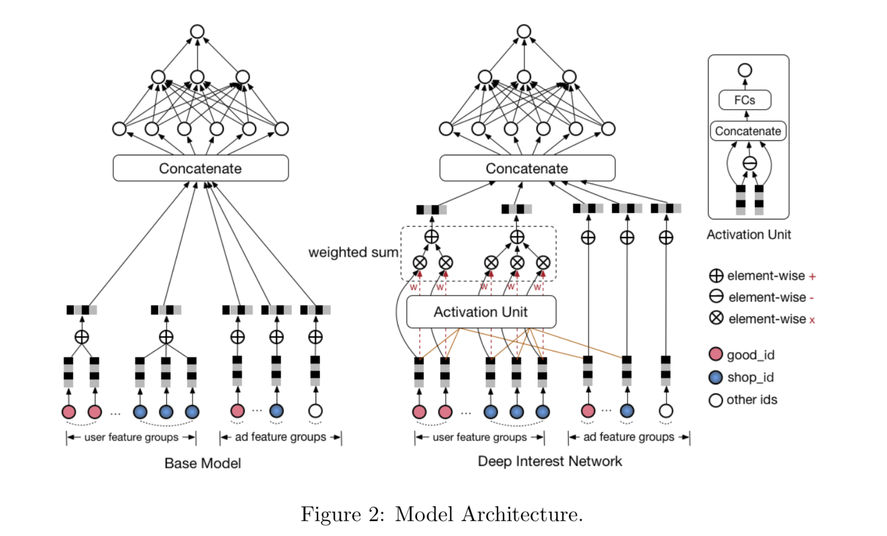
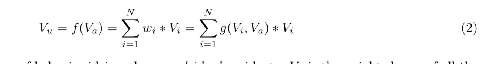
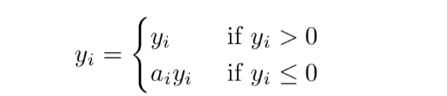
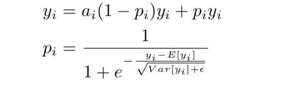
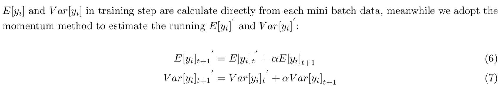
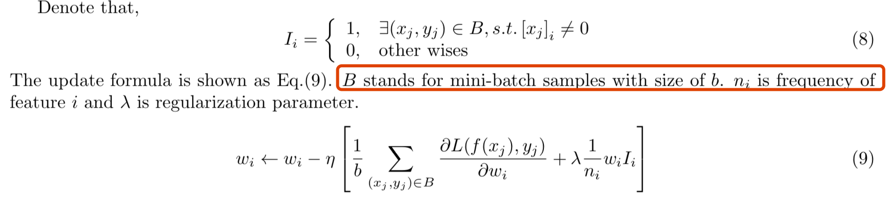
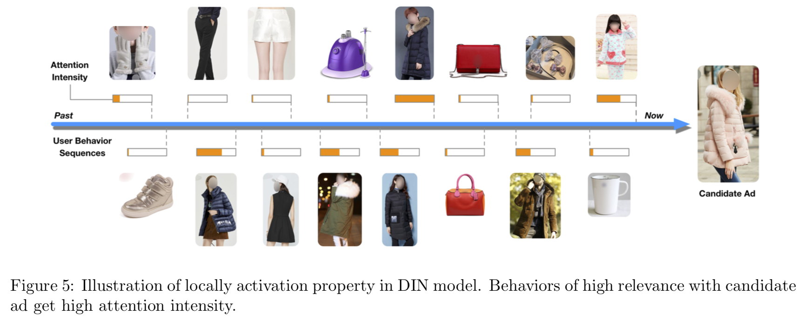

### DIN

> 在丰富的用户历史数据中提取 用户兴趣在CTR任务中是非常重要的，对于该点，本文提出2个用户行为特点
>
> * `Diversity`: 用户的兴趣爱好是不同的且广泛的
> * `local activation`: 用户点击与否取决于用户近期的历史行为
>
> **DIN**： 设计一个`attention` 结构网络，学习用户的兴趣分布表示用户的广泛兴趣爱好

> **在训练大规模稀疏数据的深度网络的时候过拟合是非常容易发生的**，文章中也提出了方法避免过拟合。
>
> 文章中指出 `DIN` 是可以捕捉到特指的(局部的)一些用户行为特征

**文章的主要贡献点**

> - We study and summarize two key structures of internet-scale user behavior data in industrial e- commence applications: diversity and local activation.
> - We propose a deep interest network (DIN), which can better capture the specific structures of behavior data and bring improvements of model performance.
> - We introduce a useful adaptive regularization technique to overcome the overfitting problem in training industrial deep network with large scale sparse inputs, which can generalize to similar industry tasks easily.

**DIN 方法提出的场景**

> In this paper we focus on the CTR prediction task in the scenario of display advertising in e-commerce industry. Methods discussed here can be applied in similar scenarios with rich internet-scale user behavior data(丰富的用户数据), such as personalized recommendation in e-commerce sites, feeds ranking in social networks etc.

**特征表示**

> 模型的输入特征中，并没有设置组合特征，而是使用 DNN  去学习组合交叉特征

**模型**

> * Base model
>
>   1. 细数数据`Embedding` 为向量
>   2. 向量作为 MLP 输入去训练DNN
>
>   在`concatenate`： 步骤中，会将多个多个`vector` 进行 `pooling` 处理，可以是 `max`, `sum`, `avg`等，这些做法无疑都将会丢失一些信息
>
> * DIN
>
>   希望模型能尽可能的发现用户以及广告之间的关系
>
>   数据包含2个结构
>
>   * diversity：users’ various interests
>
>   * local activation：User click of ad often originates from just part of user’s interests，it is similar to the attention mechanism(attention 学习给每一个`word` assign 一个 attention score)
>
>     
>
> * 上述网络的公式
>
>   
>
>   `Vu` 表示用户兴趣的向量
>
>   `wi`: 表示用户兴趣的大小
>
>   `Vi`: 某个广告商品向量
>
>   `Va`: 泛代表广告商品
>
>   其中用户兴趣大小`wi`是由一个激活函数计算得到，这个激活函数会遍历当前用户的历史兴趣广告商品，并通过计算得到这个用户对用户短期历史广告商品行为的一个兴趣
>
>   `Diversity`： 体现在用户会将局部历史行为加权求和，也就是当前用户的兴趣是用局部历史兴趣综合得到的，表示用户`泛`的兴趣
>
>   `local activation`： 体现在取用户近期的广告行为数据，参与计算
>
> * 激活函数**g(Dice)** 
>
>   > 先了解一下 `PRelu` 激活函数
>   >
>   > 
>   >
>   > 该函数是在`Relu`的基础上，增加了值小于0的时候一个很小的梯度(a取值很小)，文章中指出`RPelu` 能够提高模型的准确性，但是有`overfitting`的风险。
>
>   **文章提出Dice激活函数**
>
>   > 该函数提高模型的收敛性，以及性能
>   >
>   > 
>   >
>   > 
>   >
>   > 对比于 **Relu/PRelu** 有如下改进
>   >
>   > * 从数据中自适应蒸馏点计算，也就是`Relu/PRelu` 中的阈值0
>   > * 软蒸馏阈值
>   >
>   > 当然上面提到的2点其实在说一个东西: 阈值的自适应获取
>
> * 克服过拟合
>
>   > 训练大规模稀疏数据会带来过拟合的风险。
>   >
>   > 常规的做法`L1/L2/Dropout`但是在稀疏数据下似乎并不是很好
>   >
>   > * 文中中提出新的方法
>   >
>   > > 在互联网规模的用户行为数据是符合一个**长尾分布**，一些 数据出现次数非常的高，但是另外一些出现次数很低，当这些很少的样本出现多次的时候，就会不可避免的引入噪音，以及训练过程中加剧过拟合。
>   > >
>   > > 比较通常见的方式是，去掉这些出现频次低的样本，这相当于是认为的增加正则
>   >
>   > * 文综提出一种新的自适用正则针对长尾数据的正则化手段
>   >
>   > > 
>
> * 图解DIN
>
>   > 
>   >
>   > 

### 总结

文章主要2个措施，提高CTR

* 互联网规模的用户行为数据中提出2个数据结构，并根据这2个假设，提出基于注意力机制的模型
  * 用户的兴趣广泛
  * 用户的当前兴趣和最近的兴趣强相关
* 自使用更新权重自适用加正则方式减弱模型的过拟合风险

