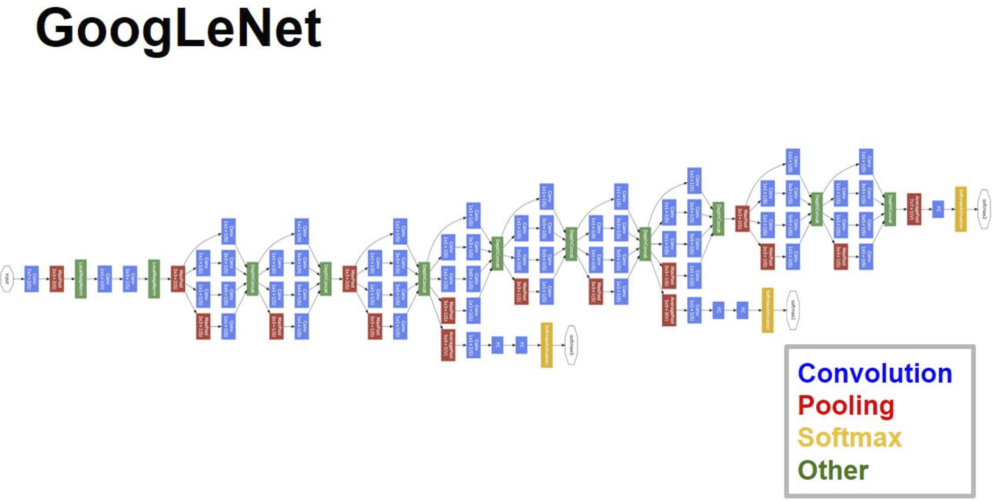

**Motivation**

> 提升网络的性能直接的方法就是增加网络深度和宽度，但是这也意味着巨量的参数，导致过拟合、计算量增加，以及深层带来的梯度消失和爆炸。
>
> 文章认为解决上述两个缺点的根本方法是将全连接甚至一般的卷积都转化为稀疏连接。大量的文献表明可以将稀疏矩阵聚类(一个卷积核的卷积操作可以看做是一遍)为较为密集的子矩阵来提高计算性能

```
3 x 3 的卷积核参数量更少，计算代价低，同时在性能上甚至表现更加优越，所以业界
探索更加卷积核小的情况，出现 1 x 1的卷积核，该特征核可以不改变特征图的宽高，而
只对通道数 c 进行变换
GoogleLeNet 采用大量的3x3 和 1x1的卷积核，网络层达到 22 层，但是参数却只有
AlexNet De  1/12.
其设计采用模块化设计的思想，通过大量的堆叠Inception，每个卷积核之前都会先使用
1 x 1 的卷积核操作，先减少通道数(就减少参数)，然后在使用3x3或者 5x5的卷积核操作，

获得高质量模型最保险的做法就是增加模型的深度（层数）或者是其宽度（层核或者神经元数）
但是带来了梯度丢失和爆炸的问题(难以优化)，以及过拟合，网络复杂，难以使用(计算量大)

还有一方面，并不知道哪个大小的卷积核是最优的，那么就全部都给了，然后让模型自己去决定
```


```javascript
对上图做以下说明：
1 . 采用不同大小的卷积核意味着不同大小的感受野，最后拼接意味着不同尺度特征的融合；
2 . 之所以卷积核大小采用1、3和5，主要是为了方便对齐。设定卷积步长stride=1之后，只要分别设定pad=0、1、2，那么卷积之后便可以得到相同维度的特征，然后这些特征就可以直接拼接在一起了；
3 . 文章说很多地方都表明pooling挺有效，所以Inception里面也嵌入了。
4 . 网络越到后面，特征越抽象，而且每个特征所涉及的感受野也更大了，因此随着层数的增加，3x3和5x5卷积的比例也要增加。

但是，使用5x5的卷积核仍然会带来巨大的计算量。 为此，文章借鉴NIN2，采用1x1卷积核来进行降维。
例如：上一层的输出为100x100x128，经过具有256个输出的5x5卷积层之后(stride=1，pad=2)，输出数据为100x100x256。其中，卷积层的参数为128x5x5x256。假如上一层输出先经过具有32个输出的1x1卷积层，再经过具有256个输出的5x5卷积层，那么最终的输出数据仍为为100x100x256，但卷积参数量已经减少为128x1x1x32 + 32x5x5x256，大约减少了4倍。

具体改进后的Inception Module如下图：
```




```javascript
对上图做如下说明：
1 . 显然GoogLeNet采用了模块化的结构，方便增添和修改；
2 . 网络最后采用了average pooling来代替全连接层，想法来自NIN,事实证明可以将TOP1 accuracy提高0.6%。但是，实际在最后还是加了一个全连接层，主要是为了方便以后大家finetune；
3 . 虽然移除了全连接，但是网络中依然使用了Dropout ;
4 . 为了避免梯度消失，网络额外增加了2个辅助的softmax用于向前传导梯度。文章中说这两个辅助的分类器的loss应该加一个衰减系数，但看caffe中的model也没有加任何衰减。此外，实际测试的时候，这两个额外的softmax会被去掉。
```

---

#### GoogLeNet Inception V2

14年以来，构建更深的网络逐渐成为主流，但是模型的变大也使计算效率越来越低。这里，文章试图找到一种方法在**扩大网络的同时又尽可能地发挥计算性能**。GoogLeNet的表现很好，但是，如果想要通过简单地放大Inception结构来构建更大的网络，则会立即提高计算消耗

## **General Design Principles**

1 . **避免表达瓶颈，特别是在网络靠前的地方**。 信息流前向传播过程中显然不能经过高度压缩的层，即表达瓶颈。从input到output，feature map的宽和高基本都会逐渐变小，但是不能一下子就变得很小。比如你上来就来个kernel = 7, stride = 5 ,这样显然不合适。
另外输出的维度channel，一般来说会逐渐增多(每层的num_output)，否则网络会很难训练。（特征维度并不代表信息的多少，只是作为一种估计的手段）

2 . 高维特征更易处理。 高维特征更易区分，会加快训练。

3. **可以在低维嵌入上进行空间汇聚而无需担心丢失很多信息**。 比如在进行3x3卷积之前，可以对输入先进行降维而不会产生严重的后果。假设信息可以被简单压缩，那么训练就会加快。

4 . 平衡网络的宽度与深度。

上述的这些并不能直接用来提高网络质量，而仅用来在大环境下作指导。

---

大尺寸的卷积核可以带来更大的感受野，但也意味着更多的参数，比如5x5卷积核参数是3x3卷积核的25/9=2.78倍。为此，作者提出可以用2个连续的3x3卷积层(stride=1)组成的小网络来代替单个的5x5卷积层，(保持感受野范围的同时又减少了参数量)

然后就会有2个疑问：

**1 . 这种替代会造成表达能力的下降吗？**
后面有大量实验可以表明不会造成表达缺失；

**2 . 3x3卷积之后还要再加激活吗？**
作者也做了对比试验，表明**添加非线性激活会提高性能**。

从上面来看，大卷积核完全可以由一系列的3x3卷积核来替代，那能不能分解的更小一点呢。文章考虑了 **nx1 卷积核**。
如下图所示的取代3x3卷积：


于是，任意nxn的卷积都可以通过1xn卷积后接nx1卷积来替代。实际上，作者发现**在网络的前期使用这种分解效果并不好，还有在中度大小的feature map上使用效果才会更好**。（对于mxm大小的feature map,建议m在12到20之间）。


**(1)** 图4是GoogLeNet V1中使用的Inception结构；

**(2)** 图5是用3x3卷积序列来代替大卷积核；

**(3)** 图6是用nx1卷积来代替大卷积核，这里设定n=7来应对17x17大小的feature map。该结构被正式用在GoogLeNet V2中。