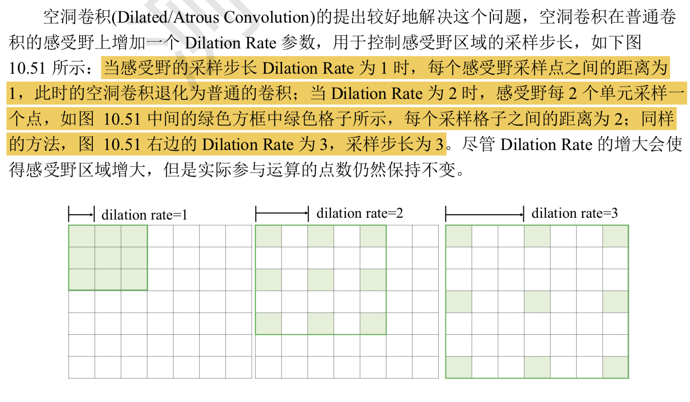
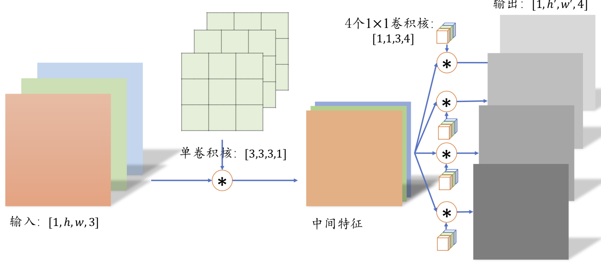

卷积神经网络利用数据的局部相关性和权值共享的思想大大减少了网络的参数量，非 常适合于图片这种具有空间(Spatial)局部相关性的数据

**空洞卷积**

> 小卷积核使得网络提取特征时的感受野区域有限，但是增大感受野的区域又会增 加网络的参数量和计算代价，因此需要权衡设计.

空洞卷积在不增加网络参数的条件下，提供了更大的感受野窗口。但是在使用空洞卷 积设置网络模型时，需要精心设计 Dilation Rate 参数来避免出现网格效应，同时较大的 Dilation Rate 参数并不利于小物体的检测、语义分割等任务。在tf 中有 `dilation_rate`，参数来使用空洞卷积

---

**分离卷积**

普通卷积在对多通道的输入进行卷积运算的时候，卷积核的每个通道和输入的每个通道分别进行卷积运算 ，得到多通道的特征图，然后对应元素相加产生单个卷积核的最终结果输出。

分离卷积核普通卷积不同的是，卷积核的每个通道和输入的每个通道进行卷积运算，得到多个通道的中间特征，这个多通道的中间特征张量接下来镜像多个1x1卷积核的普通运算 得到多个高快不变 的输出，分离卷积层包含了两步卷积运算，第 一步卷积运算是单个卷积核，第二个卷积运算包含了多个卷积核

那么采用分离卷积有什么优势呢?一个很明显的优势在于，同样的输入和输出，采用Separable Convolution 的参数量约是普通卷积的1/3

普通卷积核，输出高宽不变的4通道输出，需要参数 3 x 3 x 3 x  4 = 108

而分离卷积的第一部分参数 3 x 3  x 3 x 1 = 27, 第二部分为 1 x 1 x 3 x 4=14。

而这样的分离卷积在Xception 和 MobileNets 等对计算代价敏感的领域中得到大量的应用。

