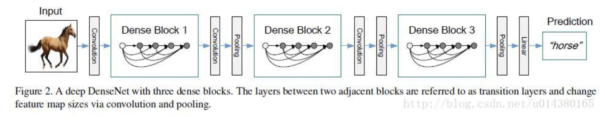
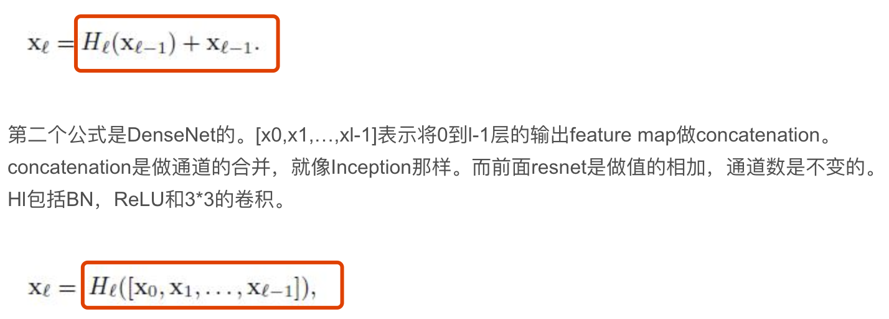

#### 整体思路

> 2017年的文章，从`GoogleLeNet` 和 `Resnet`分别从宽度和深度入手提高网络的性能，而`DenseNet`从特征入手，通过将`feature`的极致利用达到更好的效果，并且具有更少的参数。
>
> * 减少梯度消失
> * 加强feature 的传递
> * 更有效的利用 feature
> * 一定程度上减少了参数数量
>
> `Resnet` 的核心在于 `create short path from early layers to later layers`， `Densenet` 也是延续这个思路，在保证网络中层于层之间最大程度的信息 传输的前提下，之间将所有的层都连接起来。

>  `Resnet` 有L层，那么久会有L个 shortcut 连接，而`Densenet`则有 L(L+1)/2个连接，简单的说就是讲每一层的输入来自前面所有层的输出。
>
> **这样的结构会有什么好处呢，它会进一步解决梯度消失的问题，我们 已经知道，梯度消失主要是 因为梯度 在网络深层之间传递的导致的，而Densenet的设计，前面网络可以直接接受到来自 loss 函数的梯度，所以减轻梯度小时现象**

#### Densenet 和 Resnet本质区别

> 本质区别就是上面的两个式子(文章中唯一的2个公式)，`resnet`学习到残差，而`Desnet` 的输入是将0到 当前上一层的所有输出，按照通道拼接起来(所以这里要求，`Denset` 每一层的输出shape都需要一样)，

#### bottleneck layer 和 transition layer

> 二者都是使用 1 x 1的 卷积核进行操作
>
> `bootleneck layer`： 1 x 1的卷积操作， 目的是减少输入的feature map数量，既能降维减少计算量，又能融合各个通道的特征
>
> `transition layer`： 该层的1 x 1卷积的输出channel默认是输入channel到一半
>
> 使用这个两种方法。用于达到减少参数的目的(降维)

#### 还有一个概念 `Growth rate`

> 所有DenseBlock中各个层卷积之后均输出 ![[公式]](https://www.zhihu.com/equation?tex=k) 个特征图，即得到的特征图的channel数为 ![[公式]](https://www.zhihu.com/equation?tex=k) ，或者说采用 ![[公式]](https://www.zhihu.com/equation?tex=k) 个卷积核，这是一个超参数。一般情况下使用较小的 ![[公式]](https://www.zhihu.com/equation?tex=k) （比如12），就可以得到较佳的性能，而到了网络深处，由于通道堆叠，后面的输入会越来越大，这个时候使用 `bottlenect layer`来减小。

