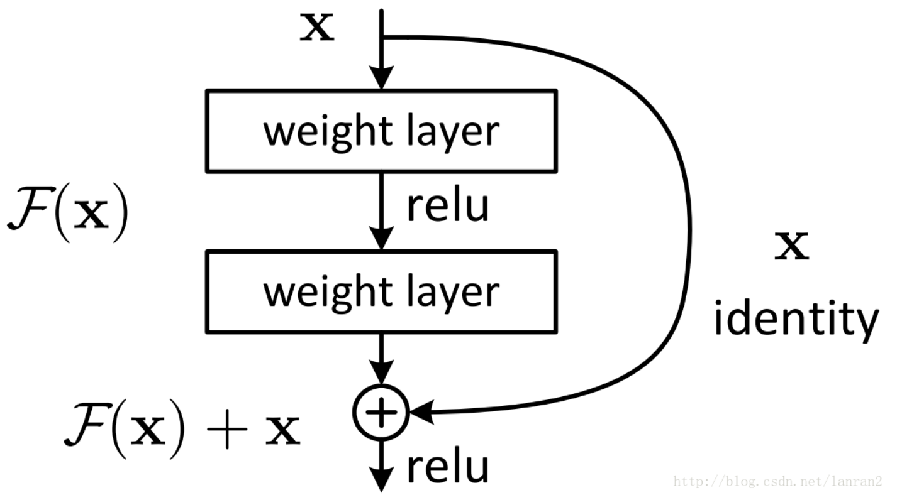
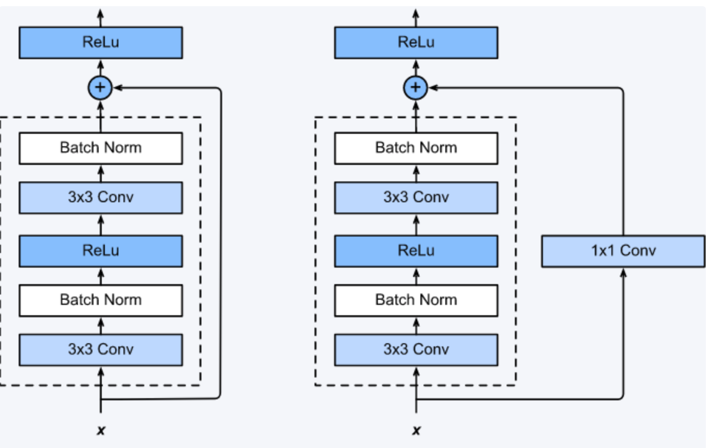

残差网络同`VGG`, `GoogleLeNet` 一样，都是旨在加深网络的层数(容量：解空间更大了)，但是随着网络层数的加深，网络的性能降低了，但是，这个降低并不是 `overfit`造成的，而是网络退化，所以针对网络`退化`提出了残差网络。

网络的深度是实现网络更高性能的一个重要因素，当然会出现一些如梯度弥散/爆炸的事情，也有一些方法可以弥补他，`Dropout`, `BN`等。

然后虽然这样网络仍然会收敛，但是网网络开始退化，增加更多的网络层数，导致更大的误差。为了防止这种`退化`: 

残差网络中提出了2中mapping:

* Identity mapping（歪歪的那条线）
* residule mapping (除了歪歪的那条线以下的两个方块结构)

esnet学习的是残差函数F(x) = H(x) - x, 这里如果F(x) = 0， 那么就是输入就等于输出 H(x) = x，学习找到对恒等映射的扰动会比重新学习一个映射函数要统一的多。

学习网络残差H(x)，优先于学习潜在映射(你和残差比直接你和潜在映射更加容易)

实验证明，残差块往往需要2层以上，单单一层的残差块并不能起到什么提升作用。

考虑到卷积参数的增多(网络深)，使用到 1x1的卷积(bootleneck block)操作

在连接层使用 1 x  1的卷积，主要是解决学习残差块的输入输出shape 不一致。

还有其他论文 中提到，在shortcut 的旁路中不添加1x1的卷积，主要是 为了 让信息在前向和后向传播中平滑传递，保持旁路的纯净。

---

#### 总结

`ResNet` 进一步的肯定了网络越深的好处，进而解决网络越深带来的网络退化问题。提出了恒等映射的方法