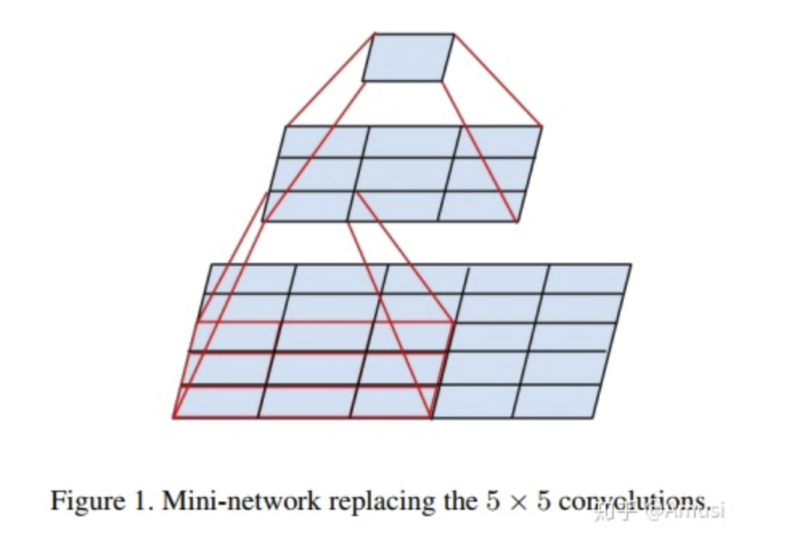

**前言**

```javascript
主要工作是证明了增加网络的深度能够在一定程度上影响网络最终的性能
```

**原理**

```javascript
VGG16相比AlexNet的一个改进是采用连续的几个3x3的卷积核代替AlexNet中的较大卷积核（11x11，7x7，5x5）。对于给定的感受野（与输出有关的输入图片的局部大小），采用堆积的小卷积核是优于采用大的卷积核，因为多层非线性层可以增加网络深度来保证学习更复杂的模式，而且代价还比较小（参数更少）。

在VGG中，使用了3个3x3卷积核来代替7x7卷积核，使用了2个3x3卷积核来代替5*5卷积核，这样做的主要目的是在保证具有相同感知野的条件下，提升了网络的深度，在一定程度上提升了神经网络的效果。
```



```javascript
如图，一个 5x5的卷积核会结果为一个像素值，而同样先使用一个3x3的卷积核操作操作，然后在使用第二个3x3的卷积核操作第一个3x3的卷积核的结果也会输出一个像素值，所以使用一个 5x5 和使用2个 3x3的卷积核的结果是一样的。
```

**优点**

> - VGGNet的结构非常简洁，整个网络都使用了同样大小的卷积核尺寸（3x3）和最大池化尺寸（2x2）。
> - 几个小滤波器（3x3）卷积层的组合比一个大滤波器（5x5或7x7）卷积层好：
> - 验证了通过不断加深网络结构可以提升性能。

**缺点**

> - VGG耗费更多计算资源，并且使用了更多的参数（这里不是3x3卷积的锅），导致更多的内存占用（140M）。其中绝大多数的参数都是来自于第一个全连接层。VGG可是有3个全连接层啊！
>
> PS：有的文章称：发现这些全连接层即使被去除，对于性能也没有什么影响，这样就显著降低了参数数量。