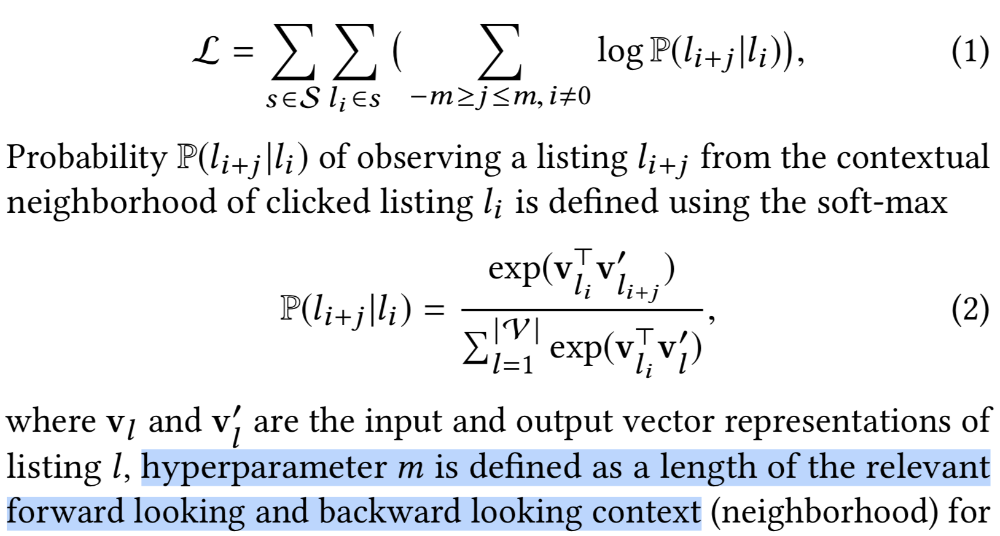
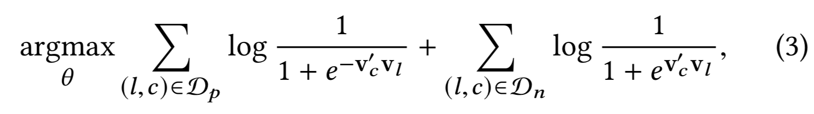
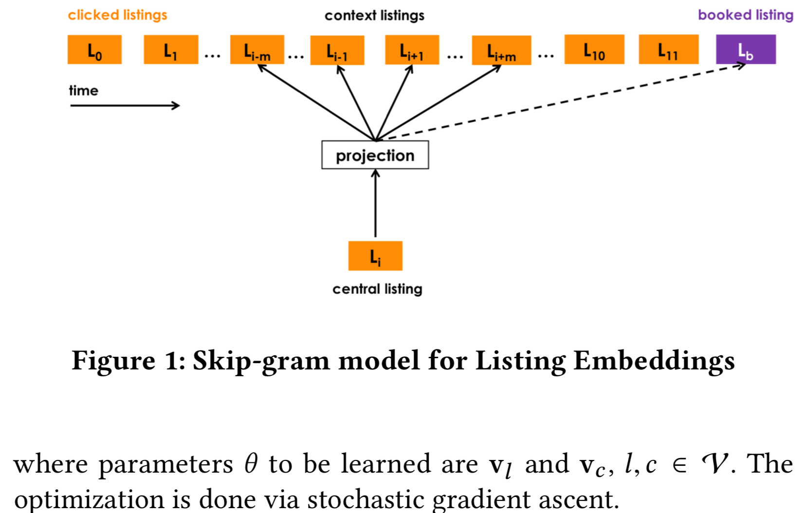
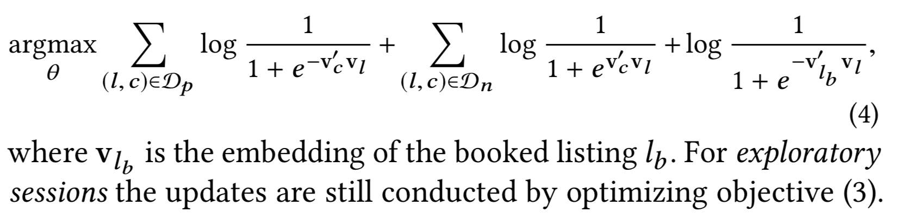
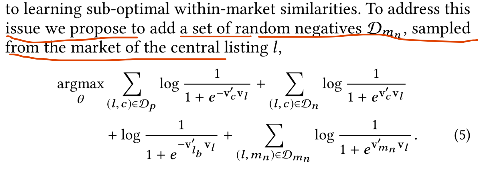
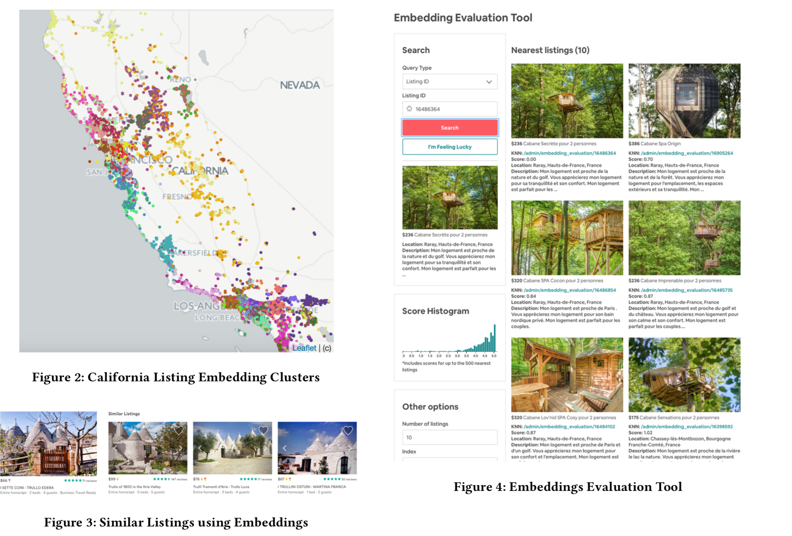
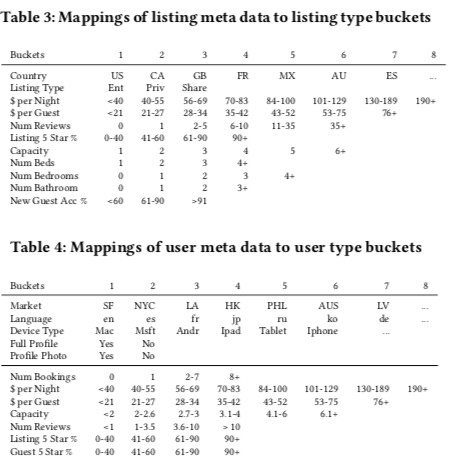
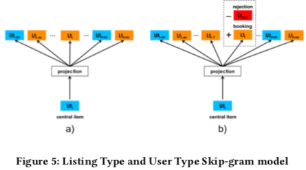
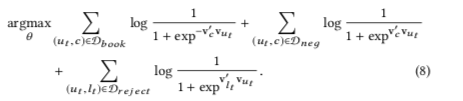

#### 论文提出解决的问题

> 新提出的方法可以捕获到用户短期和长期的兴趣，提出的方法是专门为`Airbnb` 公司使用的
>
> 提出的方法主要是对`Listing and user` Embedding 词向量化技术

#### 背景 + 主要方法简述

> 搜索算法的目的取决于平台，有些平台希望增加和用户的交互时间，如文章的推送，希望用户能够看完整篇文章，还有一些平台专注用户的转化 ，如CTR、CVR等，平台都都需要对双方(卖家和买家，需求方和提供方)都需要进行优化，
>
> Airbnb 的业务来说，需要非常明确的需求要对guest 和 host 优化搜索的结果，如用户输入房屋的价格，地点，风格，进行搜索，那么返回的结果应该是满足这些需求，且能够对guest产生吸引力，同时对于host 也能够对guest的条件满意，而不至于 拒绝 reject，用户会对那些guest 的请求租房进行reject，可能的原因是这个guest 历史租房信誉不好，租房人太多等。
>
> 用户在booking 之前会有多个search 操作，而在一个用户的搜索期间内可以获取 clicks，和 host 联系等等信息，这些信息的获得可以做为用户实时个性化推送，其目的就是给用户推送个多相似的结果，同时也可以利用这些信息不去给用户过滤一些商品。
>
> 而实现这一切就是计算物品之间的相似度，那么在计算之前去学习guest 当前发生交互的商品以及备选相片的相似度，然后决定是否推送。
>
> * 使用用户及时的交互信息，进行实时个性化推荐(学习到用户及时兴趣)
>
> * 长期兴趣学习
>
>   > 文章中的实践如下：
>   >
>   > * 在同一个空间中学习 user 和 商品的 Embedding，那么就可以计算得到那个用户对那个商品有兴趣了。
>   >
>   > 但是计算的时会有一些问题，那就是数据量，在学习Embedding 的时候，是要求一个词的出现频率至少 > 5（很多论文，一些分享文章中都有提到），但是由于业务
>   >
>   > 	* 用户一年可能才会旅游1-2次，那么用户订单是很少的，用户订单的长尾分布
>   >
>   > 文章中是这么解决问题的：
>   >
>   > 	* 根据用户 user 的属性将用户映射为 userType
>   > 	* 根据商品的属性将商品映射为 listType
>   >
>   > 通过以上的隐射，那么(userType, listType) 的共现次数就会多了，就可以学习Embedding 了。
>
> 文章的贡献
>
> * 及时用户兴趣提出 listing Embedding  方法
> * 用户长远兴趣提出 user-type & listing-type Embedding 方法

#### listing Embedding

> 用户一个session 间隔的时间需要超过 30s，训练Embedding 的模型还是基于 skip-gram 的负采样的word2vec，只不过会去自定义目标函数。
>
> 自定义目标函数：
>
> 
>
> **S** 是每个用户的session 集合， ``li`` 是 session 中的每次操作商品的序列，
>
> 以上是最基础的目标函数，而加入负采样之后，目标函数会变为：
>
> 
>
> 其中`Dp` 是在当前list 序列l 中，并且以中心词c为中心词pair 的正例样本，而Dn 是来自于整个 list(这个用户没有发生交互行为的物品序列) 采样得到的负例
>
> 
>
> 好的，还可以继续修改目标函数，想想会有这样的场景，用户在一个session 中点击物品，那么点击会有2中结果
>
> * booked session: session 的结束以 book 一个商品结束
> * exploratory session： 用户仅仅是浏览而已
>
> 那么这2中都可以计算下下文相似度，但是 booked session 无疑是非常用于的，因为我们的任务不仅仅是去计算listing 的相似度，而且还是要去预测用户 book 行为，所以将 数据中的 book 行为加入到目标函数中来：
>
> 
>
> 这是发生book 行为 目标函数，而对于没有发生book 行为的list 的目标函数还是式-3，
>
> 以上就是论文中提到的 **Booked Listing as Global Context**
>
> 继续重构目标函数：以上抽取的正例是在当前 list 中的，而负例是在整个预料库中抽取的，那么正例和负例很有可能不是来源于同一个市场 `market` 文中指出，这样会导致次最优，那么文章是这样解决的，在正例所在的市场中，随机在去抽取一些 list 出来
>
> 
>
> (图片在路径下是有的，不知道为啥显示不出来)
>
> **冷启动问题**
>
> 举一个例子：如新的房屋的位置，那么会计算新来的位置和以及有的位置10mile 里内的Embedding，然后去处这些路径的Embedding ，然后取均值，就是新 位置的 Embedding
>
> 文中提到，根据位置的Embedding 后进行 k-mean 距离，确实会将比较近的房屋聚在一类，而且对于那些无法量化的特征，如风格，list 的Ebedding 也是可以捕捉到的。如下如：
>
> 
>

#### User-type & Listing-Type 长期兴趣提取

> 举个例子，如一个用户过去在 `北京租房子`，那么到了一年或者若干时日后，又去`西安`租房子，那么这里应该给用户优先推送过去在`北京`祖国的房子相同的类型。
>
> 所以跨market 的一些 listing中的商品也是具有相似性的，但是学习这些 book 的 item 有限现实的限制：
>
> * book 了的商品的个数是远远小于发生了点击行为个数的商品
> * 一个用户在过去的比较长的时间跨度上仅仅发生很少的 book 次数
> * 要学习到有意义的 Embedding 那么需要一个 entity 出现的频率应该是5-10左右
> * 一个用户2个订单之间发生的时间间隔可能会较长，而在这个期间用户的特征可能就发生了变化，如因为工作的变动，收入发生变化，这样他对商品价格的敏感度就会变大。
>
> **以上这几个问题不仅仅在Airbnb 业务中会出现，而是在大多数企业的业务中都会出现**
>
> 解决以上的问题，文章中提出 **many-to-one**的 基于 rule-base 的方法，如一个 list_id 它会有若干属性，那么根据这些属性，将多个 list_id 可以映射到相同的 bucket 中，也就是相同的 list_type 中，这条list 的数据就会躲起来，如图：
>
> 
>
> 同时对 user_id 也进行相同的映射得到 user_type
>
> 在构建数据的时候，用户的每个session 中的数据就变成了 sb = ((utype1ltype1).... (utypem,ulistm))，虽然在session 中的 user_id 没有发生变化，但是因为在user_id 隐射到 user_type 的时候是根据user 属性进行的，所以在同一个session 中 userType 是发生着变化的，下图 a) 显示了当中心项为 ![[公式]](https://www.zhihu.com/equation?tex=u_%7Btypei%7D) ，context窗口大小为 ![[公式]](https://www.zhihu.com/equation?tex=m) 的情形。
>
> 
>
> 以上的目标函数中仅仅是包括了用户click 的 embedding，在业务中还会有 host 侧的行为，如host 会拒绝 guest 的请求，可能原因在于 guest 的star 等级不够高，没有必须的身份信息等，增加 booking 的机会应该是 userType 和 listType 的Embedding 的距离应该尽可能的近，那么将在目标函数中加入那些曾经发生被拒绝行为的 (userType, listType) 的pair 组合样本，于是目标函数就变成了：
>
> 
>
> 对于一个 userType 和 listType 当计算得到二者的 Embedding 距离较近的时候，我们就推荐经和 listType 最相似的 cosine 相似度的 list 推荐给 user，如userType1和 listType1的相似度较高，那么listType1的属性是美国、窑洞、河边等的房屋特征，那么就将具有这些特征的list 均推送给 userType1.

#### 实验

> 30分钟的间隔拆分 ordered list
>
> 在页面停留时间小于30s的被认为是无效的，会被过滤调，文中总共使用8亿的点击session 作为训练集
>
> 每一天的 listting Embedding是从4.5百万的数据中训练得到的，每天都会去训练这些 Embedding，而且在训练过程中，每日都是重新开始训练，而不是基于昨天的增量训练的方式。