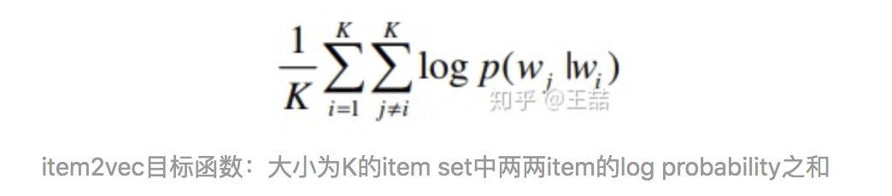

#### 微软推荐系统中提出 Item2Item 方法

它的思想非常的简单，但是却非常实用

> Word2vec 中词在句子中是有先后顺序的，且 word pair 是有正负的，在窗口里面的是正例，其他是负例
>
> 但是在item2item 中是没有先后顺序的，然后每个序列都是作为一个 set的，set中是没有空间先后概念的。
>
> 每一个set中放的是用户的行为序列，可以看做是word2vec 的一个序列。

2

> 没有建模用户对不同item的喜欢程度高低，训练出来的词向量矩阵是item-item 矩阵，不是 user-item 矩阵

> 根据上述的思想，真正的实现万物皆可 Embedding

具体来讲，如果item存在于一个序列中，item2vec的方法与word2vec没有任何区别。而如果我们摒弃序列中item的空间关系，在原来的目标函数基础上，自然是不存在时间窗口的概念了，取而代之的是item set中两两之间的条件概率。

---

1. **为什么说深度学习的特点不适合处理特征过于稀疏的样本？**

> 深度学习因为表达能力强，理特征过于稀疏的样本可能造成过拟合？

> 深入梯度下降的过程的话，会发现如果特征过于稀疏会导致整个网络收敛过慢，因为每次更新只有极少数的权重会得到更新。这在样本有限的情况下几乎会导致模型不收敛

1. **我们能把输出矩阵中的权重向量当作词向量吗？**

> 哈哈，之前也突然懵逼过，word2vec那么简单，那么用的是输入还是输出矩阵？个人感觉，两者都可以用，甚至可以拿输入矩阵转置作为输出矩阵，也没必要存储两个矩阵，不管CBOW还是skip-gram都能保证相似语境下的相关性，输入输出矩阵都可以用作embedding，官方采用了输入矩阵，但只是做embedding的话，不直接优化效果，采用输入或者输出矩阵没有本质的差别。

1. **为什么在计算word similarity的时候，我们要用cosine distance，我们能够用其他距离吗？**

> 相似性度量方法太多了，分应用场景吧，w2v本身就是内积，用cos很合适，还归一化了。

1. **在word2vec的目标函数中，两个词 ![[公式]](https://www.zhihu.com/equation?tex=w_i%2Cw_j) 的词向量 ![[公式]](https://www.zhihu.com/equation?tex=v_i%2Cv_j) 其实分别来自输入权重矩阵和输出权重矩阵，那么在实际使用时，我们需要分别存储输入矩阵和输出矩阵吗？还是直接用输入矩阵当作word2vec计算similarity就好了？**
2. **隐层的激活函数是什么？是sigmoid吗？**

---

其他回答

> word2vec最初版本是拿sentence训练的，比如有个句子"we are all good friends"，那么在训练地方时候设置window=5，中心词为all，那么上下文为we /are/good/friends，这是窗口内部的序列性。除此之外窗口是滑动的，也有序列性。
>
> 到了negative sampling就不这么玩了，首先全局计算词频，按照词频选定中心词all，再按照词频负采样生成上下文，直接训练。这时已经没有什么序列性了。
>
> 到了item2vec，其实很多数据是离散的，没有什么序列性，这时直接按照negative sampling搞就行。在txt中序列性都没那么重要

