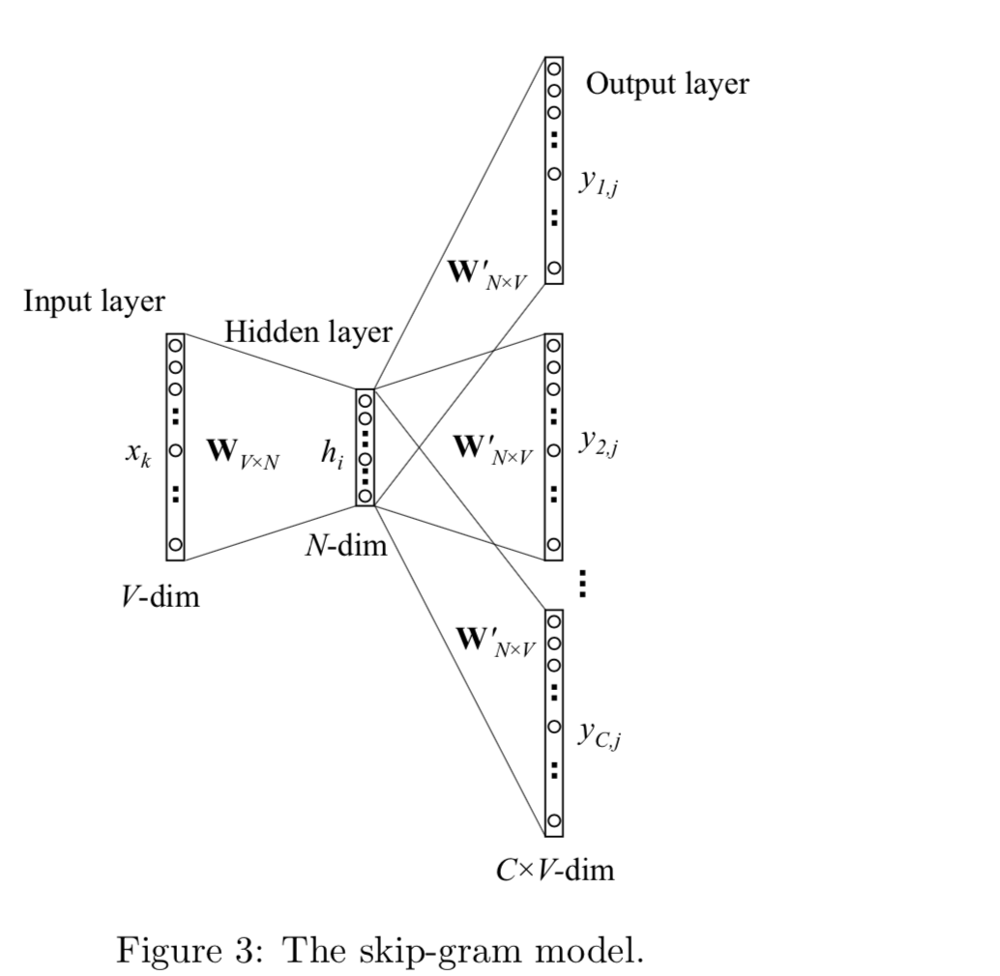

### CBOW

#### One-word context

简单一张图：

这里的输入上下文中只有一个单词

**从输入层到隐层**

因为输入x只有一个单词，也就是输入的V长度的输入中只有一个位置是1，其他位置是0，也就是`one-hot`格式，所以第`i-th` 位置的输入x，和权重`W`相乘相当于是将第`i`行的向量复制出来，也即是权重`W` 的每一行表示输入单词的一个向量表示(shape=(N,))。

**隐层到输出层**

这里有另外一个NxV 的矩阵`W2`（这么写吧，不知道怎么下W偏），然后隐层的输出`h`的`shape=(N,)`, 和 `W2`相乘，这个时候向量`h` 已经是稠密的了，`h` 和 `W2` 每一列相乘得到一个值`uj`, 总共得到 V个`u`值，然后这些`u`值进行 `softmax`操作得到`V`个长度的概率值。

这里需要知道，`vwj` 是输入层到隐层矩阵的每一行，`vwi` 隐层每一列，总共有`V`列，所以输出矩阵`p`也是 `v`维的。

然后更新2个权重

以上的更新方式，在计算输出到隐层的梯度的时候，需要遍历全部的输出单词。

**然后更新隐层到输如层**

使用向量表示就是：

因为 这里的输出向量x每次只要有2行数据不为0，所以经过矩阵相乘之后，输入到隐层的矩阵每次迭代只会有一行权重发生修改。

上述是小白模型的`Word2Vec` 这里共出现2个问题

* 计算输出往回的误差新换的时候，会遍历所有的输出单词
* 每次更新输入到隐层的权重的时候，每一次迭代会会有一行的权重发生更新变化。

#### Multi-world context

和`one-word context` 不同的是，这里输入的是多个词，而输入层到隐层的输入则变为公式：

这样自然每次更新的时候回去更新输入到隐层的多行权重向量。C  表示输入次个数

### Skip-Gram Model

输入层输入一个单词，和上面的模型一样 ，这里输入还是`one-hot`的，也是从`W` 矩阵中抽出第`i-th`行向量，而这里输出层变为了多个`panel`也就是会有多个`context`找到概率最大的那个，就是该`context`的输出单词。

输入层到隐层

隐层到输出层

`wcj`表示在第c个`panel`中第`j-th`词，`woc`是真正`c-th`输出`context`词, `wi`是输入词，`ycj`是`c-th`panel 中的`j-th`输出词，`ucj`是输出层`c-th`panel 输出的`i-th`个unit 的输入，因为输出层的`panel分享这相同的权重，所以`

`v2wj`是来自于矩阵`W2`（这块还是比较没搞懂，但会还需要返回来看）

损失函数计算：

`j*c`是`c-th`输出上下文词。

计算没一个`panel`的每一个输入词，每一个位置的词计算得到损失值是遍历所有的`panel`

然后反向求导得到隐层到输出层的矩阵更新：

这里和`CBOM`隐层更新唯一的不同就在于计算输出损失值的时候，需要遍历所有的`context`计算，

而输入层到隐层的矩阵更新就和上面`CBOM`一样了。

---

#### 计算优化

上面是`CBOW`和`skip-gram`的`word2vec`计算方式，但是都会有一个问题，那就是计算隐层到输出层的矩阵优化会代价非常的高，但是计算输入层到隐层的代价是比较低的。

在计算输出到隐层的矩阵更新的时候需要遍历词汇表中所有的词，一个直观的解决方法就是计算的时候限制需要更新的输出词向量，那么有2中方法

* Hierarchical softmax
* sampleing

####  Hierarchical softmax

首先需要建立一个霍夫曼树

* 霍夫曼树

> 霍夫曼树就是，节点的值越大越靠近根节点，反之越远离根节点，举一个例子，我们要建立(20,4,8,6,16,3)的霍夫曼树，那么建树的过程为：
>
> 首先是最小的b和f合并，得到的新树根节点权重是7.此时森林里5棵树，根节点权重分别是20,8,6,16,7。此时根节点权重最小的6,7合并，得到新子树，依次类推，最终得到下面的霍夫曼树。
>
> 输入：权值为(𝑤1,𝑤2,...𝑤𝑛)(w1,w2,...wn)的𝑛n个节点
>
> 输出：对应的霍夫曼树
>
> 1）将(𝑤1,𝑤2,...𝑤𝑛)(w1,w2,...wn)看做是有𝑛n棵树的森林，每个树仅有一个节点。
>
> 2）在森林中选择根节点权值最小的两棵树进行合并，得到一个新的树，这两颗树分布作为新树的左右子树。新树的根节点权重为左右子树的根节点权重之和。
>
> 3） 将之前的根节点权值最小的两棵树从森林删除，并把新树加入森林。
>
> 4）重复步骤2）和3）直到森林里只有一棵树为止。
>
> 结果：
>
> 
>
> 那么使用霍夫曼编码会有什么好处呢？一般得到的霍夫曼树后我们会对叶子节点进行霍夫曼编码，由于权重高的叶子节点越靠近根节点，而权重低的叶子节点则原理根节点，这样我们的高权重节点编码就比较短，而低权重值比较长，这样保证书的带权重路径最短，也符合我们的信息论，即，我们写越常用的词有更短的编码，一般对于一个霍夫曼树的节点（根节点除外），可以约定左子树编码为0，右子树编码为1.如上图，则可以得到c的编码是00。
>
> 在word2vec中，约定编码方式和上面的例子相反，即约定左子树编码为1，右子树编码为0，同时约定左子树的权重不小于右子树的权重。

在`word2vec`中，霍夫曼树的作用就是代替从隐层到softmax 输出，霍夫曼树的所有内部节点类似于神经网络的隐层神经元，根节点的词汇量对于这我们隐层的输出，也就是从输入层到隐层拿出来的那一行向量，叶子节点的个数就是词汇表的大小，在霍夫曼树中隐层到输出层的softmax 是一步一步完的，也就是多此的sigmoid。具体一步一步的完成步骤如下：

规定沿着左子树走，那么就是负类(霍夫曼树编码1)，沿着右子树走，那么就是正类(霍夫曼树编码0)。判别正类和负类的方法是使用sigmoid函数：

这里`xw`就是隐层的输出，`theta`是路径中节点的值。

拿这个图来看n(w,i)表示节点值为w的霍夫曼树中某个路径的第i个节点

使用最大似然法寻找所有节点的词汇量和所有内部节点`theta`，当计算输出`w2`，得到的最大似然函数

对于所有的训练样本，我们希望最大化所有样本的似然函数，经过从输入到隐层计算，隐层的输出就是霍夫曼树的根节点输入`xw`，在每经过一个节点的时候，和该节点的值计算sigmoid值，对应着霍夫曼编码`dw`={0,1},然后判断是继续往左走还是往右走

对于一个输出次`w`,其最大似然为：

在这个过程中，每次仅仅只用一个样本参与计算

似然函数：

计算路径中某一个节点的梯度值：

然后对于输入`xw`的梯度

**Hierarchical Softmax 的CBOW 中的使用**

**CBOW**中需要定义上下文2c，这样在输入一个词，前面的c个 词和后面的c个词，还有就是词向量化后的维度

在做模型之前先将词汇表建立一颗霍夫曼树，对于输入层到隐层，这一步比较简答，就是做一个 `sum pooling`

然后通过梯度上升发更新`theta` 和 `xw`,  更新输入到隐层的矩阵的时候：

**Hierarchical Softmax 的skip-gram 中的使用**

这里输入只有一个词，所以`xw`就是这个输入次的词向量。

**Hierarchical softmax**

使用霍夫曼树替代传统的神经网络可以提到模型的效率，但是有一个问题，就是加入有一个生僻的字，那么建立到霍夫曼树中就会变为很深的路径，那么训练的过程中，就需要在霍夫曼树中辛苦的走很久下去。

而**Negative sampleing**  可以解决这个问题

---

### Negative sample

先说说负采用的思想

> 比如我们有一个样本，中心词是w，那么它还有2c个上下文context词，记为 context(w), 那么(w,context(x))， 就是一个负样本，而在之前的逻辑中，除了词w, 和 context(w)， 之外的词都是负样本，那么使用**负采样**，就是在这些所有的负样本进行采样，使用部分词作为负样本，而不是之外的全部词，这样在训练的时候就不会遍历所有的词了，而不部分的词。那么就产生新的2个问题
>
> * 如何负采样
> * 负采样后一个正例和采样得到的多个负例训练二元逻辑回归

对于第二个问题：如何计算一个正例和多个负例计算梯度

> 加入现在已经有了负样本(context(w),wi) i=1,2,.. neg，正例定义为`w0`
>
> 在逻辑回归中，正例应该满足
>
> 
>
> 负例满足
>
> 
>
> 那么期望得到下式的最大化
>
> 
>
> 对应的似然函数：
>
> 
>
> 也使用梯度上升法，仅仅每次只使用一个样本更新梯度，来进行迭代更新得到我们需要的`xw(i), theta(i)` i =1,2,..neg
>
> 

对于第一个问题：如何负采样得到neg 个负例

> 词汇表中有V个次，那么就将一段长度为1的线段分为V份，每份对于词汇表中的一个词，当然每个词催要的线段长度是不一样的，高频词对于的线段长，低频词对应的线段短，每个词w的线段长度由下公式计算得到 
>
> 
>
> `word2vec` 中分子分母都去`3/4` 幂
>
> 
>
> 采样前会将长度为1的线段划分为M(默认10^8)的长度，M >> V，保证每个词都会有对应的线段，而M份中的没一份都会落在每一个词对应的线段上，采样的Hi好，只需要从M个位置中采样出neg 个位置就好，然后找到每个位置对应的线段所属的词
>
> 
>
> 

* 基于Negative sampleing 的 CBOW 模型

* 基于Negative sampleing 的 Skip-Gram 模型

