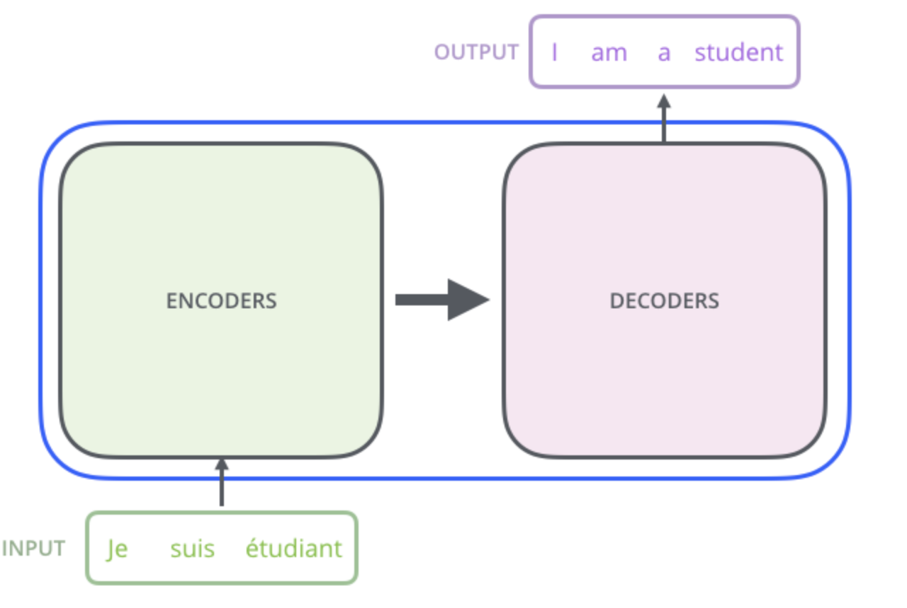

* 在谈`attention` 之前先聊聊没有`attention` 之前

  * 处理Sequence的手段 -- `RNN`

    

    缺点：输入一串序列，然后也输出一串序列，当使用单向的`RNN`输出`b4`的时候，那么`a1 ` 到 `a4` 都已经是计算出来了的，输出 `b3` 的时候，那么`a1` 到 `a3` 都是已经计算好了的等等，当使用双向的`RNN` 那么无论计算`b{n}` 的时候`a1` 到 `a4` 都必须是已经计算好了的，也就是计算不容易做到平行化。

    也有人使用`cnn` 处理序列，每一个 `filter` 都输入几个`vector`, 然后评议 `filter`, 看出使用 `CNN` 容易现平行化，但是使用`CNN` 捕捉不到距离较远序列。

* 基于`RNN` 的处理序列问题，出现以上指出的不能并行化问题，于是出现`attention` 既可以实现并行化，又可以计算长距离的序列。

  计算以及一个`attention` 的计算如下过程：

  1. 计算query、key、value

  

  2. 每一个query 对每一个 key 计算 `attention`

     当计算q 和 k 的内积的时候，会除以他们的维度，q 和 k 的维度越大，他们的内积值就会越大

     

  

  ​	3. 然后 alpha，和每一个value 去相乘

  

  ​	在这里就能看懂`attention`的妙用，如果输出 `b1` 想看local 信息，那么将 `alpha11` 之外的权值全部等于0就可以做到，如果想看到较远的信息那么将 `alpha14`设置不为0就可以了。

  而在计算`b1` 的时候，那么同时可以计算 `b2`的。

  

  ​	这些计算都是可平行计算的。

  

  而上述的一连串的矩阵运算是可以做到平行计算的。

  

  

  

  

  

  ​	综上整个计算`attention` 输出到输入都是可以实现矩阵运算的。整个计算过程：

  

* `attention`另一种 `multi-head self-attention`

  

  这里只能和同等位置计算结果计算 `attention`

  然后计算多多个 输出`concate` 起来，然后给它降维得到`bi`的输出。

  

  加上 `multi-head` 机制，可以使用一个 `key`可以多方位的关注，一个`head`有的可以关注`local attention` 有的可以关注 `global attention`, 这里只是使用2个 `head` 做例子，在实际中，可以是有多个 `head` 这也是一个超参数需要调的。

  以上的`attention` 机制还有一个问题，就是在输入没有位置顺序，那么源论文中，提出给出入增加一个位置向量，这个向量是人设置的，而不是学习得到的。

  

  那么这里这个为什么是将位置向量增加到输入中，而不是其他计算方式(concate),到了这里输入向量a就是一个从`embedding` 矩阵中取出的向量，原始输入为 `x{i}`,而给`alpha` 加上一个位置向量，实际上相当于是原始x输入加上一个 `one-hot`变量，如图所示。

  

  ---

  * **Attention 以及Query Key Value 的理解**

  下面的图片则是脱离 Encoder-Decoder 框架后的原理图解。

  > 
  >
  > 输出则是 **加权求和**
  >
  > 以一个小故事去理解`query/key/value`
  >
  > 去图书馆去借和漫威(query)书籍，而图书管理的藏书(value)肯定不是直接以书名去藏书而是给图书一个编码(key),这个时候去去根据借的书书名(query) 去寻找匹配的书的编号，然后发现发现的还挺多(query 和 key 完成点积运算)，于是在从发现的书中根据书名去找你最想找的那本书,然后取走那本书(query 和 key 点积结果衡量对应的value是否是你最想借的那本书(和query 最相近))

  **[又找到一张图，可以比较直观的看出 `self-attention` 的计算3个阶段](https://www.cnblogs.com/ydcode/p/11038064.html)**

  

* 总结

  * 优点
    * 一步到位的全局联系捕捉，且关注了元素的局部联系；attention 函数在计算 attention value 时，是进行序列的每一个元素和其它元素的对比，在这个过程中每一个元素间的距离都是一；而在时间序列 RNNs 中，元素的值是通过一步步递推得到的长期依赖关系获取的，而越长的序列捕捉长期依赖关系的能力就会越弱。
    * 并行计算减少模型训练时间；Attention 机制每一步的计算都不依赖于上一步的计算结果，因此可以并行处理。
    * 模型复杂度小，参数少
  * 缺点
    * 对序列的所有元素并行处理的，所以无法考虑输入序列的元素顺序(Transform 结构中已经解决了这个问题)
  * 简而言之，Attention 机制就是对输入的每个元素考虑不同的权重参数，从而更加关注与输入的元素相似的部分，而抑制其它无用的信息。其最大的优势就是能一步到位的考虑全局联系和局部联系，且能并行化计算，这在大数据的环境下尤为重要。同时，我们需要注意的是 Attention 机制作为一种思想，并不是只能依附在 Encoder-Decoder 框架下的，而是可以根据实际情况和多种模型进行结合。

---

* Transformer

  [哈哈哈，没看懂原文，找到一篇超级不错的博客](https://jalammar.github.io/illustrated-transformer/)

  `Transformer` 是从文章 `Attention is all your need` 一文

  * 高层来看`Transformer`  结构

    

  * `Transformer` 主要由 `encoder` 和 `decoder` 构成

    

  * 其中 `encoding` 和 `decoding`组均件是由多层组成的

    

  * `encoding` 每个结构都是相同的，均由一个 `self-attention` 和 一个全连接网络构成

    

    输入一个`sentence`，`self-attention` 将其中一个 `word` 编码，并且在编码的同时还会去查看同句子中的 其他`word`, `self-attention` 的输出被作为下一个全连接神经网络的输入。

    `decoder` 也具有相同的结构，帮助`decoder`在对输入进行输出的是，还可以看到其他上下文的`words`

    

  * 一下为整个 `Transformer` 的计算过程

    如下为输入，`Je, suis, etudiant` 是最原始的输入`word`, 而真正待输入到 模型的，是经过`embedding` 后的词向量。

    

    `self-attention` 可以接受到 `a list of vector ecah of size 512`, 作为输入 

    

    这里看到输入的每一个 词向量均有着自己的位置，并且在网络中传递的时候，依然保持着自己的位置路径往前走。而从 `x1` 经过计算到 `z1` 以及从 `x2` 经过计算达到 `z2` 这些计算都是可以并行化的。

  * `self-attention` at high level

    现在有这么一个句子

    `The animal did't cross the street because it was too tired`

    对于`it` 模型是如何理解的呢？ 是觉得它是 `animal` 呢，还是 `street` 呢？

    而对于 `self-attention` 模型允许 `it to look at other positions in the input sequence for clues that can help lead to a better encoding for this word.`  也就是在编码的时候并不仅仅是只查看自己，还会去看和自己相关的上下文(和`FM` 编码有类似)

    

  * 计算细节

    1. 根据输入的词向量创建3个 向量(query, key, value)

    

     2. 计算 `self-attention` 值，每一个输入词向量同其他词向量的`attention score` 

        

        [计算过程同一开始的截图是一致的](https://jalammar.github.io/illustrated-transformer/)

