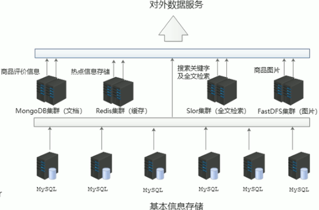
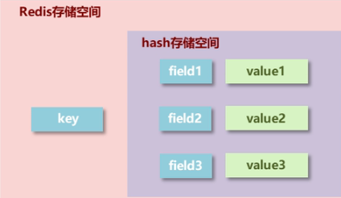
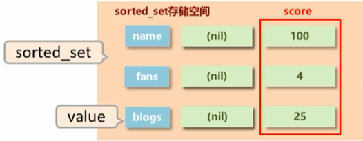
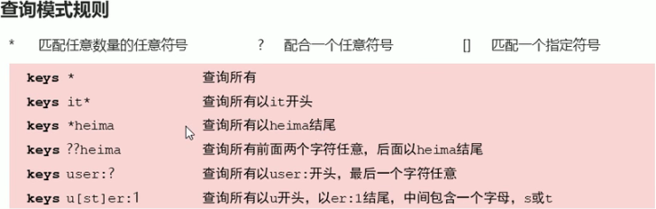
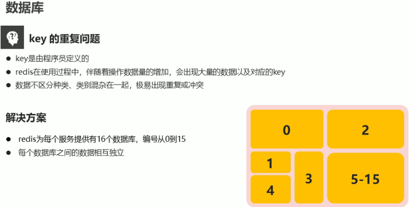

### Nosql

> `Not-Only SQL` 泛指非关系型数据库，作为关系型数据库的**补充。**
>
> 作用：应对基于海量用户和海量数据的前提下的数据处理问题

* 特征

> 1. 可扩容，可伸缩
> 2. 大数据量大高性能
> 3. 灵活的数据模型
> 4. 高可用

* 常见的NoSql 数据库

> Redis
>
> > 场景：
>
> memcache
>
> HBase
>
> MongoDB

* 数据库使用场景以及解决方案



### Redis

> 开源的**键值对**数据库

#### 特征

* 数据间没有必然的关联关系

* 内部使用单线程机制进行工作，操作原子性

* 高性能

* 多数据类型

  > `string, list, hash, set, sorted_set`

* 持久化支持，数据灾难恢复

#### 使用场景

* 热点数据加速查询
* 任务队列，秒杀，抢购，购票排队
* 及时信息查询，排行榜，网站访问统计，公交到站信息，在线人数信息等
* 分布式数据共享
* 消息队列
* 分布式锁

### 基础操作

#### 进入容器 CLI

```shell
docker run -itd --name redis-test -p 6379:6379 redis
docker exec -it redis-test /bin/bash
redis-cli
# 进入客户端

set name itheima
get name

# 会覆盖
set name itheima2

# 获取帮助，获取set 指令的使用
help set
```


### 数据类型

> redis 本身是一个Map的存储

#### string

```shell
set name itheima
get name
del name

# 批插入
mset name1 itheima1 name2 itheima2

# 批获取
get name1 name2

# 获取值长度
strlen name1

# 尾部添加
append name1 itheimama

# 扩展操作
set num 1
# 对 num 进行递增，默认1
incr num

# 对 num 进行递减，默认1
decr num 1

# 按照一定间隔递增
incrbyfloat num 10.0

incrby num 10

# 设置数据具有指定的声明周期
setex key seconds value

# 设置 num=2的有效时间为3s
setex num 3 2

# 设置的时常是微秒
psetex key millseconds value
```

数据醉倒存储量`512M`

#### hash

> 字典类型



```shell
hset key field value

gget key field

hgetall key

hdel key field1 [field1]

hmset user age 10 address xxx
hmget user age address

hexists user age

# 获取所有的值
hvals user
# 获取所有的 keys
hkeys user

# 递增
hincr key field increment
hincrbyfloat key field increment
```

#### list

> 一个存储空间包含有个值，对进入的数据存储空间顺序进行区分
>
> 底层采用**双向链表**存储结构实现, 高存储效率，读取慢

```shell
lpush key value1 value2
rpush key value1 value2

# start 从0开始，左闭右闭
lrange key start stop

# 查询到所有的
lrange l1 0 -1 

# 获取指定 index 的值
lindex key index

# 获取并移除
lpop key
rpop key

# 规定时间内获取并移除数据
# 当 key 中没有数据的时候，可以使用这个指令，指令会等待 timeout 时间，
# 再这个时间内如果 key 中存在数据了，则返回，timeout 时间到了，还没有数据，那么就直接返回
blpop key1 [key2] timeout
brpop key1 [key2] timeout

# 删除指定key数组中的值 value，count次，list 中的值可能是会重复的
lrem  key count value
```

#### set

> 可以大量存储，读取效率高，便于查询

```shell
add key member1 [member2]

smembers key

srem key member1 [member2]

# 获取集合数据总量
scard key

# 判断集合中释放包含指定数据
sismember key member

# 随机获取集合中指定数量的数据, 默认是 1
srandmember key [count]

# 随机获取集合中某个数据，并将该数据移除集合
spop key

# 集合操作,交，并，补
sinter key1 [key2]
sunion key1 [key2]
sdiff key1 [key2]

# 取得集合操作结构，并存储
sinterstore destination key1 [key2]
sunionstore destination key1 [key2]
sdiffstore destination key1 [key2]

# 指定数据从原始集合中移动到目标集合中
smove source destination member
```


#### sorted_set

> 根据存储数据自身的特征，可以排序的方式
>
> 
>
> 在插入值得时候，还给了一个score 得值，该值用于排序。它不是数据

```shell
zadd key score member [socre2 member2]
   
zrange key start stop [withscores]
zrevrange key start stop [withscores]
    
zrem key member [withscores]
    
    
# 获取数据对应得索引
zrank key member
zrevrank key member

# score 值获取
zscore key member
zincrby by increment member
```

*注意*

* `score` 保存得数据存储空间是64，可以是小数值，是双精度得 double 值
* `sorted_set` 底层存储也是基于`set` 得，数据不能重复

---

### key通用命令

`key` 是一个字符串，通过 `key` 获取 `redis` 中保存得数据。

#### `key` 基本操作

```shell
del key
exists key
type key
```


#### `key` 的失效性设置

```shell
expire key seconds
pexpire key millseconds
expireat key timestamp

pexpireat key millseconds-timestamp
```

####　获取`key` 的有效时间

```shell
ttl key
pttl key

# 时效性转为永久性
persist key
```


#### 查询

```shell
keys pattern
```




```shell
# 改名
rename key newkey
```


### `Redis 数据库 DB 的操作`

> `redis` 本地将所有的存储划分为16个区域，每个区域之间是隔离的



```shell
select 0 # 切换到0号数据库，默认数据库
select 1 # 切换到 1号数据库，以此类推

## 将当前库中的键 key，剪切到 db 号库中，
move key db

# 返回当前db 中key 的个数
dbsize

# 清除当前库
flushdb

# 清楚所有库数据
flushall
```

