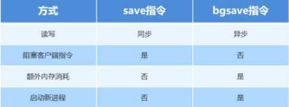
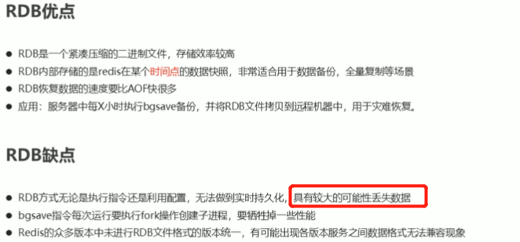

### 持久化

* 快照: `RDB`
* 记录操作步骤日志，恢复时候重新执行日志中记录：`AOF`

> redis 支持以上两种的持久化策略。


#### RDB

> 客户端发送持久化指令

```shell
save
# 会生产 dump.db 文件，保存当前数据

# docker redis 以配置文件方式运行
docker run -p 6379:6379 --name redis -v /home/local/docker/redis01/redis.conf:/etc/redis/redis.conf -v /home/local/docker/redis01/data:/data -d redis:latest redis-server /etc/redis/redis.conf --appendonly yes

# 在配置文件中可以设置 dbfilename 设置保存快照的文件名字
# 在重启动 redis 的时候会加载文件
```

`save` 指令会阻塞当前的`Redis` 服务器，知道当前`RDB` 过程结束位置，可能会有长时间的阻塞，**线上环境不建议使用**

#### 后台执行

```shell
bgsave
# 不是立即执行的，执行指令的时候，发送该指令到redis
# 会调用 fork 函数生成子进程，创建 rdb 文件
# 日志中会有 backgroud saving terminated with success 的输出
# 建议使用 bgsave
```

#### 自动执行根据条件执行备份

```shell
bgsave second changes
# 在时间 second 内，如果监控到有 changes 个key发生了变化，那么就触发保存
# 如果到了 second 时间，监控的 key 发生的变化数量小于 changes 个。不触发监控
# 那么重新开始记时间监控

# 如
bgsave 900 1
bgsave 300 10
bgsave 60 1000
```



其他`rdb` 方式

```shell
# 服务器运行过程中重启，并加载持久化数据
debug reload

# 关闭服务器时指定保存数据
shutdown save
```



​	除次之外还存在的问题有

* 每次存储的数据量较大，效率较低，每次读写均是全部数据
* 大量的IO操作
* fork创建子进程，内存产生额外消耗
* 宕机带来丢数据风险

### AOF

> `append only file` 不写全数据，仅仅记录部分数据
>
> 重启时候重新执行`AOF` 文件中的命令
>
> **主要解决数据持久化的实时性**，**这是目前主流方式**

#### 写数据过程

* 三种写数据策略

> 1. `aways` 每次操作都写到`.aof` 文件中，数据零误差，性能较低
> 2. `everysec`： 每秒，**准确性高，性能较高**， 默认配置
> 3. `no`： 系统控制，整理过程不可控

开启配置

```shell
appendonly yes|no
appendfsync always|everysec|no
# 在docker 中可以在启动镜像的时候给如参数
# 也可以配置到 redis.conf 中
```

