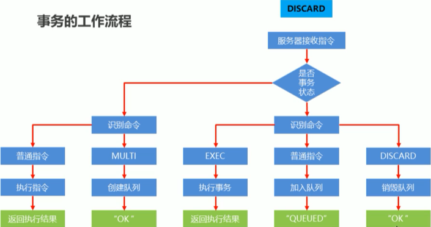
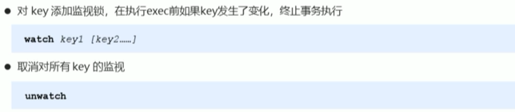
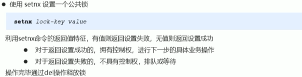
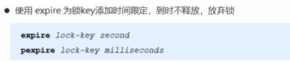
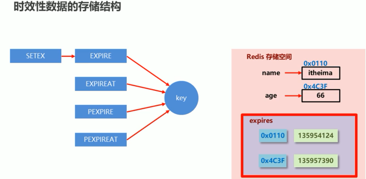
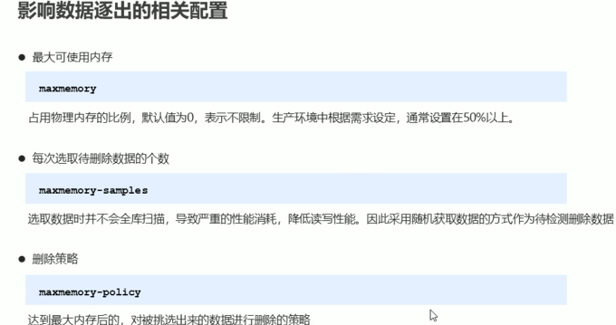

### 事务的边界

```shell
# 开启事务
multi

# 执行事务
exec

# 取消事务，在终止当前事务的定义，发生在 multi 之后，exec 之前
discard
```


### 事务的工作流程




#### 特殊情况

当事务开启之后，在执行 `exec` 前，如果输入的命令有错误，如`set` 命令，结果输入了`sea`，那么就会释放事务，后续执行`exec` 也会报错`事务不存在`


### 命令执行出现错误

> 指令格式正确， 但是无法正确的执行，例如对 string 执行 lpush 操作
>
> 能够正确运行命令并执行，运行错误的命令不会被执行
>
> 执行错误的命令不会被执行，且不会回滚。


### 锁

> 使用 watch 监控的变量，如果变量也被事务申明，如果在其他线程修改了该变量，那么事务就会被取消
>
> 不可以在事务中使用 watch。




### 分布式锁



手动加锁，自然就会存在忘记解锁得情况，所以还需要有自动解锁得机制



在加上锁之后，立马在设置一个释放锁得时间

---

#### 删除策略

> 删除带有有效时间得key 得策略
>
> `redis` 是一种内存记得数据库，所有数据均鵆在内存中，内存中得数据可以通过`TTL` 指令获取状态
>
> * `XX`: 具有时效性得数据
> * `-1`： 永久有效得数据
> * `-2`:  已经过期得数据，或者被删除得数据或者未定义得数据 

* 定时删除
* 惰性删除
* 定期删除



数据得删除是通过在内存占用和`CPU` 占用直接寻找一种平衡，顾此失彼都会造成整体`redis` 性能得下降，甚至引发服务器宕机或者内存泄漏

* 定时删除

> 创建一个定时器，当`key` 设置有国企时间，且过期时间到达，由定时器任务立即执行对键得删除操作
>
> 有点：
>
> > 节约内存，到时就删除，快速释放不必要得内存占用
>
> 缺点：
>
> > 会抢占 CPU，无论CPU 负载如何，均会占用CPU
>
> 牺牲CPU，换取内存空间

* 惰性删除

> 数据到达过期时间，不做处理，等下次访问该数据得时候删除
>
> 在执行`get name`
>
> 如果`name` 没有过期，那么返回，如果已经过期，那么删除。
>
> 有点:
>
> > 节约CPU，发现必须删除得时候才会删除
>
> 缺点：
>
> > 内存压力会相对比较大，会由不适用得数据，占着内存

上面得2种方案，要么是占CPU比较大，要么是占内存比较大，

* 定期删除

> 上面2种方案得折中
>
> 在所有设置了过期时间得key，随机抽取若干个，如果有过期得，那么就删除，


### 逐出算法

> 当进入得key，如果发现内存现在不够得时候，redis 需要删除一些数据为当前指令清理存储空间，清理数据得策略成为**逐出算法**
>
> 逐出算法得过程不是一定能成功，如果经过多此尝试，内存还是不够，那么最终OOM 错误



