### 主从复制

可用性 = （全年时间 -  一年中不可提供服务得时间 ）/全年时间

经常说得可用性，如4个9，就是说上面计算得结果为99.99%。


#### 高可用

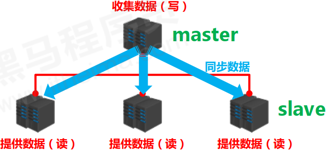

多master 高可用，master 也是相对而言得，可以达到作用

* 读写分离，提供服务器负载能力
* 负载均衡
* 故障恢复
* 数据冗余
* 高可用

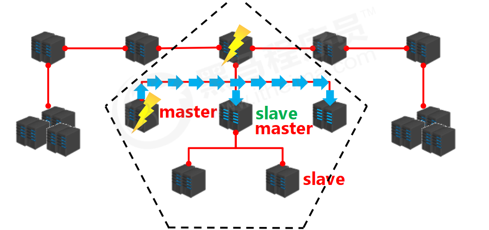


#### 主从复制工作流程

1. 建立主从连接

   > slave 连接到master，相互能够识别， 建立 socket 通道

   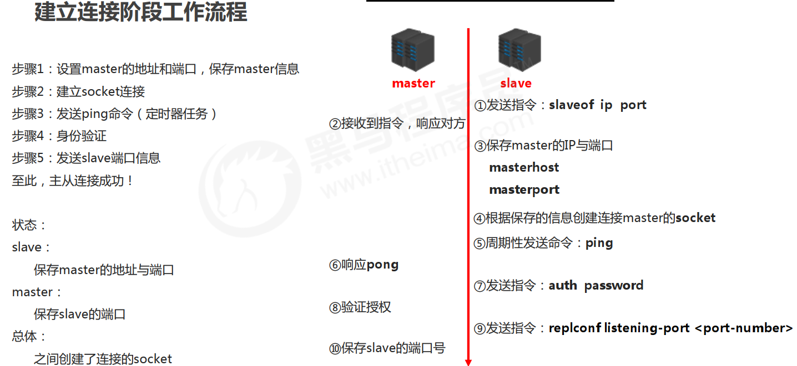

   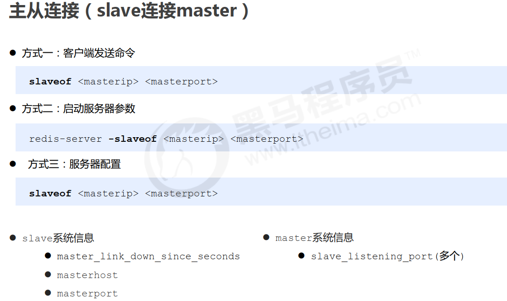

   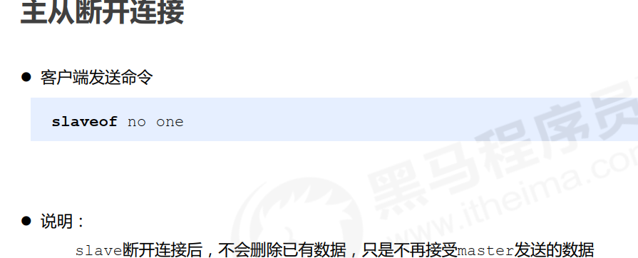

2. 数据同步

   master 数据同步到 slave、slave 发起指令

   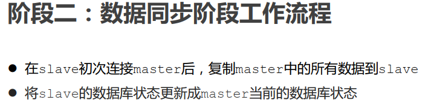

   全量同步：第一次数据同步，。

   部分同步：请求部分数据/指令

   全量/部分数据不同结束之后，发送指令同步状态。

   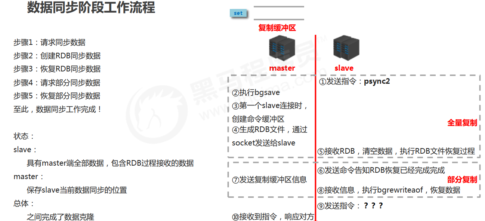

   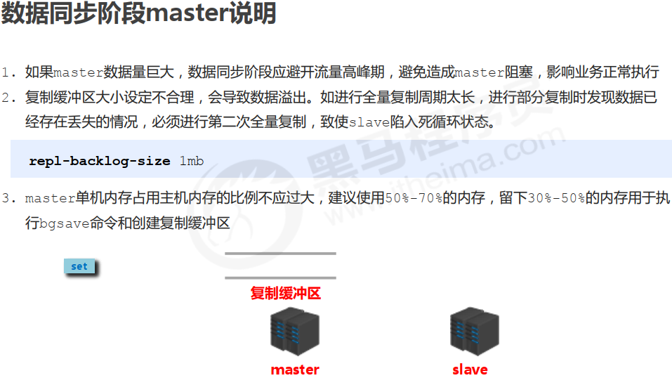

   第二条得意思是，缓冲区得大小是太有限得，当设置不合理得时候，例如说只能放10个指令，但是此时以及沾满了，但是指令还在不断进入，那么就会将之前进入得指令覆盖，导致数据丢失，这个时候就需要二次全量复制，而二次全量复制得时候，如果还又数据在进入，那么就会出现这个二次全量复制得死循环，不停得复制数据，清理数据。

   所需master 需要设置合理得缓冲区大小，默认是1M，(slave 不需要设置)，一般得设置如第3条。

   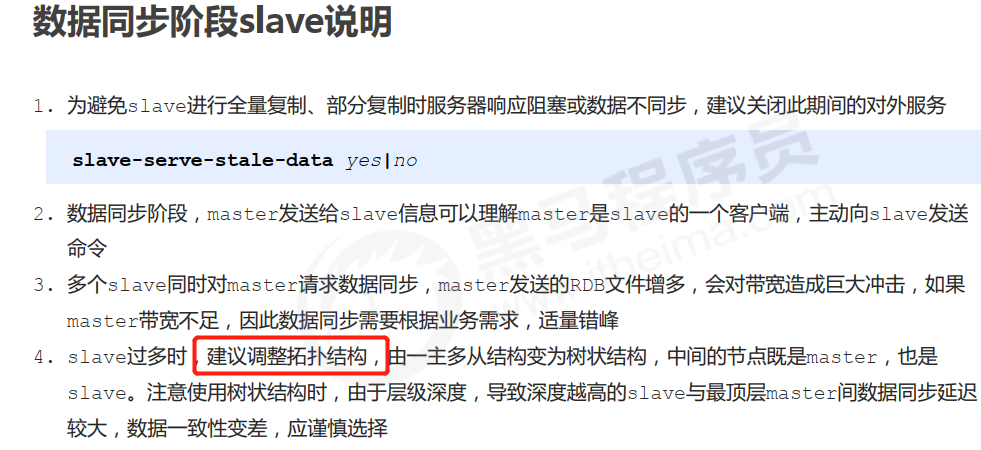

3. 命令传播

   操作master 得时候给master 发送指令，指令会同步到 slave

   操作slave得时候给slave 发送指令，指令会同步到master

---

```shell
# docker redis 以配置文件方式运行
docker run -p 6379:6379 --name redis -v /home/local/docker/redis01/redis.conf:/etc/redis/redis.conf -v /home/local/docker/redis01/data:/data -d redis:latest redis-server /etc/redis/redis.conf --appendonly yes

# 在配置文件中可以设置 dbfilename 设置保存快照的文件名字
# 在重启动 redis 的时候会加载文件


# 新建一个 容器
docker create -p 6388:6388 --name redis-slave -v /home/local/docker/redis02/redis.conf:/etc/redis/redis.conf -v /home/local/docker/redis02/data:/data redis:latest redis-server /etc/redis/redis.conf --appendonly yes --port 6388

# 6388 端口执行
slaveof 127.0.0.1 6379


```

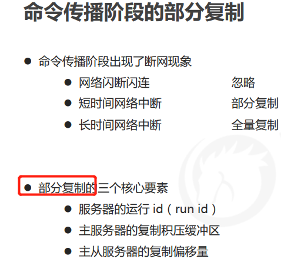

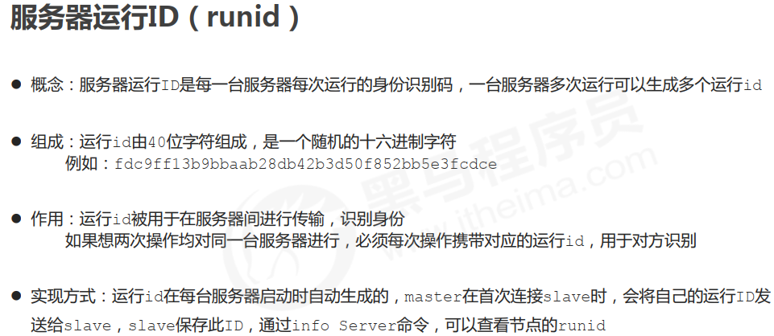

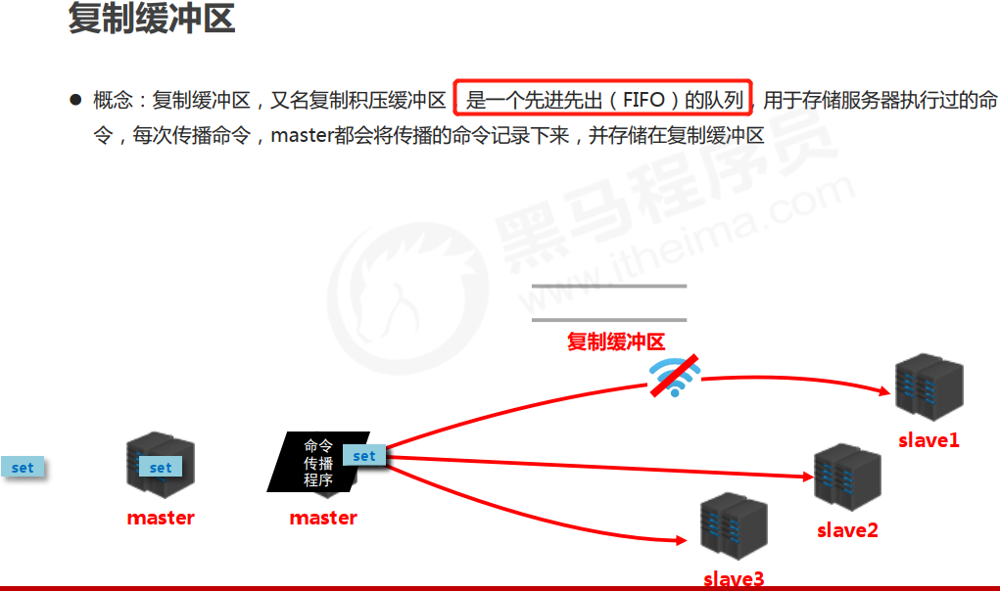

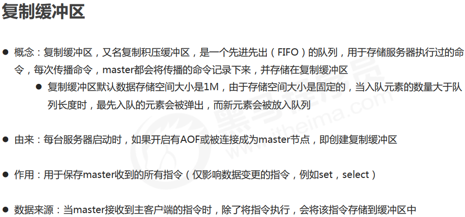

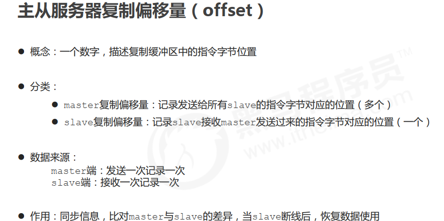

---

### 哨兵模式

master 挂掉之后，从slave 中选举出一个新得 master

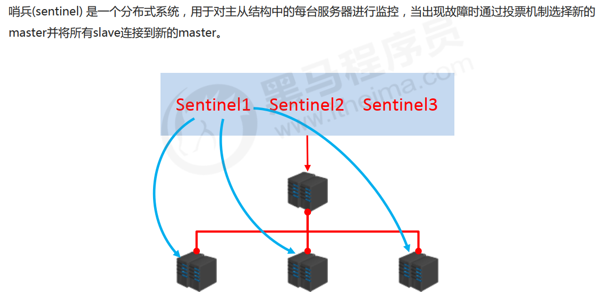

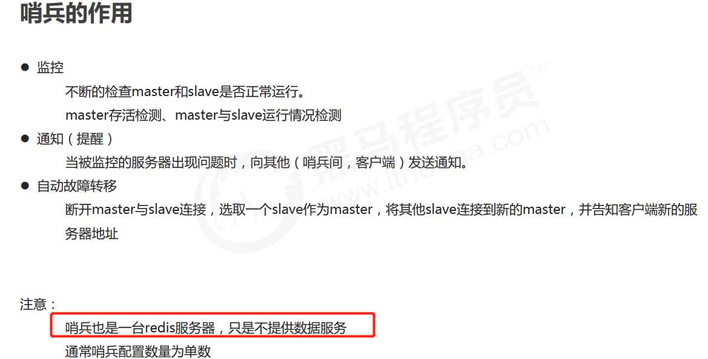

