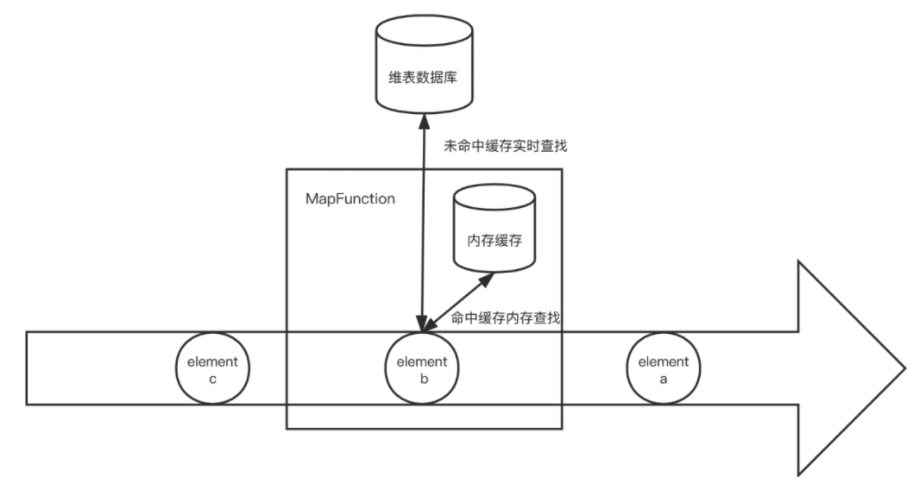

### 主要内容

#### Spark Join 方式

* Spark RDD Join

* Spark DF Join 方式

* Spark DF Join 策略

#### Flink Join 方式

* 基于DataStream 的
  * 时间窗口的
  * 时间间隔的
* Table SQL 方式
* 维度表和事实表的 `Join` 方式

---

#### Spark 中的 Join(批Join)

##### RDD Join

几种`Join` 方式均是使用`cogroup` 算子实现的

```scala
def join[W](other: RDD[(K, W)], partitioner: Partitioner): RDD[(K, (V, W))] = self.withScope {
  this.cogroup(other, partitioner).flatMapValues( pair =>
     // 但凡这里有一个 key 对应的 iterator 是空 buffer 那么这里就不会 yield 数据
     // 注意这里的 join 的结果和平时如 mysql 中的join 是不一样的。这里相当于是双层循环                                              
     for (v <- pair._1.iterator; w <- pair._2.iterator) yield (v, w)
  )
}

def leftOuterJoin[W](
  other: RDD[(K, W)],
  partitioner: Partitioner): RDD[(K, (V, Option[W]))] = self.withScope {
  this.cogroup(other, partitioner).flatMapValues { pair =>
    if (pair._2.isEmpty) {
      // 注意上面提到的，如果pair._2(iterator) 是空，那么 yield 是不会产生数据的
      // 所以这里特殊处理
      pair._1.iterator.map(v => (v, None))
    } else {
      for (v <- pair._1.iterator; w <- pair._2.iterator) yield (v, Some(w))
    }
  }
}

// rightOuterJoin 也是一样的
```

看看几种使用以及输出

```scala
val rdd1: RDD[(String, Int)] = sc.parallelize(List(("hbase", 1), ("hadoop", 1), ("flink", 1), ("spark", 1)))
val rdd2: RDD[(String, Int)] = sc.parallelize(List(("spark", 2), ("hadoop", 2), ("hbase", 2), ("hbase", 22),("hive", 2),("hive", 22)))

val value: RDD[(String, (Int, Int))] = rdd1.join(rdd2)
/*
   all pairs of elements with matching keys in this and other:  inner join
   (hadoop,(1,2)),(spark,(1,2)),(hbase,(1,2)),(hbase,(1,22))
*/

val value: RDD[(String, (Int, Option[Int]))] = rdd1.leftOuterJoin(rdd2)
/*
   For each element (k, v) in left, the resulting RDD will either contain all pairs (k, (v, Some(w)))
   for w in other, or the pair (k, (v, None)) if no elements in other have key k
   (hadoop,(1,Some(2))),(flink,(1,None)),(spark,(1,Some(2))),(hbase,(1,Some(2))),(hbase,(1,Some(22)))
*/
val value: RDD[(String, (Option[Int], Option[Int]))] = rdd1.fullOuterJoin(rdd2)
/*
	resulting RDD will either contain all pairs (k, (Some(v), Some(w)))
	(hadoop,(Some(1),Some(2))),
	(flink,(Some(1),None)),
	(spark,(Some(1),Some(2))),
	(hbase,(Some(1),Some(2))),
	(hbase,(Some(1),Some(22))),
	(hive,(None,Some(2))),
	(hive,(None,Some(22)))
*/
```

使用`join`的时候, 没有同时存在在2个`rdd` 中的数据会丢失。

当`rdd` 中key 不唯一，那么`join`  后的数据会出现扩张。

所以在使用的时候

* 最好保证`key` 的唯一性，调用`combineByKey`  等算子去除重复。

* 对于`key` 不存在的情况时候。最好是使用`outerJoin`, 避免数据的丢失

使用的时候，如果有可能，在`join` 的时候，先对数据进行过滤，这样在`shuffle` 的时候减轻资源的浪费。

`rdd JOIN` 的时候会使用默认的`shuffle hash join `  , 将相同 `key` 的 `rdd` 分发到相同的分区中，然后`join`

有2种方法可以避免`shuffle`

* 当一个`rdd` 的数据量比较小的时候, 设置广播变量

  ```scala
  def manualBroadCastHashJoin[K : Ordering : ClassTag, V1 : ClassTag,
   V2 : ClassTag](bigRDD : RDD[(K, V1)], smallRDD : RDD[(K, V2)])= {
    
    val smallRDDLocal: Map[K, V2] = smallRDD.collectAsMap()
    val smallRDDLocalBcast = bigRDD.sparkContext.broadcast(smallRDDLocal)
    
    bigRDD.mapPartitions(iter => {
     iter.flatMap{
      case (k,v1 ) =>
       smallRDDLocalBcast.value.get(k) match {
        case None => Seq.empty[(K, (V1, V2))]
        case Some(v2) => Seq((k, (v1, v2)))
       }
     }
    }, preservesPartitioning = true)
   }
  }
  ```

* 如果在 `join` 前会进行聚合操作，那么对数据先进行分区，也就是会将2个`rdd` 进行预分区，将相同`key` 的数据分发到相同分区，那么在后面的 `Join` 的时候就不需要在进行 `shuffle` 了

  ```scala
  def joinScoresWithAddress3(scoreRDD: RDD[(Long, Double)],
     addressRDD: RDD[(Long, String)]) : RDD[(Long, (Double, String))]= {
      // If addressRDD has a known partitioner we should use that,
      // otherwise it has a default hash parttioner, which we can reconstruct by
      // getting the number of partitions.
    
      val addressDataPartitioner = addressRDD.partitioner match {
        case (Some(p)) => p
        case (None) => new HashPartitioner(addressRDD.partitions.length)
      }
     // 分配 Partitioner，
      val bestScoreData = scoreRDD.reduceByKey(addressDataPartitioner,
        (x, y) => if(x > y) x else y)
      bestScoreData.join(addressRDD)
    }
  ```

##### DataFrame Join

想比较与`rdd`, `DF` 会做更多的优化，如会将一些算子下沉或者是重新规划算子操作，如会将某些过滤或者聚合操作先执行，然后再`Join` 等。`df` 的`Join` 使用，并用处理`shuffle` 的问题，没有暴露其`API`。`df` 的`Join`  还支持 `self join` 不过需要重命名列名。

```scala
df.join(otherDf, sqlCondition, joinType)
```

`joinType` 类型可以取到

* 默认 `inner`, 可以不给值
* `left_outer`
* `left_semi`
* `left_anti`
* `crossJoin: df1.crossJoin(df2)`

大概就是`内链接、外链接、半链接(semi)、交叉连接(cross)` 

```scala
private val spark: SparkSession = SparkSession.builder()
.master("local[*]")
.appName("name")
.getOrCreate()
private val sc: SparkContext = spark.sparkContext
sc.setLogLevel("ERROR")

import spark.implicits._

private val df1: DataFrame = sc.makeRDD(Seq(
  DF1("Happy", 1.0),
  DF1("Sad", 0.9),
  DF1("Happy", 1.5),
  DF1("Coffee", 3.0)
)).toDF

private val df2: DataFrame = sc.makeRDD(Seq(
  DF2("Happy", 94110),
  DF2("Happy", 94103),
  DF2("Coffee", 10504),
  DF2("Tea", 7012)
)).toDF

//  当df1 和 df2 同时存在相同的列明的时候可以使用
private val innerJoin1: DataFrame = df1.join(df2, "name")
private val innerJoin2: DataFrame = df1.join(df2, df1("name1") === df2("name2"))
innerJoin2.show()
private val innerJoin3: DataFrame = df1.join(df2).where($"name1"===$"name2")
innerJoin3.show()

/*
    +------+----+------+-----+
    | name1|size| name2|  zip|
    +------+----+------+-----+
    |Coffee| 3.0|Coffee|10504|
    | Happy| 1.0| Happy|94110|
    | Happy| 1.0| Happy|94103|
    | Happy| 1.5| Happy|94110|
    | Happy| 1.5| Happy|94103|
    +------+----+------+-----+
    当 key 不唯一的时候扩展了数据
   */

df1.join(df2, df1("name1")===df2("name2"), "cross").show()
// 这里的输出结果和 inner 是一样的，crossJoin 之后再 df1("name1")===df2("name2") 那就会去掉很多的数据
// 然后剩下的数据，就和直接 innerJoin 的一样了
  /*
     +------+----+------+-----+
    | name1|size| name2|  zip|
    +------+----+------+-----+
    |Coffee| 3.0|Coffee|10504|
    | Happy| 1.0| Happy|94110|
    | Happy| 1.0| Happy|94103|
    | Happy| 1.5| Happy|94110|
    | Happy| 1.5| Happy|94103|
    +------+----+------+-----+
   */

df1.crossJoin(df2).show()
// crossJoin 会输出16个数据

df1.join(df2, df1("name1")===df2("name2"), "left_outer").show()
  /*
      保持左表，重复key 扩展数据， right_outer 也是一样的，保持右表，重复 key 扩展数据
      +------+----+------+-----+
      | name1|size| name2|  zip|
      +------+----+------+-----+
      |   Sad| 0.9|  null| null|
      |Coffee| 3.0|Coffee|10504|
      | Happy| 1.0| Happy|94110|
      | Happy| 1.0| Happy|94103|
      | Happy| 1.5| Happy|94110|
      | Happy| 1.5| Happy|94103|
      +------+----+------+-----+
   */

df1.join(df2, df1("name1")===df2("name2"), "left_semi").show()
  /*
      filtering the left table for only rows with keys present in the right table
      留下左表中的哪些同时存在在右边中的row
      +------+----+
      | name1|size|
      +------+----+
      |Coffee| 3.0|
      | Happy| 1.0|
      | Happy| 1.5|
      +------+----+
   */

df1.join(df2, df1("name1")===df2("name2"), "left_anti").show()
  /*
    returns records that are not present in the right table
    留下左表中哪些没有在右表中的哪些 row
    |name1|size|
    +-----+----+
    |  Sad| 0.9|
    +-----+----+
   */

// 广播Join 方式
df1.join(broadcast(df2), df1("name1")===df2("name2"), "left_anti").show()
  /*
      Spark also automatically uses the
      spark.sql.conf.autoBroadcastJoinThreshold(default 10 M)
      to determine if a table should be broadcast.
   */
```

#### Spark DF Join 中的3中策略

* **Shuffle Hash Join**
* **Broadcast Join**
* **Sort Merge Join**
* Cartesian Join
* Broadcast Nested Loop Join

##### Shuffle Hash Join

> 1. 两张参与 JOIN 的表，分别按照 join Key 进行重分区，该过程会涉及到 shuffle，其目的就是将相同的 join key 数据发送到同一个分区中，方便分区内进行 join
> 2. 对于每个 shuffle 后的分区，会将小表的分区数据构建为一个 Hash Table, 然后更加 join Key 和大表非分区数据记录进行匹配。

##### **Broadcast Join**

> 小数据量进行广播，然后再collectAsMap，然后再 map 端 join

##### Sort Merge Join

> *spark2.3 之后的默认 join 方式*
>
> 
>
> 该JOIN机制是Spark默认的，可以通过参数**spark.sql.join.preferSortMergeJoin**进行配置，默认是true，即优先使用Sort Merge Join。一般在两张大表进行JOIN时，使用该方式。**Sort Merge Join可以减少集群中的数据传输**，该方式不会先加载所有数据的到内存，然后进行hashjoin。
>
> 猜测：**可以减少集群中的数据传输是因为：**
>
> 经过sort 之后，会根据 `spark runtime` 时间对数据的统计信息，知道哪些数据在哪个分区，然后直接对分区直接进行join，然后再shuffle 到一个分区结果中，然后再对第二个分区数据进行join，同样也是知道了另外一个分区中的同样的key 所在的分区，然后再将这个数据读进来，然后join，写结果分区。

---

#### Flink 中的 Join(流Join)

从[官方文档](https://ci.apache.org/projects/flink/flink-docs-release-1.13/docs/dev/datastream/operators/joining/) 中有2种双流`Join`，基于`window` 的和基于`Interval`

##### Window Join

> 就是将2个流 `join` 生成`JoinedStreams`, 然后给定一个`Join` 的条件，然后再一个窗口中进行数据的操作。
>
> ```java
> JoinedStreams<Goods, OrderItem> join = gooddsDsWm.join(itemsDsWm);
> 
> /*
>    A window join joins the elements of two streams that share a common key and lie in the same window.
>    The elements from both sides are then passed to a user-defined JoinFunction or FlatJoinFunction
>    where the user can emit results that meet the join criteria.
> 
> 注意事项：
>  The creation of pairwise combinations of elements of the two streams behaves like an inner-join,
>  meaning elements from one stream will not be emitted if they don’t have a corresponding element from the other stream to be joined with.
> */
> DataStream<FactOrderItem> resultDs = join
>   .where(good -> good.goodsId).equalTo(order -> order.goodsId)
>   .window(TumblingEventTimeWindows.of(Time.seconds(5)))
>   .apply(new JoinFunction<Goods, OrderItem, FactOrderItem>() {
>     @Override
>     public FactOrderItem join(Goods first, OrderItem second) throws Exception {
>       FactOrderItem factOrderItem = new FactOrderItem();
>       factOrderItem.setCount(second.getCount());
>       factOrderItem.setGoodsId(first.goodsId);
>       factOrderItem.setGoodsName(first.goodsName);
>       factOrderItem.setTotalMoney(first.getGoodsPrince().multiply(new BigDecimal(second.count)));
>       return factOrderItem;
>     }
>   });
> ```
>
> 这里道理还是比较简单的，窗口可以使用滑动/滚动/回话窗口。

##### Interval Join

> 分别将两个流假如说是流A和流B`keyBy`, 那么流A会在一个时间范围内观察流B，如果二者的key 相同，那么这个 pair 就会进入到一个 process 中，然后再这里定义函数，完成业务逻辑
>
> ```java
> DataStream<FactOrderItem> resultDs = gooddsDsWm.keyBy(Goods::getGoodsId)
>   .intervalJoin(itemsDsWm.keyBy(OrderItem::getGoodsId))
>   .between(Time.seconds(-1), Time.seconds(1))
>   .process(new ProcessJoinFunction<Goods, OrderItem, FactOrderItem>() {
>     
>     @Override
>     public void processElement(Goods first, OrderItem second, Context ctx, Collector<FactOrderItem> out) throws Exception {
>       
>       FactOrderItem factOrderItem = new FactOrderItem();
>       factOrderItem.setCount(second.getCount());
>       factOrderItem.setGoodsId(first.goodsId);
>       factOrderItem.setGoodsName(first.goodsName);
>       factOrderItem.setTotalMoney(first.getGoodsPrince().multiply(new BigDecimal(second.count)));
>       out.collect(factOrderItem);
>     }
>   });
> 
> /*
> 	v1.13： The interval join currently only performs inner joins.
>   	gooddsDsWm 的eventTime t,会和 itemsDsWm 的 eventTime 的 timestamp
>   	[timestamp + lowerBound; timestamp + upperBound]
>   	进行 join，每个 相同 key 的 join pair 就会触发 processElement 方法。
> /*
> ```
>
> 


但是上面的`Join` 操作都需要有一个时间来界定数据，但是在使用场景中，不一定有这个时间，例如事实表`Join` 维度表，维度表是变化缓慢可能是没有时间的。也就没有时间界定数据。这个时候可以使用[Temporal Table Join](https://ci.apache.org/projects/flink/flink-docs-release-1.9/dev/table/streaming/temporal_tables.html#temporal-table-functions)使用。

Temporal Table Join 是 Flink SQL/Table API 的原生支持，**它对两个数据流的输入都进行了缓存**，因此比起上述的基于 Event Time 的维表变更日志关联，它可以容忍任意数据流的延迟，数据准确性更好。Temporal Table Join 在 SQL/Table API 使用时是十分简单的，但如果想在 DataStream API 中使用，则需要自己实现对应的逻辑。

总体思路是使用一个 CoProcessFunction，将 build 数据流（维度表）以时间版本为 key 保存在 MapState 中（与基于 Event Time 的维表变更日志关联相同），再将 probe 数据流和输出结果也用 State 缓存起来（同样以 Event Time 为 key），一直等到 Watermark 提升到它们对应的 Event Time，才把结果输出和将两个数据流的输入清理掉。

这个 Watermark 触发很自然地是用 Event Time Timer 来实现，但要注意不要为每条数据都设置一遍 Timer，因为一旦 Watermark 提升会触发很多个 Timer 导致性能急剧下降。比较好的实践是为每个 `key` 只注册一个 `Timer`。

---

#### `DataStream` 通过状态存储维度表，以及`异步IO` 等方式实现多种方式的维度和事实表的Join

[文章来源**网易游戏高级开发工程师：林小铂**](https://ververica.cn/developers/flink-datastream-associated-dimension-table-practice/)

* 实时数据库查询查找关联
* 预加载维度关联
* 维表变更日志关联

*这三类关联方式不存在绝对的好坏，更多的是针对业务场景在各指标上的权衡取舍，因此这里的得分也仅仅是针对通用场景来说。*

#### 实时数据库查询查找关联

##### 同步数据库查找


其优点是实现简单、不需要额外的内存且维度表的更新延迟低，然而其缺点也是非常明显的：

1. 每条数据都需要请求一次数据库，给数据库的压力比较大
2. 访问数据库是同步调用，到时下游 `task` 线程会被阻塞，影响吞吐量
3. 关联是基于 Process Time，结果并不具有确定性
4. 瓶颈在数据库端，但实时计算的流量通常远大于普通数据库的设计流量，所以可拓展性低。

*从使用场景来说，同步数据库产找关联用于流量比较低的作业，通常并不是最好的选择*

##### 异步数据库查找

和同步的方案是一样的，只不过在访问数据库的时候使用异步的方式，采用`Flink` 的异步IO模块`AsyncIO`, 使用异步的方式可以并发的处理多个请求，很大程度上减少对下游`Task` 线程的阻塞。

`AsyncIO`, 有有序返回和无序返回的两种方式，有序返回模式下会需要缓存数据，且写到`checkpoint` 中，


*从应用场景来说，异步数据库查找关联比较适合流量低的实时计算。*

##### 带缓存的数据库查找关联

上述的两种同步和异步的实时查询数据的方式会对数据库造成压力，所以可以引入一层缓存来减少直接对数据库的请求，缓存一般并不需要通过 `checkpoint`机制持久化，因此简单的使用一个`WeakHashMap`  或者 `Guava Cache` 就可以实现


在冷启动刚开始的时候还是会对数据库造成一定的压力，但后续取决于缓存命中，数据库的压力将得到一定程度的缓减，但是使用缓存带来的问题是维表的更新并不能及时的反应到关联操作上，当然这也和缓存剔除策略有关，需要根据维表更新频率和业务对实时维度数据的容忍程度计算。

*带缓存的数据库查询关联适合于流量较低，且对维表数据实时性要求不太高或者维表更新比较少的业务*

#### 预加载维表关联

预加载维表关联是在作业启动时候将维表信息读到内存中，而在后续的运行期间，每条数据都会和内容中的维表进行关联，而不会直接实时访问数据库。

比如在`process` 方法的`open` 生命周期直接将维表信息加载进来，维表并不需要使用`state` 来保存，无论是手动重启或者是Flink 的错误机制导致的重启，`open` 方法都会被执行，而得到最新的维表数据。


这种方式对数据库的压力只是持续了很短的时间，但因为是拷贝整个维表，所以压力还是很大，而换来的优势是在运行期间不需要访问数据库，可以提高效率，优点类似离线计算。

对应的问题是运行期间维表数据不能更新，对`TaskManager ` 内存要求比较高。

*这种方式适合维表比较小，变更实时性要求不高的场景*

##### 启动预加载分区维表

在上面的基础之上，如果维表较大，可以启动预加载维表基础之上增加预分区的功能，简单来说就是将数据量按字段进行分区，然后每个下游`Task`, 只需要加载对应分区范围的维表数据，这里使用的分区方式并不是`keyBy`而是更加业务员数据定制化分区策略，然后调用`DataStream#partitionCustom`。

比如按照 `userId` 等区间划分，`0-999` 划分到 `subtask 1，1000-1999` 划分到 `subtask 2`，以此类推。而在 `open() `方法中，我们再根据 `subtask` 的 `id` 和总并行度来计算应该加载的维表数据范围。


*这里可以解决`TaskManager` 压力过大的问题，但同时给带来设计和维护分区策略的复杂性，*

*启动预加载分区维表适合维表比较大而变更实时性要求不高的场景，比如用户点击数据关联用户所在地。*

##### 启动预加载维表并定时刷新

上述的问题还存在一个问题就是，维度数据的更新，可以通过引入定时刷新机制办法来缓解这个问题，定时刷新可以通过使用`ProcessFunction` 提供的`Timer` 设置定时任务，或者在`open`  中初始化一个线程池来做这个事情，不过`Timer` 限制要求`KeyedStream`, 

而上述的 DataStream#partitionCustom 并不会返回一个 KeyedStream，因此两者并不兼容。而如果使用额外线程定时刷新的办法则不受这个限制。

*这种方式在于引入比较小复杂性的情况下大大缓解了的维度表更新问题，但也给维表数据库带来更多压力，因为每次 reload 的时候都是一次请求高峰。*

*预加载维表和定时刷新的组合适合维表变更实时性要求不是特别高的场景。取决于定时刷新的频率和数据库的性能，这种方式可以满足大部分关联维表的业务。*

##### 预加载 + 实时数据库查找

将预加载的维表作为缓存给实时关联时使用，若未名中则 fallback 到数据库查找。



*这种方式实际是带缓存的数据库查找关联的衍生，不同之处在于相比冷启动时未命中缓存导致的多次实时数据库访问，该方式直接批量拉取整个维表效率更高，但也有可能拉取到不会访问到的多余数据*

#### 维表变更日志关联

> 将维表变更日志以 `changeLog` 数据流的方式表示，从而将关联转变为两个流的 `join`，通常是将维表数据库端以`push` 的方式将日志写到`kafka`消息队列中，维表流称为 `build` 数据流，另外关联的主要数据流称为是 `probe` 流。

##### `processingtime` 维表变更日志关联

如果基于 `Processing Time` 做关联，我们可以利用 `keyby` 将两个数据流中关联字段值相同的数据划分到`KeyedCoProcessFunction` 的同一个分区，然后用 `ValueState` 或者 `MapState` 将维表数据保存下来。在普通数据流的一条记录进到函数时，到 `State` 中查找有无符合条件的 `join` 对象，若有则关联输出结果，若无则根据 `join` 的类型决定是直接丢弃还是与空值关联。这里要注意的是，`State` 的大小要尽量控制好。首先是只保存每个 `key` 最新的维度数据值，其次是要给 `State` 设置好 `TTL`，让 `Flink` 可以自动清理。


基于 `Processing Time` 的维表变更日志关联优点是不需要直接请求数据库，不会对数据库造成压力；缺点是比较复杂，相当于使用 `build流`在 `Flink` 应用端重新构建一个维表，会占用一定的 `CPU` 和比较多的内存和磁盘资源。值得注意的是，我们可以利用 `Flink` 提供的 `RocksDB StateBackend`，将大部分的维表数据存在磁盘而不是内存中，所以并不会占用很高的内存。不过基于 `Processing Time` 的这种关联对两个数据流的延迟要求比较高，否则如果其中一个数据流出现 `lag` 时，关联得到的结果可能并不是我们想要的，比如可能会关联到未来时间点的维表数据。

*基于 Processing Time 的维表变更日志关联比较适用于不便直接访问数据的场景（比如维表数据库是业务线上数据库，出于安全和负载的原因不能直接访问），或者对维表的变更实时性要求比较高的场景（但因为数据准确性的关系，一般用下文的 Event Time 关联会更好）。*

##### `eventTime` 维表变更日志关联

基于 `Event Time` 的维表关联实际上和基于 `Processing Time` 的十分相似，不同之处在于我们将维表 `build 流` 的多个时间版本都记录下来，**然后每当一条记录进来，我们会找到对应时间版本的维表数据来和它关联，而不是总用最新版本**，因此延迟数据的关联准确性大大提高。不过因为目前 `State` 并没有提供 `Event Time` 的 `TTL`，因此我们需要自己设计和实现 `State` 的清理策略，比如直接设置一个 `Event Time Timer`（但要注意 `Timer` 不能太多导致性能问题），再比如对于单个 `key` 只保存最近的 10 个版本，当有更新版本的维表数据到达时，要清理掉最老版本的数据。


基于 Event Time 的维表变更日志关联相对基于 Processing Time 的方式来说是一个改进，虽然多个维表版本导致空间资源要求更大，但确保准确性对于大多数场景来说都是十分重要的。相比 Processing Time 对两个数据的延迟都有要求，Event Time 要求 build 数据流的延迟低，否则可能一条数据到达时关联不到对应维表数据或者关联了一个过时版本的维表数据，

*基于 Event Time 的维表变更日志关联比较适合于维表变更比较多且对变更实时性要求较高的场景 同时也适合于不便直接访问数据库的场景。*

#### Temporal Table Join

Timed-Windowed Join 解决了资源问题，但也限制了使用场景: Join 两个输入流都必须有时间下界，超过之后则不可访问。这对于很多 Join 维表的业务来说是不适用的，因为很多情况下维表并没有时间界限。针对这个问题，Flink 提供了 Temporal Table Join 来满足用户需求。

Temporal Table Join 类似于 Hash Join，将输入分为 Build Table 和 Probe Table。前者一般是纬度表的 changelog，后者一般是业务数据流，典型情况下后者的数据量应该远大于前者。在 Temporal Table Join 中，Build Table 是一个基于 append-only 数据流的带时间版本的视图，所以又称为 Temporal Table。Temporal Table 要求定义一个主键和用于版本化的字段（通常就是 Event Time 时间字段），以反映记录内容在不同时间的内容。

Temporal Table Join 在 SQL/Table API 使用时是十分简单的，但如果想在 DataStream API 中使用，则需要自己实现对应的逻辑。

总体思路是使用一个 CoProcessFunction，将 build 数据流以时间版本为 key 保存在 MapState 中（与基于 Event Time 的维表变更日志关联相同），再将 probe 数据流和输出结果也用 State 缓存起来（同样以 Event Time 为 key），一直等到 Watermark 提升到它们对应的 Event Time，才把结果输出和将两个数据流的输入清理掉。

**Temporal Table Join 的好处在于对于两边数据流的延迟的容忍度较大，但作为代价会引入一定的输出结果的延迟，**这也是基于 Watermark 机制的计算的常见问题，或者说，妥协。另外因为吞吐量较大的 probe 数据流也需要缓存，Flink 应用对空间资源的需求会大很多。

[文章来源:网易游戏高级开发工程师:**林小铂**](http://www.whitewood.me/2019/12/15/Flink-SQL-%E5%A6%82%E4%BD%95%E5%AE%9E%E7%8E%B0%E6%95%B0%E6%8D%AE%E6%B5%81%E7%9A%84-Join/)

比如典型的一个例子是对商业订单金额进行汇率转换。假设有一个 Orders 流记录订单金额，需要和 RatesHistory 汇率流进行 Join。RatesHistory 代表不同货币转为日元的汇率，每当汇率有变化时就会有一条更新记录。两个表在某一时间节点内容如下:


我们将 RatesHistory 注册为一个名为 Rates 的 Temporal Table，设定主键为 currency，版本字段为 time。


此后给 Rates 指定时间版本，Rates 则会基于 RatesHistory 来计算符合时间版本的汇率转换内容。


在 Rates 的帮助下，我们可以将业务逻辑用以下的查询来表达:

```sql
SELECT 
  o.amount * r.rate
FROM
  Orders o,
  LATERAL Table(Rates(o.time)) r
WHERE
  o.currency = r.currency
```

值得注意的是，不同于在 Regular Join 和 Time-Windowed Join 中两个表是平等的，任意一个表的新记录都可以与另一表的历史记录进行匹配，在 Temporal Table Join 中，**Temoparal Table 的更新对另一表在该时间节点以前的记录是不可见的**。这意味着我们只需要保存 Build Side 的记录直到 Watermark 超过记录的版本字段。因为 Probe Side 的输入理论上不会再有早于 Watermark 的记录，这些版本的数据可以安全地被清理掉。