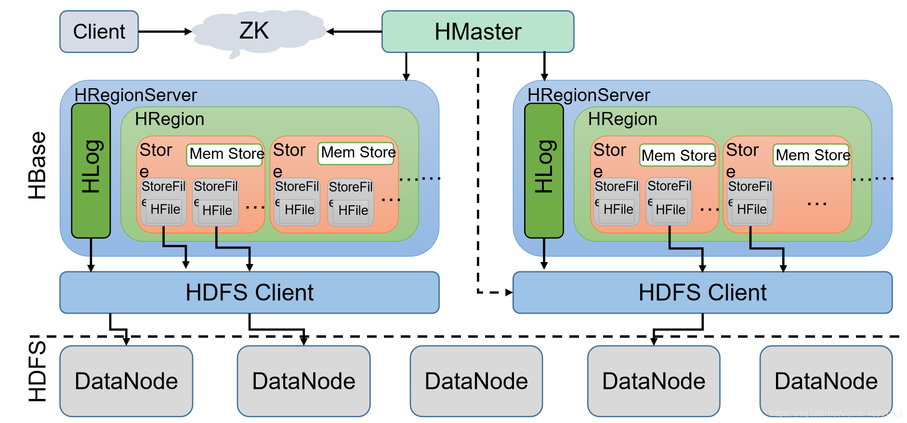

#### 架构

* 每个Hbase 集群中包含一个HMaster节点个多个HRegionServer 节点，其中HMaster 和 HRegionServer 的注册信息保存在Zookeeper 上，同时Client 进行读写操作的时候，也需要通过Zookeeper 访问 META 表的源信息
* 每个HRegionServer 包含多个 HRegion ，每个HRegion 对应多个 store，每个store 存储的是一列族的数据，每个store 中包含一个Memstore 和 多个 StoreFile， 其中StoreFile 的数据以HFile 的形式存储在HDFS 中。

##### 读数据

1）Client先访问zookeeper，从meta表读取region的位置，然后读取meta表中的数据。meta中又存储了用户表的region信息；
2）根据namespace、表名和rowkey在meta表中找到对应的region信息；
3）找到这个region对应的regionserver；
4）查找对应的region；
5）先从MemStore找数据，如果没有，再到BlockCache里面读；
6）BlockCache还没有，再到StoreFile上读(为了读取的效率)；
7）如果是从StoreFile里面读取的数据，不是直接返回给客户端，而是先写入BlockCache，再返回给客户端。

#### 写数据

Client先访问zookeeper，找到Meta表，并获取Meta表元数据。
② 确定当前将要写入的数据所对应的HRegion和HRegionServer服务器。
③ Client向该HRegionServer服务器发起写入数据请求，然后HRegionServer收到请求并响应。
④ Client先把数据写入到HLog，以防止数据丢失。
⑤ 然后将数据写入到Memstore。
⑥ 如果HLog和Memstore均写入成功，则这条数据写入成功
⑦ 如果Memstore达到阈值，会把Memstore中的数据flush到Storefile中。
⑧ 当Storefile越来越多，会触发Compact合并操作，把过多的Storefile合并成一个大的Storefile。
⑨ 当Storefile越来越大，Region也会越来越大，达到阈值后，会触发Split操作，将Region一分为二。

#### Hbase 中的 Memstore

> **为了保证hbase随机读取的性能，hfile里面的rowkey是有序的**。当客户端的请求在到达regionserver之后，为了保证写入rowkey的有序性，所以不能将数据立刻写入到hfile中，而是将每个变更操作保存在内存中，也就是memstore中。
>
> **memstore能够很方便的支持操作的随机插入，并保证所有的操作在内存中是有序的**。当memstore达到一定的量之后，会将memstore里面的数据flush到hfile中，这样能充分利用hadoop写入大文件的性能优势，提高写入性能。
>
> 由于memstore是存放在内存中，如果regionserver因为某种原因死了，会导致内存中数据丢失。所有为了保证数据不丢失，hbase将更新操作在写入memstore之前会写入到一个**write ahead log(WAL)**中。
> WAL文件是追加、顺序写入的，WAL每个regionserver只有一个，同一个regionserver上所有region写入同一个的WAL文件。这样当某个regionserver失败时，可以通过WAL文件，将所有的操作顺序重新加载到memstore中。

#### Memstore Flush 触发机制

> 1．当某个memstroe的大小达到了hbase.hregion.memstore.flush.size（默认值128M），其所 		在region的所有memstore都会刷写（阻塞写）。
> 2．当region server 中memstore 的总大小达到堆内存的百分之40时，region 会按照其所有 		memstore 的大小顺序（由大到小）依次进行刷写。直到 region server中所有 memstore 		的总大小减小到上述值以下。（阻塞写）
> 3． 到达自动刷写的时间，也会触发memstoreflush。自动刷新的时间间隔由该属性进行配置		hbase.regionserver.optionalcacheflushinterval（默认1小时）。

#### Memstore Flush 执行流程

> 1. 当MemStore数据达到阈值（默认是128M，老版本是64M），将数据刷到硬盘，将内存中的数据删除，同时删除HLog中的历史数据；
>
> 2. 并将数据存储到HDFS中；

[每天多记忆点](https://blog.csdn.net/weixin_40861707/article/details/107714178)

