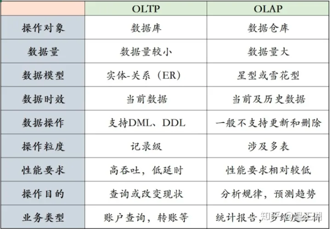
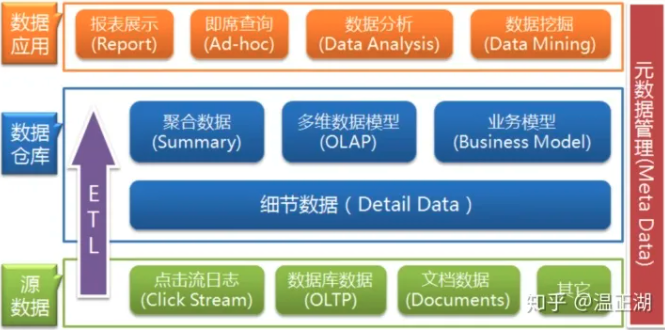
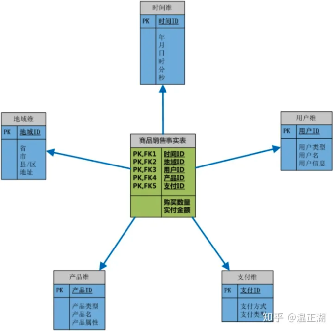
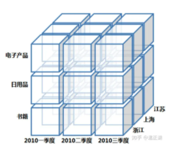
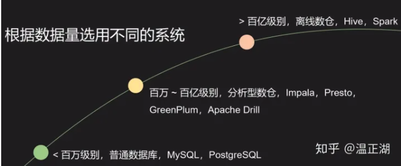

#### 什么是OLAP， 和ALTP 有什么区别

OLTP是Online transaction processing的英文缩写，指在线/联机事务处理，这么说其实还是比抽象的。OLTP典型的应用领域包括银行、证劵等金融行业，电子商务系统等，在此举最经典的银行例子，我们在招商银行APP上查询账户余额、收支信息和转账记录，**在ATM机上存钱，取钱，将招行账号的钱转到工行账号上。这些都是典型的OLTP类操作，这些操作都比较简单**，主要是对数据库中的数据进行**增删改查**。操作主体一般是产品的用户。

OLAP是Online analytical processing的英文缩写，**指联机分析处理。从字面上我们能看出是做分析类操作**。通过分析数据库中的数据来得出一些结论性的东西。比如给老总们看的报表，用于进行市场开拓的用户行为统计，不同维度的汇总分析结果等等。操作主体一般是运营、销售和市场等团队人员而不是用户。

单次OLTP处理的**数据量比较小**，所涉及的表非常有限，一般仅一两张表。

而OLAP是为了从**大量的数据中找出某种规律性的东西**，经常用到count()、sum()和avg()等聚合方法，用于了解现状并为将来的计划/决策提供数据支撑，所以对多张表的数据进行连接汇总非常普遍。

为了表示跟OLTP的数据库（database）在数据量和复杂度上的不同，**一般称OLAP的操作对象为数据仓库（data warehouse），简称数仓**。数据库仓库中的数据，往往来源于多个数据库，以及相应的业务日志。

#### MySQL 等 OLTP 数据库能处理 OLTP 业务么？

​	  **MySQL是当前最流行的开源数据库，一般作为OLTP数据库使用。在MySQL上也能执行一些OLAP操作，但这不是MySQL擅长的领域**。虽然OLTP和OLAP都是通过SQL来执行，但SQL语句只是描述了我想要什么，而并没有说明应该怎么做（不考虑hint等），即确定最优的执行计划。由于OLTP操作比较简单，所涉及的表也少，因此不需要相应的数据库具有强大的执行优化能力，比如说MySQL在查询优化这块就比较弱，但这其实没有给它的大规模普及使用造成多大伤害。

#### **OLAP的查询跟OLTP查询具体有那些不一样？**

​		上文简要提及，OLTP查询一般仅涉及单表，点查为主，返回的是记录本身或该记录的多个列。即使是范围查询，基本上也会通过limit来限制返回的记录数。

​		而OLAP则不同，表中单条记录本身并不是查询所关心的，比较典型的特点包括有聚合类算子、涉及多表Join，查询所用谓语/条件没有索引，玩玩不是返回记录。由于这些操作都非常耗计算资源，而且数据仓库相比数据库在数据量上大很多，因此，OLAP类查询经常表现为cpu-bound而不是io-bound。

​		

#### **是否有可能将OLAP和OLTP统一起来？**

#### **数仓有哪些基础知识和概念？**

OLAP的查询语句比OLTP更复杂，显然是因为两则操作的数据集和目的都是不一样的。数据库模型是2维的关系-实体模型。而数仓则是多维立方体模型。相对来说，给数仓建模的难度更高。为此，有必要再介绍下输出基础知识和一些重要概念。

先来看看这张图，基于该图，介绍下数仓的数据来源，作用和存在方式。

OLAP对应的数据载体叫做数据仓库，称之为仓库个人认为挺贴切的。因为它不是数据的生产者，其中的数据都是从其他地方搬运过来的，而搬运和清洗的过程就是ETL流程（Extract-Transform-Load，即数据抽取、转换和加载），在此不展开。

### **数仓的作用有哪些？**

- 进行交互式/即席查询（ad-hoc）
- 用于报表类查询（BI Reporting）
- 进行数据分析类查询（Data Analytics）
- 用于数据挖掘类查询（Data Mining）

### **数据在数仓中是如何组织的？**

简单介绍了数仓的数据来源，数仓中数据所能发挥的作用后，接下来聊聊这些通过不同方式进来的数据，如何存在于数仓当中的。相应地引入多维数据模型和数据立方体（data cube）概念。**数仓中数据的存在方式跟数仓索要发挥的作用息息相关，即该数仓要承载什么样的业务模型。**

上图所示即为一个采用简单星型模型组织起来的多维数据模型，用来存储商品销售情况。在这张图中的6个表又可分为2种类型，分别是最中间的事实表，和围绕其展开的维度表。

事实表（Fact Table）用来记录具体事件，包含了每个事件的具体要素，以及具体发生的事情。事实表是主干，**简明扼要得介绍一个事实**。例子中就通过一条事实表记录说明了某个地方（地域ID）的某人（用户ID）在某个时间（时间ID）通过某种方式（支付ID）买了某产品（产品ID）。

维度表（Dimension Table ）**是依赖事实表而存在的**，“皮之不存，毛将焉附”，没有事实表数据，维度表也就没有存在的意义。每个维度表都是对事实表中的每个列/字段进行展开描述。

比如事实表中的用户ID，就可以进一步展开成一张维度表，记录该用户ID实体的用户名、联系信息、地址信息、年龄、性别和注册方式等等；

一般来说，对于数仓，事实表的增删改操作相比维度表更为频繁，模型建立后，维度表中的数据保持相对稳定。试想，商品销售行为是一直在发生的，而用户注册和产品更新不总是随时有的。再说到地域和支付方式，那就更少变化了。

通过事实表和维度表组织起来的数仓多维数据模型，相比原本分散在数据库等各处的数据，能够有更有目的更高效的查询效率，比如可以查询汇总地域维度中某个省的商品销售情况，也可以通过时间维度分析每个季度的某类商品销售趋势。将多个维度表跟事实表进行不同程度的连接，可以展开得到各种各样的分析结果，满足商品运营等数据使用者的不同需求。

基于数据模型及操作又可以引入数据立方体概念及对其的常见操作。

### **什么是数据立方体？**

其实我们也可以叫它”数据魔方体“，因为立方体是三维的，而多维数据模型并不仅仅三维，虽然受图形化展示限制，一般仅展示其三个维度。而”魔方“一词，则凸现出了其变化性，通过对其进行不同的操作，让数据呈现出千变万化的结果。

上图来源于参考资料，比较好展示了多维模型，从大立方体上可以看到商品类型、季度和地区三个维度。但对于每个维度又是一个小立方体，比如第一季度浙江的书籍销售情况就是左下角的小立方体。在这个小立方体中，根据需要，我们还可以按照书籍类型，从季度拆分为月度，浙江拆出各地级市。

### **数据立方体有哪些常见操作？**

在进行OLAP查询时，基于数据立方体的多维分析操作包括：钻取（Drill-down）、上卷（Roll-up）、切片（Slice）、切块（Dice）以及旋转（Pivot），接下来以上面的数据立方体为例来逐一解释下：

---

### **按数据量划分数仓**

本系列文章主要关注的是数据量处于百万到百亿级别的偏实时的分析型数仓，Cloudera的Impala、Facebook的Presto和Pivotal的GreenPlum均属于这类系统；如果超过百亿级别数据量，那么一般选择离线数仓，如使用Hive或Spark等（SparkSQL3.0看起来性能提升很明显）；对于数据量很小的情况，虽然是分析类应用，也可以直接选择普通的关系型数据库，比如MySQL等，“杀鸡焉用牛刀”。

### **按建模类型划分**

下面我们主要关注数据量中等的分析型数仓，聚焦OLAP系统。根据维基百科对OLAP的介绍，一般来说OLAP根据建模方式可分为MOLAP、ROLAP和HOLAP 3种类型，下面分别进行介绍并分析优缺点。

### **MOLAP**

这应该算是最传统的数仓了，1993年Edgar F. Codd提出OLAP概念时，指的就是MOLAP数仓，M即表示多维（Multidimensional）。大多数MOLAP产品均对原始数据进行预计算得到用户可能需要的所有结果，将其存储到优化过的多维数组存储中，可以认为这就是上一篇所提到的“数据立方体”。

由于所有可能结果均已计算出来并持久化存储，查询时无需进行复杂计算，且以数组形式可以进行高效的免索引数据访问，因此用户发起的查询均能够稳定地快速响应。这些结果集是高度结构化的，可以进行压缩/编码来减少存储占用空间。

但高性能并不是没有代价的。首先，MOLAP需要进行预计算，这会花去很多时间。如果每次写入增量数据后均要进行全量预计算，显然是低效率的，**因此支持仅对增量数据进行迭代计算非常重要**。其次，如果业务发生需求变更，需要进行预定模型之外新的查询操作，现有的MOLAP实例就无能为力了，只能重新进行建模和预计算。

MOLAP适合业务需求比较固定，数据量较大的场景。在开源软件中，由eBay开发并贡献给Apache基金会的Kylin即属于这类OLAP引擎，支持在百亿规模的数据集上进行亚秒级查询。

**ROLAP**

与MOLAP相反，**ROLAP无需预计算，直接在构成多维数据模型的事实表和维度表上进行计算**。R即表示关系型（Relational）。显然，这种方式相比MOLAP更具可扩展性，增量数据导入后，无需进行重新计算，用户有新的查询需求时只需写好正确的SQL语句既能完成获取所需的结果。

但ROLAP的不足也很明显，尤其是在数据体量巨大的场景下，用户提交SQL后，获取查询结果所需的时间无法准确预知，可能秒回，也可能需要花费数十分钟甚至数小时。**本质上，ROLAP是把MOLAP预计算所需的时间分摊到了用户的每次查询上，肯定会影响用户的查询体验**

相比MOLAP，ROLAP的使用门槛更低，在完成星型或雪花型模型的构建，创建对应schema的事实表和维度表并导入数据后，用户只需会写出符合需求的SQL，就可以得到想要的结果。相比创建“数据立方体”，显然更加方便。

有分析表明，虽然ROLAP的性能比如MOLAP，但由于其灵活性、扩展性，ROLAP的使用者是MOLAP的数倍。

### **HOLAP**

MOLAP和ROLAP各有优缺点，而且是互斥的。如果能够将两者的优点进行互补，那么是个更好的选择。而HOLAP的出现就是这个目的，H表示混合型（Hybrid），这个想法很朴素直接。**对于查询频繁而稳定但又耗时的那些SQL，通过预计算来提速；对于较快的查询、发生次数较少或新的查询需求，像ROLAP一样直接通过SQL操作事实表和维度表。**

---

### **什么是MPP架构？**

首先来聊聊系统架构，这是设计OLAP系统的第一次分野，目前生产环境中系统采用的架构包括基于传统的MapReduce架构加上SQL层组装的系统；主流的基于MPP的系统；其他非MPP系统等。

MPP是massively parallel processing的简称，即大规模并行计算框架。**相比MR等架构，MPP查询速度快，通常在秒计甚至毫秒级以内就可以返回查询结果***，这也是为何很多强调低延迟的系统，比如OLAP系统大多采用MPP架构的原因。

