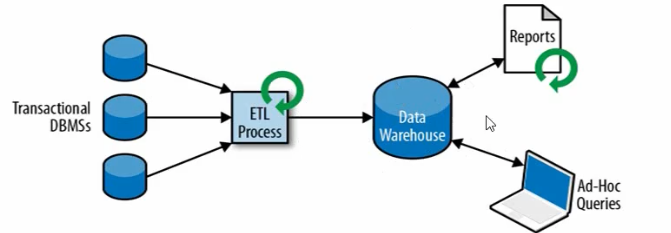
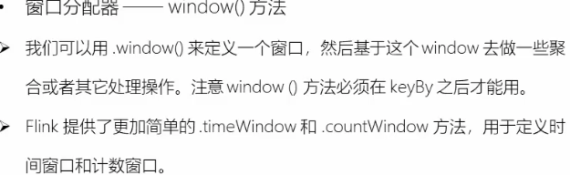
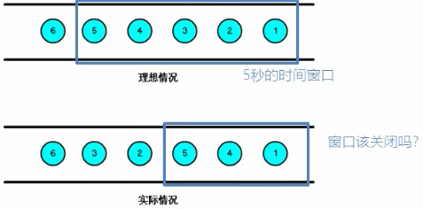
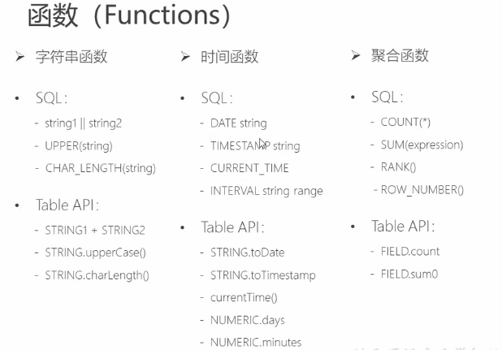

* Flink is a framework and distributed processing engine for stateful computations over unbound and bound data streams

  > 分布式处理引擎框架，用于无界和有界数据流进行状态计算

* 为什么选择Flink

  > 流数据更真实反映我们的生活方式：GPS 位置信息的处理。
  >
  > 传统的数据架构师基于有限数据集(当前数据量是固定的不会变化的，就是跑批)的
  >
  > （为了攒够一批数据去处理，必然会遇到延迟的问题，Flink 主要也就是解决这个问题，不会去等一批数据去处理，而是会来一条处理一条，或者每秒来n条，然后处理n条数据）
  >
  > 我们的目标是
  >
  > * 低延迟
  > * 高通吐
  > * 结果的准备性和良好的容错性(流处理的时候新带来的问题，这里也会处理掉这个问题)

* 传统数据处理架构

  > * 事务处理（数据量小）
  >
  >   
  >
  > * 分析处理：将数据从业务数据库中复制到数仓，然后在进行分析和查询
  >
  >   
  >
  > * 有状态的流式处理
  >
  >   、
  >
  >   每一个来的数据都有一个输出，每一个输入都计算得到一个本地状态，并将这个状态放到本地内存中，且将内存中的状态进行一个存盘(为了容错)
  >
  > * Lambda 架构
  >
  >   2套系统，
  >
  >   1套保证流式处理，另外一套保证批处理、
  >
  >   缺点：同一个需求，需要实现2套系统。开发和维护以及迭代会比较麻烦
  >
  >   
  >
  > * Flink 的主要特点
  >
  >   * 事件驱动
  >
  >     
  >
  >     flink 的程序是一直启动在哪里，等待数据(事件)的到来，当数据来的时候开始处理。
  >
  >   * 基于流的世界观
  >
  >     在Flink 的实际中，一切都是由流组成的，**离线数据是有界的流，实时数据是一个没有界限的流**
  >
  >   * 分层API
  >
  >     越顶层越抽象，表达含义越简单，使用越方便
  >
  >     越底层越具体，表达能力越丰富，使用越灵活
  >
  >     
  >
  > * 其他的一些特点
  >
  >   * 支持事件事件(event-time)和处理时间语义
  >   * 精确一次的状态一致性保证
  >   * 低延迟，每秒处理数百万个事件，毫秒级延迟
  >   * 和众多常用存储系统的连接
  >   * 高可用，动态扩展，实现 7 * 24 小时的全天候运行
  >
  > * Fink 和 Spark-stream
  >
  >   数据模型
  >
  >   ​	spark 使用RDD 模型，Spark-streaming 的DStream 实际上就是一组小批数据的RDD 集合
  >
  >   ​	fink 基本数据模型是数据流，以及事件Event 序列
  >
  >   运行时架构
  >
  >   ​	spark 是批计算，将DAG 划分为不同的stage，一个完成后才可以计算下一个
  >
  >   ​	flink 是表中的流执行模型，一个事件在一个节点处理完成可以直接发往下一个节点进行继续处理

---

* 配置文件含义

  > `jobmanager.rpc.address: localhost`
  >
  > > Jobmanager 可以理解为 spark 中的 Driver，负责管理Job，管理调度，分配任务
  >
  > `taskmanager.memory.process.size: 1728m`
  >
  > > Taskmanager 管理自己当前管理的任务，可以理解为 spark 中的executor 是干活的
  >
  > `taskmanager.numberOfTaskSlots: 1`
  >
  > > Slot : 插槽，资源的抽象

* 启动 standalong 模型

  > ```java
  > ~/Ifoods/scala/flink-1.10.2 » ./bin/start-cluster.sh 
  > Starting cluster.
  > Starting standalonesession daemon on host CNxuxliu-2.local.
  > ```
  >
  > `http://localhost:8081/#/overview`  可以看到 web 页面
  >
  > `http://localhost:8081/#/submit` 可以直接在web 页面上传 jar 包，然后运行，点击上传的jar 包，可以输出主类，以及参数，然后就可以 点击 submit 提交任务，最后在TaskManagers 中可以看到输出以及运行的信息。
  >
  > 除了在web 端提交之外，还可以使用 命令行提交命令
  >
  > `./bin/flink run -c com.flink.learn.streamingWordCount -p 1 /Users/xuxliu/Ifoods/scala/flink/target/FlinkTutorial-1.0-SNAPSHOT-jar-with-dependencies.jar --host localhost --port 7777`
  >
  > 然后在web 端就可以看到刚刚提交的任务了，Jobs-> Running Jobs
  >
  > 如果要取消提交的任务，那么在命令行中直接`Ctrl+c`是取消不了的，而是
  >
  > `~/Ifoods/scala/flink-1.10.1 » ./bin/flink cancel 031b89b58be7f37d448302ca313ad4cc
  > Cancelling job 031b89b58be7f37d448302ca313ad4cc.
  > Cancelled job 031b89b58be7f37d448302ca313ad4cc.`
  >
  > 查看Job
  >
  > `~/Ifoods/scala/flink-1.10.1 » ./bin/flink list -a`

* Flink on Yarn 

  > Flink 提供了2种在 yarn 上运行的模式，分别为 `Session-Cluster` 和 `Per-Job-Cluster` 模式
  >
  > * Session-cluster
  >
  > 
  >
  > Session-Cluster 模式需要先启动集群，然后再提交作业，接着会向 yarn 申请一块空间后，资源永远保持不变，如果资源满了，下一个作业就无法提交，只能等到yarn 中的其中一个作业执行完成之后，释放了资源，下个作业才会正常提交，所有作业共享Dispatcher 和 ResourceManager，共享资源，适合规模小执行时间段的作业。
  >
  > ​	在Yarn 中初始化一个 flink 集群，开辟指定的资源，以后提交任务都向这里提交，这个flink 集群会长住在yarn 集群中除非手工停止
  >
  >  1. 启动hadoop 集群
  >
  >  2. 启动yarn-session
  >
  >     ./yarn-session.sh -n 2 -s 2 -jm 1024 -tm 1024 -nm test -d
  >
  >     -n:(--container): TaskManager 数量
  >
  >     -s:(--slots): 每个 TaskManager 的 slot 数量，模型一个 slot 一个 core，默认每个taskManager 的 slot 为1
  >
  >     -jm: JobManager 的内存
  >
  >     -tm: taskManager 的内存
  >
  >     -nm: appName
  >
  >     -d: 后台运行
  >
  > * Per-Job-Cluster 模型
  >
  >   
  >
  >   一个Job 会对应一个集群，每提交一个作业会根据自身的情况，都会单独向 yarn 申请资源，直到作业执行完，一个作业的失败与否不会影响到下一个作业的正常提交和运行，独享Dispather 和 ResourceManager，按需接收资源申请，适合规模大长时间运行的作业。
  >
  >   ​	每提交都会创建一个新的 flink 集群，任务之间相互独立，互不影响，方便管理，任务执行完成之后创建爱你的集群也会消失
  >
  >   1. 启动 hadoop 集群
  >   2. 不启动yarn-session 之间执行 job ./flink run -m yarn-cluster -c com.mainclass xx.jar --paramName paramValue ...

* **Flink 运行时组件(Runtime)**

  > 
  >
  > 整体流程：
  >
  > > `JM` 向 `RM` 申请资源，`RM`会安全`TM`中的资源去响应`JM`资源请求，然后`JM`将任务分发到`JM`的资源上
  >
  > JobManager: 每一个应用程序的主进程，任务的调度，分配以及 checkpoint，接收用户提交的jar包，然后将jar包生成可执行任务图，然后调度，分配，最后分给 taskManager 执行
  >
  > 
  >
  > TaskManager: 干活的
  >
  > 
  >
  > ResourceManager:  管理集群的资源(slot)，每个TaskManager 需要的计算资源在这里申请获取
  >
  > 
  >
  > Dispacher: 提供 REST 接口，用的少，提供Rest应用的提交，web页面
  >
  > 

* 任务提交流程

  > 
  >
  > 
  >
  > 任务到了JobManager 之后
  >
  > 1. 得到跑到taskManager 上的执行图，得到当前job 有多少个任务，知道需要多少个slot
  > 2. resourceManager 申请 slot
  > 3. resourceManager 去启动对应资源的 TaskManager（slot资源）
  > 4. 将返回给ResourceManager 现在用了多少 slot，可使用的有多少个
  > 5. 发送给 TaskManager 将指定资源的 slot 分给当前的一个任务
  > 6. TaskManager 提供slots，JobManager给TaslManager 分发任务
  > 7. TaskManager 之间会设计到数据的交互
  >
  > * **Yarn 提交(per-job模式)**
  >
  > Flink 的TaskManager 和 JobManager 都是在ApplicationMaster 中
  >
  > AM启动的时候去HDFS加在第一步上传的jar包
  >
  > 这里AM中就有了JM/TM/jar 包程序，然后开始执行。
  >
  > 执行开始TM会先在Flink 自己的RM中申请资源，但是yarn下flink是没有RM的，所以就是第4步在yarn的RM中申请资源
  >
  > 然后后续的行为就和上面提到的一样了。
  >
  > 

* 任务调度的原理

  > 
  >
  > 提交过程做的事情(左边小块框)
  >
  > 1. 写出代码、编译、打包
  > 2. 根据代码中处理流程，优化生成StreamIngGraph
  > 3. DataFlow graph, 可以合并的操作进行合并，得到 JobGraph
  > 4. 客户端提交
  >
  > JobManager
  >
  > 1. 分析数据流图，并行度，每个job有多少个subtask，知道当前有多少个任务
  > 2. 需要多少slot，然后去申请slot，分配job
  > 3. 调度、管理(开始/停止job)、checkpoint 的发起。
  >
  > TaskManager
  >
  > 1. 执行任务
  > 2. 给JM 发送心跳
  >
  > 一些问题：
  >
  > 1. 怎么实现算子的并行计算？：并行任务subtask 必须分配到不同的slot中
  >
  > 2. 并行的任务，需要占多少 slot？
  >
  > 3. 一个流处理程序，到底包含多少个任务？

* 并行度:parallelism

  > 
  >
  > 一个特定算子的子任务(subtask) 的个数被称为其并行度(parallelism)
  >
  > 一般情况下，一个stream 的并行度，可以认为是其所有算子中的最大的那个并行度
  >
  > 并行度设置的优先级是：**算子设置并行度 > env 设置并行度 > 配置文件默认并行度**

* TaskManager 和 slots

  > Flink 中没一个 TaskManager 都是一个JVM 进程，它可能会在独立的线程上执行一个活、多个子任务
  >
  > 为； TaskManager通过 task slot 控制接受以及执行多少个task，TaskManager 通过 task slot 来进行控制(一个 taskManager 至少有一个 slot) 
  >
  > slot:  集群中固定大小的一组资源，主要是按照独立内存大小划分，所以也可以理解slot个数为taskManager 内存划分的个数。
  >
  > 
  >
  > 如上图，一个TaskManager 有3个 slot，也就是说将这个TaskManager 中的内存和CPU划分为3等份。
  >
  > 为了控制一个 TaskManager 能接受多少个 task，TaskManager 通过task slot 来控制，一个taskManager 至少有一个 slot
  >
  > 上图中2个TM，每个中有3个slot，左边的第三个slot中只有一个sink，表示这个sink的并行度只有 1.
  >
  > 而左边和右边的第一个slot中都 有编号为1和2的Source + map 任务，表示这两个chain起来的job的并行度为2，分配到2个slot中
  >
  > 调整并行度，那么相同的slot也是可以跑起来的
  >
  > 
  >
  > 每一个并行的subtask单独在一个slot中(如source+map的2个实例在2个slot中)，而前后发生的Job是串行执行的那么就可以进行共享slot(不同job的subTask可以共享slot)
  >
  > 默认情况，Flink允许子任务共享slot，即使他们是不同任务的子任务，这样的结构是一个slot可以保存作业的整个pipeline
  >
  > 
  >
  > 注意 Slot 只对内存隔离，没有对 CPU 隔离
  >
  > **slot 可以控制当前TM的并行处理的静态能力**
  >
  > TaskManager为了对资源进行隔离和增加允许的task数，引入了slot的概念，这个slot对资源的隔离仅仅是对内存进行隔离，策略是均分，比如taskmanager的管理内存是3GB，假如有两个slot，那么每个slot就仅仅有1.5GB内存可用
  >
  > 一个TaskManager 运行在一个JVM 之上，当一个TaskManager 有多个slot，这些slot 上运行task，那么这些task 都共享这个JVM、TCP 连接以及心跳信息
  
  > 上图中是有5个 slot 的任务
  >
  > **默认情况下，Flink 允许子任务共享slot(一个slot中有几个task)，即使他是不同任务的子任务，这样的结果是，一个slot 可以保存作业的整个管道**
>
  > **Task Slot 是静态的感念，是指TaskManager 具有的并发执行能力**
  >
  > 
  >
  > E2：表示E步有2个并行
  >
  > D4/B4：整个任务最大的并行度是4，所以至少需要4个slot
  >
  > 其他的小于4的并行度的Job，随机划分到不同的slot中。
  >
  > **一个slot分配的例子**
  >
  > 
  >
  > 第二张图设置并行度为1.
  >
  > 第三张图设置并行度为2
  >
  > 
  >
  > 继续设置并行度和slot的分配结果如图
  
* 数据流DataFlow

  

  

  Flink 中的Job 是如何划分的？ 为什么有时候将几个算子`chan`起来变为一个Job，而有的一个算子是一个Job

  > 

* 执行图

  > 
  >
  > jobGraph 之后Flink 根据并行度将每一个Job拆开，前后直接的传输方式，然后变为可执行的ExecutionGraph
  >
  > 

* 任务链

  > 
  >
  > 
  >
  > Source 到 flatMap 是不能合并的，因为并行数不一样，flatMap 到 KeyAgg 也不能合并，因为不是1对1的，这在写好代码后在Flink Web 的计划图中可以很好的看见
  >
  > 

* 拆开合并的slot

  > 假如出现这样的情况，在一系列的复杂操作之后，且掐好这些操作都符合1对1，且并行数都一样，那么flink会将他们合并的，这个时候由于中间复杂的操作，并不想将他们合并，那么可以调用方法
  >
  > `.disableChaining()`，如将 map，和filter断开,map 开始一个新的chain
  >
  > `filter(_.nonEmpty).disableChaining().map((_,1)).startNewChaining()`
  >
  > 合在一起之后就相当于是本地的操作，不会设计到slot前后的数据传输(序列化反序列化)等操作。s

**所以注意写程序的时候 slot 的个数和 并行度，以及可能会合并的 task**

---

#### API

* 所有的操作均分为3大部分


> * 执行环境
>
>   当前程序的上下文，可以设置并行度，如果没有设置会读取配置文件中的默认并行度，在执行代码的时候，会自动的判断是否为本地还是远程集群环境，并返回对应的上下文执行环境
>
> * source: 处理提供的一些特定输入的类，还可以自定义source， 实现 SourceFuntion
>
>   ```scala
>   class MySensorSource extends SourceFunction[TemperatureSensorReading]{
>   
>     // 定义一个标志位flag，用来表示数据源是否正常运行，发出数据
>     var running:Boolean = true
>     var count = 0
>   
>     override def run(sourceContext: SourceFunction.SourceContext[TemperatureSensorReading]): Unit = {
>       // 定义无线循环，不停的产生数据，除非被 cancel 掉
>   
>       val rand = new Random()
>   
>       var currentTemp: immutable.Seq[(String, Double)] = 1 to 10 map(i => (s"sensor_$i", rand.nextDouble() * 100))
>   
>       while (running) {
>         // 模拟微调
>         currentTemp = currentTemp.map(data => (data._1, data._2 + rand.nextGaussian()))
>        // 获取时间戳
>       val curTimestamp: Long = System.currentTimeMillis()
>       currentTemp.foreach(data =>
>         sourceContext.collect(TemperatureSensorReading(data._1, curTimestamp, data._2))
>       )
>       Thread.sleep(1000)
>       }
>     }
>   
>     override def cancel(): Unit = running = false
>   }
>   
>   // 使用
>   val stream4: DataStream[TemperatureSensorReading] = env.addSource(new MySensorSource())
>       stream4.print()
>   ```

* Transform

> * 简单转换算子
>
>   map/flatMap/Filter
>
> * 聚合算子
>
>   KeyBy: DataStream -> KeyedStream： 逻辑的将一个流拆分为不相交的分区，每个分区包含具有相同key 的元素，在内部已hash 的形式实现的
>
>   滚动聚合算子(Rolling Aggregation): 针对 KeyStream 的每一个直流做聚合操作 sum/min/max/minBy/maxBy 等
>
>   ```javascript
>   不同的是min会根据指定的字段取最小值，并且把这个值保存在对应的位置上，对于其他的字段取了最先获取的值，不能保证每个元素的数值正确，max同理。
>   
>   而minBy会返回指定字段取最小值的元素，并且会覆盖指定字段小于当前已找到的最小值元素。maxBy同理。
>   ```
>
>   Reduce：比max 等聚合更加的一般化，底层都是调用了aggeration 方法
>
> * Split/Select/Connect/CoMap/Union
>
>   split
>
>   
>
>   DataStream -> SplitStream: 根据某些特征吧一个DataStream 拆分为2个或者多个DataStream
>
>   select
>
>   
>
>   SplitStream -> DataStream 从一个SplitStream 中获取一个或者多个DataStream
>
>   split/select 是分流操作，那么就有合流操作
>
>   connect：
>
>   DataStream,DataStream -> ConnectedStreams:  连接2个保持他们类型的数据流，两个数据流被Connect 之后，只是被放在了一个同一个流中，内部依然保持各自的数据和形式不发生任何变化，2个流相互独立
>
>   
>
>   然后基于ConnectedStream 也会有一些操作api，如CoMap和CoFlatMap
>
>   
>
>   union 直接联合2条流到1条，这里就比较简单了

* Flink 支持的数据类型

> Flink 支持Java 和 Scala 中所有常见的数据类型，使用最广泛的类型有一下：
>
> * 基础数据类型
> * Java 和 Scala 元组，Flink 提供了Java 的元组类型Tuple ... Tuple25
> * scala case class
> * Java 简单对象 POJO
> * 其他Arrays、List、Maps、Enums 等

* UDF

> * function classes
>
>   Flink 暴露了所有的udf 函数的接口，如MapFunction、FilterFuntion、ProcessFunction 、ReduceFunction 等
>
>   ```scala
>   class MyFilter extends FilterFunction[TemperatureSensorReading] {
>     override def filter(t: TemperatureSensorReading): Boolean = {
>       t.temperature > 10
>     }
>   }
>   // 简单的逻辑可以直接使用匿名类的方式使用更加合适
>   // 复杂逻辑还是最好抽出一个类来实现
>   
>   //使用
>   dataStream.filter(new MyFilter)
>   ```
>
> * Rich Function：也是函数类的接口，所有Flink 函数类都有其Rich 版本，它于常规函数的不同在于，可以**获取运行环境的上下文，并拥有一些周期方法，所以可以实现更复杂的功能**
>
>   RichMapFunction、RichFilterFuntion 等
>
>   RichFunction 的父抽象方法 `AbstractRichFunction` 有更多的生命周期的方法可以覆写
>
>   ```scala
>   // RichMapFunction[IN, OUT]
>   class MyRichMapper extends RichMapFunction[TemperatureSensorReading, String] {
>   
>     override def open(parameters: Configuration): Unit = {
>       // 假如说这里想去操作下数据库, 可以在这里建立连接，这里操作
>       // map 操作是来一条数据操作一遍，那么操作数据库那就太过于频繁了
>       // 而使用 RichFunction 在open 生命周期做一些初始化操作
>       // 是当前函数类创建的时候就去执行构造器调用之后调用
>       // 然后在调用 close 做收尾动作
>     }
>   
>     override def map(in: TemperatureSensorReading): String = {
>         in.id + " temperature"
>     }
>   
>     override def close(): Unit = {
>       // 做收尾工作，如 关闭连接，或者情况状态
>     }
>   }
>   ```

* Sink： 数据的输出， 构建Sink 任务，然后将数据写出

> ```scala
> stream.addSink(new MySink(xxx))
> ```
>
> Flink 以及提供了很多的Sink 连接器Connector
>
> 第三方库 Bahir 也提供了外部的连接器
>
> 也可以自己新建Sink

* Window 开窗函数

> 一般真实的流都是无界的，可以将无限的数据流进行切分，得到有限的数据集进行处理，也就是得到有界流，
>
> **窗口就是将无限流切割为有限流的一种方式，它会将流数据分发到有限大小的桶中进行分析**
>
> * 窗口类型
>
>   时间窗口：滚动时间窗口/滑动时间窗口/会话窗口
>
>   计数窗口：滚动计数窗口/滑动计数窗口
>
> 滚动窗口：将数据依据固定的窗口长度对数据进行切分，长度固定，**数据没有重叠**
>
> 滑动窗口：是固定窗口的更广义的一种形式，滑动窗口由固定的窗口长度和滑动间隔组成，窗口长度固定，**可以有重叠**
>
> 会话窗口：由一系列事件组合一个指定时间长度的 timeout 间隙组成，也就是一段时间(timeout)没有接受到新数据就会生成新的窗口，其时间无对齐
>
> 
>
> ```scala
> dataStream
> .map(r => (r.id, r.temperature))
> .keyBy(_._1) // 变为2元祖，keyBy 就不能在使用 fileIndex 和 fieldName 了
> 
> //      .window(TumblingEventTimeWindows.of(Time.seconds(15))) // 滚动时间窗口
> //      .window(SlidingProcessingTimeWindows.of(Time.seconds(15), Time.seconds(3)))
> // 滑动窗口窗口大小为 15，滑动大小为 3
> 
> // .window(EventTimeSessionWindows.withGap(Time.seconds(12)))
> // 会话窗口，timeout=12
> 
> // window 是最为一般化的窗口定义，还有简单的方式 timeWindow
> // .timeWindow(Time.seconds(15)) // 给一个参数，这里是滚动窗口
> 
> // 还有一种 countWindow，一个参数是滑动，2个参数是滚动
> .reduce((r1, r2) => (r1._1, r1._2.min(r2._2)))
> .print()
> ```
>
> 定义还窗口之后，窗口内的计算，windowFunction 窗口函数
>
> 
>
> 全窗口函数中先把窗口所有数据收集起来，将一个桶里的数据全部收集到桶里面。
>
> 也可以做增量式的有界聚合。
>
> **在实际使用的时候推荐使用增量聚合函数**
>
> Windows split the stream into “buckets” of finite size,
> over which we can apply computations
>
> ```scala
> Keyed Windows:
>     stream
>        .keyBy(...)               <-  keyed versus non-keyed windows
>        .window(...)              <-  required: "assigner"
>       [.trigger(...)]            <-  optional: "trigger" (else default trigger)
>       [.evictor(...)]            <-  optional: "evictor" (else no evictor)
>       [.allowedLateness(...)]    <-  optional: "lateness" (else zero)
>       [.sideOutputLateData(...)] <-  optional: "output tag" (else no side output for late data)
>        .reduce/aggregate/fold/apply()      <-  required: "function"
>       [.getSideOutput(...)]      <-  optional: "output tag"
> 
> 
>  Non-Keyed Windows:
>     stream
>      .windowAll(...)           <-  required: "assigner"
>     [.trigger(...)]            <-  optional: "trigger" (else default trigger)
>     [.evictor(...)]            <-  optional: "evictor" (else no evictor)
>     [.allowedLateness(...)]    <-  optional: "lateness" (else zero)
>     [.sideOutputLateData(...)] <-  optional: "output tag" (else no side output for late data)
>      .reduce/aggregate/fold/apply()      <-  required: "function"
>     [.getSideOutput(...)]      <-  optional: "output tag"
> 
>  //.trigger(...): 操作用于给出什么时候/条件可以将函数用于窗口内数据的一种判断条件
>  //.evictor(...)： trigger 开启以及函数应用到窗口内数据之前，用以清除一些窗口内的数据
> ```
>
> keyedStream 之后使用窗口函数，每一个Stream 可以并行化，并行task
> Non-keyedStream: 之后只会有一个 task，并行化为1
>
> 之后定义WindowAssigner，定义一个元素是如何进入一个窗口的
>
> Flink 定义了4中窗口
>
> 1.tumbling windows： 滚动窗口
> 2.sliding windows： 滑动窗口
> 3.session windows：会话窗口
>
> global windows： 全局窗口

* 时间语义和水位线 Watermark

> 一个算子的实例在收到 watermark 的时候，
>
> 首先要更新当前的算子时间，这样 的话在 ProcessFunction 里方法查询这个算子时间的时候，就能获取到最新的时间。 
>
> 第二步它会遍历计时器队列，这个计时器队列就是我们刚刚说到的 timer，你可以同 时注册很多 timer，Flink 会把这些 Timer 按照触发时间放到一个优先队列中。
>
> 第三 步 Flink 得到一个时间之后就会遍历计时器的队列，然后逐一触发用户的回调逻辑。 通过这种方式，Flink 的某一个任务就会将当前的 watermark 发送到下游的其他任务 实例上，从而完成整个 watermark 的传播，从而形成一个闭环。
>
> 由于分布式的存在，数据的产生时候的顺序和数据处理时候的顺序会产生不一致，有三个时间语义
>
> 
>
> 不同的时间语义会有不同的应用场合
>
> 
>
> 如上图，按照电影上映的时候来看，排序应该是1，5，6，1，2，3，7
>
> 但是如果按照电影的故事内容排序，那么应该是1，2，3，4，5，6，7
>
> 所以不同的时间语义下有不同的使用场景，往往会更加关心事件时间(事件发生的时间EventTime)
>
> 设置事件事件，默认是使用系统时间
>
> ```scala
> env.setStreamTimeCharacteristic(TimeCharacteristic.EventTime)
> ```
>
> 设置之后还需要在处理的过程中设置那个字段是作为时间的，这样开窗的时候就根据这个时间去做处理
>
> 当Flink 以Event Time 模式处理数据流，**他会根据数据里的时间来处理基于时间的算子**
>
> 但是由于网络、分布式等的原因，**会导致乱序数据的产生**，乱序数据让窗口计算不准确
>
> 
>
> 这个时候如果窗口关闭，那么延迟的数据就会丢失掉，得到的数据结果就会不正确，这里使用等待机制也不那么合适，因为并不知道有多少数据发生了延迟，所以全部数据等待对性能有损耗。所以使用时间延迟机制watermark
>
> 使用**watermark** 处理乱序的问题：延迟等待，平衡正确性和数据的丢失情况
>
> 
>
> 
>
> wm: 就是用来指示当前的事件时间的，并在当前进来的所有事件时间基础上，引入一个时间延迟。
>
> 相当于是 wm 直接插入到目前进来的事时间，是一条特殊的数据一样，跟在数据流里面，做特殊处理，wm里面只有一个信息就仅仅带着一个时间戳，表示当前到什么时间了。
>
> 如上图中绿色的2，表示当前事件时间执行到2了，2之前的数据都到齐了，窗口可以关闭了。5表示事件时间执行到5了，5之前的数据都已经到了，截止到5的这个窗口可以关闭了。
>
> **那么数据的实际戳和wm的实际戳有什么关系呢?**
>
> > wm 肯定是要和当前的时间戳有一定关系，wm就是根据当前收到的事件时间戳生成自己的时间戳达到多少
> >
> > 所以时间只能往前推，不能后退：取当前到达的时间的最大值
> >
> > 根据当前收到的事件时间戳，生成时间
> >
> > 还引进延迟：当前收到的最大的时间戳，减去一个固定的延迟，作为当前的wm时间
>
> **wm 只负责是否关闭当前存在的窗口。**
>
> wm处理乱序数据：假如现在设定了[0,5) [5,10) 2个时间窗口，处理一下的情况
>
> 
>
> 先考虑当前数据的乱序程度由多大，如1后面是4，4后面是5是正确的顺序，而5后面是2，这就逆序了，乱序的数据程度为5-2=3，找到逆序程序最大的。设置3为这个延迟
>
> 第一个数据来了就不讲了，直接丢到[0,5)桶中，第二个数据4来的时候，计算wm:4-3=1，表示时间戳小于1的数据都已经到了，可以关闭[0,1)这个时间窗口了，将4放入到[0,5)桶中，因为没有[0,1)这个时间窗口，所以没有关闭时间窗口的操作。
>
> 
>
> 然后来了5这个数据，计算wm 5-3=2，表示时间戳小于2的数据都已经到了，可以关闭[0,2)这个时间窗口了，将放入到[5,10)桶中，因为没有[0,2)这个时间窗口，所以没有关闭时间窗口的操作。
>
> 
>
> 这个时候来了2和3这个数据，来的数据的最大时间戳还是5，所以wm保持不变(wm不能后退)
>
> 
>
> 来了6之后，时间发生了推移，计算wm:6-3=3，表示时间戳小于3的数据都已经到了，可以关闭[0,3)这个时间窗口了，将6放入到[5,10)桶中，因为没有[0,3)这个时间窗口，所以没有关闭时间窗口的操作。
>
> 
>
> 假如这个时候来了数据4，7，8等，当来了8，那么[0,5) 这个时间窗口就需要关闭了。
>
> 而在8之后，假如又来了一个4，那么这个数据就会丢掉，因为[0,5) 这个桶已经关闭了。
>
> 这就涉及到这个延迟的设定，如果我们设定延迟为4，[0,5) 这个桶在之前所有的数据中不会发生关闭，数据4就不会丢失。
>
> * WM 的传递
>
>   > 涉及到分布式的操作，上游的wm直接广播给下游全部的子任务，当前任务的wm是接到所有上游(并保存)所有任务中的最小的wm
>   >
>   > 
>
> Flink 设置wm 的时候有2个选项
>
> ```scala
> * @see AssignerWithPeriodicWatermarks: 周期性生成
> * @see AssignerWithPunctuatedWatermarks：间断性生成
> ```
>
> 二者有自己的使用场景。
>
> 在大数据场景下，一下会涌进来很多的数据，这些数据的事件事件可能是一样的，如果给每一条数据都生成一个wm是冗余的。所以这个时候应该使用周期性生成。
>
> 如果是比较稀疏的进来的数据，那么就使用间断性生成。
>
> Watermark 的设定
>
> * 在Flink 中 watermark 的设定由应用程序开发人员生成，这通常需要对相应的领域业务知识有一定的了解
> * 如果watermark 设置的延迟太久(延迟太大)，收到结果的速度可能就会很慢，解决办法是在水位线到达之前输出一个近似结果
> * 而如果watermark 达到的太早(延迟太小)，可能收到错误结果，不过flink 处理迟到的数据的机制可以解决这个问题
>
> 使用设置一个比较小的延迟时间，得到一个近似正确，然后在`.allowdLateness 并导入到 .sideOutputLateData 放到侧输出流中`
>
> ```scala
> val dataStream11 = dataStream
>       .map(r => (r.id, r.temperature, r.timestamp))
> 
> //    dataStream11.assignAscendingTimestamps(_._3) // 升序数据提取时间戳
>     dataStream11.assignTimestampsAndWatermarks(new BoundedOutOfOrdernessTimestampExtractor[(String, Double, Long)](Time.seconds(3)) {
>       override def extractTimestamp(element: (String, Double, Long)): Long = {
>         element._3
>       }
>     })
> ```
>
> 实现自己的 watermark
>
> ```scala
> class PeriodicAssigner extends AssignerWithPeriodicWatermarks[TemperatureSensorReading] {
> 
>   val bound: Long = 60 * 1000 // 延时1分钟
>   var maxTs: Long = Long.MaxValue
> 
>   override def getCurrentWatermark: Watermark = new Watermark(maxTs - bound)
> 
>   override def extractTimestamp(element: TemperatureSensorReading, previousElementTimestamp: Long): Long = {
>     maxTs = maxTs.max(element.timestamp)
>     element.timestamp
>   }
> }
> ```
>
> 设置默认的周期生成 wm 配置
>
> ```scala
> env.getConfig.setAutoWatermarkInterval(200)
> ```
>
> 这里仅仅是提取出来核心的代码逻辑，flink 本身实现的wm生成，还有很多覆盖边边角角边界条件的逻辑
>
> ---
>
> 测试代码如下：
>
> ```scala
> package com.flink.learn.window
> 
> import com.flink.learn.TemperatureSensorReading
> import org.apache.flink.api.scala._
> import org.apache.flink.streaming.api.TimeCharacteristic
> import org.apache.flink.streaming.api.functions.timestamps.BoundedOutOfOrdernessTimestampExtractor
> import org.apache.flink.streaming.api.scala.{DataStream, OutputTag, StreamExecutionEnvironment}
> import org.apache.flink.streaming.api.windowing.time.Time
> 
> object windowTest2 {
>   def main(args: Array[String]): Unit = {
>     val env = StreamExecutionEnvironment.getExecutionEnvironment
>     env.setParallelism(1)
>     env.setStreamTimeCharacteristic(TimeCharacteristic.EventTime)
>     env.getConfig.setAutoWatermarkInterval(50)
> 
> 
>     val inputDataStream: DataStream[String] = env.socketTextStream("localhost", 7777)
> 
>     val dataStream = inputDataStream.map(data => {
>       val arr = data.split(",")
>       TemperatureSensorReading(arr(0).trim, arr(1).trim.toLong, arr(2).trim.toDouble)
>     })
>       .assignTimestampsAndWatermarks(new BoundedOutOfOrdernessTimestampExtractor[TemperatureSensorReading](Time.seconds(3)) {
>         override def extractTimestamp(element: TemperatureSensorReading): Long = element.timestamp * 1000L
>       })
> 
>     val lateTag = new OutputTag[(String, Double, Long)]("late")
> 
>     val resultStream = dataStream.map(data => (data.id, data.temperature, data.timestamp))
>         .keyBy(_._1)
>         .timeWindow(Time.seconds(15))
>         .allowedLateness(Time.minutes(1))
>         .sideOutputLateData(lateTag)
>         .reduce((curRes, newData) => (curRes._1, curRes._2.min(newData._2), newData._3))
> 
>     resultStream.getSideOutput(lateTag).print("late")
> 
>     resultStream.print("result")
> 
>     env.execute()
>   }
> }
> ```
> 
>窗口初始值的计算
> 
>```java
> public static long getWindowStartWithOffset(long timestamp, long offset, long windowSize) {
>     return timestamp - (timestamp - offset + windowSize) % windowSize;
> }
> ```
> 
>一般情况下，offset 都是0，在样例中我们的第一条数据的事件事件为：`1547718199` 经过计算
> 
>`1547718199 - (1547718199-0+15) % 15=1547718195` 省去前面一样的值
> 
>所以时间窗口会是 `[195,210)，[210,225)，[225,240)...`
> 
>在命令行中启动 `nc -lk 7777`
> 
>测试过程：
> 
>```scala
> sensor_1,1547718199,35.8
> sensor_6,1547718201,15.4
> sensor_7,1547718202,6.7
> sensor_10,1547718205,38.1
> 
> // 这个时候不会有输出，继续输入，设置的wm延迟3s,现在时间是205，所以这个时候wm 是 202
> // 且并没有202这个时间的时间窗口，所以没有任何输出
> sensor_1,1547718206,32
> sensor_1,1547718208,36.2
> sensor_1,1547718210,29.7
> sensor_1,1547718213,30.9
> // 最后一次输如 1547718213 - 3(设置的延迟) = 1547718210 刚好到达窗口的关闭地方，这个时候
> // 触发窗口内的一次计算，然后输出, 窗口[195,210)关闭， 注意这个时候 sensor_1的最小温度
> // 是32.0而不是30.9，因为210 和 213 是分配在[210,225) 这个桶中。
> result> (sensor_1,32.0,1547718208)
> result> (sensor_7,6.7,1547718202)
> result> (sensor_6,15.4,1547718201)
> result> (sensor_10,38.1,1547718205)
> // 这个时候时间点还没过了1min，所以窗口还没有关闭(设置了延迟最后1min窗口关闭)，窗口还会等待1min
> // 后面迟到的数据总是会触发重新逻辑计算并输出
> sensor_1,1547718209,10
> result> (sensor_1,32.0,1547718208)
> result> (sensor_7,6.7,1547718202)
> result> (sensor_6,15.4,1547718201)
> result> (sensor_10,38.1,1547718205)
> result> (sensor_1,10.0,1547718209) // 这个是上次的基础上累加输出
> sensor_1,1547718209,9
> result> (sensor_1,32.0,1547718208)
> result> (sensor_7,6.7,1547718202)
> result> (sensor_6,15.4,1547718201)
> result> (sensor_10,38.1,1547718205)
> result> (sensor_1,10.0,1547718209)
> result> (sensor_1,9.0,1547718209) // 这个是上次的基础上累加输出
> 
> 
> sensor_1,1547718212,28.1 
> // 输入一个乱序，这个时候wm 还是在 210, 212 被放入到 [210,225) 桶中,没有输出
> sensor_1,1547718225,29
> sensor_1,1547718228,32.3
> // 228-3=225 这个时候触发再一次的窗口背景，触发逻辑计算
> result> (sensor_1,32.0,1547718208)
> result> (sensor_7,6.7,1547718202)
> result> (sensor_6,15.4,1547718201)
> result> (sensor_10,38.1,1547718205)
> result> (sensor_1,10.0,1547718209)
> result> (sensor_1,9.0,1547718209)
> result> (sensor_1,28.1,1547718212)
> 
> // 继续输入
> sensor_1,1547718213,19.0 
> // [210,225) 经过228输入后进入了等待延迟状态，每新来一个这个范围的数据都会触发计算并输出
> result> (sensor_1,32.0,1547718208)
> result> (sensor_7,6.7,1547718202)
> result> (sensor_6,15.4,1547718201)
> result> (sensor_10,38.1,1547718205)
> result> (sensor_1,10.0,1547718209)
> result> (sensor_1,9.0,1547718209)
> result> (sensor_1,28.1,1547718212)
> result> (sensor_1,19.0,1547718213)
> 
> sensor_1,1547718215,27.6
> result> (sensor_1,32.0,1547718208)
> result> (sensor_7,6.7,1547718202)
> result> (sensor_6,15.4,1547718201)
> result> (sensor_10,38.1,1547718205)
> result> (sensor_1,10.0,1547718209)
> result> (sensor_1,9.0,1547718209)
> result> (sensor_1,28.1,1547718212)
> result> (sensor_1,19.0,1547718213)
> result> (sensor_1,19.0,1547718215)
> 
> // 225 + 60 = 85
> sensor_1,1547718285,28 
> // 这个时候继续输出了，这是因为当前的 wm 已经到了 282
> // 已经超过了窗口 [225,240) 且这个窗口内是有数据的所以触发了
> // 这个窗口内的计算，输出了新数据 (sensor_1,29.0,1547718228)
> result> (sensor_1,32.0,1547718208)
> result> (sensor_7,6.7,1547718202)
> result> (sensor_6,15.4,1547718201)
> result> (sensor_10,38.1,1547718205)
> result> (sensor_1,10.0,1547718209)
> result> (sensor_1,9.0,1547718209)
> result> (sensor_1,28.1,1547718212)
> result> (sensor_1,19.0,1547718213)
> result> (sensor_1,19.0,1547718215)
> result> (sensor_1,29.0,1547718228)
> // 这个时候窗口[195,210) 已经超过了延期的1分钟，这个窗口以及关闭了
> 
> //继续输入
> sensor_1,1547718206,9
> result> (sensor_1,32.0,1547718208)
> result> (sensor_7,6.7,1547718202)
> result> (sensor_6,15.4,1547718201)
> result> (sensor_10,38.1,1547718205)
> result> (sensor_1,10.0,1547718209)
> result> (sensor_1,9.0,1547718209)
> result> (sensor_1,28.1,1547718212)
> result> (sensor_1,19.0,1547718213)
> result> (sensor_1,19.0,1547718215)
> result> (sensor_1,29.0,1547718228)
> late> (sensor_1,9.0,154771820)
> 
> // 而[210,,225) 还是没有到达其延迟的1min
> // 所以还能继续输出，没输出到侧输出流
> sensor_1,1547718219,8
> result> (sensor_1,32.0,1547718208)
> result> (sensor_7,6.7,1547718202)
> result> (sensor_6,15.4,1547718201)
> result> (sensor_10,38.1,1547718205)
> result> (sensor_1,10.0,1547718209)
> result> (sensor_1,9.0,1547718209)
> result> (sensor_1,28.1,1547718212)
> result> (sensor_1,19.0,1547718213)
> result> (sensor_1,19.0,1547718215)
> result> (sensor_1,29.0,1547718228)
> late> (sensor_1,9.0,154771820)
> result> (sensor_1,8.0,1547718219)
> 
> 
> // wm 现在还是 282，如果在加3 285 + 3 = 225 + 60 + 3 刚好达到了[210,225) 的
> // 最后延迟时间
> sensor_1,1547718288,6
> // 这个时候没有输出的，因为之前的窗口中没有新进去数据
> // 也没有第一次触发到窗口边界的窗口，而后面的窗口中也都没有数据
> // 但是wm 推移到了 285，[210,225) 延迟时间走完了，所以关闭了
> // 然后在输出 
> sensor_1,1547718218,6
> result> (sensor_1,32.0,1547718208)
> result> (sensor_7,6.7,1547718202)
> result> (sensor_6,15.4,1547718201)
> result> (sensor_10,38.1,1547718205)
> result> (sensor_1,10.0,1547718209)
> result> (sensor_1,9.0,1547718209)
> result> (sensor_1,28.1,1547718212)
> result> (sensor_1,19.0,1547718213)
> result> (sensor_1,19.0,1547718215)
> result> (sensor_1,29.0,1547718228)
> late> (sensor_1,9.0,154771820)
> late> (sensor_1,8.0,154771821)
> result> (sensor_1,8.0,1547718219)
> result> (sensor_1,8.0,1547718219)
> late> (sensor_1,6.0,1547718218)
> 
> ```

* 窗口函数： 用于处理一个窗口内的数据的函数

> 可以使用的窗口函数有
>
> * ReduceFunction：输入输出类型需要一致
> * AggregationFunction: 比`ReduceFunction 会更加的一般化，输入输出的数据类型可以不一致`
> * FoldFunction
> * ProcessWindowFunction：携带更多的窗口内的元信息
>
> 其中 `ReduceFunction` 和 `AggregationFunction` 效率更高，因为Flink 会递增的的计算一个窗口内的状态，并不需要将一个窗口内的数据全部保存下来之后在进行计算.
>
> `ProcessWindowFunction` 就比较低效一定，因为他会将一个窗口内的数据缓存在来，然后在去计算，但是该函数会包含更多的窗口的元信息。
>
> **AggregationFunction**
>
> ```scala
> /**
>  * The accumulator is used to keep a running sum and a count. The [getResult] method
>  * computes the average.
>  */
> class AverageAggregate extends AggregateFunction[(String, Long), (Long, Long), Double] {
>   override def createAccumulator() = (0L, 0L)
> 
>   override def add(value: (String, Long), accumulator: (Long, Long)) =
>     (accumulator._1 + value._2, accumulator._2 + 1L)
> 
>   override def getResult(accumulator: (Long, Long)) = accumulator._1 / accumulator._2
> 
>   override def merge(a: (Long, Long), b: (Long, Long)) =
>     (a._1 + b._1, a._2 + b._2)
> }
> 
> val input: DataStream[(String, Long)] = ...
> 
> input
>     .keyBy(<key selector>)
>     .window(<window assigner>)
>     .aggregate(new AverageAggregate)
> ```
>
> **ProcessWindowFunction**
>
> 多了2部分的信息，窗口内的数据，以及窗口的上下文(元信息)，一般不会再这里去做计算
>
> ```scala
> val input: DataStream[(String, Long)] = ...
> 
> input
>   .keyBy(_._1)
>   .timeWindow(Time.minutes(5))
>   .process(new MyProcessWindowFunction())
> 
> /* ... */
> 
> class MyProcessWindowFunction extends ProcessWindowFunction[(String, Long), String, String, TimeWindow] {
> 
>   def process(key: String, context: Context, input: Iterable[(String, Long)], out: Collector[String]) = {
>     var count = 0L
>     for (in <- input) {
>       count = count + 1
>     }
>     out.collect(s"Window ${context.window} count: $count")
>   }
> }
> ```
>
> 然后`ProcessWindowFunction` 和 `AggregationFunction/ReduceFunction` 二者可以混合使用，达到既增量计算，又缓存下了窗口的上下文
>
> ```scala
> val input: DataStream[(String, Long)] = ...
> 
> input
>   .keyBy(<key selector>)
>   .timeWindow(<duration>)
>   .aggregate(new AverageAggregate(), new MyProcessWindowFunction())
> 
> // Function definitions
> 
> /**
>  * The accumulator is used to keep a running sum and a count. The [getResult] method
>  * computes the average.
>  */
> class AverageAggregate extends AggregateFunction[(String, Long), (Long, Long), Double] {
>   override def createAccumulator() = (0L, 0L)
> 
>   override def add(value: (String, Long), accumulator: (Long, Long)) =
>     (accumulator._1 + value._2, accumulator._2 + 1L)
> 
>   override def getResult(accumulator: (Long, Long)) = accumulator._1 / accumulator._2
> 
>   override def merge(a: (Long, Long), b: (Long, Long)) =
>     (a._1 + b._1, a._2 + b._2)
> }
> 
> class MyProcessWindowFunction extends ProcessWindowFunction[Double, (String, Double), String, TimeWindow] {
> 
>   def process(key: String, context: Context, averages: Iterable[Double], out: Collector[(String, Double)]) = {
>     val average = averages.iterator.next()
>     out.collect((key, average))
>   }
> }
> ```
>
> **.triggers()**
>
> > 触发器确定窗口何时准备由窗口的函数处理，每个WindowAssigner 都带有一个默认的触发器，如果默认的触发器不何时需求，我们就需要自定义触发器
> >
> > 主要的方法：
> >
> > `onElement()` 添加到每个窗口的元素都会调用词方法，定义什么时候启动窗口计算逻辑
> >
> > `onEventTime()` 事件时间，当wm 来的时候调这个函数
> >
> > `onProcessingTime()` 系统时间有进展的时候调这个函数
> >
> > `onMerge()` 与有状态触发器相关，并在两个触发器对应的窗口合并时合并它们的状态，例如在使用会话窗口时。(目前没使用过，了解不多)
> >
> > `clear()` 执行删除相应窗口时需的任何操作(一般是删除定义的状态，定时器等)
> >
> > 删除的前三个函数都返回一个 `TriggerResult`
> >
> > `CONTINUE`： 表示啥也不做
> >
> > `FIRE`：触发计算，同时保存窗口中的数据
> >
> > `PURGER`：简单的删除窗口内的内容，同时保留关于窗口和任何触发器状态的任何潜在元信息
> >
> > `FIER_AND_PURGE`: 触发计算，然后清除窗口中的元素。默认情况下预先实现的触发器只触发而不清除窗口的状态
> >
> > ```java
> > public class MyTrigger extends Trigger<Tuple2<String, Integer>, TimeWindow> {
> >     private static final long serialVersionUID = 1L;
> >     ValueStateDescriptor<Integer> stateDescriptor = new ValueStateDescriptor<>("total", Integer.class);
> > 
> >     @Override
> >     public TriggerResult onElement(Tuple2<String, Integer> element, long timestamp, TimeWindow window, TriggerContext ctx) throws Exception {
> >         ValueState<Integer> sumState = ctx.getPartitionedState(stateDescriptor);
> >         if (null == sumState.value()) {
> >             sumState.update(0);
> >         }
> >         sumState.update(element.f1 + sumState.value());
> >         if (sumState.value() >= 2) {
> >             // 这里可以选择手动处理状态
> >             // 默认的trigger发送是TriggerResult.FIRE 不会清除窗口数据
> >           	// 当窗口内进来的数据量大于2个的时候就触发窗口计算逻辑，
> >           	// 并且计算逻辑结束之后删除窗口内数据
> >             return TriggerResult.FIRE_AND_PURGE;
> >         }
> >         return TriggerResult.CONTINUE;
> >     }
> > 
> >     @Override
> >     public TriggerResult onProcessingTime(long time, TimeWindow window, TriggerContext ctx) throws Exception {
> >         return TriggerResult.CONTINUE;
> >     }
> > 
> >     @Override
> >     public TriggerResult onEventTime(long time, TimeWindow window, TriggerContext ctx) throws Exception {
> >         return TriggerResult.CONTINUE;
> >     }
> > 
> >     @Override
> >     public void clear(TimeWindow window, TriggerContext ctx) throws Exception {
> >         System.out.println("清理窗口状态  窗口内保存值为" + ctx.getPartitionedState(stateDescriptor).value());
> >         ctx.getPartitionedState(stateDescriptor).clear();
> >     }
> > }
> > ```
> >
> > 
>
> **.evictors()**
>
> > 用于定义将窗口中某些元素驱逐出窗口

* 状态管理

> * Flink 中的状态
> * 算子状态(Operator State: Non-keyed state)
> * 键控(keyed State)
> * 状态后端(State Backed)：状态保存，涉及到容错 checkpoint
>
> 在刚开始的时候，官网定义 flink `有界和无界数据的有状态分布式计算框架`
>
> 所以什么是状态呢？
>
> 
>
> 状态就是由一个任务维护(一个任务有其对应的状态)，并且用来计算某个结果的所有数据，都属于这个任务的状态。(some operations remember information across multiple events, these operations are called stateful)
>
> 可以认为状态就是一个本地变量，可以被任务呀的业务逻辑访问
>
> Flink 会进行状态管理，包括状态一致性(容错)，故障处理以及高效存储和访问，以便开发人员可以专注于应用程序的逻辑。
>
> 如map filter 等任务是没有状态的，它结果的计算可以根据当前进来的数据就能得到结果，但是如一些聚合任务是有状态的，其结果不能仅仅根据来的一条数据而计算得到。
>
> 在Flink 中，状态始终与特定算子相关联
>
> 为了使用运行时的Flink 了解算子的状态，算子需要预先注册其状态
>
> 总的来说，有2种类型的状态： 算子状态、键控状态
>
> **算子状态**： 算子状态的作用范围现在为算子任务
>
> 
>
> 
>
> **键控状态**: 根据数据流中定义的键来维护和访问
>
> 
>
> 
>
> 

---

* ProcessFunction API( 底层API )

> DataStream API 提供了一系列底层的转换算子，可以访问时间戳，watermark 以及注册定时事件，还可以输出特定的一些事件，如超时事件等，ProcessFunction 用来构造事件驱动的应用以及实现自定义的业务逻辑，如Flink SQL 就是使用 Process Function 实现的
>
> 这个api 级别可以访问到flink 中的基本任何内容，这也可以认为是 flink 的大招，基本可以处理所有的需求。很灵活，实现功能多，那么也就使用难度大
>
> Flink 提供了 8 个Process Function
>
> * ProcessFunction：最一般化的
> * KeyedProcessFunction: keyed 之后调用
> * CoProcessFunction: Connected 之后调的
> * ProcessJoinFunction
> * BroadcastProcessFunction
> * KeyedBroadcastProcessFunction
> * ProcessWindowFunction
> * ProcessAllWindowFunction
>
> KeyedProcessFunction
>
> 特有的2个方法：
>
> processElement(v: IN, ctx: Context, out: Collector[OUT]) 流中的每一个元素都会调用这个方法，调用结果将会放在Collector 数据类型中输出，Context 可以访问元素的时间戳，元素的key以及TimerService 时间服务，Context 还可以将结果输出到别的流
>
> onTimer(timestamp: Long, ctx: OnTimerContext, out: Collector[OUT]) 是一个回调函数，当之前注册的定时器触发时候调用，参数 timestamp 为定时器所设定的触发的时间戳，collector 为输出结果的集合，OnTimerContext 和 processElement 的 Context 参数一样，提供了上下文的一些信息，列如定时器触发的时间信息 。
>
> 

* 状态后端

> 每传入一条数据，有状态的算子任务都会读取和更新状态
>
> 由于有效的状态访问对于处理数据的低延迟至关重要，因此每个并行任务都会在本地维护其状态，以确保快速的状态访问
>
> 状态的存储、访问、以及维护，由一个可插入的组件决定，这个组件就是状态后端
>
> 状态后端主要负责两个事情：
>
> * 本地的状态管理
>
> * 检查点(checkpoint) 状态写入远程存储
>
> Flink 通过 checkpoint 和 stream replay 达到容错
>
> Flink 提供的状态后端
>
> **MemoryStateBackend**
>
> > 内存级的状态后端，会将键控状态作为内存中的对象进行管理，将它们存储在TaskManager 的JVM 堆上，而将checkpoint 存储在JobManager内存中，其快速、低延迟、但不够稳定
>
> **FsStateBackend**
>
> > 将 checkpoint 存储到远程的持久化文件系统中，对本地状态，和MemoryStateBackend 一样，也会存在TaskManager 的JVM 堆上，同时拥有内存级的本地访问速度，和更好的容错保证
>
> **RockDBStateBackend**： 使用的时候需要额外的依赖引入
>
> > 将所有的状态序列化后，存入本地的RocksDB 中存储
>
> 设置状态后端
>
> ```scala
> env.setStateBackend(new FsStateBackend())
> ```

* Flink 的容错机制: 保存状态存盘

> * 一致性检测点(checkpoint)
> * 从检查点恢复状态
> * Flink 检查点算法
> * 保存点(save points)
>
> 一致性检测点(checkpoint)
>
> > 在某个时间点，对所有任务的状态做一个快照，保存起来，在需要的时候在读进来
> >
> > 
>
> 这块理论内容没有继续学习，。。。。。。

---

* Dataset DataStream 

> DataSet与DataStream的区别、使用

- DataSet同DataStream从其接口封装、真实计算Operator有很大的差别，Dataset的实现在`flink-java`module中，而DataStream的实现在`flink-streaming-java`中；
- DataSet： 批式处理，其接口封装类似于Spark的Dataset，支持丰富的函数操作，比如map/fliter/join/cogroup等；
  - 数据源创建初始数据集，例如来自文件或Java集合等静态数据；
  - 所有的操作为Operator的子类，实现具体逻辑，比如Join逻辑是在JoinOperator中实现；
- DataStram: 流式处理，其结构封装实现输入流的处理，其也实现了丰富的函数支持；
  - 所有的操作为StreamOperator的子类，实现具体逻辑，比如Join逻辑是在`IntervalJoinOperator`中实现的

> DataSet programs in Flink are regular programs that implement transformations on data sets (e.g., filtering, mapping, joining, grouping). The data sets are initially created from certain sources (e.g., by reading files, or from local collections). 
>
> 从官方的介绍来看，Dataset 是用于批处理的，而不是流式处理，

* Table API & SQL: 还是在不停的更新调整的过程中

> Flink 对批(Dataset)和流处理(DataStream)，提供了统一的上层API(Table)
>
> 
>
> Table API 是一套内嵌在Java 和 Scala 语言中的API，它允许以非常直观的方式组合实现一些关系运算符的查询
>
> Blink 是首先第一个开始将流和批做统一一个接口计算
>
> 
>
> Table 中认为批处理是流处理的特列。其底层均是 DataStream，Table 处理流或者批都是使用相同的模式，**一下是Flink API 的层级**
>
> 
>
> 
>
> 使用`TABLE api` 和 `SQL` 的wordcount
>
> ```scala
> tab.groupBy('word').select("word,count(1) as count")
> 
> "SELECT word count(*) as cnt from myTable group by word"
> ```
>
> **只关心做什么，不需要关心怎么做。**
>
> **流批统一**
>
> **语义明确，稳定遵循 sql 标准**
>
> **高性能，查询优化**
>
> 
>
> Table 的所有操作都是基于TableEnvionment 的
>
> * 创建TableEnv
>
> ```scala
> // 基于老版本 planner 的流处理, Flink 原生的
> val settings = EnvironmentSettings.newInstance()
> .useOldPlanner()
> .inStreamingMode()
> .build()
> 
> val oldStreamTableEnv = StreamTableEnvironment.create(env, settings)
> 
> // 基于老版本的批处理
> val batchEnv = ExecutionEnvironment.getExecutionEnvironment
> val oldBatchTableEnv = BatchTableEnvironment.create(batchEnv)
> 
> 
> // blink planner 的流处理
> val blinkStreamSettings = EnvironmentSettings.newInstance()
> .useBlinkPlanner()
> .inStreamingMode()
> .build()
> 
> val blinkStreamTableEnv = StreamTableEnvironment.create(env, blinkStreamSettings)
> 
> 
> // blink planner 的批处理
> val blinkBatchSettings = EnvironmentSettings.newInstance()
> .useBlinkPlanner()
> .inBatchMode()
> .build()
> 
> val blinkBathTableEnv = TableEnvironment.create(blinkBatchSettings)
> 
> // 还有一种方便的创建的方式
> val env = StreamExecutionEnvironment.getExecutionEnvironment
> 
> env.setParallelism(1)
> val tableEnv = StreamTableEnvironment.create(env)// 默认是老版本的
> ```
>
> * 创建一个Table
>
>   > view 临时表
>   >
>   > Table 实例和数据库中的VIEW 比较类似的，当多个query 用在同一个VIEW上的时候，这些多个query 不会分销 query 结果。各自执行各自的。
>
>   ```scala
>   // 获取Table 上下文
>   val tableEnv = ... // see "Create a TableEnvironment" section
>   ```
>
> // 获取Table 实例
> val projTable: Table = tableEnv.from("X").select(...)
>
> // 注册 为Table "projectedTable"
> tableEnv.createTemporaryView("projectedTable", projTable)
>   ```
> 
> * 从Connector Table
> 
>   > 直接从connector 上创建一个Table
> 
> ​```scala
> tableEnvironment
>   .connect(...)
>   .withFormat(...)
>   .withSchema(...)
>   .inAppendMode()
>   .createTemporaryTable("MyTable")
> 
> // 连接外部数据源，创建一个表
> tableEnv
> .connect(new FileSystem().path(filePath))
> .withFormat(new Csv)                                    // 从connector 中读的数据的格式
> .withSchema(new Schema()                                // 表schema
>             .field("id", DataTypes.STRING())
>             .field("timestamp", DataTypes.BIGINT())
>             .field("temperature", DataTypes.DOUBLE())
>            )
> .createTemporaryTable("inputTable")               // 创建出临时表
> 
> val sensorTable: Table = tableEnv.from("inputTable")
>   ```
>
> * 注册Catalog(相当于数据目录，包含着所有的数据库，以及数据库表，创建一个表/库先要在Catalog 上注册)
>
> * 在Catalog 上注册
>
>   > 注册一个Table 涉及到三个概念，数据目录(catalog), 数据库和表名称，其中数据目录和数据库是可以指定的，当不指定的时候，flink 会给一个默认的值，
>
>   > 常规表Table 可以用来描述外部数据，比如文件，数据库或者消息队列的数据，也可以直接从DataStream 中转换而来
>   >
>   > 视图 View 可以从现有的表中创建，通常是通过Table   API 或者SQL 查询的一个结果集
>
> ```scala
> val tEnv: TableEnvironment = ...;
> tEnv.useCatalog("custom_catalog")
> tEnv.useDatabase("custom_database")
> 
> val table: Table = ...;
> 
> // 给数据目录custom_catalog，以及
> // 数据库custom_database 中注册 'exampleView' 的view  
> tableEnv.createTemporaryView("exampleView", table)
> 
> // 给数据目录  custom_catalog ，数据库为other_database 中
> // 创建名为 exampleView 的视图
> tableEnv.createTemporaryView("other_database.exampleView", table)
> 
> // 给数据目录custom_catalog，以及
> // 数据库custom_database 中注册example.View的视图，注意符号 ``
> tableEnv.createTemporaryView("`example.View`", table)
> 
> // 给数据目录 other_catalog，以及
> // 数据库other_database 中注册 'exampleView' 的view  
> tableEnv.createTemporaryView("other_catalog.other_database.exampleView", table)
> ```
>
> * 执行SQL
>
> > Table 的 API 基于Table 的，Table 可以是一个Stream 也可以是一个Dataset，SQL 执行和Table API是可以混合使用的，因为都可以返回Table 
>
> ```scala
> dataTable
> .select("id, temperature")
> .filter("id == 'sensor_1'")
> 
> // 也可以使用SQL 实现
> tableEnv.createTemporaryView("dataTable", dataTable)
> val sql = "select id, temperature from dataTable where id = 'sensor_1'"
> val resultSQLTable = tableEnv.sqlQuery(sql)
> 
> // emits the Table to a registered TableSink
> tableEnv.executeSql("""
>   |INSERT INTO RevenueFrance
>   |SELECT cID, cName, SUM(revenue) AS revSum
>   |FROM Orders
>   |WHERE cCountry = 'FRANCE'
>   |GROUP BY cID, cName
>   """.stripMargin)
> 
> val tableEnv = ... // see "Create a TableEnvironment" section
> 
> // create an output Table
> val schema = new Schema()
>     .field("a", DataTypes.INT())
>     .field("b", DataTypes.STRING())
>     .field("c", DataTypes.BIGINT())
> 
> tableEnv.connect(new FileSystem().path("/path/to/file"))
>     .withFormat(new Csv().fieldDelimiter('|').deriveSchema())
>     .withSchema(schema)
>     .createTemporaryTable("CsvSinkTable")
> 
> // compute a result Table using Table API operators and/or SQL queries
> val result: Table = ...
> 
> // emit the result Table to the registered TableSink
> result.executeInsert("CsvSinkTable")
> ```
>
> 新的Blink Planer，会被翻译为DataStream 程序，过程有：
>
> 1. 将Query 组织为逻辑 plan
> 2. 将逻辑 plan 翻译为DataStream 程序，然后执行
>
> Scala 版本的接口，中需要引入隐式转换，可以自动的完成Dataset 到 DataStream 以及Table 类的转换
>
> ```scala
> import org.apache.flink.table.api.bridge.scala._
> import org.apache.flink.api.scala._
> ```
>
> 在注册View 的时候还是可以指定列的
>
> ```scala
> val tableEnv: StreamTableEnvironment = ... // see "Create a TableEnvironment" section
> 
> val stream: DataStream[(Long, String)] = ...
> 
> // register the DataStream as View "myTable" with fields "f0", "f1"
> tableEnv.createTemporaryView("myTable", stream)
> 
> // register the DataStream as View "myTable2" with fields "myLong", "myString"
> tableEnv.createTemporaryView("myTable2", stream, 'myLong, 'myString)
> ```
>
> 从Dataset/DataStream 中创建Table
>
> ```scala
> val tableEnv = ... // see "Create a TableEnvironment" section
> 
> val stream: DataStream[(Long, String)] = ...
> 
> // convert the DataStream into a Table with default fields "_1", "_2"
> val table1: Table = tableEnv.fromDataStream(stream)
> 
> // convert the DataStream into a Table with fields "myLong", "myString"
> val table2: Table = tableEnv.fromDataStream(stream, $"myLong", $"myString")
> ```
>
> Table 转为DataStream: Append 模式和Retract 模式
>
> ```scala
> // convert the Table into an append DataStream of Row
> val dsRow: DataStream[Row] = tableEnv.toAppendStream[Row](table)
> 
> val dsTuple: DataStream[(String, Int)] dsTuple = 
>   tableEnv.toAppendStream[(String, Int)](table)
> // 类型中还可以是case class 或者Java 的POJO
> ```
>
> Table 转为Dataset
>
> ```scala
> val dsRow: DataSet[Row] = tableEnv.toDataSet[Row](table)
> val dsTuple: DataSet[(String, Int)] = tableEnv.toDataSet[(String, Int)](table)
> 
> // 类型中还可以是case class 或者Java 的POJO
> ```
>
> * 注册UDF

> * 更新模式： 和外部系统交换数据的类型是什么，对于流式的处理，拿到的表的结果，有可能是流处理过程中，对已经有的的的追加，或者是修改已有的数据，对于外部的系统，Flink 如何告诉是追加呢，还是该呢。
>
>   追加(Append)模式： 表只做**插入**操作，和外部连接器只交换插入(insert)消息，和外部系统只交换一种信息，那就是插入信息，也就是只会对外部数据只做追加操做。
>
>   而对于一些如计数操作，新来一个数据之后，需要对已存在数据进行计数更新操作，这个时候就会用到撤回模式。
>
>     撤回(Retract)模式: 表和外部连接器交换添加(Add)和撤回(Retract)消息，对外部数据会发出添加和撤回消息，撤回之前的消息，然后插入新的消息，add消息，会给一个数据中带着true的标志,  Retract 消息,给一个数据中带着 false 的标志，更新编码为上一条Retract 和下一条 Add 消息. 2条数据表示添加一条数据，**也就是更新一次会发2条消息，2条消息代表一条数据的更新**
>
> 
>
>     更新(Upsert) 模式，这里和撤回模式有点类似，会给每个数据中带着一个 key 的标志，当和外部系统交互的时候，发现这个key 还没有，那么就将这条数据插入，如果有，那么就将key 对应的这个数据更新，替换为新来的数据，**这个时候，更新一个消息，也只是给外部系统发送一个消息，性能会由于撤回模式**
>
>   缺点是外部系统必须支持 key 的设定，并且能够找到这个key。
>
> 
>
>     所以在使用Sink 的时候看哈其Source 中的接口是否实现了这个对应的模式的接口，如果实现，则表示可以支持该功能，否则不支持
>
>   ```scala
>  aggTable> (false,(sensor_1,3))
>   aggTable> (true, (sensor_1,4))
>   aggTable> (false,(sensor_1,4))
>   aggTable> (true, (sensor_1,5))
>   ```
> 
>   更新插入Upsert(update + insert) 模式： 更新和插入都变编码为Upsert 消息，删除编码为Delete 消息
>
>   **CSV 格式目前只有追加模式**
>
> * Table 转换为DataStream
>
>   表可以转换为DataStream 或者 DataSet， 这样自定义流处理或者批处理程序就可以继续在Table API 或者 SQL 查询的结果上运行了
>
>   将表转换为DataStream 或者 DataSet 时， 需要制定生产的数据类型，即要将表的每一行转换成的数据类型
>
>   表作为流式查询结果，是动态更新的
>
>   转换有2中模式，追加和撤回
>
>   
>
>   撤回模式
>
>   > 对于一条的更新，会发送2条数据，数据中分别带着标志位 false 表示删除，true 表示插入，发送2条数据，表示更新一条数据，所以如果外部系统能够使用该模式，那么外部系统能够识别这个标志位
>
>   Upsert 模式
>
>   > 更新和插入都被编码为 Upsert 消息，删除编码为Delete 消息。
>  >
>   > 发送的时候需要带着一个key，一条更新消息进来之后，检查key 存在否，如果存在那么删除后插入新新数据，不存在直接插入新数据
>   >
>   > 所以 Upsert 模式，更新时候只会发送一条数据
>   >
>   > 那么外部系统能够识别这个标志位
> 
> * Table 转换为DataStream 
>
>   > 转换的时候需要给每一个行转换成的数据类型
>  >
>   > 转换有2种模式，Append 和 Retract 模式
> 
> * 查看执行计划
>
>   
>
>   ```scala
>  val explaination = tableEnv.explain(resultTable)
>   println(explaination)
>   ```
> 
>   
>
>   以上传统角度来看SQL关系代数它本身是专为批处理而生的，也就是做批处理的，但是在Flink 中的流处理是专为无限数据而生的，那么无限流如何使用SQL 处理的呢？也就是SQL 本身是适合做批处理的，和流处理天生有隔阂。通过动态表的概念，SQL 可以过渡处理流数据
>
>   * 动态表： **Flink 对流数据的Table API 和 SQL 支持的核心概念， 每来一条数据都将当前的已有的数据当做是一个批数据，然后在这批数据中进行SQL 查询，然后生成另外一张表，所谓动态表就是每一次查询(新来一条数据触发一次查询)生成一张新的表**
>
>   动态表示随着时间变化的，严格来说是随着数据的到来而发生变化的
>
>   Flink 中的数据是时刻发生变化的。
>
>   Flink SQL 是每来一条数据就会去执行一次，也是事件触发的
>
>   在Flink 调用代码 `env.execute()` 这个时候Flink 代码是启动了，但是并不是数据处理就开始执行了，而是将任务跑起来等待在哪里，当一旦有数据进来，那么才开始执行逻辑，没有数据，就不会执行逻辑。
>
>   而在Table中就出现 **持续查询(Continuous Query)** 和动态表是紧紧关联的，得到的查询结果也是不断变化的。
>
>   连续查询永远不会终止，并会生成另一个动态表，查询会不断更新其动态结果表，以反映其动态输入表上的更改。
>
>   
>
>   
>
>   这里的动态表示随着数据的到来，是不停的往里面追加的，持续查询后得到另外一张动态表，因为在持续查询的过程中会保存一些状态(注意这里和批处理的区别，这里每次一次的动态查询，仅仅是在上次的基础上然后对新来的数据做查询，而不是在积累的数据中做全量的查询(动态表中含有目前为止来的所有数据)，所以这里肯定是需要中间状态的).
>
>   上图动态表的转换
>
>   * 第一次从Stream 转换为动态表的过程只会涉及到追加(insert)操作。
>  * 然后经过一些Query操作 之后然后再生成一张动态表，而这张动态表可能就不止是追加了，还会有删除，更新等。
> 
> ---
>
> * 图示流转为和动态表
>
>   为了处理带有关系查询的流，必须先将其转换为表
>
>   从概念上来将，流的每个数据记录，都被解释为对结果表的插入修改操作
>
>   
>
>   持续查询
>
>   
>
>   查询的时候是分了组的，在第三次数据进来的时候只有 `Mary` 组发生了变化，只有`Mary` 的cnt 会变化，而Bob不会发生变化，可以理解为更新的改变。
>
>   **动态表到流转换**
>
>   注意下图中写数据的时候数据前面的 + 表示插入数据，- 表示删除数据，数据是从右向左的。
>
>   当文件系统如果你够读懂这些插入和删除数据操作，那么flink 就可以给这个操作系统写数据，否则不能够写。
>
>   
>
>   注意以上是先删除没然后在插入/upsert
>
> ----
>
> **Table 的时间特性**
>
> 
>
> Table 可以追加一个逻辑时间字段，用于后续的时间语义
>
> 
>
> 
>
> 
>
> 
>
> 
>
> * 窗口
>  * Group Window
>   * Over Window 开窗函数 
> 
>  Group Windows: 分组窗口，根据实际或者行数计数间隔，将行聚合到有限的组中，并对每个组的数据执行一次聚合函数， 一个组一个输出
>
> 
>
> 这里一般还会需要一个字段a，这相当于是先按照字典a分组，然后在每个组里面使用定义好的w窗口，如果不加这个a字段，那么就相当于是 windowAll，
>
> 具体的窗口函数在SQL 中都已经是定义好了的，直接拿过来使用即可(上层的API 直接拿来用就好)
>
> 
>
> 
>
> 
>
> 
>
> 
>
> Over Windows：针对每个输入行，计算相邻行范围内的聚合，一行对应一个输出结果，和 slind步长为1的滑动窗口类似
>
> 
>
> * 无界：就是到目前为止的所有数据，key 是根据 partitionBy 指定的，相当于是 `.groupBy('a)`
>
>   preceding: 向前追溯， 还有一个 following 表示向后追
>
>   UNBOUNDED_RANGE： 代表追溯到无穷远
>
>   UNBOUNDED_ROW： 行的无界，其实和上面差不多
>
> 
>
>   
>
> * 有界
>
> 
>
> 
>
> * 函数
>
> 
>
> * UDF
>
> 
>
> 
>
> 
>
> 就是将一个值拆分为多个，然后每个值作为一列： A_a_a => a,a,a
>
> 
>
> 
>
> ```scala
>// 保存状态(tempSum, tempCount)
> class AvgAggregation extends AggregateFunction[Double, AvgTempAcc] {
> 
>   // Called every time when an aggregation result should be materialized
>   override def getValue(acc: AvgTempAcc): Double = acc.sum / acc.count
> 
>   // Creates and initializes the accumulator
>   override def createAccumulator(): AvgTempAcc = new AvgTempAcc(0.0, 0)
> 
>   def accumulate(acc: AvgTempAcc, temp: Double): Unit = {
>     acc.sum = acc.sum + temp
>     acc.count = acc.count + 1
>   }
> }
> 
> case class AvgTempAcc(var sum: Double, var count: Int)
> 
> val resultTable = sensorTable
> .groupBy('id)
> .aggregate(aggregation('temperature) as 'avgTemp)
> .select('id, 'avgTemp)
> 
> tableEnv.createTemporaryView("sensor", sensorTable)
> tableEnv.registerFunction("avgTemp", aggregation)
> 
> val resultSQLtABLE = tableEnv.sqlQuery(
>   """
>         | select id, avgTemp(temperature)
>         | from sensor
>         | group by id
>         |""".stripMargin
> )
> ```
> 
> 
>
> 
>
> 

---

CEP

```
CEP(complex event process)： 复杂事件的处理模块，就是处理先来什么事，然后后来什么事等，一组事件组成的复杂事件的处理

CEP 处理过程： 自己定义出一组事件序列的模式出来，然后按照这个模板处理

CEP 允许在无休止的事件流中检测事件模式，让我们有机会掌握数据中重要的部分

一个活多个由简单事件构成的实际流通过一定的规则匹配，然后输出用户想要得到的数据，满足规则的复杂事件

有点像复杂的Filter 操作
```


* Pattern API


---

#### Flink 的内存管理

JVM 的几大问题

* Java 对象存储密度低，一个包含boolean 属性的对象占了16个字节空间，对象头占了8个，对其填充7个，而实际上只需要1个bit就可以
* Full GC 会极大影响性能，尤其是为了处理更大数据而开了很大空间的JVM来说，GC 会达到秒级别
* OOM 问题，OOM是在分布式大数据下经常会遇到的问题、

基于此，Fliinik解决上述问题，主要包括内存管理。定制的序列化工具，缓存又好的数据结构和算法，堆外内存JT编译优化等。

**积极的内存管理**

Flink 并不是将大量对象存储在堆上，而是将对象都序列化到一个预分配的内存块上，这个内存块叫做 MemorySegment，它代表一端固定长度的内存(默认32K)，也是Flinik中最小的内存分配单元，并且提供了非常高效的读写方法，你可以将MemorySegment 想为Flini 定制的 java.nio.ByteBuffer，它的底层是一个普通的Java 字节数组，也可以是一个申请的堆外ByteBuffer，每条记录都会以序列化形式存储在一个或者多个MemorySegment中。

Flink 中的Work 称为TaskManager，用来运行用户代码的JVM进程， * TaskManager 的堆内存主要被分为三部分。

* Free： 用户代码函数等
* MemoryManager：MemoryManagerPool 是MemoryManager管理的，众多的MemorySegment组成的超大集合，Flink中的算法(sort/shuffle/join)会向这个内存池申请MemorySegment，将序列化后的数据存于其中，使用完后释放会内存池，默认情况下，池子栈了堆内存的70%的大小。
* NerworkBuffer：一定数量的32k大小的buffer，主要用于数据的网络传输，在TaskManager 启动的时候就会分配，默认数据喂2048个，可以通过taskmanager.network.numberofBuffers来配置。


Remaining（Free）Heap: 这部分的内存是留给用户代码以及TaskManager 的数据结构使用的，因为这些数据结构一般都很小，所以基本上这些内存都是给用户大妈使你用的，从GC角度看，可以把这类看成的新生代，也就是说这里主要都是由用户代码产生的短期对象。

**注意**：MemoryManagerPool 主要是在Batch 模式下使用，在Streaming 模式下，该池子不会预分配内存，也不会向该池子请求内存块，也就是说该部分的内存都是给用户代码使用的。(社区也是打算streamiing 也将这块内存使用起来)


