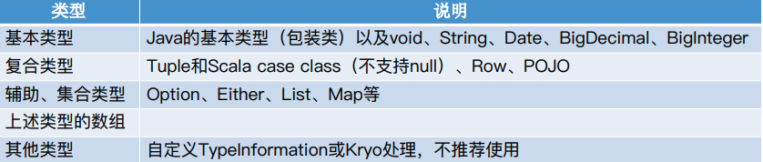

### 运行整体流程

>  Source -> Transformation -> Sink

#### 操作概览


操作算子是说将一个或者多个 DataStream 转换为一个新的DataStream


**理解 keyedStream 是理解整个DataStreamAPI 的重中之重**

#### 数据流向的物理分组


* `global`


相当于是强制将下游的算子的并行度设置为了1。

* `boradcast`


相当于就是将上游某个实例的数据发给下游的全部实例。使用的时候非常小心，相当于是将数据流复制n份(下游有n个实例)

* `forward`

上下游并行度一样的时候才可以使用。如果在编译期间上下游并行度不一样，那么就会报错。

* `shuffle`

做一个随机分配，每一个实例都知道自己的下游有几个实例，那么将一条数据随机选择下游的一个实例发过去，可以达到负载均衡的效果。

* `reblance`

和 shuffle 的作用差不多，不同的地方是`reblance` 是轮询的方式。

* `rescale`

和 `reblance`一样的做法，不同的是上面提到的 `reblace` 和 `rescale` 是会考虑所有的下游实例，如上面的例子中`A1 `  不止会考虑 `B1/B2` 还会考虑 `B3/B4/B5`

而这里的`rescale` 只会考虑本地的下游实例，也就是`A1` 只会考虑`B1/B2` 去分发数据，而`A2` 只会考虑  `B3/B4/B5`

* partitionCustome

自定义数据路由的逻辑，根据选择下游分区的逻辑返回下游的一个分区，然后将数据分发到下游的一个分区。


#### 类型系统

`Flink` 是强类型的，这个它的序列化/反序列化相关的，作为一个框架，理解的数据的类型越多，那么这个框架一定意义上越高效。有时候甚至需要给出  `TypeInformation`

```java
OutputTag<Order> outputTag = new OutputTag<>("seriousList", TypeInformation.of(Order.class));
```

在使用`scala` 编程或者使用`java` 调 `scala` 的时候，需要`scala` 的隐士转换，完成类型推到。

而在使用`Java` 写程序的时候，没有隐士转换，且`java` 运行期间类型擦除，那么就需要比较繁琐的给出类型

```java
SingleOutputStreamOperator<Tuple2<String, Integer>> word1Pair = words
  .map((String value) -> Tuple2.of(value, 1))
  .returns(Types.TUPLE(Types.STRING, Types.INT));
```




#### API 原理


Function: 是真正执行逻辑的代码，也是我们写代码的时候关注的点。

API 越抽象，**那么表达能力越低，但是一致性越强**，所谓一致性越强就是api 适应性越强，假如说你使用Table API 写了一个功能，如果你的flink 版本发生变化，那么在下一个版本中还可以工作能力越强。相反表达能力越若，因为其灵活性降低，很多底层Api processFunction 可以做的事情，这个时候它不一样能够做的到。

而越底层的api，在版本发生变化的时候其变化的可能越大，到下一个版本中还可以使用的可行性就越低。

---

#### Source

```scala
class MySensorSource extends SourceFunction[SensorReading]{

  // 定义一个标志位flag，用来表示数据源是否正常运行，发出数据
  var running:Boolean = true
  var count = 0

  override def run(sourceContext: SourceFunction.SourceContext[SensorReading]): Unit = {
    // 定义无线循环，不停的产生数据，除非被 cancel 掉

    val rand = new Random()

    var currentTemp: immutable.Seq[(String, Double)] = 1 to 10 map(i => (s"sensor_$i", rand.nextDouble() * 100))

    while (running) {
      // 模拟微调
      currentTemp = currentTemp.map(data => (data._1, data._2 + rand.nextGaussian()))
    // 获取时间戳
    val curTimestamp: Long = System.currentTimeMillis()
    currentTemp.foreach(data =>
      sourceContext.collect(SensorReading(data._1, curTimestamp, data._2))
    )
    Thread.sleep(1000)
    }
  }


  override def cancel(): Unit = {
    running = false
  }
}

// 运行
env.addSource(new MySensorSource())
```

---

#### Transformation

比较常规的有 `map,flatmap,filter,sum,min,max,minBy,maxBy,reduce` 等

```scala
dataStream
      .keyBy("id")
      .reduce((curState, newData) => SensorReading(curState.id, newData.timestamp, curState.temperature.min(newData.temperature))
      )

dataStream.map(data => (data.id * 2, data.timestamp))

dataStream.flatMap(data => {data.id.split("_")})

dataStream
.map(data => (data.id, data.timestamp, data.temperature))
.keyBy(_._1)
.sum(2)

dataStream
.map(data => (data.id, data.timestamp, data.temperature))
.keyBy(_._1)
.min(2)

dataStream
.map(data => (data.id, data.timestamp, data.temperature))
.keyBy(_._1)
.minBy(2)
```

#### 注意 min 和 minBy 的区别

> ```
> min:   min 那个字段为当前为止最小值, 其他字段(除keyBy的字段)始终都是stream中的第一次出现的那个值
> minBy: minBy 那个字段为当前为止最小值, 其他字段都更随着最小值的那行其它的数据，所以 minBy 找最小值的行是最准确的。
> 
> maxBy 也是一样的
> ```

#### 合流和分流

```scala
// 查看代码中
// java.transformations
```

#### 使用类

```scala
dataStream.filter(new MyFilter)

// 自定义一个函数类
class MyFilter extends FilterFunction[SensorReading] {
  override def filter(t: SensorReading): Boolean = {
    t.temperature > 10
  }
}

class MyReduceFuntion extends ReduceFunction[SensorReading] {
  override def reduce(t: SensorReading, t1: SensorReading): SensorReading =
    SensorReading(t.id, t1.timestamp, t.temperature.min(t1.temperature))
}
```

> 相同的还有 `ReduceFunction MapFunction`

#### 使用富函数

> 富函数和普通的函数的区别在于：**可以获取运行环境的上下文，并拥有一些生命周期方法，所以可以实现更复杂的功能。**

```scala
class MyRichMapper extends RichMapFunction[SensorReading, String] {

  override def open(parameters: Configuration): Unit = {
    // 假如说这里想去操作下数据库, 可以在这里建立连接，这里操作
    // map 操作是来一条数据操作一遍，那么操作数据库那就太过于频繁了
    // 而使用 RichFunction 在open 生命周期做一些初始化操作
    // 是当前函数类创建的时候就去执行构造器调用之后调用
    // 然后在调用 close 做收尾动作
  }

  override def map(in: SensorReading): String = {
    in.id + " temperature"
  }

  override def close(): Unit = {
    // 做收尾工作，如 关闭连接，或者情况状态
  }
}
```

#### 使用状态

> 因为状态是需要在环境上下文中建立的，所以在使用的时候，需要在可以获取环境上下文的地方使用，
>
> 如`ProcessFunction, RichFunction`

##### 使用本身带有状态的算子

```scala
public class maxValueFromKeyedState {
  public static void main(String[] args) throws Exception {
    StreamExecutionEnvironment env = StreamExecutionEnvironment.getExecutionEnvironment();
    env.setRuntimeMode(RuntimeExecutionMode.AUTOMATIC);

    DataStreamSource<Tuple2<String, Long>> tDs = env.fromElements(
      Tuple2.of("北京", 1L),
      Tuple2.of("北京1", 2L),
      Tuple2.of("北京1", 1L),
      Tuple2.of("北京", 3L),
      Tuple2.of("北京", 5L),
      Tuple2.of("北京1", 7L)
    );

    // 找对大值
    tDs
    .keyBy(t -> t.f0)
    .maxBy(1)
    .print("maxBy");

    tDs
    .keyBy(t -> t.f0)
    .map(new RichMapFunction<Tuple2<String, Long>, Tuple3<String, Long, Long>>() {

      private ValueState<Long> maxValueState;

      @Override
      public void open(Configuration parameters) throws Exception {
        ValueStateDescriptor<Long> stateDesc = new ValueStateDescriptor<>("maxValueState", Long.class);

        RuntimeContext runtimeContext = getRuntimeContext();

        maxValueState = runtimeContext.getState(stateDesc);
      }

      @Override
      public Tuple3<String, Long, Long> map(Tuple2<String, Long> value) throws Exception {
        Long maxValue = maxValueState.value();
        if (maxValue == null || value.f1 > maxValue) {
          maxValue = value.f1;
        }
        maxValueState.update(maxValue);

        return Tuple3.of(value.f0, value.f1, maxValue);
      }
    }).print("keyed State");

    // value 实现最大值

    env.execute();
  }
}
```

##### 自定义使用算子

```scala
class TempChangeAlert(threadHold: Double) extends RichFlatMapFunction[SensorReading, (String, Double, Double)] {

  /*
    定义状态，保存上一次的温度值
    这里可以使用 lazy 的方式创建状态，也可以在先定义一个类型然后 open 的周期方法中初始化，
    这个时候环境上下文getRuntimeContext以及可以获取到
    
    因为使用 lazy 创建的时候并没有立即初始化，而是在 flatMap 方法中使用，
    这个时候环境上下文getRuntimeContext以及可以获取到
    
    getRuntimeContext 是在执行完构造函数后才可以获取到的
   */
  lazy val lastTempState: ValueState[Double] = 
    getRuntimeContext.getState(new ValueStateDescriptor[Double]("lastState", classOf[Double]))

  override def flatMap(value: SensorReading, out: Collector[(String, Double, Double)]): Unit = {
    val lastTempValue = lastTempState.value()

    val diff = (value.temperature - lastTempValue).abs

    if (diff > threadHold)
      out.collect((value.id, lastTempValue, value.temperature))

    // 更新
    lastTempState.update(value.temperature)
  }
}

class MyRichMapper11 extends RichMapFunction[SensorReading, String] {


  /*
    getRuntimeContext:必须是在类的生命周期过程中调用，而不能在构造函数中调用，
    这样是获取不到 getRuntimeContext的
    应该将其放 到 open 生命周期中
   */

  var valueState: ValueState[Double] = _
  lazy val listState: ListState[Int] = getRuntimeContext.getListState(new ListStateDescriptor[Int]("listState", classOf[Int]))
  lazy val mapState: MapState[String, Double] =
    getRuntimeContext.getMapState(new MapStateDescriptor[String, Double]("mapState", classOf[String], classOf[Double]))

  lazy val reduceStage: ReducingState[SensorReading] = getRuntimeContext.getReducingState(new ReducingStateDescriptor[SensorReading]("reduceState", (curRes, newData) => SensorReading(curRes.id, newData.timestamp, curRes.temperature.min(newData.temperature)), classOf[SensorReading]))

  override def open(parameters: Configuration): Unit = {
    valueState = getRuntimeContext.getState(
      new ValueStateDescriptor[Double]("valueState", classOf[Double]))
  }

  override def map(value: SensorReading): String = {
    // 完成状态的读写
    val v = valueState.value()
    valueState.update(value.temperature)
    listState.add(1)
    listState.addAll(util.Arrays.asList(1, 2, 3, 4))
    listState.update(util.Arrays.asList(5)) // 直接替换

    val iterable: lang.Iterable[Int] = listState.get()
    iterable.forEach(el => println(el))

    val isEmpty = mapState.isEmpty

    value.id
  }
}
```

状态分为2大类：

* Managed State

* Raw Satate

  Managed State 分为2中

* Keyed State: 

  > DataStream 经过 keyBy 之后就变为KeyedStream， 每一个Key 对应一个state，一个Operator 的实例处理多个Key，访问多个State，所以有了Keyed State，它只能使用在KeyedStream 上

* Operator State

  > Operator State 可以用于所有算子，通过RuntimeContext 访问，这需要 Operator 是一个 Rich Function。Operator  State 需要自己实现 CheckpointedFunction 或 ListCheckpointed 接口

---

#### ProcessFunction

> 是最底层的流处理操作，允许访问所有流应用程序的基本构件:
>
> * event：数据流中的元素
> * state: 状态，用于容错和一致性，仅仅用于 keyed stream
> * timers: 定时器，支持时间时间和处理时间，用于keyed stream

Flink 提供了8 个 ProcessFunction

- ProcessFunction：dataStream
- KeyedProcessFunction：用于KeyedStream，keyBy之后的流处理
- CoProcessFunction：用于connect连接的流
- ProcessJoinFunction：用于join流操作
- BroadcastProcessFunction：用于广播
- KeyedBroadcastProcessFunction：keyBy 之后的广播
- ProcessWindowFunction：窗口增量聚合
- ProcessAllWindowFunction：全窗口聚合

```scala
class SplitTempProcess(threshold: Double) extends ProcessFunction[SensorReading, SensorReading] {
  override def processElement(value: SensorReading, ctx: ProcessFunction[SensorReading, SensorReading]#Context, out: Collector[SensorReading]): Unit = {
    if (value.temperature > threshold) {
      // 温度高输出到主流
      out.collect(value)
    } else {
      // 低温度输出到侧流
      ctx.output(new OutputTag[(String, Long, Double)]("low"), (value.id, value.timestamp, value.temperature))
    }
  }
}

dataStream.process(new SplitTempProcess(30.0))
```

* KeyedProcessFunction

```scala
class TempIncreaseWarning(interval: Long) extends KeyedProcessFunction[String, SensorReading, String] {

  // 定义状态，保存上一个问题值进行比较，保存注册定时器的时间戳，用于删除

  lazy val lastTempState: ValueState[Double] = getRuntimeContext.getState(new ValueStateDescriptor[Double]("lastState", classOf[Double]))
  lazy val timerTSState: ValueState[Long] = getRuntimeContext.getState(new ValueStateDescriptor[Long]("timerTSState", classOf[Long]))


  override def processElement(value: SensorReading, ctx: KeyedProcessFunction[String, SensorReading, String]#Context, out: Collector[String]): Unit = {
    // 取出状态
    val lastTemp = lastTempState.value()
    val timerTs = timerTSState.value()

    lastTempState.update(value.temperature)

    if (timerTs == 0 && value.temperature > lastTemp) {
      // 如果温度上升且没有定时器，那么注册当前数据时间戳10s之后的定时器
      val ts = ctx.timerService().currentProcessingTime() + interval
      ctx.timerService().registerProcessingTimeTimer(ts)
      timerTSState.update(ts)
    } else if (value.temperature < lastTemp) {
      // 温度下降，则删除定时器
      ctx.timerService().deleteProcessingTimeTimer(timerTs)
      timerTSState.clear()
    }
  }

  override def onTimer(timestamp: Long, ctx: KeyedProcessFunction[String, SensorReading, String]#OnTimerContext, out: Collector[String]): Unit = {
    val key = ctx.getCurrentKey
    val value = interval / 1000
    out.collect(s"传感器 $key 的温度连续 $value 秒连续上升")
    timerTSState.clear()
  }
}


dataStream
.keyBy(_.id)
.process(new TempIncreaseWarning(10000L)) // 10000m = 10s
```

#### 窗口中的API

在spark DataFrame 中或者SQL 中的开窗函数都是这样的


数据是已经有了的，然后在这个数据的基础之上，施加一个一个的窗口，然后在这个窗口进行计算，输出一个结果

而 flink 中的窗口是这样的。flink 中的数据是无界的，而窗口的提出主要是解决无界流的问题，如在源源不断来的数据(无界流)中需要计算在过去一段时间的统计结果，那么是对时间有一个限制的，处理的数据也是过去一段时间内的数据，是一个有界的数据，是截取了一部分数据。在Flink 中的创建就是就是讲无限流切割为一种有限流的方式，它将流数据分发到有限大小的桶bucket 中进行分析。

**这个有界流中的窗口是不一样的，有界流中的窗口是现有数据后有框，而无界流中的是现有框，然后才有数据。**


这里就发现，如果出现一个迟到的数据，那么使用先数据，后窗口方式解决不了数据乱序问题，当然你可以对数据进行一个排序，但是需要知道分布式下的数据排序是一个shuffle(想想spark 中的 sortByKey 操作)


而在flink 中是先有窗口，后来数据，会有一定的机制去处理延迟/乱序的数据

* 窗口的生命周期

> **窗口创建**：当属于这个窗口的第一条数据到来的时候，就窗口该窗口。
>
> **窗口移除**：当该窗口所属的时间全部已经走完，并且设置的允许延迟时间也过去了，那么这个窗口就会被移除
>
> 窗口的移除只限于那些基于时间的窗口，如`global window` 是不会被移除的。
>
> 每一个窗口都有一个 `triggers` 函数，它包括应用在这个窗口数据中的计算方法，以及什么时候出发这个计算的`triggering policy`,以及决定何时消除窗口中的内容。
>
> 每一个窗口也有一个 `Evictor` 负责决定在函数应用在窗口中的元素之前或者之后移除窗口中的元素
>
> 窗口的什么周期主要有4部分
>
> * 窗口建立
> * 窗口收集够了数据出发计算
> * 窗口移除数据
> * 窗口移除

* keyed 以及 Non-keyed Window

> 在调用窗口函数之前，如果使用了`keyed` 算子，那么后续的窗口就变为了`keyedWindow` 否则就是`non-keyed window`
>
> 使用了`keyed` 算子的好处是将Stream 并行化，一个keyedStream 分配到了一个 task，这些task 之间是可以并行化运行的。
>
> 没有使用了`keyed` 算子，那么Stream 只会在一个task中计算，并行度是1。
>
> 使用了`keyed` 算子那么使用`API window `
>
> 没有使用了`keyed` 算子，那么使用`api windowAll`

* Window Assigners

> 使用了`keyed` 算子那么使用`API window `
>
> 没有使用了`keyed` 算子，那么使用`api windowAll`
>
> 也可以自己定义窗口，实现接口`WindowAssigner`

* 四类窗口

> * 时间窗口
>
>   *tumbling windows*:  滚动窗口（一个跟斗翻了过去)时间对其，窗口长度固定，头连尾，尾连头，没有重叠，所以定好了起始点，所有窗口就都出来了。(滚动窗口可以看做是滑动窗口的一个特殊，就是滚动大小等于窗口长度的滑动窗口)，**只有一个窗口参数，那就是窗口长度**
>
>   *sliding windows* ：滑动窗口，起始点窗口长度固定，下一个窗口在保持窗口长度，在第一个窗口的起始时间往后滑动一定时间。**有重叠，一个数据，会存在在多个窗口中**。会有2个窗口参数，窗口长度和滑动步长。
>
>   *session windows* : 一段时间没有收到新数据就会生成一个新的数据，如打电话，当说完一些话之后，双方就不在说话，说明话说完了，然后将电话挂了，等下次再有话讲，那么在打一通电话。
>
>   该参数只有一个 `session gap` timeout 参数。时间无对其。
>
>    *global windows*
>
> * 计数窗口
>
>   *tumbling windows*: 
>
>   *sliding windows* 
>
> 基于时间的窗口期时间的范围左闭右开的。`*start timestamp* (inclusive) and an *end timestamp* (exclusive) t`

> 定义好窗口，就需要对每个窗口中中的数据进行逻辑计算，Window Function 有4中
>
> * ReduceFunction: 完成增量聚合，**获取不上窗口的上下文信息**
> * AggregationFunction: 完成增量聚合，**获取不上窗口的上下文信息**
> * FoldFunction：以后会移除
> * ProcessWindowFunction: 提供一个Iterasble 迭代器，可以获得一个窗口的所有元素以及元素的元数据信息，它的执行效率不是很好，因为需要缓存窗口中的所有元素，**但是它可以获取到窗口的上下文信息**
>
> 可以将增量聚合和缓存窗口内所有数据进行结合使用
>
> 使用窗口的场景一般场景就是
>
> ```java
> .keyby
> .window
> .aggregate
> ```
>
> 而在聚合的时候也分为2中聚合的方式
>
> * 增量聚合：`ReduceFunction/aggregateFunction`
>
> * 全窗口函数：先将全部的数据收集起来，等到计算的时候回遍历所有数据，然后得到结果
>
>   `ProcessWindowFunction/WindowFunction`,如在排序，统计中位数，20%的哪个数据等需要使用这个方式，将数据先收集起来，然后统计。还有全窗口函数还可以获取当前窗口的上下文以及窗口的信息。全窗口函数会更加使用场景多
>
> * 当然二者也可以混合起来使用

* ReduceFunction

> 需要传入一个聚合函数
>
> ```scala
> reduce(function: (T, T) => T)
> ```
>
> 函数要求输入和输出的类型一样

```scala
SingleOutputStreamOperator<SensorReading> dataStream = source.map(line -> {
  String[] split = line.split(",");
  return new SensorReading(split[0], new Long(split[1]), new Double(split[2]));
});

dataStream
.keyBy(sensorReading -> sensorReading.id)
.window(TumblingProcessingTimeWindows.of(Time.seconds(15)))
//.countWindow(10,2)
.reduce((a,b) -> {
  a.temperature = Math.max(a.temperature, b.temperature);
  return a;
}).print("a");

env.execute();
```

* AggregationFunction

> 需要传入一个 AggregateFunction 的函数类

> ```scala
> // 这个函数只接受一个函数，做增量聚合操作
> public <ACC, R> SingleOutputStreamOperator<R> aggregate(AggregateFunction<T, ACC, R> function)
> public interface AggregateFunction<IN, ACC, OUT> extends Function, Serializable
> 
> public static class MyAggregationFunction implements AggregateFunction<SensorReading, Tuple2<Double, Integer>, Double> {
> 
>   @Override
>   public Tuple2<Double, Integer> createAccumulator() {
>     return new Tuple2<>(0.0, 0);
>   }
> 
>   @Override
>   public Tuple2<Double, Integer> add(SensorReading value, Tuple2<Double, Integer> accumulator) {
>     return new Tuple2<>(accumulator.f0 + value.temperature, accumulator.f1 + 1);
>   }
> 
>   @Override
>   public Double getResult(Tuple2<Double, Integer> accumulator) {
>     return accumulator.f0 / accumulator.f1;
>   }
> 
>   @Override
>   public Tuple2<Double, Integer> merge(Tuple2<Double, Integer> a, Tuple2<Double, Integer> b) {
>     return new Tuple2<>(a.f0 + b.f0,a.f1 + b.f1);
>   }
> }
> 
> dataStream
>   .keyBy(sensorReading -> sensorReading.id)
>   .window(TumblingProcessingTimeWindows.of(Time.seconds(15)))
>   .aggregate(new MyAggregationFunction())
>   .print("a");
> ```
>

```scala
dataStream
.keyBy(sensorReading -> sensorReading.id)
.window(TumblingProcessingTimeWindows.of(Time.seconds(15)))
.aggregate(new AggregateFunction<SensorReading, Integer, Integer>() {
  @Override
  public Integer createAccumulator() {
    // 累加的初始值
    return 0;
  }

  @Override
  public Integer add(SensorReading value, Integer accumulator) {
    // 累加，这里累加个数，所以就 +1
    return accumulator + 1;
  }

  @Override
  public Integer getResult(Integer accumulator) {
    return accumulator;
  }

  @Override
  public Integer merge(Integer a, Integer b) {
    // Merges two accumulators, returning an accumulator with the merged state.
    return a + b;
  }
}).print("res");
```

* 全窗口函数 `WindowFunction`

> ```java
> dataStream
>   .keyBy(sensorReading -> sensorReading.id)
>   .window(TumblingProcessingTimeWindows.of(Time.seconds(15)))
>   .apply(WindowFunction 函数)
>  
> // 这里的参数 w 他是一个 window
> public interface WindowFunction<IN, OUT, KEY, W extends Window> extends Function, Serializable 
>   
> 
> // 虽然低效率，但是可以做的事情多了起来。
> dataStream
>   .keyBy(sensorReading -> sensorReading.id)
>   .window(TumblingProcessingTimeWindows.of(Time.seconds(15)))
>   .apply(new WindowFunction<SensorReading, Tuple3<String, Integer, Long>, 
>          	String, TimeWindow>() {
>             
>     @Override
>     public void apply(String key, TimeWindow window, 
>                       Iterable<SensorReading> input, 
>                       Collector<Tuple3<String, Integer, Long>> out) throws Exception {
>       
>       out.collect(Tuple3.of(key, IteratorUtils.toList(input.iterator()).size(), 
>                             window.getEnd()));
>     }
>   }).print("a");
> 
> env.execute(); 
> ```

* 全窗口函数 `ProcessWindowFunction`

```scala
public abstract class ProcessWindowFunction<IN, OUT, KEY, W extends Window> extends AbstractRichFunction

// 这里和全窗口不同点
// 1. 主要是实现一个 process 函数
// 2. 使用 process 调用计算
// 3. ProcessWindowFunction 还给了一个 context，窗口需要在这里获取
dataStream
.keyBy(sensorReading -> sensorReading.id)
.window(TumblingProcessingTimeWindows.of(Time.seconds(15)))
.process(new ProcessWindowFunction<SensorReading, Tuple3<String, Integer, Long>, String, TimeWindow>() {

  @Override
  public void process(String key, Context context, Iterable<SensorReading> elements, Collector<Tuple3<String, Integer, Long>> out) throws Exception {
    out.collect(Tuple3.of(key, IteratorUtils.toList(elements.iterator()).size(),
                          context.window().getEnd()));
  }
}).print("a");
```

* `ProcessWindowFunction`和 `AggeragationFunction/ReduceFunction` 混合使用

```scala
SingleOutputStreamOperator<CategoryPoJo> aggregateByEachCategory = ds
.keyBy(t -> t.f0)
// 注意查看注释中的信息， offset 的使用
// 这个窗口，从当前00:00:00 开始，计算当前的数据，
.window(TumblingProcessingTimeWindows.of(Time.days(1), Time.hours(-8)))
// 每隔 1s 触发一下窗口
.trigger(ContinuousProcessingTimeTrigger.of(Time.seconds(1)))
// aggregate 自定义聚合， 这里有2类使用
// 1. 单纯自定义 聚合函数，得到聚合结果 传入 aggregateFunction
//   aggregate(AggregateFunction<T, ACC, R> function)
// 2. 除了聚合结果，还可以收集窗口中的数据， 再传入 windowFunction， 有窗口 context 信息
// SingleOutputStreamOperator<R> aggregate(
//		AggregateFunction<T, ACC, V> aggFunction,
//		WindowFunction<V, R, K, W> windowFunction)
//  这种方法中  WindowFunction 中的IN 是 AggregateFunction 的 OUT
.aggregate(new PrinceAggerate(), new WindowResult());

private static class PrinceAggerate implements AggregateFunction<Tuple2<String, Double>, Double, Double> {
        @Override
        public Double createAccumulator() {
            return 0.0;
        }

        @Override
        public Double add(Tuple2<String, Double> value, Double accumulator) {
            return value.f1 + accumulator;
        }

        @Override
        public Double getResult(Double accumulator) {
            return accumulator;
        }

        @Override
        public Double merge(Double a, Double b) {
            return a + b;
        }
    }

private static class WindowResult implements WindowFunction<Double, CategoryPoJo, 
String, TimeWindow> {
  
  private FastDateFormat df = FastDateFormat.getInstance("yyyy-MM-dd HH:mm:ss");

  @Override
  public void apply(String key, TimeWindow window, Iterable<Double> input, 
                    Collector<CategoryPoJo> out) throws Exception {
    
    Iterator<Double> iterator = input.iterator();
    double aggegrateResult = iterator.hasNext() ? iterator.next() : 0.0;
    String dateStr = df.format(System.currentTimeMillis());
    out.collect(new CategoryPoJo(key, aggegrateResult, dateStr));
  }
}
```

在这里先经过一个聚合函数进行聚合，这样一个窗口中输出的数据就只有一个了，

然后这个时候将这一个结果在输出到 `ProcessWindowFunction` 函数中，然后就可以获取到窗口的上下文了


#### 其他的窗口关于的API

* `.trigger`

  定义 window 什么时候关闭，并出发计算输出结果

* `.evictor`

  定义移除某些数据的逻辑

* `.allowedLateness`

  允许处理迟到的数据

* `.sideOutputData`

  将迟到的数据放到测输出流

* `.getSideOutPut`

  获取测输出流

```java
OutputTag<Order> outputTag = new OutputTag<>("seriousList", TypeInformation.of(Order.class));
/*
    .allowedLateness(Time.seconds(3)).sideOutputLateData(outputTag)
    Elements that arrive behind the watermark by more than the specified time will be dropped
    如果数据到达时间比 watermark 晚了 3s，那么就丢弃到  sideOutputLateData 中
    之前设置了 watermark 比事件时间晚个 3s，也就是时间窗口的计算触发时间是比比事件时间晚了3s，晚到 3s 内的事件是可以在窗口中收集到的但是超过3s 的事件就会被丢弃现在的这个设置，就是将晚到3s 的数据输出到侧输出流中

  保证数据不丢失，但是具体这个数据如何处理看业务需求了，看是否需要人工接入
         */
SingleOutputStreamOperator<String> apply = watermarkDs
  .keyBy(Order::getUserId)
  // 滚动窗口
  .window(TumblingEventTimeWindows.of(Time.seconds(5)))
  .allowedLateness(Time.seconds(3)).sideOutputLateData(outputTag)
  .apply(new WindowFunction<Order, String, Integer, TimeWindow>() {
    @Override
    public void apply(Integer key, TimeWindow window, Iterable<Order> input, Collector<String> out) throws Exception {
      ArrayList<String> eventTimeList = new ArrayList<>();
      for (Order order : input) {
        Long eventTime = order.eventTime;
        eventTimeList.add(df.format(eventTime));
      }
      long timestamp = window.maxTimestamp();
      String ourStr = String.format("key: %s 窗口开始结束时间:[%s-%s)，属于该窗口的事件事件%s",
                                    key, df.format(window.getStart()), df.format(window.getEnd()), eventTimeList.toString());

      out.collect(ourStr);
    }
  });

DataStream<Order> sideOutput = apply.getSideOutput(outputTag).map(order -> {
  order.setEventTimeStr(df.format(order.eventTime));
  return order;
});

sideOutput.print("sideoutput");
apply.print("normal data");
```


---

#### 全窗口函数和窗口函数

全窗口函数是说，DataStream 只有一个并行度，

窗口函数是DataStream 是多个并行度的，如经过keyBy 操作之后的DataStream 获取KeyedStream 一个keyedStream 就是一个并行度

```scala
class MyWindowFunction extends WindowFunction[(String, Double, Long), String, String, TimeWindow] {
  override def apply(key: String, window: TimeWindow, input: Iterable[(String, Double, Long)], out: Collector[String]): Unit = {
    out.collect(window.getStart + "->" + window.getEnd + " " + window.toString)
  }
}

.timeWindow(Time.seconds(5), Time.seconds(3))
.apply(new MyWindowFunction)
```

