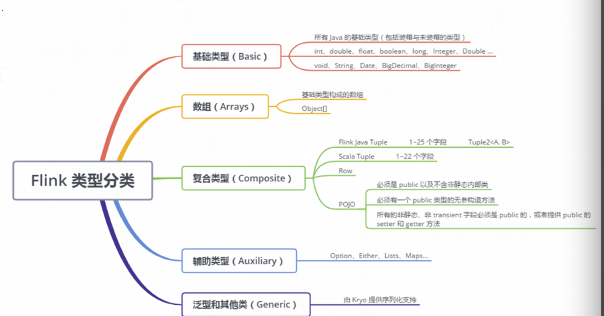
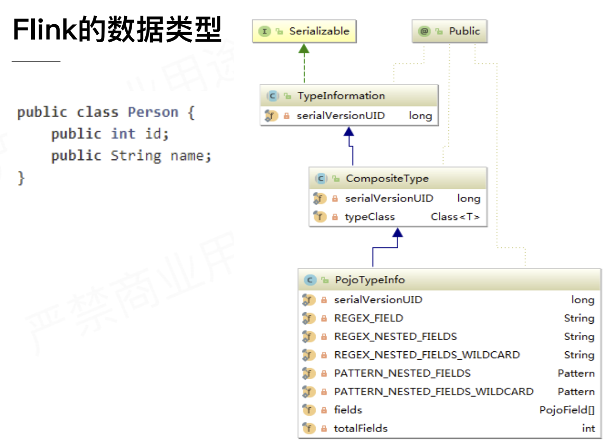
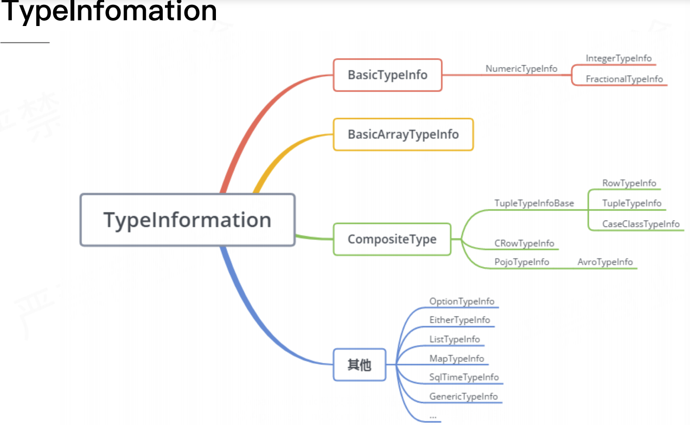
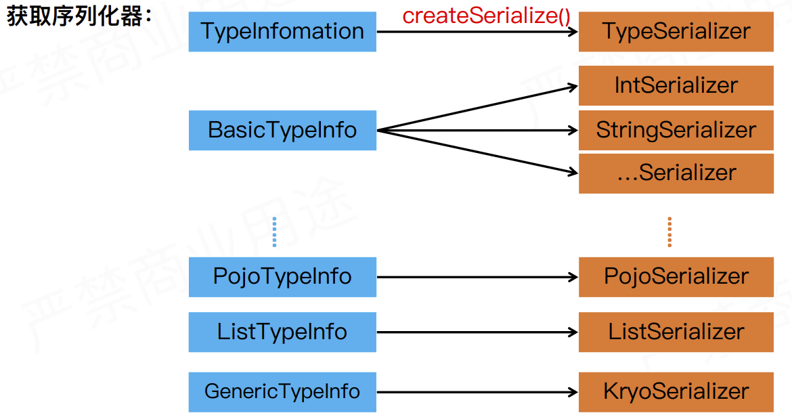
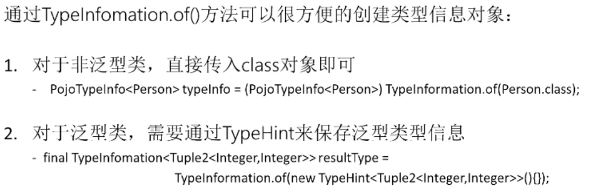
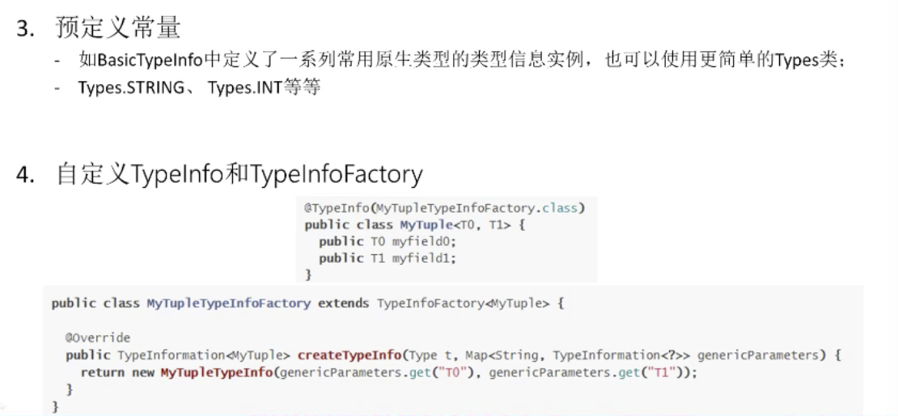
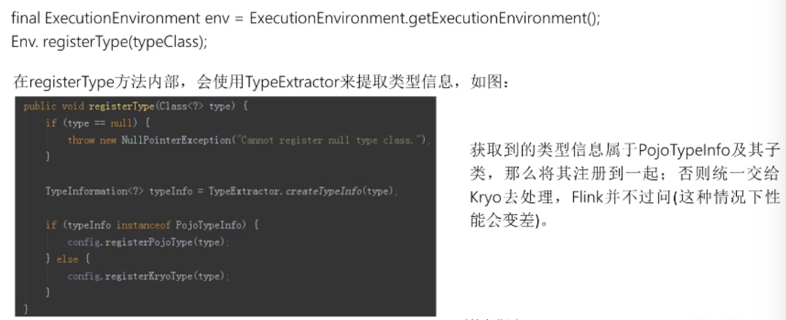
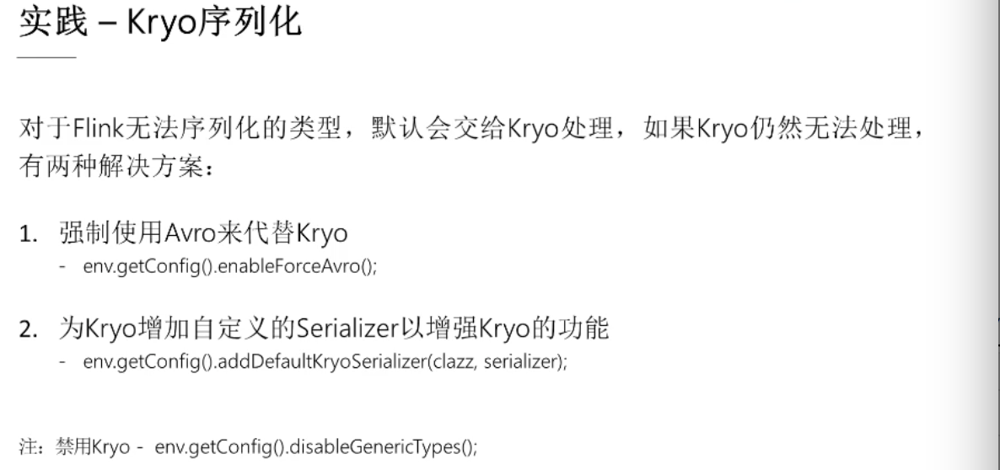

#### 主要内容

* 为Flink 量身定制的序列化框架
* Flink 序列化的最佳实践
* Flink 底层通信的序列化

---

#### 为Flink 量身定制的序列化框架

* 为什么定制

  > 基于JVM 的数据分析引擎
  >
  > 大数据时代的JVM-显示的内存管理
  >
  > 为Flink量生定制的序列化框架
  >
  > * Flink知道数据类型，更早的检查，而不是在运行时跑出异常
  >
  > * 知道数据类型，选取更好的序列化方式，更好的数据布局，节省空间

  > 
  >
  > 还有 `scala` 的 `case class`
  >
  > 一个简单的POJO的类，在Flink 中是使用PojoTypeInfo 表示的
  >
  > 
  >
  > TypeInformation 作为类型描述符，描述表示的数据类型
  >
  > TypeInformation的脑图
  >
  > Flink 中每一个类型都有对应的 TypeInformation 类
  >
  > 

  #### 序列化过程

  * 获取序列化器

    > 调用 TypeInfomation 类中的 createSerialize 方法，获得序列化器
    >
    > 大多数类型Flink 都可以获取到序列化器

    

    > 而对泛型则通过Kyro序列化器
    >
    > 使用Pojo的序列化器的限制
    >
    > * Pojo 必须是public 的
    > * 类有 public 无参构造函数
    > * 类的非静态字段都是 public 的
    >
    > 当无法满足上述的要求的时候：那么就会使用泛型的序列化器
    >
    > 当上述无法满足的时候，用户可以自定义，自定义话，需要实现TypeInformation 接口，以及实现 createSerialize 方法

  * 类型声明

    > 
    >
    > 
    >
    > 
    >
    > 
    >
    > 