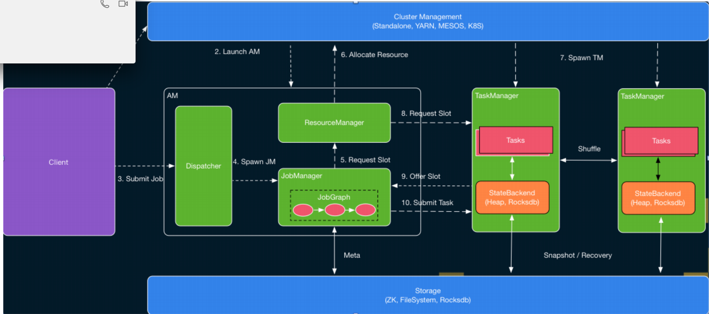

#### 整体架构

* 底层可以跑在不同的环境中，Local、YARN、Cloud 等环境
* 针对不同环境Flink 实现了一套统一的分布式执行引擎，就是Runtime 层
* 再网上就是DataStream 和 Dataset 的流和批的API
* 在往上就是基于流和批实现的各种使用组件

Flink 的整体架构如图 1 所示。Flink 是可以运行在多种不同的环境中的，例如，它可以通过单进程多线程的方式直接运行，从而提供调试的能力。它也可以运行在 Yarn 或者 K8S 这种资源管理系统上面，也可以在各种云环境中执行。

其中 Runtime 层对不同的执行环境提供了一套统一的分布式执行引擎。

针对不同的执行环境，**Flink 提供了一套统一的分布式作业执行引擎，也就是 Flink Runtime 这层**。Flink 在 Runtime 层之上提供了 DataStream 和 DataSet 两套 API，分别用来编写流作业与批作业，以及一组更高级的 API 来简化特定作业的编写。本文主要介绍 Flink Runtime 层的整体架构。

---

#### Runtime 架构

`master-slave` 架构

`AM(白线部分)`: 相当于是master: 负责管理整个集群中的资源和作业

 `TaskManager`：相当于是 slave: 负责提供具体的资源并实际执行作业。

* AM

  > **Dispather**：接收用户的提交，并将**JobManager 拉起来**, 一个AM 中只会有一个
  >
  > **ResourceManager** ： 负责资源的管理，一个AM 中只会有一个
  >
  > **JobManager**：控制作业执行，一个AM 中只会有多个
  >
  > 基于上述结构，当用户提交作业的时候，提交脚本会首先启动一个 Client 进程负责作业的编译与提交。它首先将用户编写的代码编译为一个 JobGraph，在这个过程，它还会进行一些检查或优化等工作，例如判断哪些 Operator 可以 Chain 到同一个 Task 中。然后，Client 将产生的 JobGraph 提交到集群中执行。此时有两种情况，一种是类似于 Standalone 这种 Session 模式，AM 会预先启动，此时 Client 直接与 Dispatcher 建立连接并提交作业即可。另一种是 Per-Job 模式，AM 不会预先启动，此时 Client 将首先向资源管理系统 （如 Yarn、K8S）申请资源来启动 AM，然后再向 AM 中的 Dispatcher 提交作业
  >
  > 
  >
  > 当作业到 Dispatcher 后，Dispatcher 会首先启动一个 JobManager 组件，然后 JobManager 会向 ResourceManager 申请资源来启动作业中具体的任务。这时根据 Session 和 Per-Job 模式的区别， TaskExecutor 可能已经启动或者尚未启动。如果是前者，此时 ResourceManager 中已有记录了 TaskExecutor 注册的资源，可以直接选取空闲资源进行分配。否则，ResourceManager 也需要首先向外部资源管理系统申请资源来启动 TaskExecutor，然后等待 TaskExecutor 注册相应资源后再继续选择空闲资源进程分配。目前 Flink 中 TaskExecutor 的资源是通过 Slot 来描述的，一个 Slot 一般可以执行一个具体的 Task，但在一些情况下也可以执行多个相关联的 Task，这部分内容将在下文进行详述。ResourceManager 选择到空闲的 Slot 之后，就会通知相应的 TM “将该 Slot 分配分 JobManager XX ”，然后 TaskExecutor 进行相应的记录后，会向 JobManager 进行注册。JobManager 收到 TaskExecutor 注册上来的 Slot 后，就可以实际提交 Task 了。
  >
  > 
  >
  > TaskExecutor 收到 JobManager 提交的 Task 之后，会启动一个新的线程来执行该 Task。Task 启动后就会开始进行预先指定的计算，并通过数据 Shuffle 模块互相交换数据

**Client 编译作业之后，提交**

* Session 模式

  > AM 和 TM 都已经提前被起起来，作业可以直接提交

* per-Job 模式

  > 在提交作业的时候，将AM 和 TM 拉起来
  >
  > 1. client 会先向集群资源(Yarn 等)索要container，也就是资源，这部分资源将AM 拉起来
  > 2. 然后作业首先到了Dispather，Dispather启动一个新的JM线程，然后在JM中得到JobGraph，得到所有需要的task，对每个task 的计算需要资源，去ResourceManager 索要资源。
  > 3. ResourceManager 再次向集群资源索要资源，获得资源后，在将TaskManager 拉起来，RM 向TM申请Slot
  > 4. 申请到资源后，TM 会给JM回复，“你可以给我分配任务了，资源已经准备好了”
  > 5. JM将task submit 到 TM
  > 6. 当多个TM将多个task 运行起来之后，多个TM直接就可以通信交换数据了

* 资源调度：任务和资源的匹配

> 资源是通过 Slot 来表示的，每个 Slot 可以用来执行不同的 Task。而在另一端，任务即 Job 中实际的 Task，它包含了待执行的用户逻辑。调度的主要目的就是为了给 Task 找到匹配的 Slot。
>
> 
>
> 作业调度的基础是首先提供对资源的管理，因此我们首先来看下 Flink 中资源管理的实现。
>
> Flink 中的资源是由 TaskExecutor 上的 Slot 来表示的。

---

#### Slot

> SlotManager: 它维护了当前集群中所有 TaskExecutor 上的 Slot 的信息与状态，如该 Slot 在哪个 TaskExecutor 中，该 Slot 当前是否空闲等。
>
> JobManager 是向ResourceManager 申请资源的，然后是TaskManager 向JobManager 回复
>
> ResourceManager、TaskManager、JobManager 三者构成Slot 的生命周期
>
> 1. 当TaskManager 起来的时候，会向ResourceManager 注册，告诉它，我这里又多少个Slot
> 2. JobManager 有任务需要去执行的时候，去向 ResourceManager 申请
> 3. session 模式
>    1. 直接向TaskManager 要资源
> 4. per-job 模式
>    1. 先起一个 TaskManager，然后在去要资源
> 5. RM 是已经知道如何Slot 的，例如说 slot1分配给 task1, 然后TM 给task1说，你来我的slot1上执行任务吧
> 6. JM 将作业进行了分发执行
> 7. Task 执行结果之后/异常退出
> 8. TM都会告诉RM这个task已经结果，slot 已经释放，RM可以将其分配到其他task
>
> TM 会定期给RM发送心跳，告诉RM，TM上slot 的状态 
>
> 当 JobManger 来为特定 Task 申请资源的时候，根据当前是 Per-job 还是 Session 模式，ResourceManager 可能会去申请资源来启动新的 TaskExecutor。当 TaskExecutor 启动之后，它会通过服务发现找到当前活跃的 ResourceManager 并进行注册。在注册信息中，会包含该  TaskExecutor 中所有 Slot 的信息。 ResourceManager 收到注册信息后，其中的 SlotManager 就会记录下相应的 Slot 信息。当 JobManager 为某个 Task 来申请资源时， SlotManager 就会从当前空闲的 Slot 中按一定规则选择一个空闲的 Slot 进行分配。当分配完成后，如第 2 节所述，RM 会首先向 TaskManager 发送 RPC 要求将选定的 Slot 分配给特定的 JobManager。TaskManager 如果还没有执行过该 JobManager 的 Task 的话，它需要首先向相应的 JobManager 建立连接，然后发送提供 Slot 的 RPC 请求。在 JobManager 中，所有 Task 的请求会缓存到 SlotPool 中。当有 Slot 被提供之后，SlotPool 会从缓存的请求中选择相应的请求并结束相应的请求过程。
>
> 
>
> 当 Task 结束之后，无论是正常结束还是异常结束，都会通知 JobManager 相应的结束状态，然后在 TaskManager 端将 Slot 标记为已占用但未执行任务的状态。JobManager 会首先将相应的 Slot 缓存到 SlotPool 中，但不会立即释放。这种方式避免了如果将 Slot 直接还给 ResourceManager，在任务异常结束之后需要重启时，需要立刻重新申请 Slot 的问题。通过延时释放，Failover 的 Task 可以尽快调度回原来的 TaskManager，从而加快 Failover 的速度。当 SlotPool 中缓存的 Slot 超过指定的时间仍未使用时，SlotPool 就会发起释放该 Slot 的过程。与申请 Slot 的过程对应，SlotPool 会首先通知 TaskManager 来释放该 Slot，然后 TaskExecutor 通知 ResourceManager 该 Slot 已经被释放，从而最终完成释放的逻辑。
>
> 
>
> 除了正常的通信逻辑外，在 ResourceManager 和 TaskExecutor 之间还存在定时的心跳消息来同步 Slot 的状态。在分布式系统中，消息的丢失、错乱不可避免，这些问题会在分布式系统的组件中引入不一致状态，如果没有定时消息，那么组件无法从这些不一致状态中恢复。此外，当组件之间长时间未收到对方的心跳时，就会认为对应的组件已经失效，并进入到 Failover 的流程。
>
> 

* Slot 划分

* Slot share

> 单个 slot 部署多个 task，如上当Slot2 中的taskC2执行完之后就空闲了，那么这个时候就可以让B2 使用
>
> 但是单个算子的多个实例不可以调度到同一个 Slot 中，如A算子的三个实例A1，A2，A3 调度到了三个Slot 中。

---

#### DAG 结构

JobGraph 中的 flatMap 算子到了JobManager 中就具有物理含义，2个实例。

基于上述 Slot 管理和分配的逻辑，JobManager 负责维护作业中 Task 执行的状态。如上文所述，Client 端会向 JobManager 提交一个 JobGraph，它代表了作业的逻辑结构。JobManager 会根据 JobGraph 按并发展开，从而得到 JobManager 中关键的 ExecutionGraph。ExecutionGraph 的结构如图 5 所示，与 JobGraph 相比，ExecutionGraph 中对于每个 Task 与中间结果等均创建了对应的对象，从而可以维护这些实体的信息与状态。

一个Job中多个Task，Task 的调度策略

> * Eager 调度，适用于流作业,Job 一起起来，所有task 的资源准备好，并将所有的task 都起起来
>
>   > 流作业的特点：先将所有的算子都启动起来，然后当来了数据之后算子开始执行，task永远不退出，数据源源不断的来。
>
> * LAZY_FROM_SOURCE: 适用于批处理，有限的数据集，一个task1 执行完之后，就可以将这个task1资源释放，然后下一个task2 在调度起来，接收上一个task1 的输入，task2申请资源，然后启动执行
>
>   > 节省资源

---

#### 错误恢复

错误恢复策略

* Task Failover

> 直接重启所有的 Task。对于 Flink 的流任务，由于 Flink 提供了 Checkpoint 机制，因此当任务重启后可以直接从上次的 Checkpoint 开始继续执行。因此这种方式更适合于流作业。

> 它只适用于 Task 之间没有数据传输的情况。这种情况下，我们可以直接重启出错的任务。
>
> 
>
> 如A1给B1 发送了消息，然后B1 失败了，这个时候如果只B1启动，A1认为消息已经发送了，但是新启动B1却没有收到，肯定是会出现问题的。
>
> 除非B1和其他Task 没有连接，否则会出现不一致

> **为了增强对 Batch 作业**，Flink 在 1.9 中引入了一种新的 Region-Based 的 Failover 策略。在一个 Flink 的 Batch 作业中 Task 之间存在两种数据传输方式，**一种是 Pipeline 类型的方式，这种方式上下游 Task 之间直接通过网络传输数据，因此需要上下游同时运行**；另外一种是 Blocking 类型的试，如上节所述，这种方式下，上游的 Task 会首先将数据进行缓存，因此上下游的 Task 可以单独执行。基于这两种类型的传输，Flink 将 ExecutionGraph 中使用 Pipeline 方式传输数据的 Task 的子图叫做 Region，从而将整个 ExecutionGraph 划分为多个子图。可以看出，Region 内的 Task 必须同时重启，而不同 Region 的 Task 由于在 Region 边界存在 Blocking 的边，因此，可以单独重启下游 Region 中的 Task。
>
> 
>
> 基于这一思路,如果某个 Region 中的某个 Task 执行出现错误，可以分两种情况进行考虑。如图 8 所示，如果是由于 Task 本身的问题发生错误，那么可以只重启该 Task 所属的 Region 中的 Task，这些 Task 重启之后，可以直接拉取上游 Region 缓存的输出结果继续进行计算。
>
> 
>
> 如果是由于上游失败导致的错误，那么需要同时重启上游的 Region 和下游的 Region。实际上，如果下游的输出使用了非确定的数据分割方式，为了保持数据一致性，还需要同时重启所有上游 Region 的下游 Region。

当然有一种极端的情况，如磁盘坏了，通信失败了，这个时候就需要全部重启了

* Master Failover

---

#### 未来展望

* 完善的资源管理
* 统一的 Stream 和 Batch
* 灵活的调度
* Mater Failover 优化

[原文链接](https://www.infoq.cn/article/RWTM9o0SHHV3Xr8o8giT)

