Flink 中的时间，相当于数据库表中的主键

本文中主要关于对Table 以及 ProcessFunction 中对时间的剖析

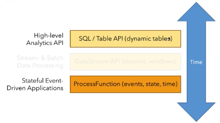

主要内容

* 时间语义
* EventTime 和 watermark
* Table 中的时间
* 深入思考

---

#### Flink 时间语义

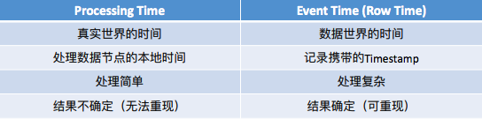

时间特性：

* 只会往前走，不会回退

但是现实事件中，在数据传输的时候，网络的延迟等会有一些数据时间的延迟，从而导致乱系

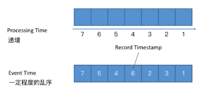

单挑数据的乱序，那么如果将整个序列进行一些的离散化，那么得到的结果就出现了正确的顺序

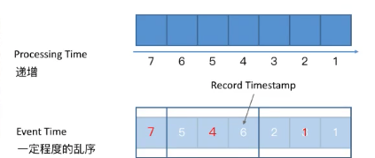

如上，将整个数据序列进行三阶段的划分，没一个阶段使用红色的值代表，那么这个序列就出现正确的顺序。

这个时候就通过一些手段给整个数据中插入一些标志位：

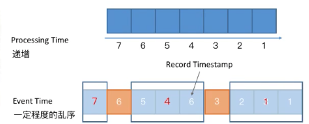

这些标志位就是 watermark，标志着后面在来的数据，没有比watermark 小于或等于的了，也就是watermark 之前的数据都已经到了。

下面主要讲解：

* TimeStamp 和 watermark 的产生
* TimeStamp 和 watermark 在节点间的传递
* TimeStamp 和 watermark 在节点间的处理

---

#### TimeStamp 和 watermark 的产生

* wm 是一条特殊的数据记录
* 必须单调递增，确保任务的事件时间向前推进，而不是在后退
* wm 和数据的时间戳相关

窗口的关闭时由wm 触发的。

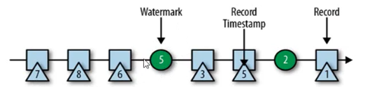

所以如图当wm5到来的时候，就会将假如说[1, 5) 这个窗口关闭。如图当事件时间等于5的时候，这个时候wm 就更新成了5，所以会关闭。

还可以设置wm 的延迟用于等待迟到/乱序的数据，假如说设置了延迟3秒，那么只有当事件时间到了8的时候，这个时候wm=8，那么[1,5) 这个窗口才会关闭。

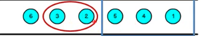

如这里，窗口为[1,5) 我设置了延迟2s，那么数据5之后事件时间到了8的时候我的这个窗口才关闭，也就是迟到的数据2和3还都是可以落到[1,5) 这个窗口中的，数据不会丢失。

在代码中设置

```scala
.assignTimestampsAndWatermarks(new BoundedOutOfOrdernessTimestampExtractor[SensorReading](Time.seconds(0)) {
        override def extractTimestamp(element: SensorReading): Long = element.timestamp})
```

生成的方式也是分为：

* 周期性
* 数据驱动： 需要自己实现逻辑，如当遇到什么情况的时候，生成一个wm，其他case不生成

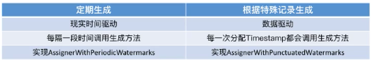

在使用中建议，在生成wm 的时候越靠近DataSource 越好，方便程序中更多的算子去判断数据是否乱序。

Flink 中也有非常好的机制保证时间以及wm 被正确的传递到下游的节点。

#### wm 传递

* wm广播形式在算子之间进行传播
* 单输出取其大，多输入取其小
* Long.MAX_VALUE 表示不会再有数据

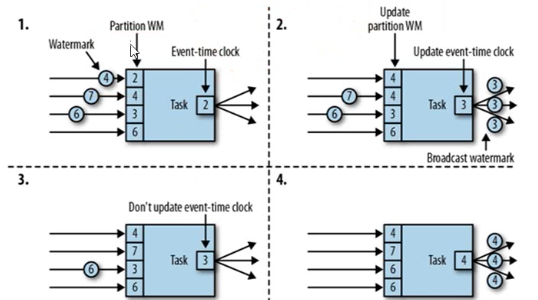


局限性的理解：当时一个输入源的时候，要求经过一些分布式的计算之后到达某一个节点的wm一致，那是很合理的，但是对于多个输入源，当做聚合操作(如：join操作)的时候，还要求wm一致，那就不是很合理了，如一个数据源比较早，另外一个数据源很晚。


#### 窗口的起始点和截止点的计算源码

代码位置 `org.apache.flink.streaming.api.windowing.assigners.TumblingEventTimeWindows#assignWindows`

```java
// 创建的时候是这样的
public static TumblingEventTimeWindows of(Time size) {
  return new TumblingEventTimeWindows(size.toMilliseconds(), 0, WindowStagger.ALIGNED);
}

// 然后会在某个地方调用
public Collection<TimeWindow> assignWindows(Object element, long timestamp, WindowAssignerContext context) {
  if (timestamp > Long.MIN_VALUE) {
    if (staggerOffset == null) {
      staggerOffset = windowStagger.getStaggerOffset(context.getCurrentProcessingTime(), size);
    }
    // 这里计算起始点
    // globalOffset 默认会是 0
    // 那么它的作用是什么呢， timestamp 使用的是格林威治时间，和北京时间会差个8小时
    // 如果在北京时区中使用标准的时候，那么在一开始使用 of 方法创建的时候需要给 offset 这个 -8h 的微秒值
    // 详细可以看源代码中的注释。
    long start = TimeWindow.getWindowStartWithOffset(timestamp, (globalOffset + staggerOffset) % size, size);
    return Collections.singletonList(new TimeWindow(start, start + size));
  } else {
    throw new RuntimeException("Record has Long.MIN_VALUE timestamp (= no timestamp marker). " +
                               "Is the time characteristic set to 'ProcessingTime', or did you forget to call " 
                               + "'DataStream.assignTimestampsAndWatermarks(...)'?");
  }
}

/**
  Method to get the window start for a timestamp.
  Params:
  	timestamp – epoch millisecond to get the window start.
  	offset – The offset which window start would be shifted by.
  	windowSize – The size of the generated windows.
  Returns:
  	window star
**/
public static long getWindowStartWithOffset(long timestamp, long offset, long windowSize) {
  // timestamp 当前时间戳
  return timestamp - (timestamp - offset + windowSize) % windowSize;
}

/*
	在刚开始的时候 可以认为 offset=0
	timestamp - (timestamp - 0 + windowSize) % windowSize;
	= timestamp - (timestamp + windowSize) % windowSize;
	= timestamp - (timestamp) % windowSize;
	timestamp 将 余数全部都减掉了，剩下的就是 windowSize 的整数倍
	也就是假如是 windowSize=5 是当前的，那么当前的起始点肯定是 5的整数倍
	因为 timestamp 肯定是大于 5 的。
	假如说当前的 timestamp=1617462222，那么经过这里的计算，返回的结果就是 1617462220
	
	返回的结果到方法 assignWindows 中，那么就计算出第一个窗口 [1617462220,1617462225)
*/
```

#### 解决迟到数据

如果在窗口关闭的时候，数据还没有到，那么这个数据就会永久丢失了，为了解决这个问题可以使用下面的接口

```java
.allowedLateness(Time.seconds(3)).sideOutputLateData(outputTag)
```

因为窗口的计算已经结束，窗口已经关闭了，所以迟到的数据是不能再正常参与到计算中了，

但是可以将数据输出到侧输出流中，然后后续再取出来

```java
DataStream<Order> sideOutput = apply.getSideOutput(outputTag).map(order -> {
  order.setEventTimeStr(df.format(order.eventTime));
  return order;
});
```

然后进而做进一步的计算。

---

#### ProcessFunction

提供和时间相关的API

* 时间窗口相关
* 获取算子时间(wm)
* 注册定时器：当wm到达某个时间时候调一个接口

所有和时间相关的逻辑，都是通过TimeService 提供的

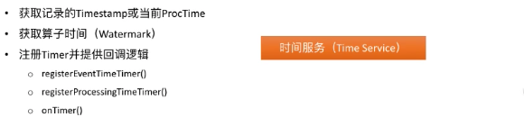

#### wm 处理

算子的实例，当收到一个wm 的时候都去干什么事情：

* 更新算子时间
* 遍历计时器队列触发回调逻辑
* 将wm 发送到下游

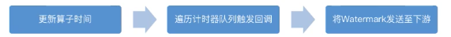

---

#### Table 中指定时间

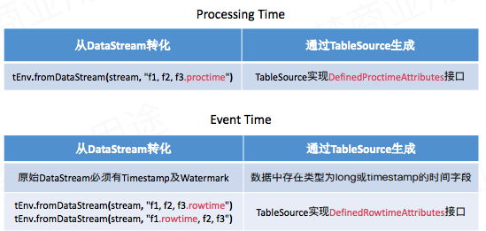

`.proctime`必须是在Table 中的最后一列


* 和时间列紧密的API

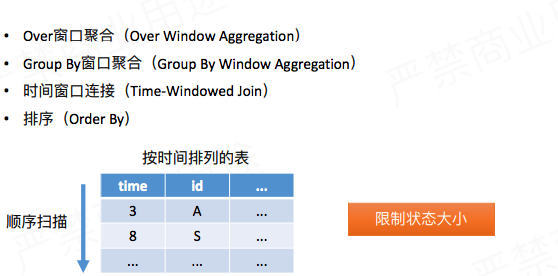

---

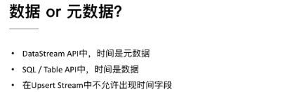

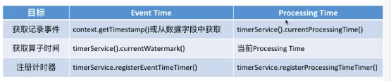

---

#### 时间和wm本质

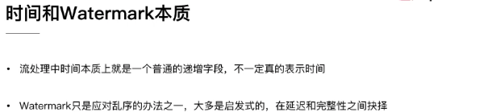

wm 的设置延迟，需要根据业务在延迟和数据的完整性之间取一个平衡


 