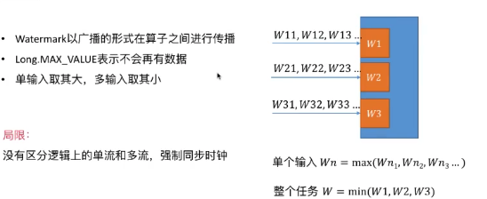

Flink 中的时间，相对于数据库表中的主键

本文中主要关于对Table 以及 ProcessFunction 中对时间的剖析


主要内容

* 时间语义
* EventTime 和 watermark
* Table 中的时间
* 深入思考

---

#### Flink 时间语义


时间特性：

* 只会往前走，不会回退

但是现实事件中，在数据传输的时候，网络的延迟等会有一些数据时间的延迟，从而导致乱系


单挑数据的乱序，那么如果将整个序列进行一些的离散化，那么得到的结果就出现了正确的顺序


如上，将整个数据序列进行三阶段的划分，没一个阶段使用红色的值代表，那么这个序列就出现正确的顺序。

这个时候就通过一些手段给整个数据中插入一些标志位：


这些标志位就是 watermark，标志着后面在来的数据，没有比watermark 小于或等于的了，也就是watermark 之前的数据都已经到了。

下面主要讲解：

* TimeStamp 和 watermark 的产生
* TimeStamp 和 watermark 在节点间的传递
* TimeStamp 和 watermark 在节点间的处理

---

#### TimeStamp 和 watermark 的产生

在代码中设置

```scala
.assignTimestampsAndWatermarks(new BoundedOutOfOrdernessTimestampExtractor[SensorReading](Time.seconds(0)) {
        override def extractTimestamp(element: SensorReading): Long = element.timestamp})
```

生成的方式也是分为：

* 周期性
* 数据驱动： 需要自己实现逻辑，如当遇到什么情况的时候，生成一个wm，其他case不生成


在使用中建议，在生成wm 的时候越靠近DataSource 越好，方便程序中更多的算子去判断数据是否乱序。

Flink 中也有非常好的机制保证时间以及wm 被正确的传递到下游的节点。

#### wm 传递

* wm广播形式在算子之间进行传播
* 单输出取其大，多输入取其小
* Long.MAX_VALUE 表示不会再有数据



局限性的理解：当时一个输入源的时候，要求经过一些分布式的计算之后到达某一个节点的wm一致，那是很合理的，但是对于多个输入源，当做聚合操作(如：join操作)的时候，还要求wm一致，那就不是很合理了，如一个数据源比较早，另外一个数据源很晚。

---

#### ProcessFunction

提供和时间相关的API

* 时间窗口相关
* 获取算子时间(wm)
* 注册定时器：当wm到达某个时间时候调一个接口

所有和时间相关的逻辑，都是通过TimeService 提供的


#### wm 处理

算子的实例，当收到一个wm 的时候都去干什么事情：

* 更新算子时间
* 遍历计时器队列触发回调逻辑
* 将wm 发送到下游


---

#### Table 中指定时间


`.proctime`必须是在Table 中的最后一列


* 和时间列紧密的API


---


---

#### 时间和wm本质


wm 的设置延迟，需要根据业务在延迟和数据的完整性之间取一个平衡


 