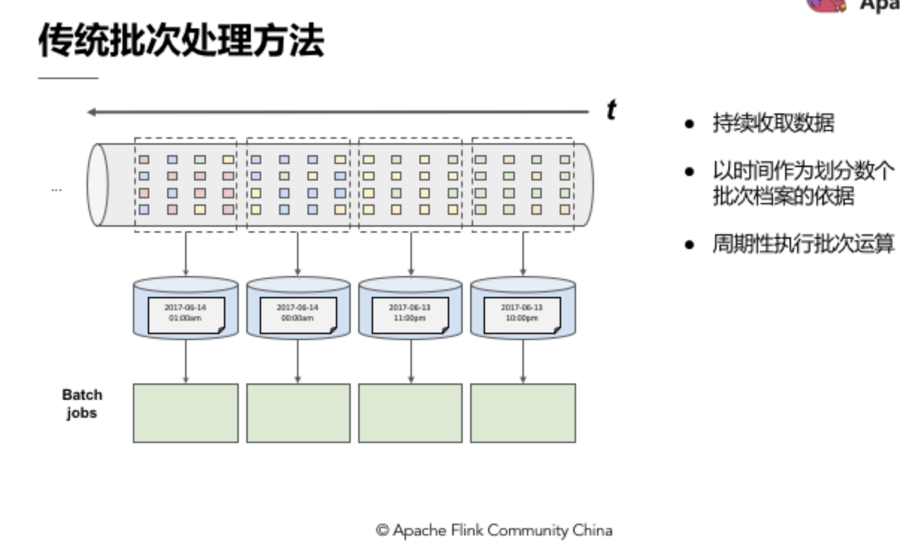
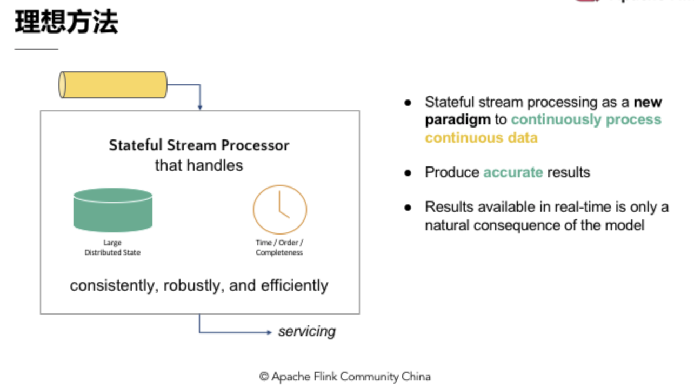
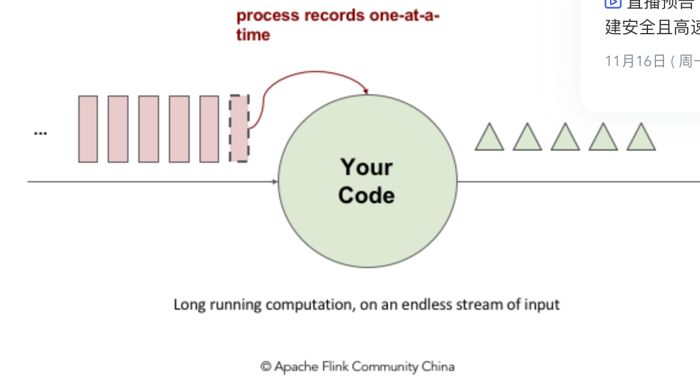
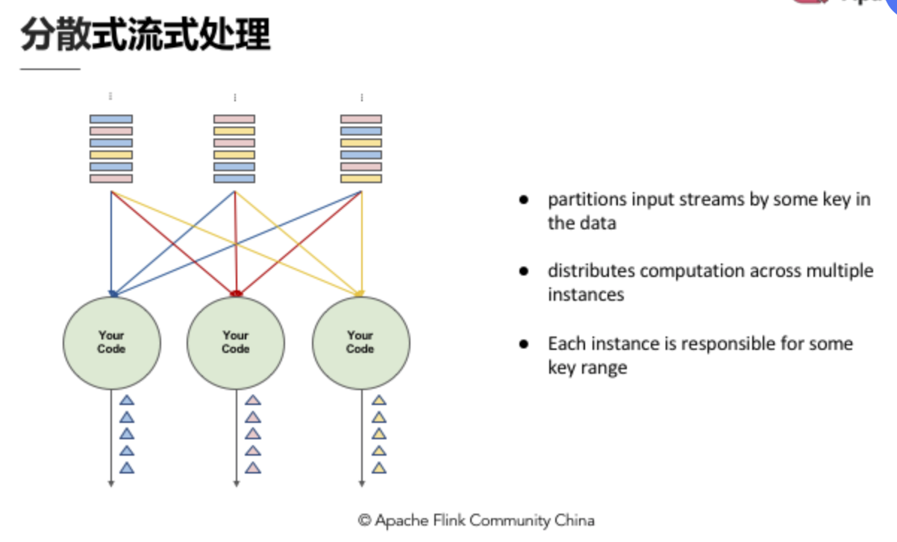
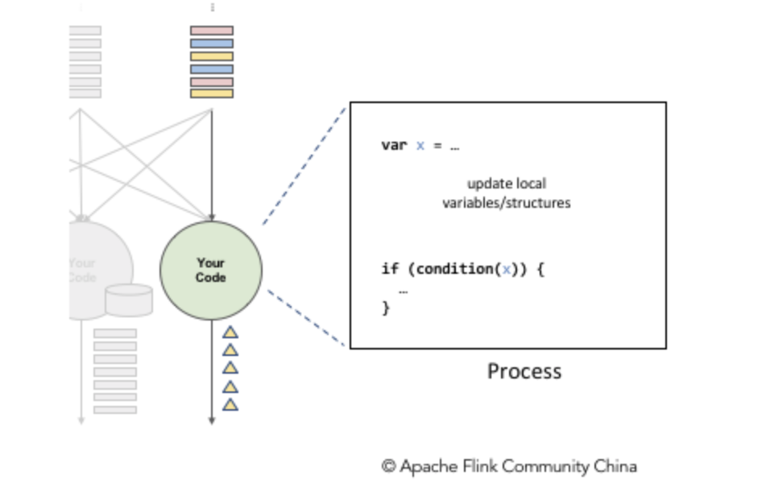
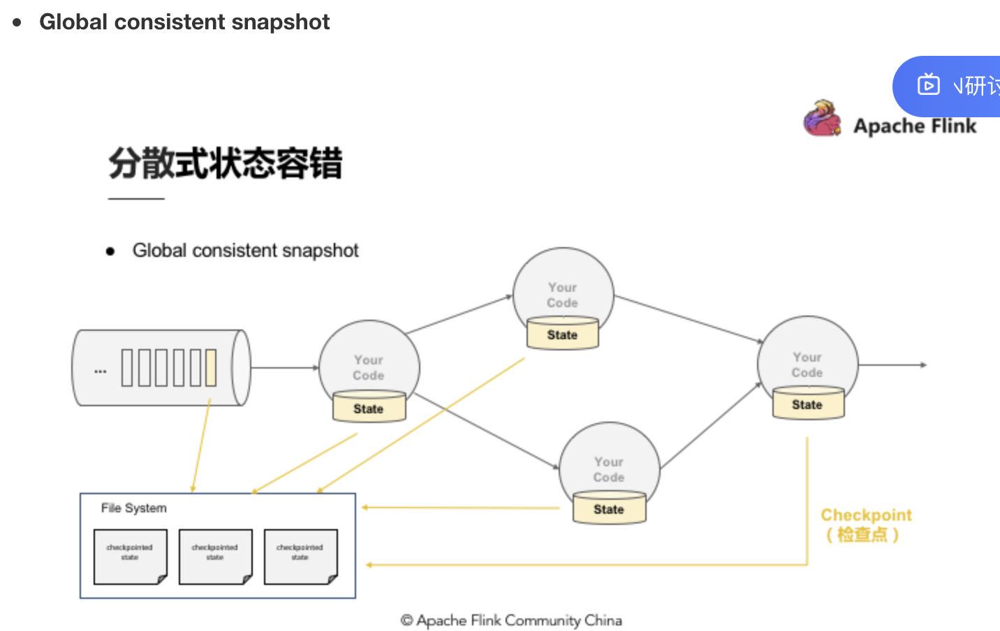
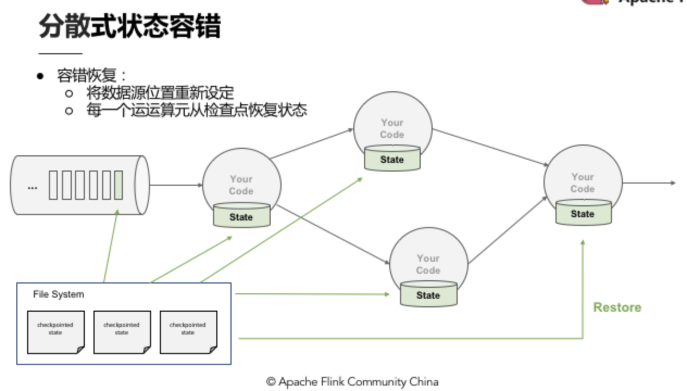
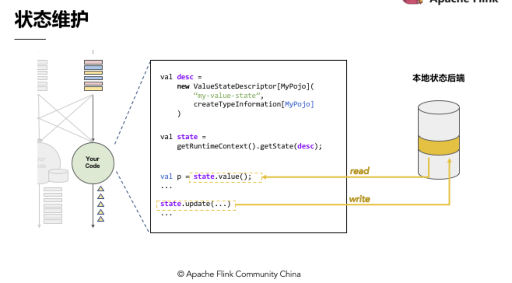
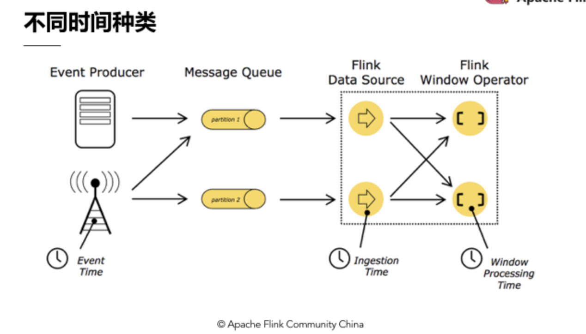

#### Flink 基本概念

主要涉及到的概念有：Streams、State、Time 等

* Stream: 流,分为有界(批)和无界数据流(数据随时间推演而增加)
* State: 计算过程中的数据信息，在容错恢复和Checkpoint 中有这重要的作用，流计算的本质是Increamental Processing，因此需要不断查询保持状态，为了保证Exactly-once 语义需要将数据写入到状态中，然后持久化到存储，可以做到当系统运行失败或者挂掉下做到Exactly-once
* Time: 提供三种时间，EventTime，Ingestion Time，Processing Time
* API： 三层API，上到下分为SQL/Table API、DataStream API、ProcessFunction，抽象能力增强，表达力减弱，灵活性减弱

---

### 有状态的流式处理理解

* 传统的处理方法

​	批处理是持续收取数据，以时间作为划分多个批次的依据，周期性跑批，例计算每个小时出现事件转换的次	 	数，如果事件跨了所定义的时间划分，传统会将中间运算结果带到下一个批计算；另外如果接受到的事件顺	  	序跌倒，传统批处理会将中介状态带到下一个批次中计算结果。

#### 理想方法

* 引擎可以累积状态和维护状态，累积状态代表着过去历史中接受过的所有事件，会影响到输出。
* 引擎对于数据的完整性有机制可以控制，当所有数据完全接受后，输出计算结果。
* 理想方法模型需要实时产生结果，引擎能够持续性数据处理模型来处理实时数据。

* 流式处理

  

  流式处理简单来说有一个无穷无尽的数据源在持续收取数据，以代码作为数据处理的基础逻辑，代码是长期执行的，数据源的数据经过代码处理后产生结果，然后输出，也就是来了数据开始处理，其他时间代码都在等数据。

  #### 分布式流式处理

  

  假设InputStream 有多个使用者，每个使用者都有自己的ID，如计算每个使用者出现的次数，我们就需要让同一个使用者的出现事件流到同一个运算带啊， ，这和其他批处理做groupby 的同样的概念，所以和Stream 一样需要做分区，设定相应的key，然后让统一的 key 流到同一个 computation instance 中做同样的计算

  #### 有状态的分布式流式处理

  

  变量x，经过一些更新处理之后，x 会和 key 绑定，作为 key 的状态，在处理过程中它是会存盘的。

  ---

### Flink 的优势

#### 状态容错

流式处理最关键的就是实现端到端的**Exactly-once** 精确一次的状态容错，应用在运算的时候累积的状态，每次的输入事件反应到状态，更改状态，如果修改超过一次的话也就意味着数据引擎产生的结果不可靠

所以：

* 如何保证状态拥有精确一次(exactly-once guarantee) 的容错保证
* 如何在分散场景下替多个拥有本地状态的运算算子产生一个全局一致的快照(Gloable consistent sanpshot)
* 如何在不中断运算的前提下产生快照

#### 简单场景的精确一次容错方法

将进来的数据和经过计算更新过的状态进行一次快照，快照包含在队列中并与相应的状态进行对比，完成一次快照，就能确保精确一次，如果下次还来这个数据，引擎是知道的，那么这次不去更新状态。

#### 分布式状态容错

在分布式创建下，进行多个本地状态的运算，只产生一个全局一致性的快照，如果在不中断运算值的前提下产生全局一直的快照，那就涉及到分散式状态容错

#### 容错恢复

Checkpoint每次将产生检查点时将他们传入到共享的DFS中，当任何一个Process 挂掉后，可以直接从三个完整的Checkpoint 将所有的运算值恢复，重新设定到相应位置，CheckPoint 的存在使整个Process 能够实现分散式环境中的Exactly-once

**checkpoint 的内容看相同目录下的另外一篇比较，更加详细**

---

#### 状态维护

状态维护就是一段代码在本地维护状态值，当状态值非常大的时候需要本地的状态后端来支持

Flink 有2中不同的状态值

* JVM Heap 状态后端，适合较小的状态，在内存中，不需要序列化
* RocksDB 状态后端，在Runtime 的本地状态后端使用者读取状态的时候都会经过磁盘，需要序列化，序列化后的数据，直接写到DFS 中

---

#### 时间语义

EventTime:  时间本身的时间

IngestionTime: 时间进入Flink 的时间

ProcessingTime: 时间处理时间

---

#### watermarks

使用wm实现Event-time 的功能，也是使用它来实现了乱序，数据延迟纠正等

