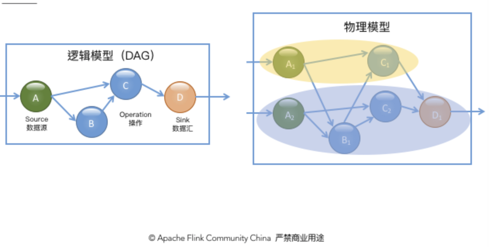
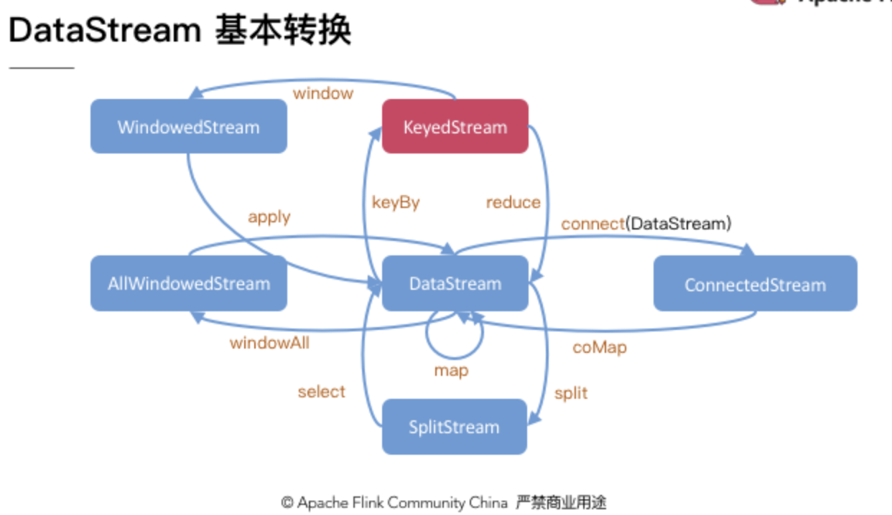
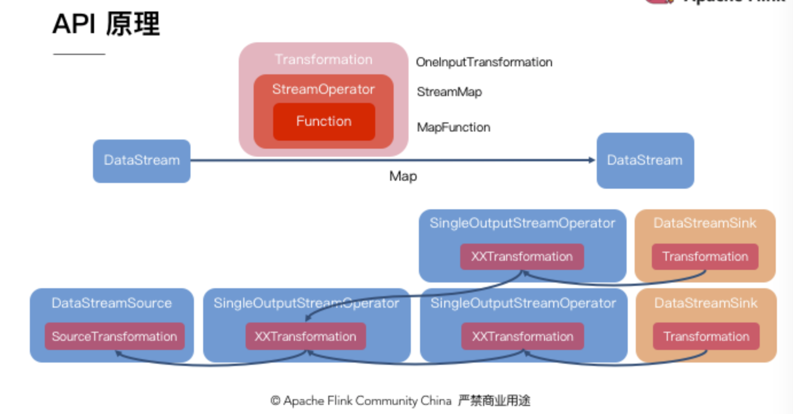

​		流处理系统本身有很多自己的特点。一般来说，由于需要支持无限数据集的处理，**流处理系统一般采用一种数据驱动的处理方式**。它会提前设置一些算子，然后等到数据到达后对数据进行处理。为了表达复杂的计算逻辑，包括 Flink 在内的分布式流处理引擎一般采用 DAG 图来表示整个计算逻辑，其中 DAG 图中的每一个点就代表一个基本的逻辑单元，也就是前面说的算子。由于计算逻辑被组织成有向图，数据会按照边的方向，从一些特殊的 Source 节点流入系统，然后通过网络传输、本地传输等不同的数据传输方式在算子之间进行发送和处理，最后会通过另外一些特殊的 Sink 节点将计算结果发送到某个外部系统或数据库中。

Apache Flink 的接口虽然也是在构建计算逻辑图，**但是 Flink 的 API 定义更加面向数据本身的处理逻辑，它把数据流抽象成为一个无限集，然后定义了一组集合上的操作**，然后在底层自动构建相应的 DAG 图，如代码示例 2 所示。可以看出，Flink 的 API 要更“上层”一些。许多研究者在进行实验时，可能会更喜欢自由度高的 Storm，因为它更容易保证实现预想的图结构；而在工业界则更喜欢 Flink 这类高级 API，因为它使用更加简单。

Flink DataStream API 的核心，就是代表流数据的 DataStream 对象。整个计算逻辑图的构建就是围绕调用 DataStream 对象上的不同操作产生新的 DataStream 对象展开的。整体来说，DataStream 上的操作可以分为四类。

* 第一类是对于**单条记录的操作**，比如筛除掉不符合要求的记录（Filter 操作），或者将每条记录都做一个转换（Map 操作）。
* 第二类是对**多条记录的操作**。比如说统计一个小时内的订单总成交量，就需要将一个小时内的所有订单记录的成交量加到一起。**为了支持这种类型的操作，就得通过 Window 将需要的记录关联到一起进行处理**。
* 第三类是对**多个流进行操作并转换为单个流**。例如，多个流可以通过 Union、Join 或 Connect 等操作合到一起。这些操作合并的逻辑不同，但是它们最终都会产生了一个新的统一的流，从而可以进行一些跨流的操作。最后， DataStream 还支持与合并对称的操作，即把一个流按一定规则拆分为多个流（Split 操作），每个流是之前流的一个子集，这样我们就可以对不同的流作不同的处理。

总结下就是：

* 单挑数据的操作
* 多条数据的操作
* 流的操作

---

#### 多重多样的DataStream

为了支持这些不同的流操作，Flink 引入了一组不同的流类型，用来表示某些操作的中间流数据集类型。完整的类型转换关系如图 4 所示。首先，对于一些针对单条记录的操作，如 Map 等，操作的结果仍然是是基本的 DataStream 类型。然后，对于 Split 操作，它会首先产生一个 SplitStream，基于 SplitStream 可以使用 Select 方法来筛选出符合要求的记录并再将得到一个基本的流。

类似的，对于 Connect 操作，在调用 streamA.connect(streamB)后可以得到一个专门的 ConnectedStream。ConnectedStream 支持的操作与普通的 DataStream 有所区别，由于它代表两个不同的流混合的结果，因此它允许用户对两个流中的记录分别指定不同的处理逻辑，然后它们的处理结果形成一个新的 DataStream 流。由于不同记录的处理是在同一个算子中进行的，因此它们在处理时可以方便的共享一些状态信息。上层的一些 Join 操作，在底层也是需要依赖于 Connect 操作来实现的。

另外，如前所述，我们可以通过 Window 操作对流可以按时间或者个数进行一些切分，从而将流切分成一个个较小的分组。具体的切分逻辑可以由用户进行选择。当一个分组中所有记录都到达后，用户可以拿到该分组中的所有记录，从而可以进行一些遍历或者累加操作。这样，对每个分组的处理都可以得到一组输出数据，这些输出数据形成了一个新的基本流。

对于普通的 DataStream，我们必须使用 allWindow 操作，它代表对整个流进行统一的 Window 处理，因此是不能使用多个算子实例进行同时计算的。针对这一问题，就需要我们首先使用 KeyBy 方法对记录按 Key 进行分组，然后才可以并行的对不同 Key 对应的记录进行单独的 Window 操作。**KeyBy 操作是我们日常编程中最重要的操作之一，下面我们会更详细的介绍。**

使用 KeyBy 进行数据切分之后，后续算子的每一个实例可以只处理特定 Key 集合对应的数据。除了处理本身外，Flink 中允许算子维护一部分状态（State），在 KeyedStream 算子的状态也是可以分布式存储的。由于 KeyBy 是一种确定的数据分配方式（下文将介绍其它分配方式），因此即使发生 Failover 作业重启，甚至发生了并发度的改变，Flink 都可以重新分配 Key 分组并保证处理某个 Key 的分组一定包含该 Key 的状态，从而保证一致性。

最后需要强调的是，**KeyBy 操作只有当 Key 的数量超过算子的并发实例数才可以较好的工作**。由于同一个 Key 对应的所有数据都会发送到同一个实例上，因此如果 Key 的数量比实例数量少时，就会导致部分实例收不到数据，从而导致计算能力不能充分发挥。

最后，我们对 DataStream API 的原理进行简要的介绍。当我们调用 DataStream#map 算法时，Flink 在底层会创建一个 Transformation 对象，这一对象就代表我们计算逻辑图中的节点。它其中就记录了我们传入的 MapFunction，也就是 UDF（User Define Function）。随着我们调用更多的方法，我们创建了更多的 DataStream 对象，每个对象在内部都有一个 Transformation 对象，这些对象根据计算依赖关系组成一个图结构，就是我们的计算图。后续 Flink 将对这个图结构进行进一步的转换，从而最终生成提交作业所需要的 JobGraph。

