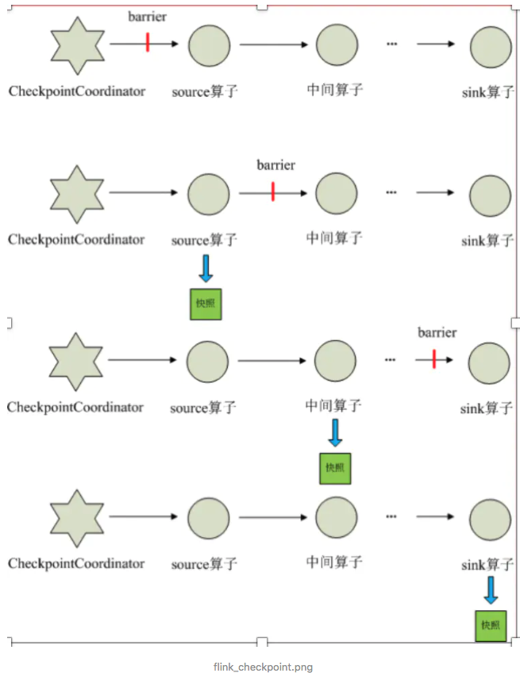
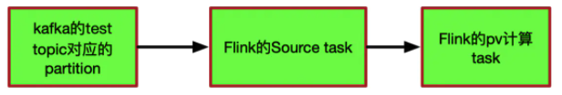
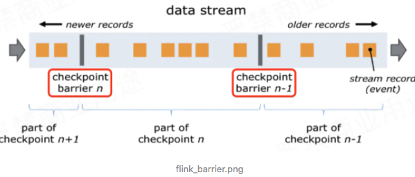
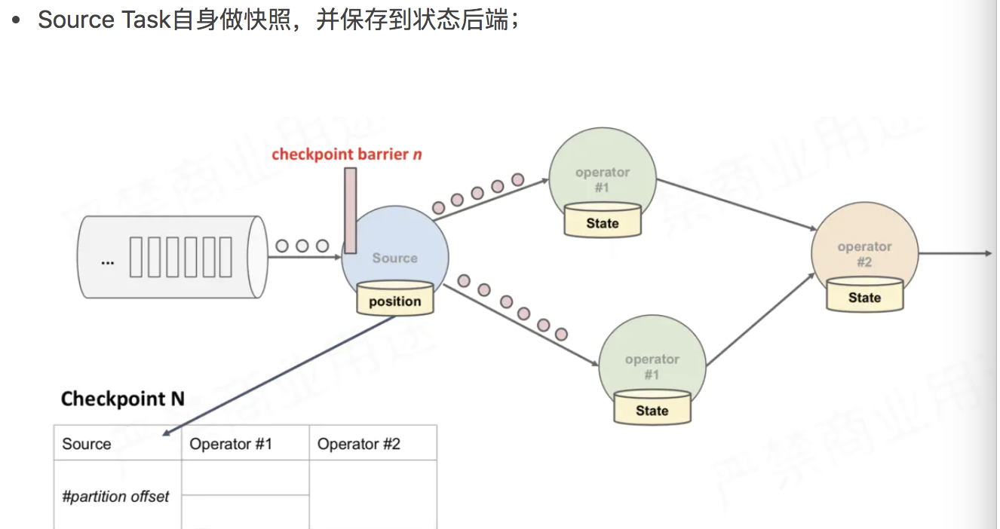
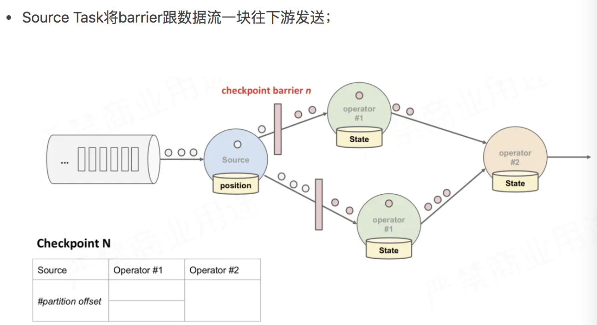
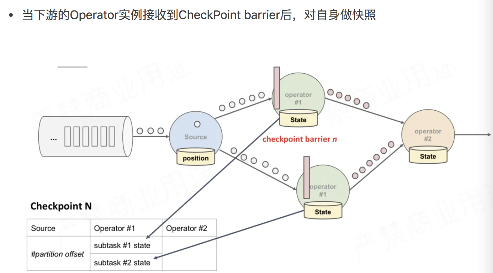
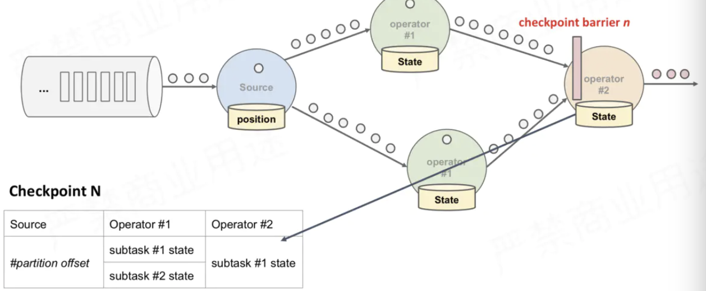
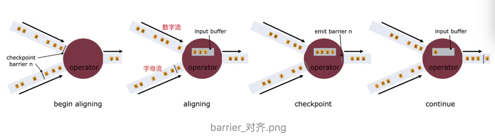
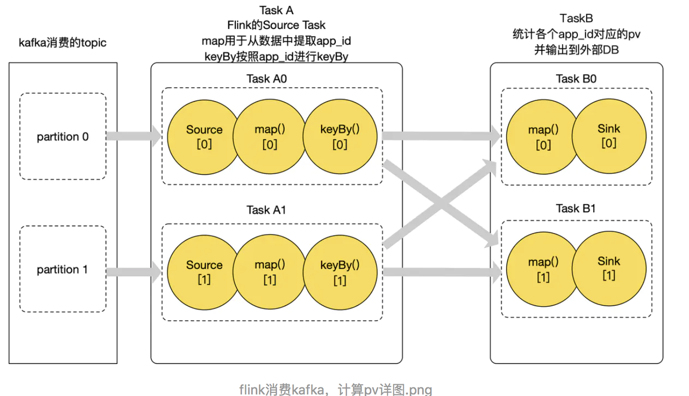

[参考](https://www.jianshu.com/p/4d31d6cddc99)

#### 三种语义

* At most once: 最多一次， 数据有可能丢失
* At least once: 至少一次：重复处理
* Exactly once: 精确一次：恰好正确处理一次

如果在整个Source-> transformation -> Sink 都实现 Exactly once， 那么就是End to End Exactly once

三者的实现难度：At most once < At least once < Exactly once < End to End Exactly once

Fink 正是能够做到 End to End Exactly once。

#### 如何理解Flink 中的state

* state泛指：flink 中有状态函数和运算符号在各个元素/事件的处理过程中存储的数据

#### 案例理解state

相对应的无状态是指数据进入Flink 后经过算子时要对当前数据进行处理就可以得到想要的结果，有状态计算就是需要和历史的一些状态或者进行相关操作，才能计算出正确的结果

有状态的计算是不符合**幂等性**的，相同输入，第一次输入和下次的输入结果总不会是一样的，因为存在中间状态，且状态是会被更新的。

#### 为什么需要 state 管理

流式作业是一直在运行的，数据不重复消费，不丢失，保证值计算依次，数据实时产生出不延迟，但是当状态很大，内存容量限制，如何保证状态正确的管理，在任务重新执行的时候能正确运行。

#### 理想的 state 管理

可靠，flink 对状态可以做持久化，保证 **exactly-once** 语义

#### flink 中的checkpoint 执行流程

checkpoint 是Flink 可靠性的基石，可以保证Flink 集群在某个算子因为某些原因出现故障，能够将整个应用的状态恢复到故障之前的某一个状态，保证应用流图状态的一致性，

每个需要checkpoint 应用启动时候，Flink 的JobManager 为其创建一个CheckpoitCoordinator，CheckpoitCoordinator 全权负责本应用的快照制作

1. CheckpointCoordinator 周期性的项流应用的所有source 算子发送barrier
2. 当source 算子收到一个 barrier 时候，便暂停数据处理过程，然后将自己的当前状态制作为快照，并保存到指定的持久化存储中，最后向 CheckpointCoordinator 报告，自己快照制作完成，同时将自身所有下游算子广播该 barrier，恢复数据处理
3. 下游算子收到 barrier 之后，会暂停自己的数据处理过程， 然后将自身的相关状态制作为快照，并保存到指定的持久化存储中，最后向 CheckpointCoordinator 报告自身快照情况，同时向自身下游算子广播 barrier，恢复数据处理
4. 每个算子安装步骤3，制作快照并向下游广播，知道最后 barrier 专递到 sink 算子，快照制作完成
5. 当 CheckpointCoordinator 收到所有算子的报告之后，认为该周期的快照制作成功，否则如果在规定的时间内没有收到所有算子的报告，则认为本周期快照制作失败

#### Checkpoint 中保存的是什么信息

几个问题：

* Checkpoint 具体做了哪些功能，为什么任务挂掉之后，通过Checkpoint能使得任务得到恢复
* Checkpoint 是通过给程序快照的方式使得将历史某些时刻的状态保存下来，当任务挂掉之后，默认从最近一次保存的完整快照处进行恢复任务，那么快照是什么？
* 快照里面保存的是什么信息 ？

##### flink 消费 wordcount 数据为例

从kafka 中消费一条条的日志，从日志中解析出 app_id，然后将结果放到内容中，key 为 app_id, value是对应的count。流程如下：

##### kafka topic 有且只有一个分区

* 消费kafka 的数据的时候，flink source task 记录了当前消费到 kafka topic 的所有的partition 的 offset，如(0,1000) 表示0号分区目前消费到 10000 的数据

* flink 的pv task 记录了当前计算的各 app 的 pv 值，为了方便讲，我么这里有2个app(app1, 50000),(app2, 10000)  表示当前 app1 的count 为50000，app2的count是10000 每来一条数据，只需要确定相应的 app_id, 将对应的值 +1 即可记录的其实就是第n次CheckPoint消费的offset信息和各app的pv值信息，记录一下发生CheckPoint当前的状态信息，并将该状态信息保存到相应的状态后端。

* 如: chk-100

  - offset：（0，1000）
  - pv：（app1，50000）（app2，10000）

  该状态信息表示第100次CheckPoint的时候， partition 0 offset消费到了1000，pv统计结果为（app1，50000）（app2，10000)

  
  
  任务挂了，如何恢复？
  
  假如我们设置了三分钟进行一次CheckPoint，保存了上述所说的 chk-100 的CheckPoint状态后，过了十秒钟，offset已经消费到 （0，1100），pv统计结果变成了（app1，50080）（app2，10020），但是突然任务挂了，怎么办？
   莫慌，其实很简单，flink只需要从最近一次成功的CheckPoint保存的offset（0，1000）处接着消费即可，当然pv值也要按照状态里的pv值（app1，50000）（app2，10000）进行累加，不能从（app1，50080）（app2，10020）处进行累加，因为 partition 0 offset消费到 1000时，pv统计结果为（app1，50000）（app2，10000）
  
  当然如果你想从offset （0，1100）pv（app1，50080）（app2，10020）这个状态恢复，也是做不到的，因为那个时刻程序突然挂了，这个状态根本没有保存下来。我们能做的最高效方式就是从最近一次成功的CheckPoint处恢复，也就是我一直所说的chk-100;
  
  
  
  **疑问**，计算pv的task在一直运行，它怎么知道什么时候去做这个快照？或者说计算pv的task怎么保障它自己计算的pv值（app1，50000）（app2，10000）就是offset（0，1000）那一刻的统计结果呢？
  
  
  
  flink是在数据中加了一个叫做barrier的东西（barrier中文翻译：栅栏），下图中红圈处就是两个barrier;
  
  
  
  对应到pv案例中就是，Source Task接收到JobManager的编号为chk-100的CheckPoint触发请求后，发现自己恰好接收到kafka offset（0，1000）处的数据，所以会往offset（0，1000）数据之后offset（0，1001）数据之前安插一个barrier，然后自己开始做快照，也就是将offset（0，1000）保存到状态后端chk-100中。然后barrier接着往下游发送，当统计pv的task接收到barrier后，也会暂停处理数据，将自己内存中保存的pv信息（app1，50000）（app2，10000）保存到状态后端chk-100中。OK，flink大概就是通过这个原理来保存快照的;
  
  
  
  统计pv的task接收到barrier，就意味着barrier之前的数据都处理了，所以说，不会出现丢数据的情况
  
  
  
  **barrier的作用就是为了把数据区分开，CheckPoint过程中有一个同步做快照的环节不能处理barrier之后的数据，为什么呢？**
  
  如果做快照的同时，也在处理数据，那么处理的数据可能会修改快照内容，所以先暂停处理数据，把内存中快照保存好后
  
  结合案例来讲就是，统计pv的task想对（app1，50000）（app2，10000）做快照，但是如果数据还在处理，可能快照还没保存下来，状态已经变成了（app1，50001）（app2，10001），快照就不准确了，就不能保障Exactly Once了;

#### 分布式下的快照制作

上述图中，有4个带状态的Operator实例，相应的状态后端就可以想象成填4个格子。整个CheckPoint 的过程可以当做Operator实例填自己格子的过程，Operator实例将自身的状态写到状态后端中相应的格子，当所有的格子填满可以简单的认为一次完整的CheckPoint做完了

上面只是快照的过程，整个CheckPoint执行过程如下

- 1、JobManager端的 CheckPointCoordinator向 所有SourceTask发送CheckPointTrigger，Source Task会在数据流中安插CheckPoint barrier
- 2、当task收到所有的barrier后，向自己的下游继续传递barrier，然后自身执行快照，并将自己的状态异步写入到持久化存储中。增量CheckPoint只是把最新的一部分更新写入到 外部存储；为了下游尽快做CheckPoint，所以会先发送barrier到下游，自身再同步进行快照
- 3、当task完成备份后，会将备份数据的地址（state handle）通知给JobManager的CheckPointCoordinator；
   如果CheckPoint的持续时长超过 了CheckPoint设定的超时时间，CheckPointCoordinator 还没有收集完所有的 State Handle，**CheckPointCoordinator就会认为本次CheckPoint失败，会把这次CheckPoint产生的所有 状态数据全部删除**
- 4、 最后 CheckPoint Coordinator 会把整个 StateHandle 封装成 completed CheckPoint Meta，写入到hdfs。

一旦Operator从输入流接收到CheckPoint barrier n，它就不能处理来自该流的任何数据记录，直到它从其他所有输入接收到barrier n为止。否则，它会混合属于快照n的记录和属于快照n + 1的记录；

接收到barrier n的流暂时被搁置。从这些流接收的记录不会被处理，而是放入输入缓冲区。

上图中第2个图，虽然数字流对应的barrier已经到达了，但是barrier之后的1、2、3这些数据只能放到buffer中，等待字母流的barrier到达；

一旦最后所有输入流都接收到barrier n，Operator就会把缓冲区中pending 的输出数据发出去，然后把CheckPoint barrier n接着往下游发送

这里还会对自身进行快照；
 之后，Operator将继续处理来自所有输入流的记录，在处理来自流的记录之前先处理来自输入缓冲区的记录。

#### 什么是barrier 不对其

- 上述图2中，当还有其他输入流的barrier还没有到达时，会把已到达的barrier之后的数据1、2、3搁置在缓冲区，等待其他流的barrier到达后才能处理

- barrier不对齐就是指当还有其他流的barrier还没到达时，为了不影响性能，也不用理会，直接处理barrier之后的数据。等到所有流的barrier的都到达后，就可以对该Operator做CheckPoint了；

#### 为什么要进行barrier对齐？不对齐到底行不行？

Exactly Once时必须barrier对齐，如果barrier不对齐就变成了At Least Once；

结合pv案例来看，讲述barrier对齐，所以topic有2个partittion；

Source的kafka的Consumer，从kakfa中读取数据到flink应用中
 TaskA中的map将读取到的一条kafka日志转换为我们需要统计的app_id
 keyBy 按照app_id进行keyBy，相同的app_id 会分到下游TaskB的同一个实例中
 TaskB的map在状态中查出该app_id 对应的pv值，然后+1，存储到状态中
 利用Sink将统计的pv值写入到外部存储介质中；

我们从kafka的两个partition消费数据，TaskA和TaskB都有两个并行度，所以总共flink有4个Operator实例，这里我们称之为 TaskA0、TaskA1、TaskB0、TaskB1；

假设已经成功做了99次CheckPoint，这里详细解释第100次CheckPoint过程；

JobManager内部有个定时调度，假如现在10点00分00秒到了第100次CheckPoint的时间了，JobManager的CheckPointCoordinator进程会向所有的Source Task发送CheckPointTrigger，也就是向TaskA0、TaskA1发送CheckPointTrigger。

TaskA0、TaskA1接收到CheckPointTrigger，会往数据流中安插barrier，将barrier发送到下游，在自己的状态中记录barrier安插的offset位置，然后自身做快照，将offset信息保存到状态后端。

这里假如TaskA0消费的partition0的offset为10000，TaskA1消费的partition1的offset为10005。那么状态中会保存 (0，10000)(1，10005)，表示0号partition消费到了offset为10000的位置，1号partition消费到了offset为10005的位置；

然后TaskA的map和keyBy算子中并没有状态，所以不需要进行快照
 接着数据和barrier都向下游TaskB发送，相同的app_id 会发送到相同的TaskB实例上，这里假设有两个app：app0和app1，经过keyBy后，假设app0分到了TaskB0上，app1分到了TaskB1上。基于上面描述，TaskA0和TaskA1中的所有app0的数据都发送到TaskB0上，所有app1的数据都发送到TaskB1上

现在我们假设TaskB0做CheckPoint的时候barrier对齐了，TaskB1做CheckPoint的时候barrier不对齐，带大家分析一下barrier对不对齐到底对统计结果有什么影响？

上面说了chk-100的这次CheckPoint，offset位置为(0，10000)(1，10005)，TaskB0使用barrier对齐，也就是说TaskB0不会处理barrier之后的数据，所以TaskB0在chk-100快照的时候，状态后端保存的app0的pv数据是从程序开始启动到kafka offset位置为(0，10000)(1，10005)的所有数据计算出来的pv值，一条不多（没处理barrier之后，所以不会重复），一条不少(barrier之前的所有数据都处理了，所以不会丢失)，假如保存的状态信息为(app0，8000)表示消费到(0，10000)(1，10005)offset的时候，app0的pv值为8000

TaskB1使用的barrier不对齐，假如TaskA0由于服务器的CPU或者网络等其他波动，导致TaskA0处理数据较慢，而TaskA1很稳定，所以处理数据比较快。导致的结果就是TaskB1先接收到了TaskA1的barrier，由于配置的barrier不对齐，所以TaskB1会接着处理TaskA1 barrier之后的数据，过了2秒后，TaskB1接收到了TaskA0的barrier，于是对状态中存储的app1的pv值开始做CheckPoint 快照，保存的状态信息为(app1，12050)，但是我们知道这个(app1，12050)实际上多处理了2秒TaskA1发来的barrier之后的数据，也就是kafka topic对应的partition1 offset 10005之后的数据，app1真实的pv数据肯定要小于这个12050，partition1的offset保存的offset虽然是10005，但是我们实际上可能已经处理到了offset 10200的数据，假设就是处理到了10200；

分析到这里，我们先梳理一下我们的状态保存了什么：

chk-100

- offset：(0，10000)(1，10005)
- pv：(app0，8000) (app1，12050)

接着程序在继续运行，过了10秒，由于某个服务器挂了，导致我们的四个Operator实例有一个Operator挂了，所以Flink会从最近一次的状态恢复，也就是我们刚刚详细讲的chk-100处恢复，那具体是怎么恢复的呢？

Flink 同样会起四个Operator实例，我还称他们是 TaskA0、TaskA1、TaskB0、TaskB1。四个Operator会从状态后端读取保存的状态信息。

从offset：(0，10000)(1，10005)  开始消费，并且基于 pv：(app0，8000) (app1，12050)值进行累加统计

然后你就应该会发现这个app1的pv值12050实际上已经包含了partition1的offset 10005~10200的数据，所以partition1从offset 10005恢复任务时，partition1的offset 10005~10200的数据被消费了两次

TaskB1设置的barrier不对齐，所以CheckPoint chk-100对应的状态中多消费了barrier之后的一些数据（TaskA1发送），重启后是从chk-100保存的offset恢复，这就是所说的At Least Once

由于上面说TaskB0设置的barrier对齐，所以app0不会出现重复消费，因为app0没有消费offset：(0，10000)(1，10005) 之后的数据，也就是所谓的Exactly Once；

**看到这里你应该已经知道了哪种情况会出现重复消费了，也应该要掌握为什么barrier对齐就是Exactly Once，为什么barrier不对齐就是 At Least Once**

#### 分析了这么多，这里我再补充一个问题，到底什么时候会出现barrier对齐？

首先设置了Flink的CheckPoint语义是：Exactly Once

Operator实例必须有多个输入流才会出现barrier对齐

- 对齐，汉语词汇，释义为使两个以上事物配合或接触得整齐。由汉语解释可得对齐肯定需要两个以上事物，所以，必须有多个流才叫对齐。barrier对齐其实也就是上游多个流配合使得数据对齐的过程；
- 言外之意：如果Operator实例只有一个输入流，就根本不存在barrier对齐，自己跟自己默认永远都是对齐的；

---

文章最后有几个比较好的问题：

* 第一种场景计算PV，kafka只有一个partition，精确一次，至少一次就没有区别？

> 如果只有一个partition，对应flink任务的Source Task并行度只能是1，确实没有区别，不会有至少一次的存在了，肯定是精确一次。因为只有barrier不对齐才会有可能重复处理，这里并行度都已经为1，默认就是对齐的，**只有当上游有多个并行度的时候，多个并行度发到下游的barrier才需要对齐**，单并行度不会出现barrier不对齐，所以必然精确一次。其实还是要理解barrier对齐就是Exactly Once不会重复消费，barrier不对齐就是 At Least Once可能重复消费，这里只有单个并行度根本不会存在barrier不对齐，所以不会存在至少一次语义；

为了下游尽快做CheckPoint，所以会先发送barrier到下游，自身再同步进行快照；这一步，如果向下发送barrier后，自己同步快照慢怎么办？下游已经同步好了，自己还没？

> **可能会出现下游比上游快照还早的情况，但是这不影响快照结果，只是下游快照的更及时了**，我**只要保障下游把barrier之前的数据都处理了，并且不处理barrier之后的数据，然后做快照**，那么下游也同样支持精确一次。这个问题你不要从全局思考，你单独思考上游和下游的实例，你会发现上下游的状态都是准确的，既没有丢，也没有重复计算。这里需要注意一点，如果有一个Operator 的CheckPoint失败了或者因为CheckPoint超时也会导致失败，那么JobManager会认为整个CheckPoint失败。失败的CheckPoint是不能用来恢复任务的，必须所有的算子的CheckPoint都成功，那么这次CheckPoint才能认为是成功的，才能用来恢复任

我程序中Flink的CheckPoint语义设置了 Exactly Once，但是我的mysql中看到数据重复了？程序中设置了1分钟1次CheckPoint，但是5秒向mysql写一次数据，并commit；

> Flink要求end to end的精确一次都必须实现TwoPhaseCommitSinkFunction。如果你的chk-100成功了，过了30秒，由于5秒commit一次，所以实际上已经写入了6批数据进入mysql，但是突然程序挂了，从chk100处恢复，这样的话，之前提交的6批数据就会重复写入，所以出现了重复消费。Flink的精确一次有两种情况，一个是Flink内部的精确一次，一个是端对端的精确一次，**这个博客所描述的都是关于Flink内部去的精确一次**

