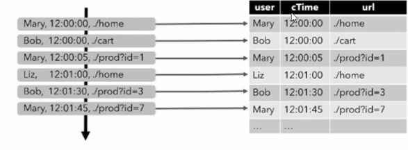
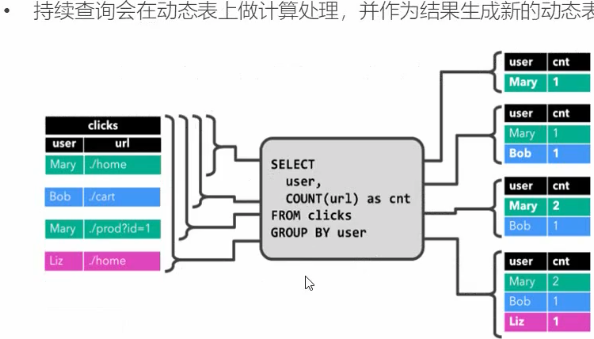

* 声明式，用户只关心做什么，不用关心怎么做
* 高性能，支持查询优化，可以获得更好的执行性能
* 流批统一，相同的统计逻辑，既可以流模式运行，也可以批模式运行
* 标准稳定，语义遵循 SQL 标准，不易变动
* 易理解，语义明确，所见即所得

#### 核心概念

##### 动态表/无界表

>  **Flink 对流数据的Table API 和 SQL 支持的核心概念， 每来一条数据都将当前的已有的数据当做是一个批数据，然后在这批数据中进行SQL 查询，然后生成另外一张表，所谓动态表就是每一次查询(新来一条数据触发一次查询)生成一张新的表**。
>
> 动态表示随着时间变化的，严格来说是随着数据的到来而发生变化的
>
> Flink 中的数据是时刻发生变化的。
>
> Flink SQL 是每来一条数据就会去执行一次，也是事件触发的
>
> 在Flink 调用代码 `env.execute()` 这个时候Flink 代码是启动了，但是并不是数据处理就开始执行了，而是将任务跑起来等待在哪里，当一旦有数据进来，那么才开始执行逻辑，没有数据，就不会执行逻辑。

##### 连续查询/借助state

>  **持续查询(Continuous Query)** 和动态表是紧紧关联的，得到的查询结果也是不断变化的。
>
> 连续查询永远不会终止，并会生成另一个动态表，查询会不断更新其动态结果表，以反映其动态输入表上的更改。

为了处理带有关系查询的流，必须先将其转换为表

从概念上来将，流的每个数据记录，都被解释为对结果表的插入修改操作

持续查询

#### 结果更新的几种方式

> 将表转换为DataStream 或者 DataSet 时， 需要制定生产的数据类型，即要将表的每一行转换成的数据类型
>
> 表作为流式查询结果，是动态更新的
>
> 转换有2中模式，追加和撤回

##### 追加(Append)模式

表只做**插入**操作，和外部连接器只交换插入(insert)消息，和外部系统只交换一种信息，那就是插入信息，也就是只会对外部数据只做追加操做。而对于一些如计数操作，新来一个数据之后，需要对已存在数据进行计数更新操作，这个时候就会用到撤回模式。

##### 撤回模式

撤回(Retract)模式: 表和外部连接器交换添加(Add)和撤回(Retract)消息，对外部数据会发出添加和撤回消息，撤回之前的消息，然后插入新的消息，add消息，会给一个数据中带着true的标志,  Retract 消息,给一个数据中带着 false 的标志，更新编码为上一条Retract 和下一条 Add 消息. 2条数据表示添加一条数据，**也就是更新一次会发2条消息，2条消息代表一条数据的更新**

##### 更新模式

更新(Upsert) 模式，这里和撤回模式有点类似，会给每个数据中带着一个 key 的标志，当和外部系统交互的时候，发现这个key 还没有，那么就将这条数据插入，如果有，那么就将key 对应的这个数据更新，替换为新来的数据，**这个时候，更新一个消息，也只是给外部系统发送一个消息，性能会由于撤回模式**

***所以在使用Sink 的时候看哈其Source 中的接口是否实现了这个对应的模式的接口，如果实现，则表示可以支持该功能，否则不支持***

