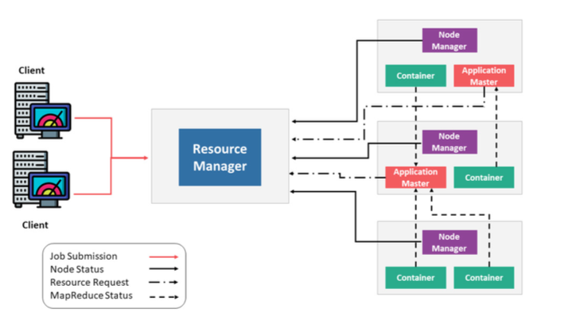
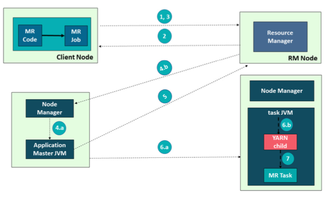
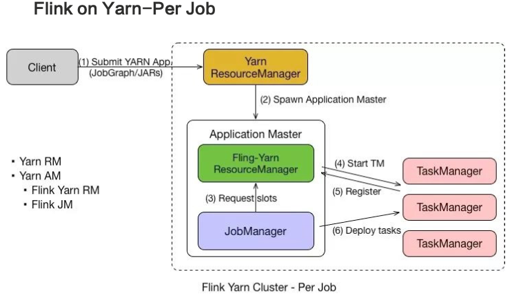
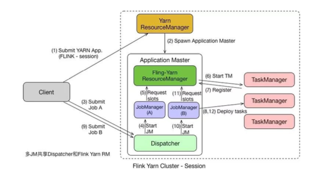
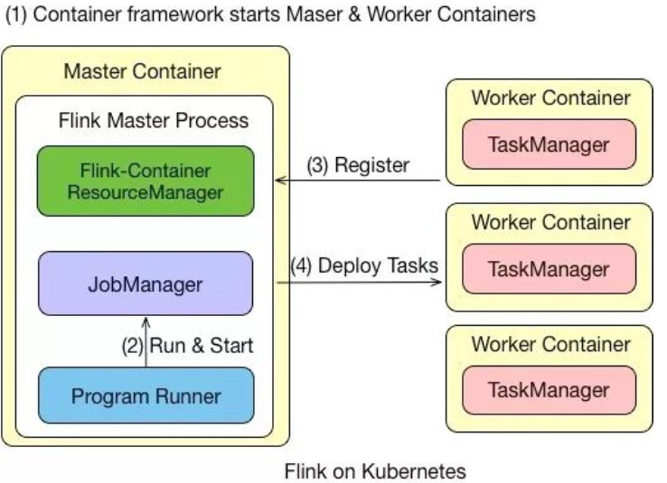

Yarn 的架构原理如上图所示，最重要的角色是 ResourceManager，主要用来 负责整个资源的管理，Client 端是负责向 ResourceManager 提交任务。

用户在 Client 端提交任务后会先给到 Resource Manager。Resource Man- ager 会启动 Container，接着进一步启动 Application Master，即对 Master 节点 的启动。当 Master 节点启动之后，会向 Resource Manager 再重新申请资源，当 Resource Manager 将资源分配给 Application Master 之后，Application Master 再将具体的 Task 调度起来去执行。

Yarn 集群中的组件包括:

- ResourceManager (RM):ResourceManager (RM) 负 责 处 理 客 户 端 请 求、启动 / 监控 ApplicationMaster、监控 NodeManager、资源的分配与调 度，包含 Scheduler 和 Applications Manager。
- ApplicationMaster (AM):ApplicationMaster (AM) 运行在 Slave 上，负责数据切分、申请资源和分配(AM先启动之后向RM申请运行task的资源)、任务监控和容错。
-   NodeManager (NM):NodeManager (NM) 运 行 在 Slave 上， 用 于 单 节 点资源管理、AM/RM 通信以及汇报状态。
- Container:Container 负责对资源进行抽象，包括内存、CPU、磁盘，网络 等资源。

Yarn 架构原理 - 交互

- 首先，用户编写 MapReduce 代码后，通过 Client 端进行任务提交。

- ResourceManager 在接收到客户端的请求后，会分配一个 Container 用来 启动 ApplicationMaster，并通知 NodeManager 在这个 Container 下启动

  ApplicationMaster。

-  ApplicationMaster 启 动 后， 向 ResourceManager 发 起 注 册 请 求。 接 着

  ApplicationMaster 向 ResourceManager 申请资源。根据获取到的资源，

  和相关的 NodeManager 通信，要求其启动程序。

- 一个或者多个 NodeManager 启动 Map/Reduce Task。

- NodeManager 不 断 汇 报 Map/Reduce Task 状 态 和 进 展 给 Application-

  Master。

- 当所有 Map/Reduce Task 都完成时，ApplicationMaster 向 ResourceM-

  anager 汇报任务完成，并注销自己。

Yarn 模式特点

●  资源的统一管理和调度。Yarn 集群中所有节点的资源(内存、CPU、磁 盘、网络等)被抽象为 Container。计算框架需要资源进行运算任务时需要 向 Resource Manager 申请 Container，Yarn 按照特定的策略对资源进行 调度和进行 Container 的分配。Yarn 模式能通过多种任务调度策略来利用 提高集群资源利用率。例如 FIFO Scheduler、Capacity Scheduler、Fair Scheduler，并能设置任务优先级。

- 资源隔离。Yarn 使用了轻量级资源隔离机制 Cgroups 进行资源隔离以避免相 互干扰，一旦 Container 使用的资源量超过事先定义的上限值，就将其杀死。

- 自 动 failover 处 理。 例 如 Yarn NodeManager 监 控、Yarn Application-

  Manager 异常恢复。

1. Yarn 模式虽然有不少优点，但是也有诸多缺点，例如运维部署成本较高，灵活 性不够。

Flink on Yarn 中的 Per Job 模式是指每次提交一个任务，然后任务运行完成之 后资源就会被释放。在了解了 Yarn 的原理之后，Per Job 的流程也就比较容易理解 了，具体如下:

- 首先 Client 提交 Yarn App，比如 JobGraph 或者 JARs。

- 接下来Yarn 的ResourceManager 会申请第一个Container。这个 Container 通过 Application Master 启动进程，Application Master 里面运

  行的是 Flink 程序，即 Flink-Yarn ResourceManager 和 JobManager。

- 最 后 Flink-Yarn ResourceManager 向 Yarn ResourceManager 申 请 资 源。当分配到资源后，启动 TaskManager。TaskManager 启动后向 Flink- Yarn ResourceManager 进行注册，注册成功后 JobManager 就会分配具体的任务给 TaskManager 开始执行。

Flink on Yarn-Session

在 Per Job 模式中，执行完任务后整个资源就会释放，包括 JobManager、 TaskManager 都全部退出。而 Session 模式则不一样，它的 Dispatcher 和 Resource- Manager 是可以复用的。Session 模式下，当 Dispatcher 在收到请求之后，会 启动 JobManager(A)，让 JobManager(A) 来完成启动 TaskManager，接着会 启动 JobManager(B) 和对应的 TaskManager 的运行。当 A、B 任务运行完成 后，资源并不会释放。Session 模式也称为多线程模式，其特点是资源会一直存在 不会释放，多个 JobManager 共享一个 Dispatcher，而且还共享 Flink-YARN ResourceManager。

Session 模式和 Per Job 模式的应用场景不一样。Per Job 模式比较适合那种 对启动时间不敏感，运行时间较长的任务。**Seesion 模式适合短时间运行的任务，一 般是批处理任务。若用 Per Job 模式去运行长时间的任务**，那就需要频繁的申请资 源，运行结束后，还需要资源释放，下次还需再重新申请资源才能运行。显然，这种 任务会频繁启停的情况不适用于 Per Job 模式，更适合用 Session 模式。

----

Flink on Kubernetes 原理剖析

​	Kubernetes 是 Google 开源的容器集群管理系统，其提供应用部署、维 护、扩展机制等功能，利用 Kubernetes 能方便地管理跨机器运行容器化的应用。 Kubernetes 和 Yarn 相比，相当于下一代的资源管理系统，但是它的能力远远不止 这些。

Kubernetes- 基本概念

- 首先往 Kubernetes 集群提交了资源描述文件后，会启动 Master 和 Worker 的 container。
- Master Container 中会启动 Flink Master Process，包含 Flink-Container ResourceManager、JobManager 和 Program Runner。
- Worker Container 会启动 TaskManager，并向负责资源管理的 Re- sourceManager 进行注册，注册完成之后，由 JobManager 将具体的任务 分给 Container，再由 Container 去执行。
- 需要说明的是，在 Flink 里的 Master 和 Worker 都是一个镜像，只是脚本的命令不一样，通过参数来选择启动 master 还是启动 Worker。

