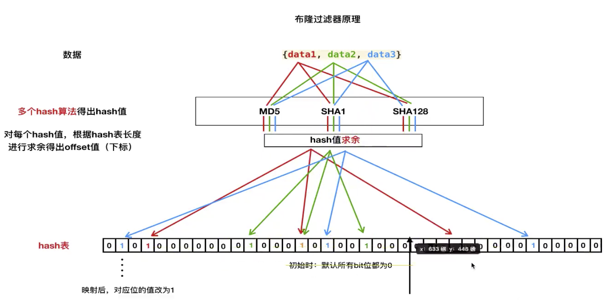
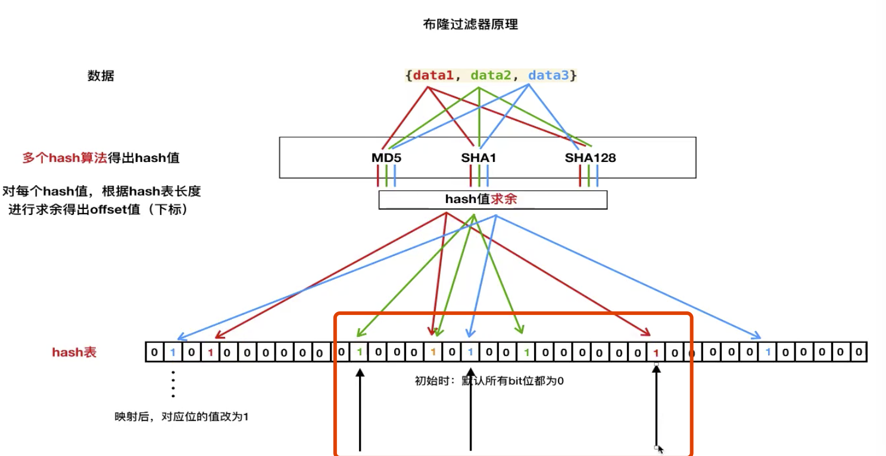
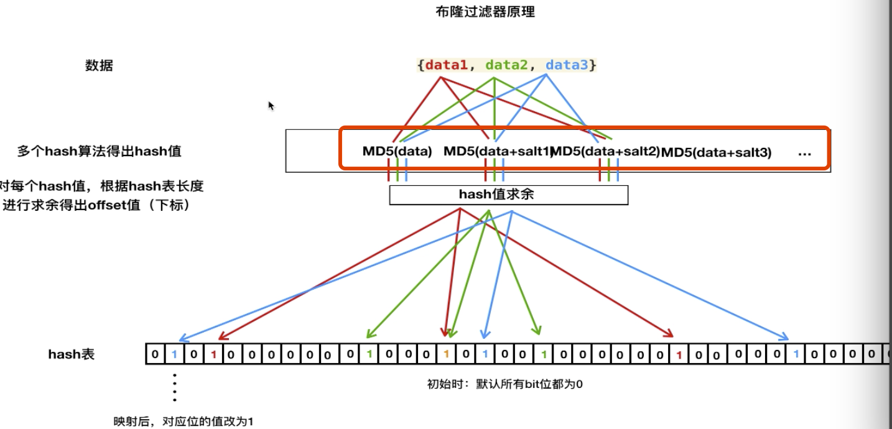

* 使用场景

  > 海量数据去重中使用

* 简单实现原理

  > 需要依赖两个东西
  >
  > * 多个哈希算法
  >
  > * hash 表，单位都是bit(比特位)
  >
  >   > 如256M 的哈希表，所占用的bit 长度为 256 * 1024 * 1024 * 8 = 21亿
  >
  > **计算(映射)**
  >
  > > 
  > >
  > > 如上是 data1这个数据
  > >
  > > 1. 先使用三个哈希函数进行哈希隐射，并转换为10进制数值，然后使用这个数值对哈希表的长度进行求余，然后得到data1在这个哈希表中的一个位置，然后对这个位置置为1(初始化都为1)，如上三个红线所指向的位置都为1，这三个位置为1的时候，就表示data1这个数据存在
  > > 2. 其余的data2和data3都是一样的
  > >
  > > 当有一个新的数据来的时候进行如上的计算，如果计算到的位置中但凡有一个位置是0值表示新来的数据是不存在的。
  > >
  > > 
  > >
  > > 当然当出现如上图的时候，计算得到3个结果都是1，但是这3个1是来自于不同的数据数据计算得到的，那么这个时候就出现了**误判**
  > >
  > > 使用布隆过滤器这个误判是不能够避免的，但是可以减少误判的概率，但是256M的长度哈希表的长度就是21亿，而且使用3个哈希函数，出现误判的几率是相当低的，如果512M呢，使用7个哈希函数呢，这样就可以降低误判的几率，如果对数据的重复性要求并不是那么的极致哟求，使用布隆过滤器还是非常高效的。

* 误判的缺点

* 降低误判的几率

  > * 多个哈希函数
  >
  > * 长哈希表
  >
  > * 给值加盐(每个哈希函数的盐需要相同)
  >
  >   
  >
  >   