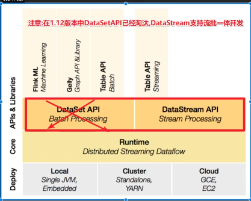
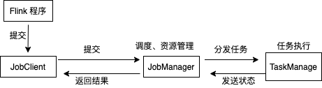

#### Flink 组件栈



---

### Flink 安装部署

#### local 模式

> 本地多线程模拟、Flink 中的各个角色
>
> 
>
> 

#### standalone 独立及其模式

学习测试时候使用

* 启动 hadoop

  > 环境变量已经设置，珍惜
  >
  > start-dfs.sh
  >
  > start-yarn.sh

* 启动 flink

  > ./start-cluster.sh
  >
  > 集群模式启动

* 一个简单的例子

  > ./bin/flink run examples/batch/WordCount.jar 会将结果展示到terminal 中

* 停止集群

  > ./bin/stop-cluster.sh

#### standalone HA 高可用

#### Flink-on-yarn

* 关闭yarn的内存检查

* 启动一个 flink-session

  > /export/server/flink/bin/yarn-session.sh -n 2 -tm 800 -s 1 -d
  >
  >  Yarn 可以看到 flink-session 的任务
  >
  > 说明:
  >
  > 申请2个CPU、1600M内存
  >
  > \# -n 表示申请2个容器，这里指的就是多少个taskmanager
  >
  > \# -tm 表示每个TaskManager的内存大小
  >
  > \# -s 表示每个TaskManager的slots数量
  >
  > \# -d 表示以后台程序方式运行
  >
  > 然后去提交一个 wc
  >
  > ./bin/flink run examples/batch/WordCount.jar 

* 关闭 flink-session

  > yarn application -kill application_1613115501911_0002

* 提交一个 flik-perjob

  > ./bin/flink run -m yarn-cluster -yjm 1024 -ytm 1024 examples/batch/WordCount.jar 

#### 提交任务时候的参数

> ./bin/flink --help

提交任务

> ```scala
> /bin/flink run -Dexecution.runtime-mode=BATCH -m yarn-cluster -yjm 1024 -ytm 1024 -c wordcount.DataStreamWordCountHdfs examples/batch/WordCount.jar
> --output hdfs://node1:8020/wordcount/output_xx
> 
> ./bin/flink run -Dexecution.runtime-mode=BATCH -m yarn-cluster -yjm 1024 -ytm 1024 -c wordcount.DataStreamWordCountHdfs /original-flink_learn-1.0-SNAPSHOT.jar
> 
> ./bin/flink run -Dexecution.runtime-mode=BATCH -m yarn-cluster -yjm 1024 -ytm 1024 examples/batch/WordCount.jar
> 
> ```

* 过程中执行的动作

> StreamGraph(流程化，最初的算子前后的顺序)
>
> JobGraph: 流程优化合并，OperatorChain
>
> ExecutionGraph: 根据算子的并行度和请求的资源，进行并行化规划，在JobMananger上形成规划
>
> 物理执行图：将任务分配给具体的TaskSlot，落实执行线程化

---

#### Flink 流批一体化API

dataset 会在未来被弃用，后面datastream api 支持流批一体

* 流

> unbounded stream， 无界流，源源不断来的数据，流数据
>
> bounded stream： 有边界流，批数据

* 流批计算的不同

> * 数据的时效性不同
>   * 流：实时、低延时
>   * 批：非实时、高延迟
> * 数据特征不同
>   * 流：动态的、没有边界
>   * 批：静态数据
> * 应用场景不同
>   * 流：实时场景，时效性要求高，如推荐，业务监控
>   * 批：离线计算，数据分析、离线报表等
> * 运行方式不同
>   * 流：任务是持续进行的
>   * 批：一次性完成的

