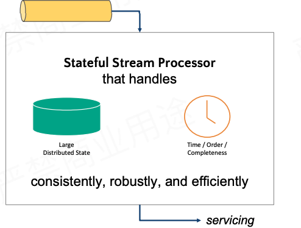
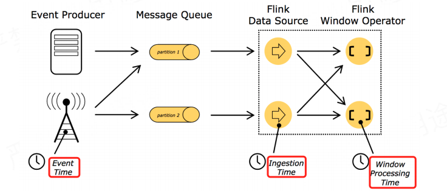
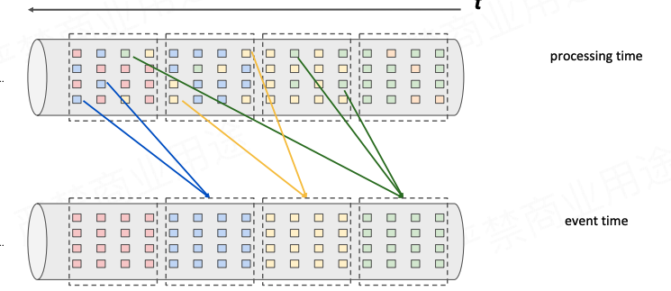

#### 传统批次处理方法

接受的数据是一直在产生，首选会有一个 `queue` 在持续不断的收集这些持续不断产生的数据，在还没有流式处理之前通常是如何处理这些不断的收集到的数据！

普通的方式就是以时间为划分将不断的数据进行切分，切分为一个离散的`批次数据`,比如说从1点到2点收集到的数据为一个批，2点到3点的数据作为一个批，这样就得到了一批一批的数据，然后使用批计算引擎，如`spark` 等去计算这批数据。

**但是实际上，很简单的一个使用场景就发现这个模式是处理不了的。**

比如说我在统计 `wordcount`， 一个单词`a` 在1点到2点的批中出现了2次，在2到4点的批中出现了3次，那么在4点的时候输出的`a` 的频率是3而不是 2+3=5，当然这个问题也是比较好简单的解决的，就是将1点到2点这个时间段的统计，保留在下一个时间中，然后在下一个时间段批数据中进行累加。

当然这个是可以解决上面的问题的。

可是上面的问题是一个比较简单的问题，如果出现更加复杂的问题呢？ 如数据发生了乱序，比如本来在2点到4点出现的单词，突然出现在了点到1点到2点，也就是数据的发生时间/次序发生的乱序。

**这个时候问题就变得更加复杂了**

所以使用批去处理持续发生的数据是非常不符合状态本身的特质。

那么什么是符合的呢？

----

#### 理想方法

回答什么样的方法符合上面持续发生/产生数据的计算呢！

我们需要一个持续执行的过程，这个过程会持续去拉取持续收集到的数据，在处理这些数据的时候，这个持续运行的过程应该具备持续累积数据状态的能力，这个累积的状态能够反映过去历史中所有所收过的数据，也就是这个状态代表过去收集到的数据。

累积的状态也会影响收到的数据经过处理而得到的结果。也就是这个过程每处理一个数据，状态就发生变化，然后得到这个数据的结果，那么接着在来一个数据，这个数据也会去更新状态，然后得到另外一个结果。

所以第一个理想方法应该具备的能力就是能够**收集和维护一个状态**

还有一个能力就是**根据时间判断当前时间之前的所有数据都已经收集完了**。如在上面微批的例子中在2点到4点的数据中出现了1点到2点的数据。

所以第二个理想方法应该具备的能力就是**所收到的数据是否完备是和时间是由关联的**

* 累积状态和维护状态
* 时间：决定该收的数据都收完了，然后产生结果

---

#### 流式处理

长期运行的计算，处理来源不断的输入。

#### 分散式流式处理

这里和批处理计算是很相似的，有分区，每个分区，key 相同的数据shuffle 到同一个 task 中并进行计算，每一个key 去处理一部分数据。

那么重点是什么是有状态分散式流式处理，所谓有状态分散式流式处理，这里就是这个key 的状态(**keyed  state**)， 这个key 是和shuffle 后的partition 绑定的，如果这个key 有很多，内存中放不下的时候，那么就需要持久化的磁盘中，就是**状态后端**。

---

#### 有状态流式处理

* 状态容错
* 状态维护
* Event-time 处理
* 状态保存和迁移

#### 状态容错

如何拥有**精确一次(exactly-once guarantee)**的容错迁移

> 每一个数据对状态的更改是恰好一次的。

如何在分布式场景下，分布式运算算子产生一个**全局一致性的快照(global consistent snapshot)**

> 比较笨的方法是，第一笔数据过来全部算子处理完之后，产生一个快照，然后在来第二笔数据处理，然后在产生快照。这样会有一个副作用，效率就会很低，如第一笔数据在第一个算子处理完之后，到了第二个算子处理的时候，这个时候第一个算子就可以处理第二个数据了，但是这种方法由于第一笔数据需要做快照，所以第二笔数据是不能够使用第一个算子的。

**checkpoint**

> 通过某个机制不间断的将当前算子的状态存储到状态后端。

当某个时刻算子挂掉了，那么从状态后端中获取拉取上一个完整状态恢复算子

如何在不中段运算的前提下产生分布式快照(Distributor snapshot)。

> Flink 会在dataStream 中一直插入checkpoint barrier，checkpoint barrier n 代表的是一个范围的数据，如在 checkpoint barrier n 做的快照就是 checkpoint barrier n 到 checkpoint barrier n -1 范围的数据。

这个 checkpoint barrier 是 job manager 从数据源广播出来的，一直往下游的算子流动，当一个算子遇到这个 checkpoint barrier 那么这个算子就做快照。

具体的做法如下

job manager 在数据源开始广播  checkpoint barrier n，往下广播的过程中开始 *填写左下角的表格*，那么具体做什么事情呢？

当checkpoint barrier n 流到 Source 的时候，Source 开始做快照。

checkpoint barrier n 所负责的数据就是在 Source 前面的那些红色标志的数据，这个时候 Source 做完了快照，表示Source 中已经将红色那部分数据给处理完了，而 checkpoint barrier n 后面白色的数据是属于下一次的 checkpoint barrier n-1的。

然后 checkpoint barrier n 就往下流动，当到了 operator #1的时候，到了 operator #1 做快照

到这里就完成了一次分布式的快照的过程。

#### 状态维护

状态都会维护在后端的状态后端。

状态也可能会非常的大，flink 目前支持2中不同的状态后端，JVM Heap状态后端，这样在读取的时候就没有涉及到序列化和反序列化，只有在做快照的时候才会做。

如果状态太大，那么可以放置到磁盘，这样不管是读取状态还是快照状态都会涉及到序列化和反序列化

**这里需要知道的是Flink 目前支持内存和磁盘的2中状态后端。**

#### Event-time 处理

目前Flink 有3种时间

* EventTime
* IngestionTime
* processingTime

而在处理的时候，使用事件本事的时间去做一个 `re-bucket`,  将对应的时间真的放在一个 `bucket` 中，

那么何时输出运算结果，在之前说到流式处理的另外一个理想能力就是 **根据时间判断当前时间之前的所有数据都已经收集完了**， 那么收集完了就是计算，然后输出结果，所以是在数据收集完了的时候输出计算结果。

那么什么时候才是数据收集完了呢？

有一个 pipeline 在一直持续不断的收集资料，其中有一个窗口算子在做计算，然后我们配置的这个窗口是每个小时都产生一个结果，那么如何该告诉这个窗口，加入说是4点了，那么告诉这个窗口算子说“现在4点了，你收集的3点到4点的数据都收集完了，可以产生结果了”。

这个算子需要知道现在4点到了。完成“通知算子现在4点到了”这个机制就是`watermark` 的事情。

watermark 和 checkpoint barrier一样是属于特殊事件，不是用户的事件。watermark 本质上也是一个时间戳，其作用是这样的，现在有一个 watermark t 那么就代表着处理不会再收到比时间t更早的数据了，也就是时间t 之前的数据都已经到了，后续的事件的时间都是在时间t之后的了。而这一使用 watermark 的一个好处就是可以处理一定程度的事件延迟/乱序问题，比如说你知道本次处理的数据的时间最大也是延迟5s，那么你这是watermark 事件延迟事件为5s，当当前的watermark到了10:10, 那么watermark 会认为说现在10:05 之前的数据都已经收到了。这个时候时间是到了10:10 了，但是还是可以收到10:06 之后的数据。

* watermark 本质是时间戳
* watermark = 当前窗口最大的事件时间 - 最大允许的数据延迟时间或者乱序时间
* watermark 可以通过改变窗口计算触发时间来解决一定程度上的乱序或者延迟
* watermark >= 窗口结束时触发计算
* 当前窗口的最大事件时间 - 最大允许的数据延迟时间或者乱序时间 >= 窗口结束时间
* 

#### 状态保存和迁移

保存点 savepoint，手动产生一个 checkpoint。

---

#### 总结

需要明白有状态流式处理的2个基本需求，以及 flink 是如何做到这2个需求的

1. 收集和维护**状态**
   1. 状态后端/有状态编程
      1. 如何实现状态的一致性/状态容错(精确一次的计算)
      2. 异步checkpoint/savepoint
2. 时间和数据的关系，根据**时间**判断需求的数据都有了，以及触发对这些数据的计算
   1. 三个时间语义
   2. wantermark 以及处理延迟/乱序

---

学习最重要的就是点到面，面到体的维度上升。

比如说你要给别人将flink 是什么，假如说是在面试中面试官要你简单说下flink，那么就可以从状态和时间这两个点切入点就能引出flink 大部分知识。

说到讲flink 那么就是在讲流式处理，那么讲流式处理就离不开批处理spark，以及批到流的过度微批，首先微批处理的时候会约到数据跨批以及数据乱序延迟等问题，微批不能解决，那么解决这个问题就出现了流式处理。

而讲到流式处理，那么就从理论出发，流式处理2个最理想的原则就是

1. 状态计算及维护

有状态，这个状态是从流式处理中处理流过的数据而得到的，也就是一个状态代表着这个处理接受到的所有的数据，涉及到状态的计算，那么就是`flink` 的状态编程，有各种的数据结构的状态，如 `valueState`、`MapState`等，这是状态的计算。

还有就是状态的维护，那么就是状态后端，`flink` 目前支持2中状态后端一种是内存的，也就是 `JVM HEAP`,还有一种是基于磁盘的`RockDB`，那么有了状态后端，状态怎么写进去呢？ 那么就是 `checkpoint` 和 `savepoint`，而提到 `checkpoint` 那么就扯出了`flink` 的精准一次的实现逻辑，包括`checkpoint barrier`等。

2. 时间，flink 算子需要通过时间这个维度知道说，假如入现在是3点，那么flink 需要知道到目前为止3点之前的数据都已经到了，那么我就开始计算了。

提到时间，那么首先就是想到那三个时间语义，基于时间的计算基本都是在窗口内的计算，而在窗口内的计算的时候就涉及到数据的延迟、乱序等，此时就扯出了`watermark`的知识，以及时间窗口和`watermark` 是如何一起作用，如何触发发计算的，这个时候牵扯到计算，那么就是各种各样的聚合方法，`reduce` 和 `aggregate` 以及对于的各种富函数,`processfunction` 等。

