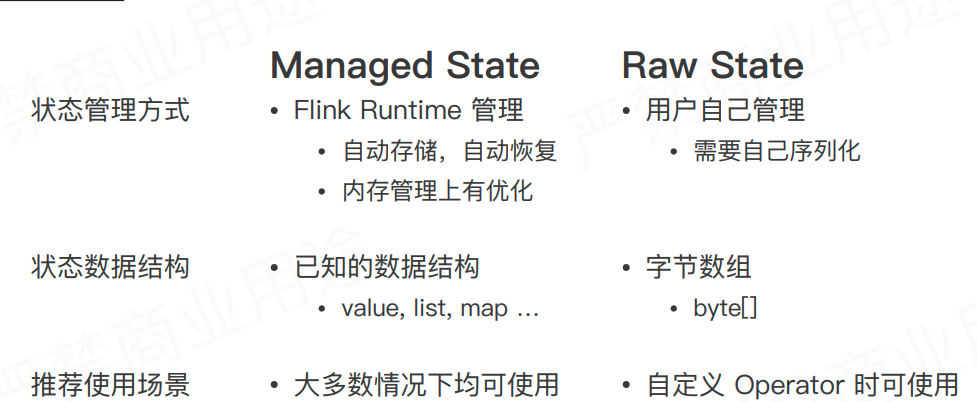
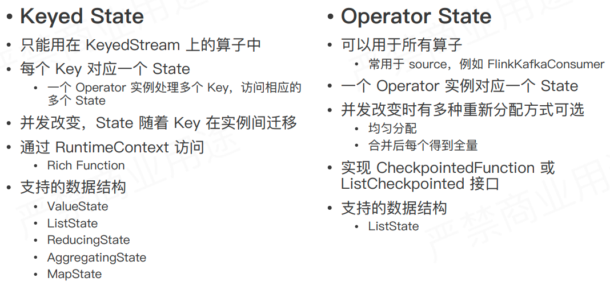
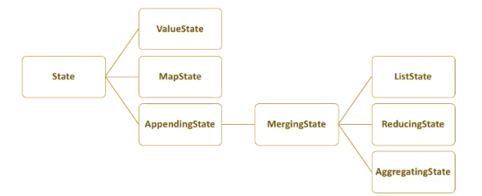
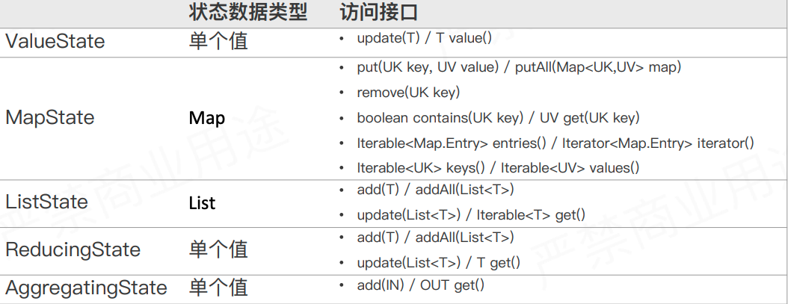
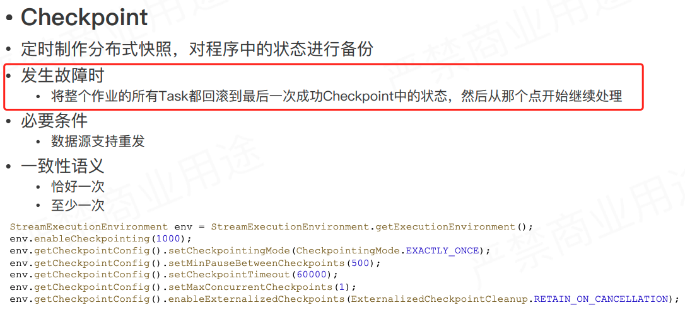
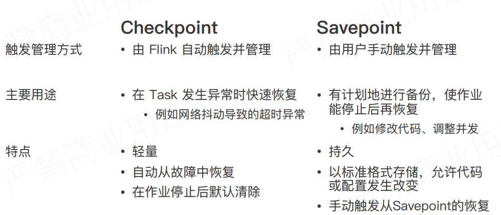

在另外一个`node`  *有状态流式处理引擎的基石* 中提到流式处理的一个理想的功能就是能够做到*状态的计算和维护*

这一件看一看 `flink` 中关于状态和以及其相关的内容容错的内容.

#### 什么是状态

状态是由历史输入累加得到，然后在作用于后续的输入，就算是相同的输入，那么输出也会不一样，这就收到状态的影响。

---

#### 状态的类型

* managed state & Raw state

* keyed state & operator state

---

#### keyedState 种类

#### 状态与容错

---

