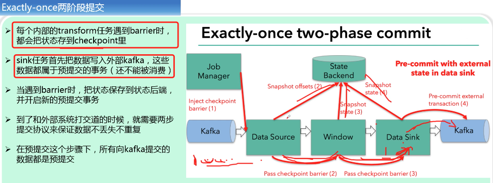
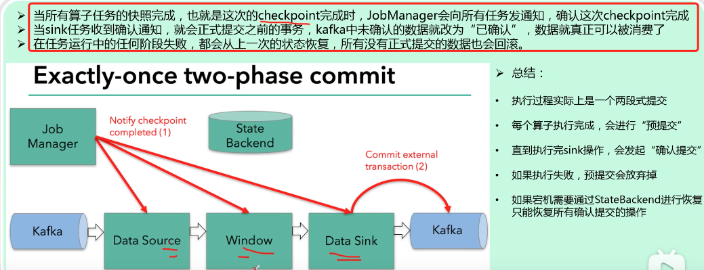

#### 端到端的状态一致性

* 目前一致性保证都是由流处理器实现的，也就是说是在Flink 流处理器内部保证的
* 在真实应用中，流处理应用除了流处理器以外还包含了数据源，和输出到持久化系统
* 端到端的一致性保证，意味着结果的正确性贯穿整个流处理应用的始终，每一个组件都保证他自己的一致性
* 整个端到端的一致性级别取决于所有组件中一致性最弱的组件

---

#### 端到端的精确一次一致性

* 内部保证，依赖 **checkpoint**
* source 端，外部源可重设数据的读取位置
* sink 端，需要保证从故障回复时，数据不会重复写入外部系统

##### 幂等写入

一个操作，可以重复执行很多次，但值导致一次结果更改，后面在重复执行就不起作用了。

##### 事务写入

事务的4个属性：原子性、一致性、隔离性、持久性

##### 实现思路

需要构建事务写入外部系统

构建的事务对应着checkpoint，等到 checkpoint 真正完成的时候，才将所有对应的结果写入 sink系统

##### 实现方式：

* 预写日志（write ahead log）

结果数据线当成状态保持，然后再收到 checkpoint 完成的通知时候，一次性写入到 sink 系统

简单易于实现，由于数据提前在状态后端中做了缓存，所以无论什么 sink系统，都可以使用这种方式一批实现

Fink 内部实现一个模板类 `GenericWriteAheadSink`

* 两阶段提交(2 phase commit)

对于没一个checkpoint sink 任务会启动一个事务，并将接下来所有的数据添加到事务中。

然后将这些数据写入到 sink 外部系统，但是不提交，这时候只是**预提交。**

当收到checkpoint 完成的通知，**才正式提交事务**，实现结果的真正写入。

这种方式真正实现了`exactly-once` 需要一个提供事务执行的外部sink系统，Flink 提供了`TwoPhaseCommitSinkFunction` 接口

##### 2PC 对外部系统的要求

* 外部系统必须提供事务支持，或者是 Sink 任务必须能够模拟外部系统上的事务
* checkpoint 的时间间隔里，必须能够开启一个事务并接受数据写入
* 在收到checkpoint 完成的通知之前，事务必须是 “等待提交”  的状态
* 在故障恢复的情况下，还可能需要一些时间，若此时 sink 系统关闭事务，那么未提交的数据就会丢失
* sink 任务必须能够在进程失败之后能够恢复事务
* 提交事务必须是幂等操作

当数据源不能重置的时候，那么sink 在牛逼，也不能完全保证精确一次，整个job数据要么消费一次，要么就丢失。

当源可以重置的时候，那么幂等、WAL、2PC 都可以保证精确一次。`kafka`中是可以做重置的，且使用的是2PC 的方式保证端到端的一致性。

为了保证精确一次，kafka 的操作必须是事务的。

在两次 checkpoint 之前需要批量提交数据，这样在任务失败之后就可以将没有提交的数据回滚

一个简单的提交和回滚，对于一个分布式的流失数据处理系统来讲是远远不够的。

属于flink 的计算算子的状态会提交到状态后端，包括后续sink 的commit，都是预提交。

知道检查点时间点结束，所有的提交都是预提交，包括kafka 算子的转换算子状态，source 状态，sink 状态。

当有失败，那么不会有最后一次的正式提交，也就是数据还会从上次提交的地方开始重新消费。

