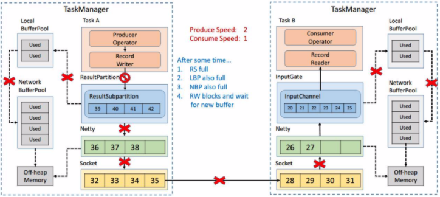

#### 为什么需要网络流控

加入出现上图情况，Producer 吞吐率2MB/s 产生数据，而消费者以1MB/s 消费数据，假设两段都有一个发送和接收的buffer，那么很快接收buffer 就会撑不住了，存满了数据。但是数据还是源源不断的来，那么就会发生

* bounded receive buffer: consumer 丢弃新到达的数据
* unbounded receive buffer: buffer 持续狂涨，耗尽 consumer 内存，出现oom

**基于上述的问题：就需要一个网络流控组件去控制上游和下游速度差问题**

传统的做法：做一个上流的限速组件

这样做也会出现2点限制

* 通常无法预先预估consumer 端能够承受的最大速率
* consumer 的承受能力是动态波动的

**基于这里的问题，于是出现了动态反馈/自动反压**

也就是consumer 及时的给 producer 一些反馈，来动态的条件producer 的吞吐量。所以这里就出现了正负反馈

* 负反馈：接收速度小于发送时发生，要求producer 的吞吐降下
* 正反馈：接收速度大于发送时发送，要求producer 的吞吐可以增加些

**以上就是反压的概念**

#### Spark Streaming 的反压实现

Spark Streaming 也有类似这样的feedback 机制，上图Fetcher 会实时从Buffer、Processing 这样的节点收集一些指标然后通过Controller 把速度接收的情况在反馈给Receiver，实现速率的匹配。

---

#### 为什么Flink(V1.5版本前)没有类似feedback 的机制？

答：TCP 天然剧本Feedback 流控机制，Flink 基于它来实现反压

先看看Flink 中的网络传输是一个什么样的架构

上图是Flink 在做网络传输的时候最基本的数据的流向，发送端在发送网络数据的前，要经历自己内部的一个流程，会有一个自己的Network Buffer，在地产曾使用Netty 做通信，Netty 这一层又有属于自己的ChannelOutBoundBuffer， 因为要最终通过Socket 做网络请求的发送，所以在Socket 也有自己的sendBuffer，同样在接收端也有对应的三级Buffer，学过计算机网络的时候了解到，TCP 是自带流量控制的，实际上Flink就是通过TCP 的流量控制来实现feedback 的。

##### TCP 流量控制

简单回顾下TCP 包的格式。首先有Sequence number 这样一个机制给每个数据包做一个编号，还有ACK number 这样一个机制来确保TCP 的数据传输是可靠的，除此之外还有一个很重要的部分就是Window Size，接收端在恢复消息的时候回通过Window size 告诉发送端还可以发送多少数据。

其简单的流程是这样的：

##### TCP 流控： 滑动窗口

TCP 流控就是基于滑动窗口的机制，现在我们有一个Socket 的发送端和一个Sockert 的接收端，目前我们的发送端的速率是我们接收端的3倍，为什么是3被呢？假定初始的时候我们发送的window 大小是3，然后我们接收端的window 大小是固定的，就是接收端的Buffer 的大小为5.

发送端一次性发送3个packets，将1，2，3发送给接收端，接收端收到后会将这3个packets 放到bffer 中。

接收端一次消费一个 packet，这时候1就被消费了，然后我们看到接收端的滑动窗口会往前滑动一格，这时候2，3 还在Buffer 当中，而4，5，6 是空出来的，所以接收端会发给发送端发送ACK=4，表示发送端还可以从4开始发送，同时window 设置为3(buffer 的大小5减去剩下的2得到还可以接收3个packet)，发送端收到回应后也会将它的滑动窗口移动到4，5，6.

这时候发送端将 4，5，6 发送，接收端也能成功的接收到 Buffer 中去。

接收端消费到2了，同样它的窗口也会向前滑动一个，这个时候buffer 就只剩下一个了，于是想发送端发送ACK=7，window=1，发送端手偶到哦之后滑动窗口也向前移动，但是这个时候就不能移动3格了。虽然发送端的速度允许发3个packets，但是window的传值告知只能接收一个，所以他的滑动窗口就只能往前移动1个，这样就达到了限流的效果，发送端的速度从3降到了1.

在看一种情况，这个时候发送端将7发送之后，接收端接到后，但是由于接收端的消费出现问题，一直没有从Buffer 中取出来，这个时候接收端向发送端ACK=8，window=0，这个时候发送端是不能发送任何数据，也就会使得发送端的发送速度将到0，这个时候发送端不发送任何数据了，接收端也不进行任何反馈了，那么如何知道消费端又开始消费数据看呢？

TCP 中有一个ZeroWindowProbe 的机制，发送端会定期发送1个字节的探测消息，这个时候接收端会把window 的大小进行反馈，当接收端的消费恢复了之后，接收到探测消息就可以将window反馈给发送端，从而恢复整个流程，TCP 就是通过这样一个滑动窗口的机制实现feedback。

---

#### TCP 反压机制

##### 实例 WindowWordCount

答题的逻辑就是从Socket中去接收数据，没5s 去进行一次WordCount，将这个代码提交后就进入到了编译阶段。

编译阶段：生成JobGraph

这个时候还没有向集群提交任务，在Client 端会将StreamGraph 生成JobGraph，JobGraph 就是做为向集群提交的最基本单元，在生成JobGraph 的时候，会做一些优化，将一些没有shuffle 机制的节点进行合并，有了JobGraph 后就会向集群进行提交，进入运行阶段。

##### 运行阶段：调度ExecutionGraph

JobGraph 提交到集群后就会生成ExecutionGraph，这个时候就以及具备了基本的执行任务的雏形了，吧每个任务拆解为不同的SubTask，上图中ExecutionGraph，中的intermediate Result Partition 就是用于发送数据的模块，最终会将ExecutionGraph 交给JobManager 的调度器，整个ExecutionGraph 调度起来，然后我们概念化这样一张物理执行图，可以看到每个Tasl 在接收数据的时候都会通过这样一个inputGate 可以认为是负责接收数据的，在往前就有一个ResultPartition 负责发送数据，在ResultPartition又会去做分区和下游的Task 保持一致，就形成了 ResultSubPartition 和 InputChannel 的对应关系，这就是从逻辑层上来看的网络传输的通道，基于这么一个概念我们可以将反压的问题进行拆解

#### 问题拆解：反压传播2个阶段

反压的传播实际上是分为2阶段的，对应着上面的图，一共涉及到3个TaskManager，在每个TaskManager 里面都有相应的Task 在执行，还有负责接收数据的InputGate，发送数据的ResultPartition，这就是一个最基本的数据传输的通道，在这时候假设最下游的Task(Sink) 出现了问题，处理速度降了下来，这个时候是如何压力传播回去呢？分为2种情况。

* 跨TaskManager：从InputGate 传递到ResultPartition
* TaskManager 内部：反压是如何从ResultPartition 传递到InputGate

##### 跨TaskManager 的传播

发送数据需要ResultPartition，在每个ResultPartition 里面都会有分区，ResultPartition 中间还会有一些关于内存管理的Buffer。

对于一个TaskManager 来说会有一个统一的NetWork BufferPool，被所有的Task共享，在初始化的时候从Off-heap Memory 中申请内存，申请到内存的后续管理就是同步Network BufferPool 来进行的，不需要依赖JVM gc的机制去释放，有了NetWork BufferPool 之后可以为每一个 ResultSubPartition 创建LocalBufferPool。

如上如左边的TaskManager 的Record Writer写了<1,2> 这2个数据进来，因为 ResultSubPartition初始化的时候为空，没有buffer 用来接收，就会想Local BufferPool 省去内存，这时候Local BufferPool 也没有租后的内容于是将请求转给NetWorkBufferPool，最终将申请到的Buffer 按原路返回给 ResultSubPartition，《1，2》就被写入，之后将申请到的 ResultSubPartition 的Buffer 拷贝到Netty 的Buffer 中最终拷贝到Socket 的buff而将消息发送出去，然后哦接收端按照类似的机制去处理消息将其消费。

接下来模拟上下游处理速度不匹配的场景，发送端的速率为2，接收端的速率为1，看一下反压的过程。

因为速度不匹配，就会导致一段时间后InputChannel 的Buffer 被用尽，于是它会向LocalBuffer Pool 申请Buffer，这时候可以看到LocalBufferPool 中的一个Buffer 就被标记为Used

发送端还在持续不断的以不匹配的速度发送数据，然后就会导致InputChannel 向LocalBufferPool 申请Buffer的时候没有可用的buffer了，这时候就只能向NetworkBufferPool 申请，当然每个Local BufferPool 都有最大的可用Buffer，防止一个LocalBufferPool 把Network BufferPool 消耗完，这个时候Network BufferPool 还是有可用的Buffer 可以向其申请。

然后一段时候后，发现Network BufferPool 没有可以使用的Buffer，或者LocalBufferPool 的最大可用Buffer 到了上限无法向 Network BufferPool 申请，没有办法读取新的数据，这时候Netty AutoRead 就会被禁止，Netty 就不会从Scoket 的Buffer 中读取数据了。

显然，再过不久，Socket 的Buffer 也被用尽，这时候将Window=0，发送给发送端，这时候发送端Socket 就会停止发送。

很快发送端的Socket 的Buffer 也被用尽，Netty无法写了之后就会停止向Scocket 写数据。

Netty 停止写之后，所有的数据就会阻塞在Netty 的buffer 当中，但是Netty 的Buffer 是无界的，可以通过Netty 的水位机制控制其上界，当超过 high watermark，Netty 就会将其Channel 置为不可写，ResultPartition 在写之前都会检测Netty 是否可写，发现不可先就会停止向Netty 写数据。

这个时候所有的压力都来到了ResultSubPartition，和接收端一样也会也不断向LocalBufferPool 和 Network BufferPool 申请资源。

LocalBufferPool 和 Network BufferPool 都用尽后，整个Operator 停止写数据，达到跨TaskManager 的反压。

##### TaskManager 内反压过程

TaskManager 内反压过程就比较好理解了，下游的TaskManager 反压导致本TaskManager 的ResultSubPartition无法继续写入数据，于是RecordWriter 的写也被阻塞了，因为Operator 需要输入才能计算后的输出，输入和输出都是在同一线程执行，RecordWriter 阻塞了，RecordReader也停止从InputChannel 中读数据，这时上游的TaskManager 还在不断的发送数据，最终将这个TaskManager 的Buffer 耗尽，

---

#### Flink Credit-based 反压机制

##### Tcp based 反压的弊端

* 一个TaskManager 中可能要执行多个Task，如果多个Task 的数据最终要传输到下游的同一个TaskManager就会复用同一个Socket 进行传输，这个时候如果单个Task产生反压，就会导致复用的Socket 阻塞，其余的Task 无法使用传输，checkpoint barrier 也无法发出导致下游执行的checkpoint 延迟增大。
* 依赖底层的TCP ，导致反压传播路径常，导致产生的延迟比较大。

##### 引入Credit-based 反压过程

如图所示在Flink 层面实现反压机制，就是每一次ResultSubPartition 向InputChannel 发送消息的时候都会发送一个backlog size 告诉上游准备发送多少消息，下游就会去计算有多少buffer 去接收消息，算法之后如果有充足的Buffer 就会返回给上游一个Credit 告知他还有发送消息(上图中ResultSubPartition 和 InputChannel 之间的需要时以为内最终还是需要通过Netty 和 Socket 通信)，下面具体给出一个示例

假设我们上游的速度不匹配，上游发送速率为2，下游接收速率为1，可以看到图上在ResultSuubPartition 中累积了2条消息，10，11，backlog为2，这时候就将发送的数据<8,9>和backlog=2一起发送到下游，下游收到之后就会计算是否有2个Buffer 去接收，可以看到InputChannel 中已经不足了，这时候就会从LocalBufferPool 和Network Buffer Pool 申请，好在这个时候Buffer 还是可以申请到的。

过了一段时间之后，由于上游的发送速率大于下游的接收速率，下游的TaskManager 的Buffer 已经达到了申请上限，这时候下游就会向上游返回Credit=0，ResultSubPartition 接收到之后就不会像Netty 传输数据了，这样上游的TaskManager 的buffer 也很快耗尽，达到反压的效果，这样在ResultSubPartition 层就能感知到反压，不用通过Socket和Nettu 一层一层向上反馈，降低了反压剩下的延迟，同时也不会像Socket 去阻塞，解决了又于一个Task 反压导致TaskManager 和TaskManager 之间的Socket 阻塞问题。

---

#### 总结：

- 网络流控是为了在上下游速度不匹配的情况下，防止下游出现过载
- 网络流控有静态限速和动态反压两种手段
- Flink 1.5 之前是基于 TCP 流控 + bounded buffer 实现反压
- Flink 1.5 之后实现了自己托管的 credit - based 流控机制，在应用层模拟 TCP 的流控机制

---

### 思考

有了动态反压，静态限速是不是完全没有作用了？

实际上动态反压不是万能的，我们流计算的结果最终是要输出到一个外部的存储（Storage），外部数据存储到 Sink 端的反压是不一定会触发的，这要取决于外部存储的实现，像 Kafka 这样是实现了限流限速的消息中间件可以通过协议将反压反馈给 Sink 端，但是像 ES 无法将反压进行传播反馈给 Sink 端，这种情况下为了防止外部存储在大的数据量下被打爆，我们就可以通过静态限速的方式在 Source 端去做限流。所以说动态反压并不能完全替代静态限速的，需要根据合适的场景去选择处理方案。

---

这里提到了很多的 Netty 的东西，再回去看看复习下netty 的内容

https://www.bilibili.com/video/BV124411P7V9

https://www.infoq.cn/article/g8DbwKBoxSk4JdBXA7fX

[Flink 反压官方文档](https://ci.apache.org/projects/flink/flink-docs-release-1.10/zh/monitoring/back_pressure.html)

