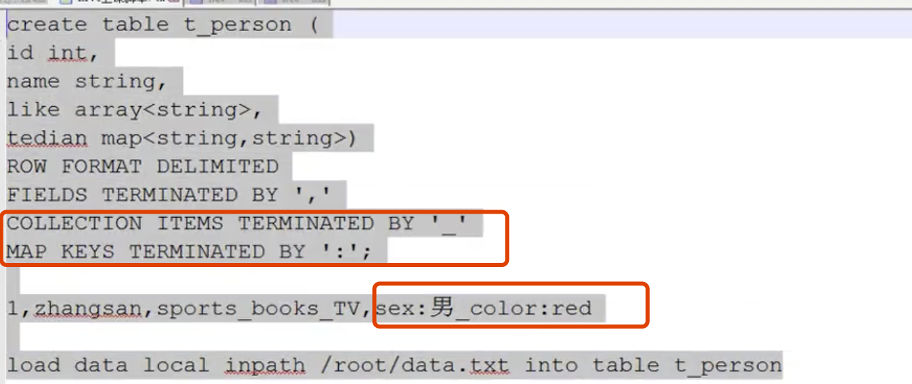

### HIVE

---

> Hive 的设计初衷是，让哪些不会Java 语言的人，写MapReduce 语言，也就是使用SQL 语句执行MapReduce。
>
> HIVE 本质是 hdfs 的客户端

> HIve 也就是一个数据仓库
>
> Hive 包含部分：
>
> * 解释器: 脚本解释为Java 代码
> * 编译器: 编译Java 代码
> * 优化器: 提交Java 代码，并优化，这里的Java 代码就是MR 程序，
>
> 所谓Hive 的脚本就是 HQL(类SQL 语句)，看着Hive 是一个关系型数据库，但是本质上并不是，存储还是在hdfs 之上，计算也还是在MR之上。
>
> * HIVE 运行的时候，肯定是有元数据的，这些元数据存储在关系型数据库之中，在什么没有配置的时候，Hive 默认自带一个关系型数据库，但是这个数据库并不稳定。在 hive-site.xml 的配置文件中有默认配置。在正式使用HIve 那么最好是自己安装一个数据库，Mysql，因为元数据其实是不多的。安装Mysql 之后，首先集群中要有mysql 的驱动，将驱动放到Hive 的lib目录下，修改下面的配置文件,红色两张图，先使用mysql jdbc 和 驱动配置，然后是用户名和密码配置, 如下面jdbc 中的Hive数据库，启动hive的时候，并不会去创建，所以需要预先手动去创建这个数据库


Hive 官方手册 https://cwiki.apache.org/confluence/display/Hive/GettingStarted

#### HQL

**DDL**

> 在Hive 的安装目录下的 bin 目录下可以 **./hive** 就可以启动Hive 客户端了，可以开始执行Hive了
>
> ```
> SHOW TABLES;
> ```
>
> ```
> SHOW TABLES '.*s'; 带有模式匹配
> ```
>
> 创建数据库
>
> ```
> CREATE (DATABASE|SCHEMA) [IF NOT EXISTS] database_name
>   ``[COMMENT database_comment]
>   ``[LOCATION hdfs_path]
>   ``[WITH DBPROPERTIES (property_name=property_value, ...)];
> ```
>
> 销毁数据库
>
> DROP (DATABASE|SCHEMA) [IF EXISTS] database_name [RESTRICT|CASCADE];
>
> 修改数据库
>
> ```
> ALTER (DATABASE|SCHEMA) database_name SET DBPROPERTIES (property_name=property_value, ...);   -- (Note: SCHEMA added in Hive ``0.14``.``0``)
> ```
>
> 使用数据库
>
> USE DATABASE_NAME;
>
> USE DEFAULT;
>
> 创建数据表
>
> ```
> CREATE EXTERNAL TABLE page_view(
> 		viewTime INT, 
> 		userid BIGINT,
>     page_url STRING, 
>     referrer_url STRING,
>     ip STRING COMMENT 'IP Address of the User', // 列注释
>     country STRING COMMENT 'country of origination'
>  )
>  COMMENT 'This is the staging page view table' // 表注释
>  ROW FORMAT DELIMITED FIELDS TERMINATED BY '\054' // 文件没一行使用什么符号隔开，	
>  																															常使用的还有 '\t'
>  STORED AS TEXTFILE 					// 存储格式，还有一种格式是 sequence
>  LOCATION '<hdfs_location>'; 	// 存储在hdfs 中的路径
> ```

**创建一张表**


**导入数据**


```java
hive> LOAD DATA LOCAL INPATH './examples/files/kv1.txt' OVERWRITE INTO TABLE pokes;
```

Local load 本地数据，当不加 local 参数的时候，就是加载的是 hdfs 中的数据，然后你就在 hadoop 的hdfs 目录的 /user/hive/warehouse 下就能找到刚 load 的数据了，在创建的时候，也是可以指定路径的

并且在安装配置hive 的时候，并不需要特意去讲hive 和 hadoop 建立联系，hive 会去读取hadoop 的环境变量，找到 hdfs 存储

再Hive 可以存储各种各样的类型，包括数组，字典等，在官网都有说明



再Hive 中有一个分区的概念，partition，这其实就是创建一个目录，目录名称就是你创建表的时候指定的表名，然后创建的表就在这个目录下，分区可以是更具时间，地点等划分，分区就是一个文件夹.


执行之后就会将 sxtsts 放到了 2013-07-09 目录之下

**上面的方式都是在命令行中敲的**

---

#### hql 脚本有3种方式执行

> Hive -e  'hql'  调试使用，一句一句的执行
>
> hive -f 'hql.file' 
>
> Java 代码  hive-jdbc (这个理也就是看着 hive 就是一个数据库)

在使用 hive-jdbc 的时候，需要在hive 中启动 service

> ./hive —service hiveserver2


