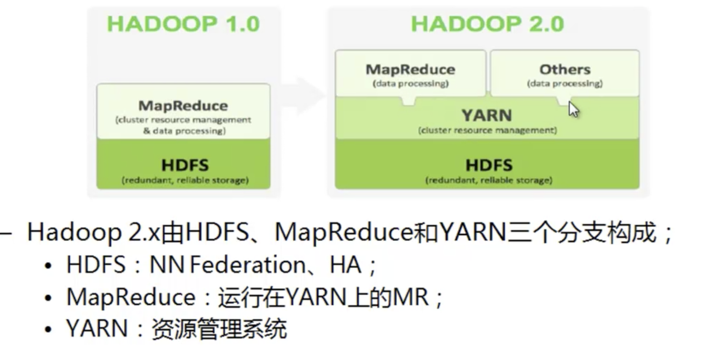
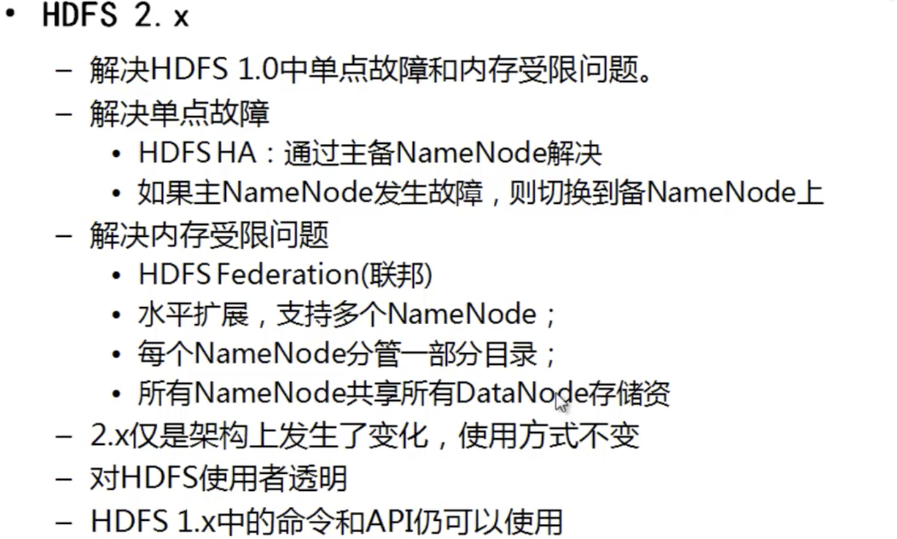
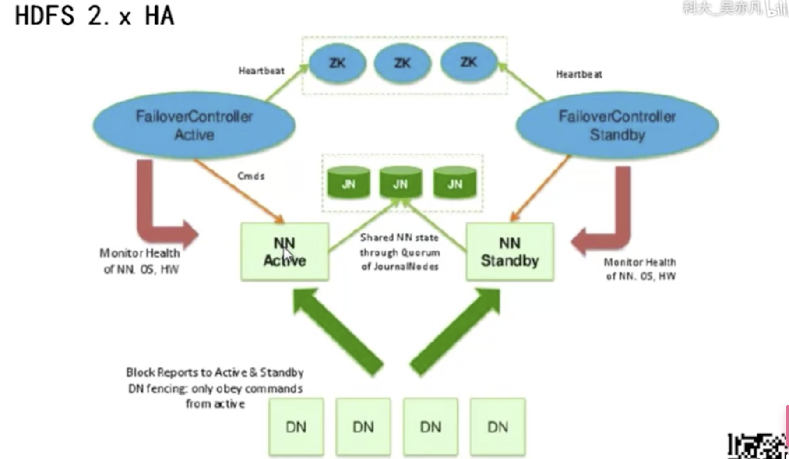
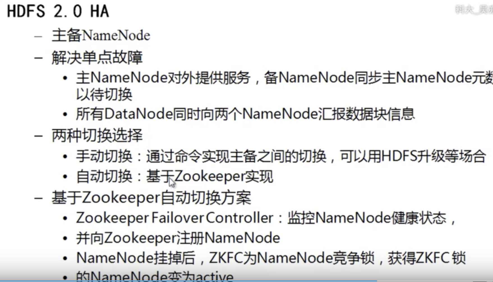
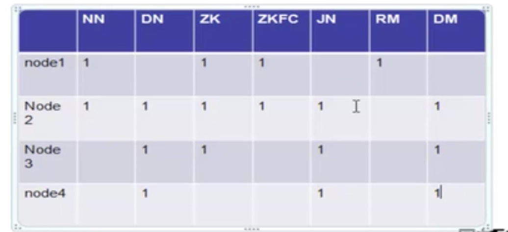

#### Hadoop 2.x

---

#### Hadoop 2.x 的产生

> Hadoop 1.x 在HSDA 和 MR 在高可用，扩展性方面存在问题
>
> NN 单点故障，难以使用在在线场景，mr 是离线的计算框架
>
> NN 压力过大，且内存受限，影响扩展性
>
> MR 中的JobTracker 访问压力大，影响系统扩展性
>
> Hadoop 1.x 难以支持 MR 以外的计算框架，如 spark (内存计算)和 storm(流式计算)等

> NN Federation : 相当于是 monitor
>
> 在 MR 做操作的时候，首先回向YARN 申请资源，好处是，不浪费资源，物尽其用

> DN 会将所有的文件信息发送给所有的主备NN，而NN 中的metaData 此时就不存在在NN 之中了(因为当主NN 挂掉之后，主上的metadATA 会丢失，那么备NN 就会拿不到metaData了)而是存在JN 中，当主NN挂掉之后， 备NN 会到JN 中拿metaData 数据，不管是主还是备NN 在读写文件的时候，都需要去JN 中刷新数据，在JN 中加载或写入数据，
>
> FailoverControllerActive 控制NN 的切换和，心跳检查，然后再最顶层，使用zookeeper 实现高可用
>
> 客户端请求NN 的时候会发生的问题是，客户端并不知道哪个NN 是活着的，所以客户端访问的是Zookeeper，zk是知道哪个NN 活着的

#### Federation

>通过多个nameNode/nameSpace 把元数据的存储和管理分散到多个节点上，使到 nameNode/namespace 可以通过增加机器来进行水平扩展，必须在NN 节点上
>
>能把单个NN 的负载分散到多个节点上，在hdfs 数据规模较大的时候，也不会降低hdfs 的性能，可以通过多个namespace 来隔离不同类型的应用，把不同类型应用的hdfs 原数据存储和管理分派到不同的namenode 中。

---

### YARN

yet another resource negotiator， 资源管理系统

> * 核心思想： 资源管理和任务调度分别使用 ResourceManager 和 ApplicationMater 进程实现
>
> > ResourceManager 负责整个集群的资源管理和调度
> >
> > ApplicationMater： 负责应用程序相关的事务，比如任务调度，任务监控和容错等
>
> * YARN 的引入，使得多个计算框架可运行在一个集群中
>
>   目前多个计算框架可以运行在YARN 上，MR、Spark、Storm 等

综上，一个集群的所有节点为：

