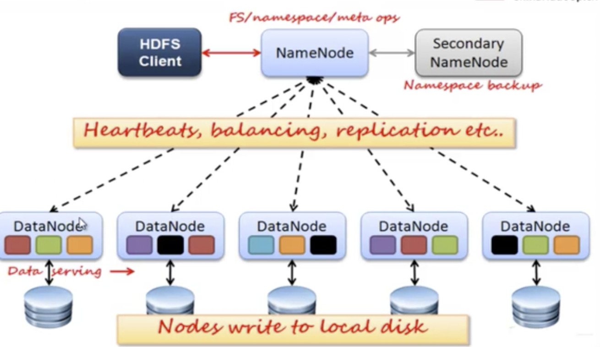
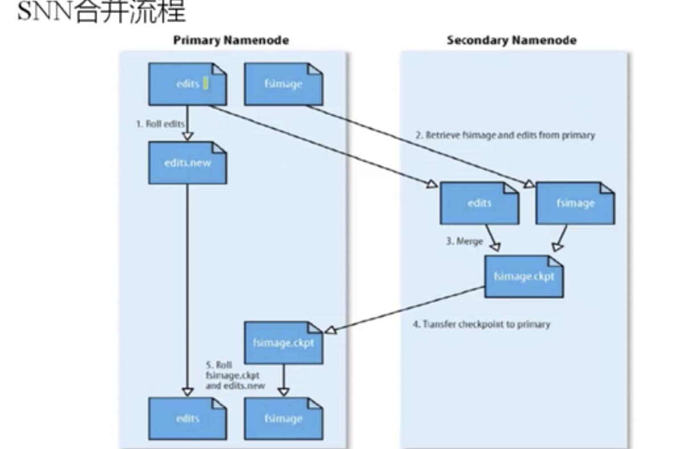
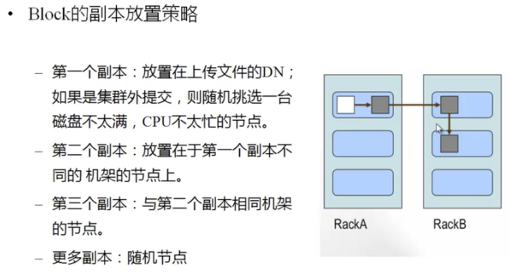
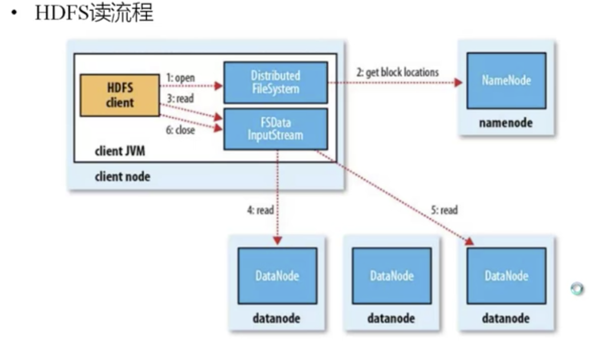
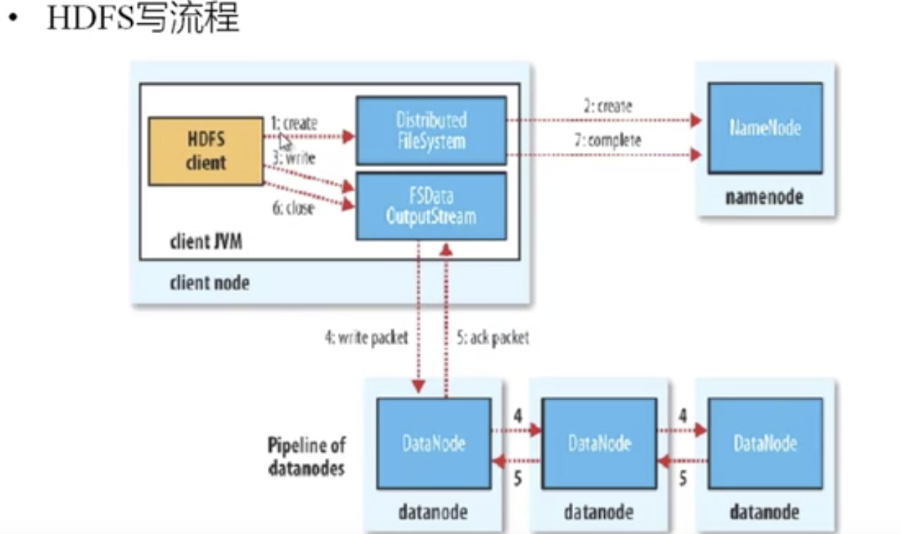

### Hadoop

---

#### 大数据

> * 数据量在TB -> PB 以上
> * 持续实时产生数据
> * 半结构化和非结构化数据
> * 用于数据挖掘和预测性分析

#### Hadoop 的子项目

> * Core 一套分布式文件系统，以及支持MapReduce 的计算框架
> * Avro： 定义了一种用于支持大数据应用的数据格式，并未这种格式提供了不同的编程语言支持
> * HDFS： Hadoop 的分布式文件系统
> * MapReduce： 可靠容错的方式并行处理上T 级别的数据集
> * Zookeeper： 高可用和可靠的分布式协同系统
> * Pig(使用的越来越少)： 建立于Hadoop Core 之上为并行计算环境提供一套数据工作流语言和执行框架
> * Hive： 是为提供简单的数据操作而设计的下一代分布式数据仓库，它提供了简单的类似SQL 的语法的HiveSQL 语言进行的数据查询
> * Hbase： 建立于Hadoop Core 之上提供一个可扩展的数据库系统
>
> 
>
> * Flume：分布式，可靠，和高可用的海量日志聚合的系统，支持在系统中定制各类数据发送方，用于收集数据
> * Mahout：可扩充能力的机器学习类库
> * Sqoop：RDBM 和 HDFS 互相倒数据的工具

#### HDFS

> 可靠性：创建多份数据，并将这些副本放置在服务器群的计算节点上，MR 就可以在它们所在的几点上处理这些数据了。
>
> 结构：
>
> * NameNode，存储元数据，存储在内存中，保存文件 即block和dataNode 之间的映射关系
>
> * DataNode：存储文件内容，文件内容保存在磁盘，维护了blockId到DataNode 本地文件的映射关系
>
> 一个NameNode 节点和多个数据节点
>
> 数据复制(冗余)
>
> 故障检测：
>
> * 数据节点
> * 心跳包：是否宕机
> * 块报告：安全模式下的检测
> * 数据完整性检测：校验和比较
>
> 名字节点
>
> 空间回收机制

> * 优点
>
> > 高容错性
> >
> > * 数据自动保存多个副本
> > * 副本丢失后，自动回复
> >
> > 适合批处理
> >
> > * 移动计算而非数据
> > * 数据为止暴露给计算框架
> >
> > 适合大数据处理
> >
> > * GB TB PB 级数据
> > * 百万规模以上的文件数量
> > * 10K 节点
> >
> > 可构建在廉价的机器上
> >
> > * 通过多副本提高可靠性
> > * 提供了容错和恢复机制
>
> * 缺点
>
> > 低延时数据访问
> >
> > * 比如行秒级
> > * 低延迟与高吞吐量
> >
> > 小文件存取
> >
> > * 占用NameNode 大量内存
> > * 寻道时间超过读取时间
> >
> > 并发写入，文件随机修改
> >
> > * 一个文件智能有一个写着：不适合修改
> > * 仅仅支持append

如上是hdfs的系统框架

> 1. 当用户读写访问hdfs 的时候，首先会去访问NameNode，NameNode然后再将请求转发给DataNode，所有的DataNode 在讲数据存储在磁盘上，如上图一个颜色表示一个block 数据，然后这个block 数据就是存储在不同的DataNode，上存储多个副本，如黑色block，是存储了3块。
> 2. 存储的文件被切分为固定大小的数据块，
>
> * 默认数据块的大小为64M，可以配置的，这里64M 是逻辑大小，并不是说一个Block 就占了64M 的磁盘，而是文件有多大就会占多大的磁盘
> * 若文件大小不到64M，则单独存储为一个Block
>
> 3. 一个文件存储方式
>
> * 按照大小被切分为若干个block，存储到不同的节点上
> * 默认没个block 都有3个副本，多个副本必须是存储在不同的机器上，当一个机器管挂掉，不至于全部数据丢失，当一个机器关掉，丢失一个副本的时候，HDFS 在复制这样一个副本，放到空闲的机器上。
>
> Block 大小和副本数，通过Client 端上传文件时，设置，文件上传成功后副本数可以变更，Block Size 不可变更

#### NameNode

> * 主要功能，接受客户端的读写服务
> * 保存metaData 信息包括：
>
> > 文件owership 和 permission
> >
> > 文件包含哪些块
> >
> > Block 保存在哪个DataNode(DataNode 启动的时候上报)
>
> * NameNode 的metadata 信息在启动的时候加载到内存
>
> > Metadata 存储到磁盘文件名称为 fsimage
> >
> > Block 的位置信息不回保存在fsimage
> >
> > edits 记录对metadata 的**操作日志**：新增删除数据的时候，并不是马上跟新fsimage，而是将这些当下的一段时间的操作记录在edits 中，过一段时间之后，将edit 中的记录合并到fsimage 上，此时将fsimage 的记录进行跟新，如删除了些文件，那么将fsimage 中记录这些文件的metadata 删除，或者增加一个文件，将这些文件的metadata 信息，新增到 metadata，

#### SNN

> 它不是NN 的备份(但是可以做备份)，它的主要功能就是帮助NN 合并edits log 减少NN 的启动时间
>
> SNN 执行合并时机
>
> * 根据配置文件设置的时间间隔 fs.checkpoint.period 默认为3600s
> * 根据配置文件设置 edits log 大小 fs.checkpoint.size 规定edits 文件的最大值默认为 64M

SNN 是在另外的一台机器上，合并一段时间内的操作，和历史操作。

在合并的时候，首先从NN 上拉过来历史的，和新的操作，在SNN 中合并，同时在NN 中会有一个新的edits.new 去记录在合并期间，NN 的操作，然后SNN 合并之后，将合并的结果推给 nn，然后一段时间之后，在重复执行这样的合并操作。

上图也可以看出来SNN是对NN 最一定的备份，如当NN 挂掉之后，再SNN 中海存储这里是的操作记录，但是在SNN 合并这段时间，NN 的新的操作是丢失了的。SNN可以找出大部分的东西。

所以SNN 和 NN 放在不同的机器上，这样不至于NN 机器挂了之后再SNN 中恢复数据 ，

---

#### DataNode

> 存储数据
>
> 启动DN 的时候会想NN 汇报 block 信息
>
> DN会主动通过向NN 发送心跳数据(每3秒)，表示DN 还在，如果NN超过10 分钟没有收到DN 的心跳，则认为 DN 已经lost，然后复制一个副本到其它空闲机器，

**Block 的副本放置策略**

> 第一个副本：放置在上传文件的DN，如果集群外提交，则随机选择一台磁盘不满，CPU 不太忙的节点
>
> 第二个副本：放置在位于第一个副本不同的机架节点上(不同的机架用到不同的电源，机架的ip 地址会在安装的时候配置)，还有机架之间尽量靠近，为的是传输的损耗小，传输快。
>
> 第三个副本和第二个副本相同机架节点
>
> 其它副本随机节点

---

### HDFS 读流程

> 1. 第1. 2 步获取block 的metadata，返回给客户端
> 2. 第3步，客户端带着这些 block 的metadata(如要读取的文件的block 分别在哪些个机器上，路径是什么等信息)  去并发读取(第4 步和第5步)在各个机器上的block。
> 3. 第6步读到数据

### HDFS 写流程

> 1. 第1 和第2 步骤，上传文件，先将文件大小，等写给NN，NN 会记录上传者，权限等信息，并且计算文件的大小，切分为几块，怎么存储等信息，然后将这些信息返回给客户端
> 2. 然后将文件写到 NN 分配的路径，bock 副本放置规则等，然后返回信息。穿得时候是只传一份数据，然后再DN 中进行复制副本存储。

#### 安全模式

> - nameNode 启动的时候，首先将印象文件fsimage，载入内存，并执行编辑日志 edits，中的各项操作。
> - 一旦在内存中成功建立文件系统元数据的映射，则创建一个心得 fsimage文件，和一个空的编辑日志
> - 此刻nameNode运行在安全模式，即NN 的文件系统对于客服端而言是只读的，显示目录，显示文件内容等，写，删除，重命名等操作都是失败
> - 在此阶段NN，收集各个DN 的报告，当数据块达到最小副本以上的时候，会被认为是安全的，再一定比例的数据块被确定为安全后在过若干时间，安全模式结束
> - 当检测到副本数不足的数据块的时候，该快被复制直到达到最小副本数，系统中数据库的为止并不是由NN 维护的，而是以快列的表形式存储在DN 中。

> masters: 配置文件配置 SNN 的配置，只要保证 SNN 和NN不在同一台机器就OK
>
> slaves：配置 dataNode所在机器
>
> core-site.xml 配置 NN 的主机和入口端口号,元数据的存放目录
>
> hdfs-site.xml 配置 hdfs 相关配置
>
> Hadoop-evn 中需要配置 JAVA HOME

> start-dfs.sh : 只启动 hdfs

> 保证所有机器上的配置文件一样，一台机器配置好之后，将这台机器的配置问了目录 conf/ 拷贝到其它机器
>
> 然后格式化: ./hadoop namenode -format

> 在启动的时候，注意将 机器的防火墙关掉

