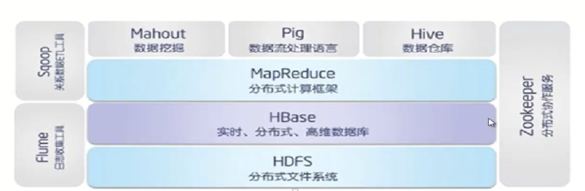
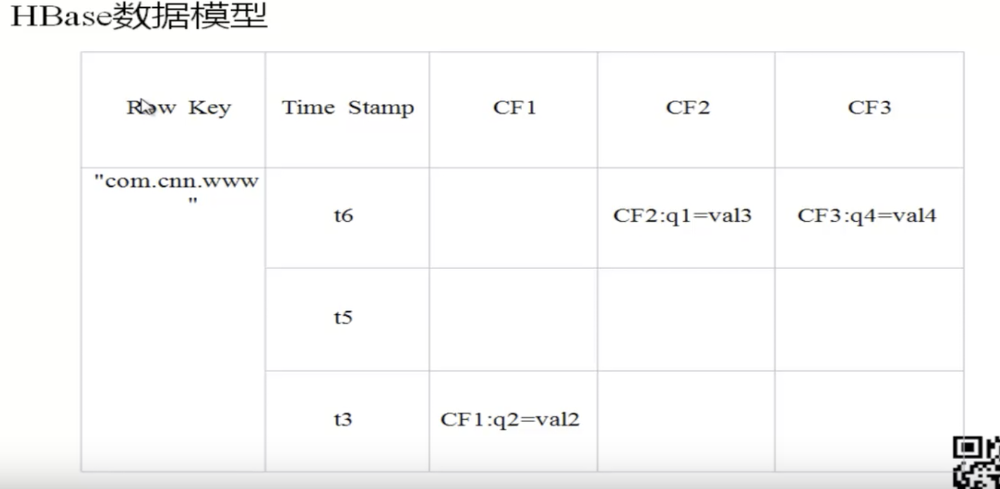
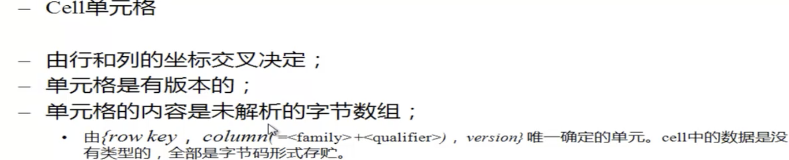
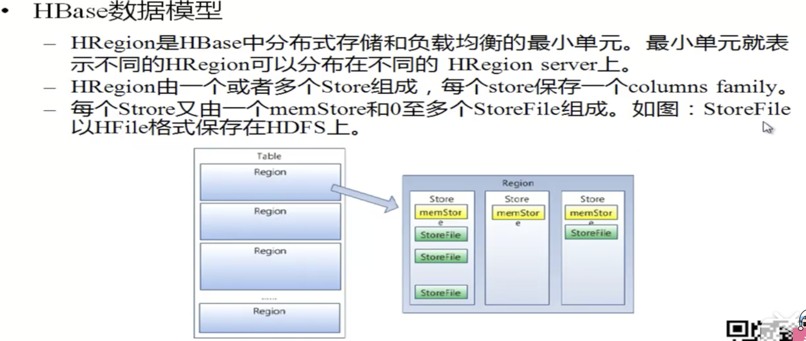
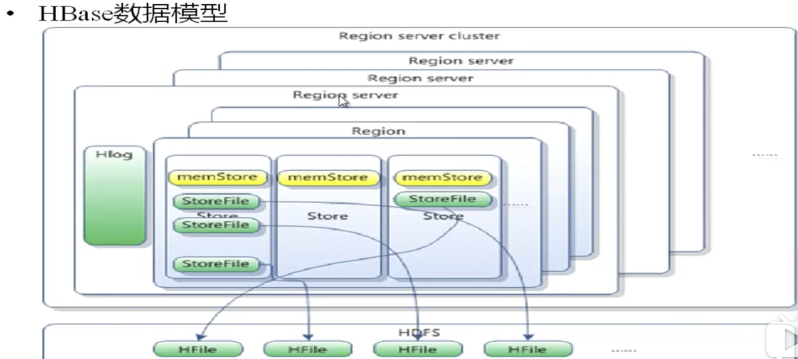
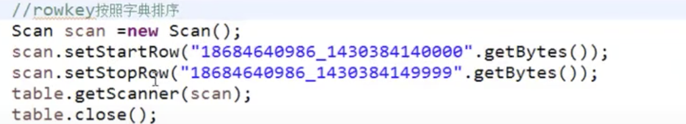
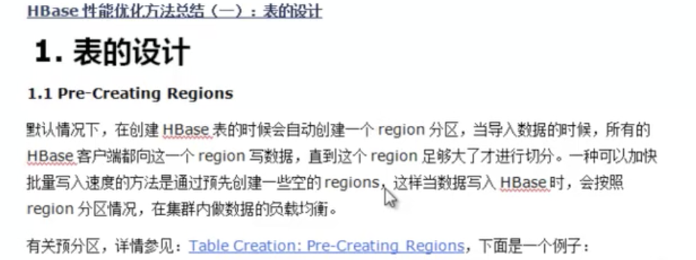

#### Hbase

---

> * HBASE: 是实时的存储，速度快，高维度数据库。
>
> * Hbase： hadoop database，是一个高可靠性，高性能，面向列，可伸缩，实时读写的分布式数据库
>
> * 利用hadoop HDFS 作为其文件存储系统，利用Hadoop MapReduce 来处理Hbase 中的海量数据，利用zookeeper 作为其分布式协同服务
>
> * 主要用来存储非结构化和半结构化的松散数据，列存储NoSQL数据库
> * 

> hbase 的数据模型如上，使用RowKey 去区分每一行，当row key 不同的时候，才去区分说，这不是同一行数据，
>
> 时间戳，描述数据的版本,hbase 中的数据是不能修改的，所以使用版本，去表示数据的跟新
>
> 列族(Column Family)，也就是一个列族(Column Family)下面会有很多列(qualifier)。
>
> Hbase 表中的每个列都归属于某个列族，列族必须作为表模式(schema)，定义的一部分预先给出，如 create 'test', 'course';
>
> 列名以列族作为前缀，每个「列族」都可以有多个成员(column)，如 course:math, course:english， 新的列族成员(列)可以随后按需，动态加入。
>
> 权限控制，存储以及调优都是在列族层面进行的
>
> Hbase 把同一列族里面的数据存储在同一个目录下，由几个文件保存
>
> 在Hbase 的每一个cell 中存储单元对同一份数据有多个版本，根据唯一的时间戳来区分每一个版本之间的差异，不同版本的数据按照时间倒序排序，最新的数据版本排在最前面，
>
> 时间戳的类型是64位整型
>
> 时间戳也可以用户显示复制，如果应用程序要避免数据版本冲突，就必须自己生成具有唯一性的时间戳
>
> 所以一个单元格是由三个纬度确定的，rowkey、colFamily、时间戳

Hbase 体积架构

> * Client 包含访问Hbase 的接口并维护cache 来加快对Hbase 的访问
>
> * Zookeeper 保证任何时候，集群中只有一个master
>
>   保存所有Region 的寻址入口
>
>   实时监控Region server 的上线和下线信息，并实时通知master
>
>   存储Hbase 的 schema 和 table 元数据
>
> * Mster：
>
>   * 为Region server 分配region
>   * 负责 Region server 负载均衡，新的任务，放到清闲的region
>   * 发现失效的 Region server 并重新分配其上的region
>   * 管理用户对 table 的增删操作
>
> * Region server
>
>   * Region server 维护region，处理对这些region 的IO 请求
>   * Region server 负责切分在运行过程中变得过大的 region
>
> * Region
>
>   * Hbase 自动把水平划分成多个区域，每个区域会保存一个表名里面某段连续的数据，每个表一开始只有一个region，随着数据不断插入表，Region 不断增大，当增大到一个阈值的时候，Region 就会等分为俩个新的region
>   * 当table 中的行不断增多，就会有越来越多的region，这样一张完整的表备保存在多个RegionServer 上

---

> hbase 中有namespace 的概念，相当于数据目录或者数据库，下面放着很多的table
>
> 在 hbase 中命令行中输入 help 会打印出所有的命令急例子可以阅读，非常的方便。
>
> 输入 create help 就会有所有的新建的使用
>
> 在输入一个命令之后，直接回车，就是代表这个命令结束了，不能使用 ; 结尾。

---

> 在写表的时候，查表的时候都是经过rowkey 去查表，根据业务去设置合适的rowKey，

rowkey 是排序的，所以可以给定范围然后查询\

---

#### 优化

 

