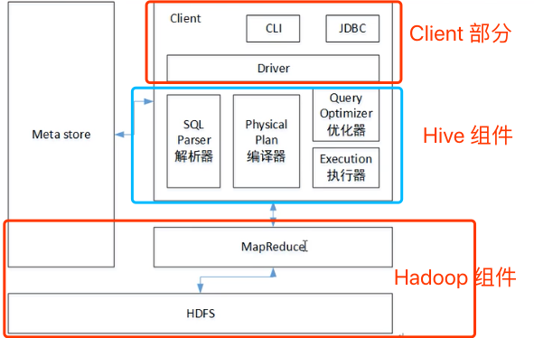

**大数据技术解决了海量数据的**

* **传输(Kafka)**
* **存储(Hadoop,Kafka,Hive)**
* **计算(MR,Spark,Flink)**

#### 什么是 Hive

> 是一个**基于Hadoop的数据仓库**工具，解决**海量**、**结构化日志**的数据**数据统计**，将结构化的数据文件映射为一张表，提供**类似SQL查询功能**
>
> 本质：将HQL 转化为MR程序

* 处理的数据存储在HDFS上
* 分析数据底层的实现默认是MR，可以改为Spark
* 执行程序运行在Yarn 上

可以理解Hive 是Hadoop 的一个客户端，可以很方便的使用Haoop 的组件，HDFS/YARN/MR

#### 优点

* 类似SQL语言，容易上手
* 避免去写 MR程序
* 延迟比较高，用于实时较低的场景
* 优势在于处理大数据，对于小数据没有优势，因为延迟比较高
* 支持UDF

#### 确定

* HSQL 表达能力有限
  * 迭代式算法无法表达
  * 数据挖掘不擅长
* Hive 效率低
  * 自动生成MR程序，不够智能化
  * 调优比较困难，粒度较粗

#### Hive 架构/包含哪些组件

* SQL 解析器： 和`metastore`交互校验语法是否有问题
* Physical Plan 编译器：翻译 HQL 到MR
* 优化器：优化MR程序
* 执行器： 提交任务给yarn



#### Hive 和数据库

Hive 和数据库除了拥有类似的查询语言，再无类似之处

* 存储位置

  > Hive 数据存储在HDFS，而数据库存储在本地文件系统中

* 数据更新

  > Hive 是为数仓而设计的，其内容是读多写少，所以Hive 不建议对数据进行改写，所有的数据都是在加载的时候确定好了的，而数据库中的数据是需要进行修改的。

* 索引

  > Hive 0.7.0版本中，加入了索引(待补充)

* 执行延迟

  > 执行MR延迟高，而数据库延迟相对较低

* 可扩展性

  > 可扩展性强

* 数据规模

  > Hive 建立在集群上，并可以利用MR进行并行计算，支持大规模的数据，而数据库支持规模较小

---

#### 安装

Apache-hive-1.2.1-bin.tar.gz

Mysql-lib.zip

---

#### 简单测试

```sql
create table student(id int, name string);

    show tables;

    insert into table student values(1,'hell10');

    select * from student;

    load data local inpath '/opt/hive/data/data.txt' into table student;

    select count(1) from student;

    create table stud(id int, name string) row format delimited fields terminated by ',';

    create table stud2(id int, name string) row format delimited fields terminated by ',';

    load data local inpath '/opt/hive/data/data2.txt' into table stud2;

    // 有时候会出现NULL值，是因为分隔符号有问题

    存储在 hdfs 上的路径是 /user/hive/warehouse/stud2
    可以直接给这个路径上 put 文件，然后hive 里面
    select * from stud2;
    就可以看到了put 到 hdfs 上的数据

    在 hdfs 的根目录放一个 data4.txt 文件
    hive 中执行
    load data inpath '/data4.txt' into table stud2;
    select * from stud2;
    可以看到加载进来的数据

```


