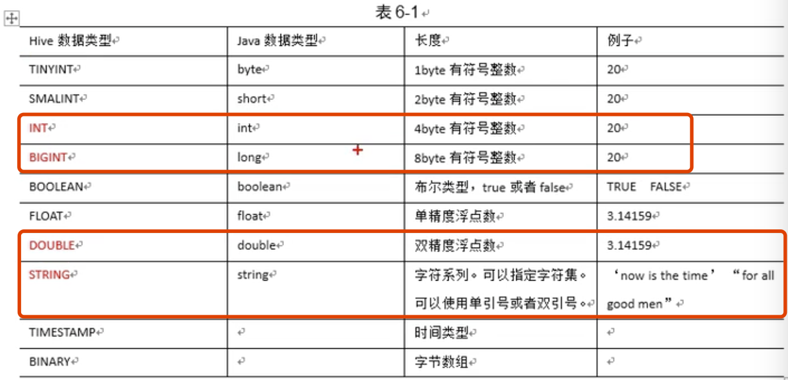

Hive 之所以可以从HDFS 中取到数据是因为，Hive操作是涉及到的Hdfs 数据都会存储在Hive 自己的数据库，Hive 通过读这个数据库的信息，可以知道自己要操作的数据在HDFS 的什么位置。

Mysql 存储着哪张表在哪里，当你去查这张表的时候，Hive 会先去数据库查下，这张表在HDFS上的位置，然后在这个位置上去查表数据。

---

#### 常使用命名

> ` ./hive -e "select * from stud2;"` 直接在 terminal 中就可以执行，而不需要进入 hive cli
>
> > -e SQL from command line
>
> `./hive -f ./hive.hql` 在 termial 中读取 文件中的sql 语句然后执行
>
> > -f  SQL from files
> >
> > 可以将结果写入到其他的文件 中间的日志信息不回写到结果文件中去
> >
> > ` ./hive -f ./hive.hql > ./hive_result.hql.txt`
>
> `可以查看 hdfs 文件系统目录`
>
> > dfs -ls /

#### 一些默认值

> **输出路径位置**
>
> `/user/hive/warehouse/stud2`
>
> 它在配置文件中是可以修改的
>
> 

---

#### Hive 数据类型

* 基本类型



红色部分是最常用的。

* 集合类型


* 类型转换

  一个例子

  ```sql
  -- 插入一下数据
  {
      "name":"songsong",
      "friends": ["bingbing", "lili"],
      "children":{
          "xiao song":12,
          "xiaoxiao song":19
      }
      "address": {
          "street":"huilonguan",
          "city":"beiging"
      }
  }
  
  -- hive 是不能直接插入一下的数据的，需要进行一定的转换
  -- 定义表结构
  create table test(
    name string,
    friends array<String>,
    children map<String, int>,
    address struct<street:string, city: string>
  )
  row format delimited fields terminated by ','
  collection items terminated by '_' -- 这个集合包括表结构中的 array 和 map 以及结构体，元素之间的分隔符
  map keys terminated by ':'
  lines terminated by '\n';
  
  -- 并不能单独定义 map 元素之间分隔符，array元素之间分隔符
  -- 插入数据的时候需要按照定义表结构那样将每一列数据按照一定的分隔符分隔开
  songsong,bingbing_lili, xiao song:18_xiaoxiao song:19, hui long guan_beijing
  yangyang,caicai_susu, xiao yang:18_xiaoxiao song:19,chao yang_beijing
  
  -- 然后使用，就可以将数据 load 进来了
  load data local inpath '/opt/hive/data/complicatedData' into table test;
  
  
  -- 访问数组
  select friends from test;
  select friends[0] from test;
  
  -- 访问 map
  select children from test;
  select children[' xiao yang'] from test;
  
  -- 结构体访问
  select address from test;
  select address.city from test;
  ```

  在Hive 中原子数据类型是不能够隐式转换的，TINYINT 会自动转为 INT,但是  Hive 不会反向转化，如INT 不会转为 TINYINT 类型，但可以使用CAST 强转类型。

  1. 隐式转换的规则如下：

     1. 任何整数类型都可以隐式地转换为一个范围更广的类型，如 TINYINT 可以转换

        成 INT，INT 可以转换成 BIGINT。

     2. 所有整数类型、FLOAT 和 STRING 类型都可以隐式地转换成 DOUBLE。

     3. TINYINT、SMALLINT、INT 都可以转换为 FLOAT。

     4. BOOLEAN 类型不可以转换为任何其它的类型。

  2. 使用CAST 操作显示进行数据类型转换

     1. 例如 CAST('1' AS INT)将把字符串'1' 转换成整数 1;如果强制类型转换失败，如执行

        CAST('X' AS INT)，表达式返回空值 NULL。

---

#### DDL

* 创建数据库

  > ```sql
  > create database if db_hive;
  > create database if not exists db_hive;
  > 
  > create database db_hive1 location '/hive1';
  > 
  > -- 一下这样也是可以创建成功的
  > hadoop fs -mkdir -p /database/hive3
  > create database db_hive3 location '/database/hive3';
  > create table banzhang(id int);
  > 
  > -- 可以模糊查询
  > show databases like 'db_hive*';
  > 
  > -- 显示数据库详细信息
  > desc database extended db_hive;
  > 
  > -- 只显示字段信息
  > desc banzhang;
  > 
  > -- 显示数据库信息
  > desc database db_hive3;
  > 
  > -- 查看创建表时候的语句，包括输出一些默认的信息
  > show create table banzhang;
  > ```
  >
  > 数据库的其他元数据信息都是不可更改的，包括数据库名和数据库所在的目录位置。

* 删除

  > ```sql
  > drop database db_hive2;
  > 
  > -- 如果数据库不为空,上述命令删不掉，可以采用 cascade 命令，强制删除
  > drop database db_hive cascade;
  > ```

* 创建表

  > ```sql
  > CREATE [EXTERNAL] TABLE [IF NOT EXISTS] table_name
  > [(col_name data_type [COMMENT col_comment], ...)]
  > [COMMENT table_comment]
  > [PARTITIONED BY (col_name data_type [COMMENT col_comment], ...)] 
  > [CLUSTERED BY (col_name, col_name, ...)
  > [SORTED BY (col_name [ASC|DESC], ...)] INTO num_buckets BUCKETS]
  > [ROW FORMAT row_format]
  > [STORED AS file_format]
  > [LOCATION hdfs_path]
  > ```
  >
  > `[COMMENT table_comment]`: 给表加一些注释
  >
  > `[PARTITIONED BY (col_name data_type [COMMENT col_comment], ...)] ` 按照某个列分区表，文件夹分开
  >
  > `[CLUSTERED BY (col_name, col_name, ...)` 按照某个列分桶
  >
  > `[STORED AS file_format]` 存储格式

* 管理表/内部表和外部表

  > ​	默认创建的表都是所谓的管理表，有时也被称为内部表。因为这种表，**Hive 会(或多 或少地)控制着数据的生命周期**。Hive 默认情况下会将这些表的数据存储在由配置项 hive.metastore.warehouse.dir(例如，/user/hive/warehouse)所定义的目录的子目录下。当 我 们 删除一个管理表时，Hive 也会删除这个表中数据。
  >
  > 内部表的管理是由Hive负责的，也就是Hive 不止有数据本生的一些信息，还有数据数据的元信息。
  >
  > 外部表 Hive 并不认为自己拥有这份数据，删除表的时候并不会真正的删除数据，不过描述表的元信息被删除。
  >
  > 外部表一般会用哪个与
  >
  > ```sql
  > create external table if not exists default.dept(id int, name string) 
  > row format delimited fields terminated by ',';
  > ```
  >
  > 插进去几条数据
  >
  > ```sql
  > drop table dept;
  > ```
  >
  > hive 中已经没有这张表了，但是在hdfs 还有这份数据。
  >
  > 如果这个时候再执行一遍创建语句
  >
  > ```sql
  > create external table if not exists default.dept(id int, name string) 
  > row format delimited fields terminated by ',';
  > ```
  >
  > 然后
  >
  > ```sql
  > select * from dept;
  > ```
  >
  > 还有数据，就是前面删除之前的数据，这就是在创建表的时候，会有一个默认的数据存储路径，这个路径下是有数据的，所以就能够select 出来数据。
  >
  > ---
  >
  > * 使用场景
  >
  > 内部表值在中间临时表的时候使用，是 因为使用结束之后直接就可以删，如果临时表也是外部表，那么删完hive 还需要去hdfs 上在去删除一次。
  >
  > 而使用外部表，那么就算你hive 删了，hdfs 上表还是有的，数据还是在的，更加的安全。
  >
  > 所以大部分情况下都是使用外部表。
  >
  > * 内部表和外部表的相互转换
  >
  > 查看表类型
  >
  > ```sql
  > desc formatted student;
  > 
  > -- 其中一个重要的输出
  > | Table Type:                   | MANAGED_TABLE 
  > ```
  >
  > 那么将这个属性改掉，就会发生将表类型改变
  >
  > ```sql
  > alter table dept set tblproperties('EXTERNAL'='FALSE') -- 改为内部表
  > alter table dept set tblproperties('EXTERNAL'='TRUE')  -- 改为外部表
  > ```
  >
  > 这个时候再去删除 dept，hive 和 hdfs 上的数据都没有了的。

#### 分区表

> 提高查询效率，避免全表查询
>
> 注意：
>
> * 分区字段是表外字段，也就是不再创建表的事实使用的字段，字段可以当成是一个列，查询过滤
>
> * 分区字段不建议使用中文值，分区表是有编码的，如果使用中文之，那么就需要使用`UTF8`, 如果全局编码和列编码不一致非法混合的存储，如果非要使用中文，那么先检查全局编码是否是`UTF8` 编码
>
> * 不建议分区数太多，主要是因为
>
>   * 分区太多导致，小文件太多，`namenode`  的寿命减少
>
>   * `MR`分区多，意味着数据量少，执行时间太短，比启动、停止一个`JVM`使用时间还短
>
>   * 不建议使用动态分区
>
>     * 静态分区：建表时候手动指定分区
>     * 动态分区：通过数据自动判断
>
>     

	> 分区表实际上就是对应一个 HDFS 文件系统上的独立的文件夹，该文件夹下是该分区 所有的数据文件。Hive 中的分区就是分目录，把一个大的数据集根据业务需要分割成小的 数据集。在查询时通过 WHERE 子句中的表达式选择查询所需要的指定的分区，这样的查询 效率会提高很多。
	>
	> ```sql
	> create table dept_partition(
	> 	deptno int, dname string, loc string
	> ) partitioned by (month string)
	> row format delimited fields terminated by ',';
	> ```
	>
	> 如果直接load 数据那么就会报错
	>
	> `load data local inpath "/opt/hive/data/data4.txt" into table dept_partition;`
	>
	> 在 load 的时候需要加进来 分区信息
	>
	> `load data local inpath "/opt/hive/data/data4.txt" into table dept_partition partition(month='2020-02');`
	>
	> 在 hdfs 的目录上
	>
	> ```txt
	> drwxrwxr-x   - root supergroup          0 2020-11-18 13:08 /user/hive/warehouse/dept_partition/month=2020-01
	> drwxrwxr-x   - root supergroup          0 2020-11-18 13:08 /user/hive/warehouse/dept_partition/month=2020-02
	> ```
	>
	> * 可以直接增加分区 
	>
	> ```sql
	>  alter table dept_partition add partition(month='2020-03');
	> ```
	>
	> * 删除分区
	>
	> ```sql
	>  alter table dept_partition drop partition(month='2020-03');
	> ```
	>
	> * 查看分区表有多少分区
	>
	> ```sql
	>  show partitions dept_partition;
	> ```
	>
	> * 查看分区表结构
	>
	> ```sql
	> desc formatted dept_partition;
	> ```
	>
	> * 可以where 条件分区
	>
	> ```sql
	> select * from dept_partition where month='2020-01';
	> ```
	>
	> ### 注意
	>
	> * 创建耳机分区
	>
	> ```sql
	> create table dept_partition2(depo int, dname string, loc string)
	>  partitioned by (month string, day string)
	> row format delimited fields terminated by ',';
	> 
	> load data local inpath "/opt/hive/data/data4.txt" into table dept_partition2 partition(month='2020-03',day='02');
	> load data local inpath "/opt/hive/data/data4.txt" into table dept_partition2 partition(month='2020-03',day='01');
	> ```
	>
	> 这样在 hdfs 的路径下month='2020-03'/目录下就有2个目录 'day=01' 和  ’day=02‘
	>
	> ### 数据之间上传到分区目录上，让分区表盒数据产生管理的三种方式
	>
	> * 上传数据后修复
	>
	> ```sql
	> -- 创建目录
	> hadoop fs -mkdir -p /user/hive/warehouse/dept_partition2/month=2020-04/day=01
	> -- 上传数据
	> hadoop fs -put /opt/hive/data/data4.txt /user/hive/warehouse/dept_partition2/month=2020-04/day=01
	> 
	> -- 查不到数据
	> select * from dept_partition2 where month='2020-04' and day='03'
	> 
	> -- 修复分区
	>  msck repair table dept_partition2;
	>  
	>  -- 可以查看到数据
	>  select * from dept_partition2 where month='2020-04' and day='03'
	>  
	>  -- 或者可以显示的添加分区，
	>  alter table dept_partition2 add partition(month='2020-04', day='09');
	>  
	>   -- 然后也可以查看到数据
	>  select * from dept_partition2 where month='2020-04' and day='03'
	>  
	>  -- 或者load 数据并添加分区
	>  load data local inpath '/opt/hive/data/data4.txt' into table dept_partition2 partition(month='2020-04', day='11');
	> ```
	>
	> ### 修改表
	>
	> * 重命名表
	>
	> ```sql
	> alter table dept_partition2 rename to dept_p;
	> ```
	>
	> * 修改/增加/替换列信息
	>
	> ```sql
	> alter table dept_p add columns(dept_desc string);
	> alter table dept_p change column dept_desc desc string;
	> ```

---

## DML

* 查询语句中创建表并加载数据

> ```sql
>  create table if not exists student3 as select id, name from student;
> ```

* 创建表，并加载指定路径数据

> ```sql
> create table if not exists dept_p4( id int, name string,loc string)
> row format delimited fields terminated by ',' 
> location '/user/hive/warehouse/dept_p/month=2020-03/day=01/data4.txt';
> ```

* Import 数据到指定Hive 表: 但是需要在线到处去，然后在将到处去的数据导进来，不是随便指定一个数据目录就能将数据导进来。这个目录下必须有元数据和数据，才能导进来

> ```sql
> import table student2 partition(month='201709') from '/user/hive/warehouse/export/student';
> ```

* 导出数据

> ```sql
> --- 使用的最多
> insert overwrite local directory '/opt/hive/data/'
> row format delimited fields terminated by ','
> select * from dept_p;
> 
> 
> ./hive -e "select * from dept_p;" > /opt/hive/data/data5.txt
> 
> -- 导出数据
> export table default.dept_p to '/aa';
> 
> -- 创建一张新表
> create table dept_2(depo int, dname string, loc string)
>  partitioned by (month string, day string)
> row format delimited fields terminated by ',';
> 
> -- 导入数据,注意这里导入的表，应该是一个全新的表，而不是已经创建出来的表
> import table dept_f from '/aa';
> ```

* 情况内部表(外部表无法清除)

> ```sql
> truncate table student;
> ```

* select 查看数据

> ```sql
> -- Like 和 RLike, RLIKE 其可以通过 Java 的正则表达式这个更强大的语言来指定匹配条件。
> -- % 代表零个或多个字符(任意个字符)。
> -- _ 代表一个字符。
> ```

---

### 分桶表

> 使用的较少，只有数据集极大的时候才会使用
>
> 它是通过一个字段的哈希，然后将数据存放在不同的文件中。所以分桶针对的是数据文件。
>
> 分桶是将数据集分解为更容易管理的若干部分的另一种技术。
>
> ```sql
> -- 分4个桶，后面会输出到4个文件
> create table stu_buck(id int, name string)
> clustered by(id) into 4 buckets 
> row format delimited fields terminated by ',';
> 
> -- 直接插分桶表，hive出于保护机制，会先不允许插(如果强制load 进来，那相当于是hdfs put 一个文件，在hdfs 目录上只有一个文件)
> -- 创建一个临时表
> create table stu_buck_1(id int, name string)
> row format delimited fields terminated by ',';
> -- 数据导入到临时表
> load data local inpath "/opt/hive/data/data5.txt" into table stu_buck_1;
> -- 然后临时表中插入
> -- 然后在 hdfs 上会出现4个文件 
> insert into stu_buck select * from stu_buck_1;
> ```
> 
>* Hive 可以通过对表进行抽样来满足这个需求
> 
>数据加载到桶表时，会对字段取hash值，然后与桶的数量取模。把数据放到对应的文件中。物理上，每个桶就是表(或分区）目录里的一个文件，一个作业产生的桶(输出文件)和reduce任务个数相同。

### 其他常用查询函数

> * 控制处理
>
> ```sql
> NVL(string1, replace_with)
> 如果 string1 字段为NULL，则返回 replace_with 值。
> ```
>
> * case when
> * concat(col_a, col_b..., string B)
>
> > 返回输入字符串连接后的结果，支持任意个输入 字符串;
> >
> > ```sql
> > create table person_info(
> > 	name string,
> >   con string,
> >   type string
> > )
> > row format delimited fields terminated by ",";
> > 
> > 
> > load data local inpath "/opt/hive/data/data5.txt" into table person_info;
> > 
> > +------------------+------------------+-------------------+
> > | person_info.ame  | person_info.con  | person_info.type  |
> > +------------------+------------------+-------------------+
> > | sunwukong        | baiyaozuo        | A                 |
> > | dahai            | sheshouzuo       | A                 |
> > | songsong         | baiyangzuo       | B                 |
> > | songsong         | baiyangzuo       | B                 |
> > | zhubajian        | baiyangzuo       | A                 |
> > | fenjie           | sheshouzuo       | A                 |
> > +------------------+------------------+-------------------+
> > 
> > select t1.base, concat_ws('|', collect_set(t1.ame)) name
> > from (select ame, concat(con,",", type) base from person_info) t1
> > group by t1.base;
> > 
> > +---------------+---------------+
> > |    t1.base    |     name      |
> > +---------------+---------------+
> > | baiyangzuo,A  | zhubajian     |
> > | baiyangzuo,B  | songsong      |
> > | baiyaozuo,A   | sunwukong     |
> > | sheshouzuo,A  | dahai|fenjie  |
> > +---------------+---------------+
> > 
> > -- collect_set(t1.ame) 收集多行内容为一个 array
> > -- 然后将array 元素拼接使用|进行拼接，拼接函数为 concat_ws
> > ```
> >
> > 另外一个一行变为多行
> >
> > ```sql
> > create table movie_info(movie string, category array<string>)
> >  row format delimited fields terminated by "|"
> >  collection items terminated by ",";
> >  
> >  load data local inpath "/opt/hive/data/Data5.Txt" into table movie_info;
> >  
> >  +-------------------+----------------------+
> > | movie_info.movie  | movie_info.category  |
> > +-------------------+----------------------+
> > | <aa>              | ["1","2","3"]        |
> > | <bb>              | ["3","4","1"]        |
> > | <cc>              | ["3","4","1","5"]    |
> > +-------------------+----------------------+
> > 
> > select movie, category_name from movie_info lateral view explode(category) table_tmp as category_name;
> > 
> > +--------+----------------+
> > | movie  | category_name  |
> > +--------+----------------+
> > | <aa>   | 1              |
> > | <aa>   | 2              |
> > | <aa>   | 3              |
> > | <bb>   | 3              |
> > | <bb>   | 4              |
> > | <bb>   | 1              |
> > | <cc>   | 3              |
> > | <cc>   | 4              |
> > | <cc>   | 1              |
> > | <cc>   | 5              |
> > +--------+----------------+
> > 
> > -- EXPLODE(col) 将 hive 一列中复杂的 array 或者 map 结构拆分成多行
> > -- LATERAL VIEW udtf(expression) tableAlias AS columnAlias 用于和 split, explode 等 UDTF 一起使用，它能够将一列数据拆成多行数据，在此 基础上可以对拆分后的数据进行聚合。
> > ```

---

#### 窗口函数

```sql
create table business(name string, orderdate string, cost int)
row format delimited fields terminated by ",";

load data local inpath "/aa" into table business;

+----------------+---------------------+----------------+
| business.name  | business.orderdate  | business.cost  |
+----------------+---------------------+----------------+
| jack           | 2017-01-01          | 10             |
| tony           | 2017-01-02          | 15             |
| jack           | 2017-02-03          | 23             |
| tony           | 2017-01-04          | 29             |
| jack           | 2017-01-05          | 46             |
| jack           | 2017-04-06          | 42             |
| tony           | 2017-01-07          | 50             |
| jack           | 2017-01-08          | 55             |
| mart           | 2017-04-08          | 62             |
| mart           | 2017-04-09          | 68             |
| neil           | 2017-05-10          | 12             |
| mart           | 2017-04-11          | 75             |
| neil           | 2017-06-12          | 80             |
| mart           | 2017-04-13          | 94             |
+----------------+---------------------+----------------+
```

> * over
>
> > 必须是跟在 聚合函数后面，这是一个开窗函数，窗口就是一个数据集，这个数据集仅仅是给前面的聚合函数用的，加入说开窗函数将数据集划分为3部分，那么聚合函数就会分别作用在这三个部分的数据集上。
> >
> > over() 括号里面没有给参数，窗口大小是针对整个数据集的(全量数据)。
> >
> > 开窗函数是针对每条数据都会开窗口的。然后在窗口内做一些分析操作，输出结果，也就意味着使用
> >
> > 开窗函数，每条数据都会有一个输出。
>
> * over 函数的语法
>
> > ```sql
> > 分析函数 over(partition by 列名 order by 列名 rows between 开始位置 and 结束位置)
> > ```
> >
> > 其上三个函数可以分开使用，也可一起使用，如果over() 没人任何参数，那么就是对表全部数据进行分析函数操作。统计的结果分配到每一行上。
> >
> > Order by 之后，每次开窗口的窗口范围是比排序小的那些行，到当前行。假如order by 之后有数据1，2，3，4，6，8 当到达数据3的时候，那么在当前数据3开窗口，因为是使用order by ，此时的窗口只能看到比3小的数据，而4，6，8等数据是看不到的，在窗口之外的。
> >
> > * 主要理解下 rows between 语句
> >
> > ```sql
> > ROWS BETWEEN UNBOUNDED PRECEDING AND CURRENT ROW（表示从起点到当前行）
> > 
> > PRECEDING：往前
> > FOLLOWING：往后
> > CURRENT ROW：当前行
> > UNBOUNDED：起点（一般结合PRECEDING，FOLLOWING使用）
> > UNBOUNDED PRECEDING 表示该窗口最前面的行（起点）
> > UNBOUNDED FOLLOWING：表示该窗口最后面的行（终点）
> > 
> > 比如说：
> > ROWS BETWEEN UNBOUNDED PRECEDING AND CURRENT ROW（表示从起点到当前行）
> > ROWS BETWEEN 2 PRECEDING AND 1 FOLLOWING（表示往前2行到往后1行）
> > ROWS BETWEEN 2 PRECEDING AND 1 CURRENT ROW（表示往前2行到当前行）
> > ROWS BETWEEN CURRENT ROW AND UNBOUNDED FOLLOWING（表示当前行到终点）
> > ```
> >
> > * 常使用的分析函数
> >
> > > * 聚合类
> > >
> > > > ```sql
> > > > avg, sum, max, min
> > > > ```
> > >
> > > * 排名类
> > >
> > > > ```sql
> > > > row_number()按照值排序时产生一个自增编号，不会重复（如：1、2、3、4、5、6）
> > > > rank() 按照值排序时产生一个自增编号，值相等时会重复，会产生空位
> > > > （如：1、2、3、3、3、6）其中4和5的位置，都写成了3，然后直接跳到了6
> > > > dense_rank() 按照值排序时产生一个自增编号，值相等时会重复，不会产生空位（如：1、2、3、3、3、4）
> > > > ```
> > >
> > > * 偏移类
> > >
> > > > ```sql
> > > > lag(列名,往前的行数,[行数为null时的默认值，不指定为null])，可以计算用户上次购买时间，或者用户下次购买时间，统计的是当前行开的窗口的往前的行数。
> > > > 
> > > > lead(列名,往后的行数,[行数为null时的默认值，不指定为null])，统计的是当前行开的窗口的往后的行数。
> > > > 
> > > > ntile(n) 把有序分区中的行分发到指定数据的组中，各个组有编号，编号从1开始，对于每一行，ntile返回此行所属的组的编号
> > > > 
> > > > FIRST_VALUE() 分组内的第一行
> > > > LAST_VALUE()  分组后的最后一行
> > > > ```
>
> * over 的一些测试练习
>
> 数据
>
> ```sql
> 20191020,11111,85
> 20191020,22222,83
> 20191020,33333,86
> 20191021,11111,87
> 20191021,22222,65
> 20191021,33333,98
> 20191022,11111,67
> 20191022,22222,34
> 20191022,33333,88
> 20191023,11111,99
> 20191023,22222,33
> ```
>
> 建表导入数据
>
> ```sql
> create table table_window(logday string, userid string, score int)
> row format delimited fields terminated by ',';
> 
> load data local inpath '/aa' into table table_window;
> 
> -- 统计每个用户以及表中数据的总和
> select *, count(userid) over() as total from table_window;
> 
> --统计用户明细，并统计每天的用户总数
> select *, count() over(partition by logday) as day_total from table_window;
> 
> -- 统计第一天到现在的所有的 score 大于80 的用户总数
> select *, count() over(order by logday rows between unbound preceding and current row) as total from table_window where score>80;
> -- 使用order by 之后那么窗口的范围就是从之前到当前row
> ```
>
> ---
>
> 数据
>
> ```sql
> jack,2017-01-01,10
> tony,2017-01-02,15
> jack,2017-02-03,23
> tony,2017-01-04,29
> jack,2017-01-05,46
> jack,2017-04-06,42
> tony,2017-01-07,50
> jack,2017-01-08,55
> mart,2017-04-08,62
> mart,2017-04-09,68
> neil,2017-05-10,12
> mart,2017-04-11,75
> neil,2017-06-12,80
> mart,2017-04-13,94
> ```
>
> 建表倒数据
>
> ```sql
> create table business(name string, orderdate string, cost int)
> row format delimited fields terminated by ',';
> 
> load data local inpath '/aa' into table business;
> 
> -- 查询在2017-04购买过的顾客及总人数
> 
> select *, count() over() total from business where substr(orderdate,1,7)='2017-04'
> 
> -- 查询顾客的购买明细以及月购买总额
> select *, sum(cost) over(partition by name, substr(orderdate, 1,7)) as total_cost from business
> 
> -- 查询顾客的购买明细以及到目前为止每个顾客购买总金额
> select *, sum(cost) over(partition by name order by orderdate rows between unbounded preceding and current row) from business;
> 
> -- 查询顾客上次的购买时间， lag over 偏移函数的使用
> select *, lag(orderdate,1,'0000-01-01') over(partition by name order by orderdate) last_buy_date from business;
> 
> -- 查询前20%时间的订购信息
> select *, ntile(5) over(order by orderdate) sortgroup_num from business;
> +----------------+---------------------+----------------+----------------+
> | business.name  | business.orderdate  | business.cost  | sortgroup_num  |
> +----------------+---------------------+----------------+----------------+
> | jack           | 2017-01-01          | 10             | 1              |
> | tony           | 2017-01-02          | 15             | 1              |
> | tony           | 2017-01-04          | 29             | 1              |
> | jack           | 2017-01-05          | 46             | 2              |
> | tony           | 2017-01-07          | 50             | 2              |
> | jack           | 2017-01-08          | 55             | 2              |
> | jack           | 2017-02-03          | 23             | 3              |
> | jack           | 2017-04-06          | 42             | 3              |
> | mart           | 2017-04-08          | 62             | 3              |
> | mart           | 2017-04-09          | 68             | 4              |
> | mart           | 2017-04-11          | 75             | 4              |
> | mart           | 2017-04-13          | 94             | 4              |
> | neil           | 2017-05-10          | 12             | 5              |
> | neil           | 2017-06-12          | 80             | 5              |
> +----------------+---------------------+----------------+----------------+
> 将时间进行均分
> select * from (
> select *, ntile(5) over(order by orderdate) sortgroup_num from business) t where t.sortgroup_num =1;
> 
> --- 先使用 distribute by 进行分区，然后在分区中排序 sort by
> --- 如果不写分区，那么就是在全局数据进行排序
> select *, sum(cost) over(distribute by name sort by orderdate) as total_cost from business;
> +----------------+---------------------+----------------+-------------+
> | business.name  | business.orderdate  | business.cost  | total_cost  |
> +----------------+---------------------+----------------+-------------+
> | jack           | 2017-01-01          | 10             | 10          |
> | jack           | 2017-01-05          | 46             | 56          |
> | jack           | 2017-01-08          | 55             | 111         |
> | jack           | 2017-02-03          | 23             | 134         |
> | jack           | 2017-04-06          | 42             | 176         |
> | mart           | 2017-04-08          | 62             | 62          |
> | mart           | 2017-04-09          | 68             | 130         |
> | mart           | 2017-04-11          | 75             | 205         |
> | mart           | 2017-04-13          | 94             | 299         |
> | neil           | 2017-05-10          | 12             | 12          |
> | neil           | 2017-06-12          | 80             | 92          |
> | tony           | 2017-01-02          | 15             | 15          |
> | tony           | 2017-01-04          | 29             | 44          |
> | tony           | 2017-01-07          | 50             | 94          |
> +----------------+---------------------+----------------+-------------+
> 
> ---
> 其实这里不存在全部排序，只有一个 reducer 的情况，因为在开窗时候使用了distribute by/partition by 方法。如果不使用开窗函数，直接使用 order 那么就会出现全局排序，只有一个 reducer，而使用下面的写法，那么久是先将任务按照 year 进行分mapper，然后mapper 输出时候做sort，然后才到reducer
> select year, temperature distribute by year
> sort by year asc, temperature desc; 
> 就不会只有一个 reducer 的低效做法。
> ---
> 使用partition by xx order by xx
> 使用distribute by xx sort by xx
> 可以实现相同的功能，不可以混合着使用
> ```
>
> ---
>
> ```sql
> name    subject score
> 孙悟空 语文  87
> 孙悟空 数学  95
> 孙悟空 英语  68
> 大海  语文  94
> 大海  数学  56
> 大海  英语  84
> 宋宋  语文  64
> 宋宋  数学  86
> 宋宋  英语  84
> 婷婷  语文  65
> 婷婷  数学  85
> 婷婷  英语  78
> ```
>
> 创建表以及load 数据
>
> ```sql
> create table score(name string, subject string, score int)
> row format delimited fields terminated by ',';
> 
> load data local inpath '/aa' into table score;
> 
> -- 1、每门学科学生成绩排名(是否并列排名、空位排名三种实现)
> select  *,
> row_number()over(partition by subject order by score desc),
> rank()over(partition by subject order by score desc),
> dense_rank()over(partition by subject order by score desc)
> from score
> 
> -- 2、每门学科成绩排名top n的学生
> select 
> *
> from 
> (
> select 
> *,
> row_number() over(partition by subject order by score desc) rmp
> from score
> ) t
> where t.rmp<=3;
> ```
>
> ---
>
> ```sql
> --- 使用 RANK() 函数计算每个部门中谁的收入最高：
> SELECT dep_name, emp_name, salary
> FROM (
>   SELECT
>     dep_name, emp_name, salary
>     ,RANK() OVER (PARTITION BY dep_name ORDER BY salary DESC) AS rnk
>   FROM t_employee
> ) a
> WHERE rnk = 1;
> 
> -- 计算整个公司员工薪水的累积分布
> SELECT
>   salary
>   ,CUME_DIST() OVER (ORDER BY salary) AS pct_cum
>   ,PERCENT_RANK() OVER (ORDER BY salary) AS pct_rank
> FROM t_employee;
> ```

---

#### 数据倾斜以及解决

* 开启数据倾斜的负载均衡

  > `set.hive.groupby.skewindata=true`
  >
  > 先随机分发并处理，然后根据key group by 分发处理。
  >
  > 生成的查询计划有2个`MR` job
  >
  > 1. 第一个`JOb` 先对随机分发的数据最一个`Reduce` 的 `Join`, 做部分聚合结果，相同key 的数据会分发到不同的`Reduce` 中。将数据打散
  > 2. 第二个`Job`, 更第一个`Job`的结果按照`groupby Key` 这个过程做最终的聚合操作

* 倾斜原因

  > Map 输出数据按照 key hash 分配待reduce 中，由于 key 分布不均匀业务数据本身的一些特点早上reduce 上的数据差异过大，导致执行时间过程
  >
  > 解决方案
  >
  > 1. 开启数据倾斜的负载均衡(上面提到的)
  > 2. SQL 语句调节：
  >    1. 选用join key分布最均匀的表作为驱动表。做好列裁剪和filter操作，以达到两表做join 的时候，数据量相对变小的效果。
  >    2.  大小表Join：
  >           使用map join让小的维度表（1000 条以下的记录条数）先进内存。在map端完成reduce。
  >    3. 大表Join大表：
  >           把空值的key变成一个字符串加上随机数，把倾斜的数据分到不同的reduce上，由于null 值关联不上，处理后并不影响最终结果。

* 请说明hive中 Sort By，Order By，Cluster By，Distrbute By各代表什么意思？

  > order by：会对输入做全局排序，因此只有一个reducer（多个reducer无法保证全局有序）。只有一个reducer，会导致当输入规模较大时，需要较长的计算时间。
  >
  > sort by：不是全局排序，其在数据进入reducer前完成排序。
  >
  > distribute by：按照指定的字段对数据进行划分输出到不同的reduce中。
  >
  > cluster by(distribute by+sort by)：除了具有 distribute by 的功能外还兼具 sort by 的功能。

* Hive 函数 split、coalesec、collect_list

  > split 将字符串转化为数组，即：split('a,b,c,d' , ',') ==> ["a","b","c","d"]。
  > coalesce(T v1, T v2, …) 返回参数中的第一个非空值；如果所有值都为 NULL，那么返回NULL。
  > collect_list列出该字段所有的值，不去重 => select collect_list(id) from table。

---

#### 小文件合并

##### 小文件危害

* 元数据方面：每一个文件都有一个元数据，路径、创建时间、文件名，权限等，均是保存在`NameNode` 内容中，每个均是存储`150字节`，小文件过多，会占用`NameNode`  的服务器内容。
* 计算层面：`MR` 对每一个文件产生一个`Map`  任务计算，大量的小文件也会影响磁盘的寻址时间。

##### 处理小文件

* 合并，主要还是设置一些参数

  > Map 执行前合并小文件，减少map 数量
  >
  > ```set hive.input.format=org.apache.hadoop.hive.ql.io.CombineHiveInputFormat```
  >
  > 在map结束的时候合并小文件，默认是开启的
  >
  > `SET hive.merge.mapfiles=true`
  >
  > mapreduce 结束的时候合并小文件
  >
  > `SET hive.merge.mapredfiles=true`
  >
  > 合并文件的大小，默认256M
  >
  > `SET hive.merge.size.per.task=268435456`
  >
  > 输出文件平均大小小于这个值，那么单独启动一个job 去将任务合并
  >
  > `SET hive.merge.smallfiles.avgsize=16777216`

#### Hive 的分区以及优势

> 分区：表目录下，创建一个分区目录
>
> 对表进行粗略划分的机制
>
> 避免全表查询，提高查询效率
>
> 注意事项：
>
> 1. 分区字段是**表外字段**，不是创建表的字段
> 2. 不建议使用中文作为分区字段，分区表是有编码的，字段使用中文的话，需要使用utf8，当全局和分区编码不是 utf8，会报错
> 3. 不建议分区数太多
>    1. hdfs 出发，是存储发文件的组件，小文件会使得 NameNode 负担增加
>    2. MR，一个分区对于task，一个task 启动一个JVM，数据太小，那么计算时间还没有开启和关闭JVM 的时间，
>    3. 不建议使用动态分区，动态分区话系统会更加当前数据判断来指定否分区，动态分区会使用MR 查询数据

