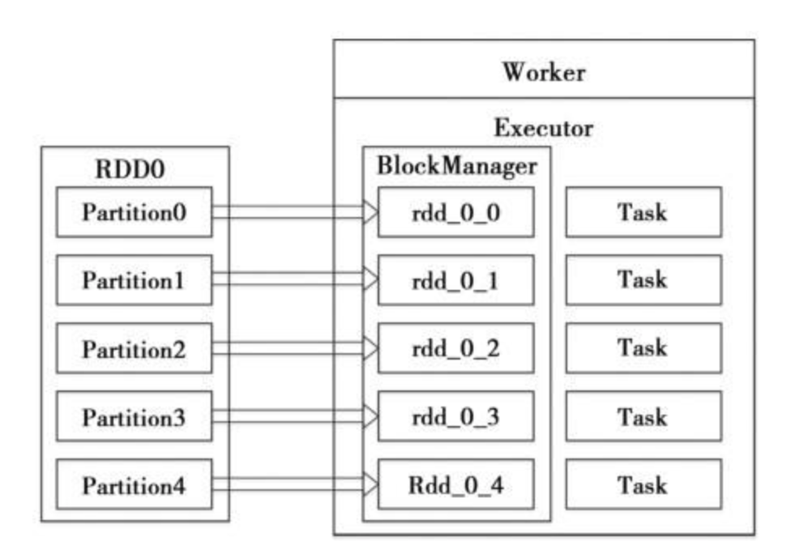
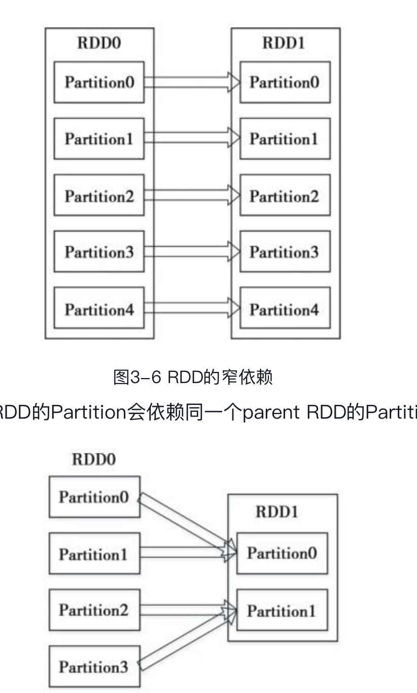
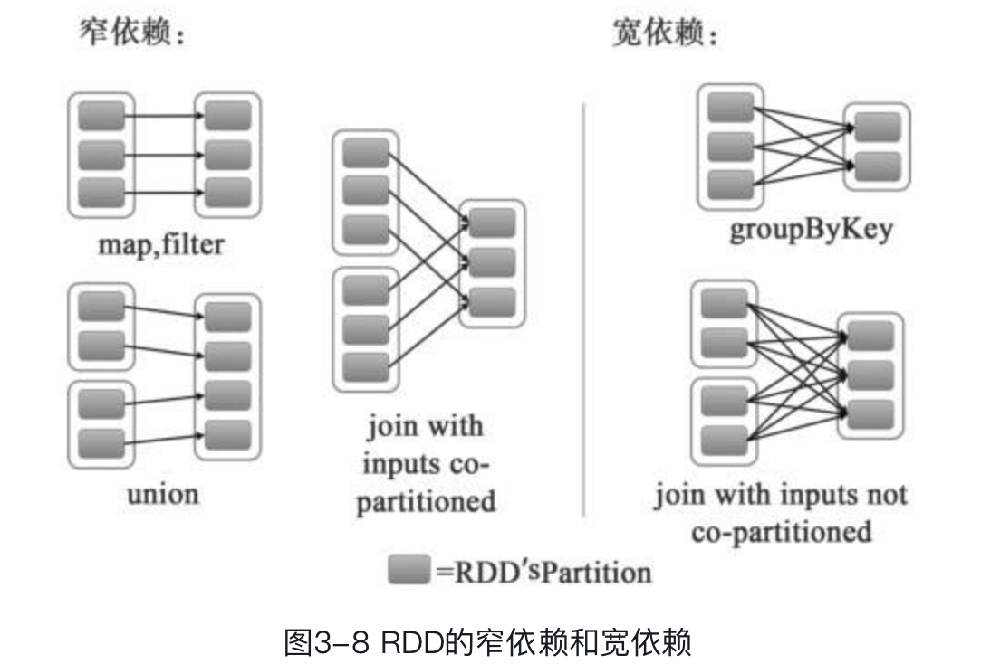

**容错性2种方式**

> * 数据检查点：操作成本高，需要通过数据中心的网络连接在机器之间复制庞大的数据集，而网络带宽往往比内存带宽低得多，同时还需要消耗更多的存储资源（在内存中复制数据可以减少需要缓存的数据量，而存储到磁盘则会降低应用程序速度
> * 记录更新：如果更新太多，记录更新成本也不低。因此，RDD只支持粗粒度转换，即在大量记录上执行的单个操作。将创建RDD的一系列转换记录下来（即Lineage），以便恢复丢失的分区。

> Spark 采用第二种方式。

**什么是RDD**

> RDD 是只读的，分区记录的集合，它有5个主要的属性
>
> * 一组分片：每一个分片都会被一个计算任务处理，默认是采用CPU 的core 数量作为分区数量，
> * 一个计算每个分区的函数，每个RDD都会实现compute 函数用于计算。
> * RDD之间的依赖：RDD每次的转换都会生成一个新的RDD，所以RDD直接会生成类似于流水线一样的前后依赖关系，在部分数据丢失的情况下，spark可以通过这个RDD的依赖关系重新计算得到。
> * 一个Partitioner即RDD的分片函数，当前spark 实现了两种类型的分片函数，一个是基于哈希的HashPartitioner，另外一个是基于范围的RangePartitioner，只有基于(key, value) 的RDD才能会有Partitioner，Partitioner 的分布函数决定了分片数量，也决定了Parent RDD Shuffle 输出分分片数量。
> * 一个列表：存储存取每个Partition的优先位置，这个列表保存的就是每个Partition所在的块的位置。按照“移动数据不如移动计算”的理念，Spark在进行任务调度的时候，会尽可能地将计算任务分配到其所要处理数据块的存储位置。



* RDD 的创建

> 已近存在的Scala 集合创建
>
> 外部系统中读入数据创建

* RDD 的转换


> RDD 中的转换都是惰性的，也就是说并不会直接发生计算结果，它们只是记录这些应用到基础数据集上的转换，当发送一个要求返回计算结果给Driver的动作之后(action)，这些转换才会真正运行。
>
> 如在上图的groupByKey操作中，会在MapPartitionsRDD 做一次shuffle，将分区片变为3个，生成shuffleRDD，然后在执行一个Map 操作。
>
> 默认情况下每一个转换过的RDD都会在它执行一个动作的时候被重新计算，当然如果在执行的过程中执行一次persist或者cache的方法。spark在磁盘或者内存中保存相关元素，下次在执行一个动作的时候就从这里开始执行，而不会整个都执行一遍，可持久化机制也是spark执行快速的一个原因

* spark checkpoint(检查点)

> RDD的缓存能够在第一次计算完成后，将计算结果保存到内存、本地文件系统或者Tachyon中。通过缓存，Spark避免了RDD上的重复计算，能够极大地提升计算速度。但是，如果缓存丢失了，则需要重新计算。如果计算特别复杂或者计算耗时特别多，那么缓存丢失对于整个Job的影响是不容忽视的。为了避免缓存丢失重新计算带来的开销，Spark又引入了检查点（checkpoint）机制。

* RDD 的转换和DAG的生成

> Spark 会以RDD中的转换动作来生成RDD之间的依赖关系，同时计算这个依赖关系生成逻辑上的DAG。

```scala
val file = spark.textFile("hdfs://...")
val counts = file.flatMap(line => line.split(" "))
				.map(world => (world,1))
				.reduceByKey(_+_)
counts.saveAsTextFile("hdfs://")
```



> 如上所示是窄依赖和宽依赖。



> 对于groupByKey 子RDD的所有partition 会依赖于parent RDD的所有的Partitions，子partition是父partition的shuffle结果，所以这两个宽依赖中的RDD是不能通过一个计算任务来完成的，

* DAG(有向无环图) 的生成

> Spark rdd 的一系列转换就称为是一个有向无环图DAG，而spark 中有又根据RDD中不同的依赖关系将DAG划分为不同的阶段，窄依赖被划分在同一个执行阶段中，对于宽依赖由于shuffle 的存在只能在父RDD执行结束之后(所有涉及到的父RDD)才能开始接下来的RDD转换，**所以宽依赖就是spark划分stage的依据，在一个stage内部，每个Partition都会分配一个计算任务(Task)**，这些Task是冰箱执行的，Stage依据的依赖就变为一个大粒度的DAG，这个DAG的执行顺序也是从前向后的，也就是说Stage只有在它没有parent 的Stage 或者 全部的parent Stage 都已经执行完成之后才能够开始执行。

* Task 介绍

> 原始的RDD经过一系列转换之后会在最后一个RDD上触发一个动作，这个动作会生成一个Job(一个action生成一个Job)，在Job被划分为一批计算任务(Task)，这批Task 会被提交到集群上的计算节点去计算，计算节点执行计算逻辑的部分称为是Executor。DAG的最后一个阶段会为每个结果的Partition生成一个ResultTask，其余所有的阶段都会生成ShuffleMapTask。

* 缓存的处理

> RDD的每个Partition对应Storage模块的一个Block，只不过Block是Partition经过处理后的数据。在系统实现的层面上，可以认为Partition和Block是一一对应的.
>
> cacheManager 会通过RDD的id 和 当前计算的Partition的id向storage模块发起查询请求，如果能获取到block的信息，那么直接返回否则代表该RDD的结果是需要计算的。
>
> 而在计算的时候会去检测是否被checkpoint过，如果有，那么读取checkpoint数据，否则调用compute()计算。
>
> 在缓存没有命中的情况下，首先会判断是否保存了RDD的checkpoint，如果有，则读取checkpoint
>
> **那么checkpoint 的RDD是如何写入的呢？**
>
> 在Job 结束之后，会判断是否需要 checkpoint，如果需要就调用org.apache. spark.rdd.RDDCheckpointData#doCheckpoint，doCheckpoint首先为数据创建一个目录，然后启动一个新的Job来计算，并且将计算结果写入新创建的目录，接着创建一个org.apache.spark.rdd.CheckpointRDD；最后，原始RDD的所有依赖被清除，这就意味着RDD的转换的计算链（compute chain）等信息都被清除，然后调用数据写入的实现在org.apache.spark.rdd.CheckpointRDD$#writeToFile  持久化CheckpointRDD
>
> 至此 CheckpointRDD完成，CheckpointRDD的读取可以使用readFromFile读取

* RDD 的计算逻辑

> org.apache.spark.rdd.RDD#compute

* RDD 的容错机制

> RDD基于lineage(血统)的容错机制。RDD的转换关系，构成了computechain，可以把这个compute chain认为是RDD之间演化的Lineage。在部分计算结果丢失时，只需要根据这个Lineage重算即可。

* 小结

> RDD是Spark最基本，也是最根本的数据抽象。RDD是只读的、分区记录的集合。RDD只能基于在稳定物理存储中的数据集和其他已有的RDD上执行确定性操作来创建。
>
> RDD不需要物化。RDD含有如何从其他RDD衍生（即计算）出本RDD的相关信息（即Lineage），据此在RDD部分分区数据丢失时可以通过物理存储的数据计算出相应的RDD分区。


