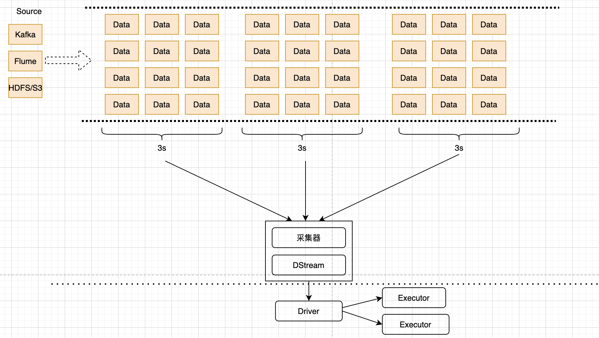
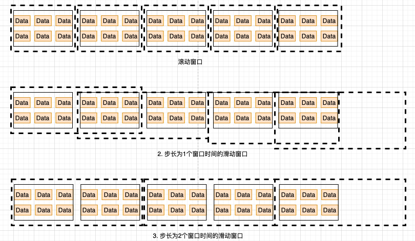
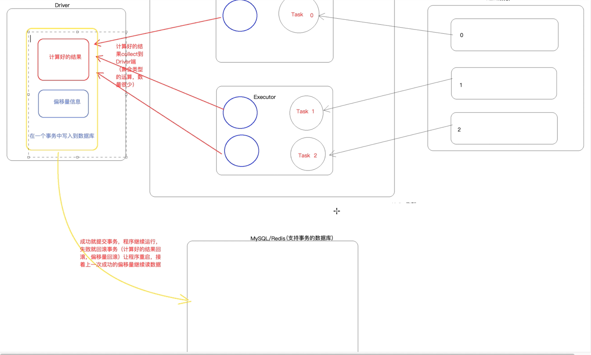

> * **微批次**
> * **准实时**，微批的产生会有一些延时
> * `Application(Driver)` 一直运行

> `Driver` 和 `Executor` 是不停止的，且之间的通信不间断的，且`Driver` 是不停的向集群提交任务的。如我们启动的`spark-shell`, 那么这个线程是不停的，那么在这个`shell` 中不停的执行`action` 操作，给集群提交`job`, 当这个提交的频率快一些，那么就可以认为是流式的执行方式。
>
> `sparkStreaming` 提交的任务是一直运行的，不停的提交`job`，每次提交的`job`使用的数据变少(微批，每个微批是一个` job`)，数据是一直往这个程序中流入的。
>
> 每隔一个时间段，从外面读数据，读进来的数据就成为一个微批，然后提交这个微批，准实时，产生一个 `job`。
>
> `spark` 基本是可以满足一般的需求，延时个几秒钟，几分钟也是可以的。

* 可容错
* 高吞吐
* 可扩展
* 编程API 丰富
* 可以保证 `exectly once` 语义

缺点：

* 有一定的延迟

#### 概览


`sparkStreaming` 提供了高阶抽象`DStream`,  代表着持续的数据流，也可以看做是一个序列的`rdd`  抽象。

#### wordcount 例子

```scala
val spark = SparkSession
.builder()
.master("local[2]")
// 这里的 core 至少需要有2个，因为一个被 receiver 占了，剩下的被计算逻辑占用
.getOrCreate()

val sc = spark.sparkContext
// sc 用来创建 RDD
sc.setLogLevel("ERROR")

// sparkStreaming 中只有一种时间语义，processTime
val ssc = new StreamingContext(sc, Seconds(2)) // 一个小批次产生的时间间隔
ssc.sparkContext.setLogLevel("WARN")
// ssc 创建实时计算抽象的数据集 DStream

val lines: ReceiverInputDStream[String] = ssc.socketTextStream("localhost", 9999)

// 实时的 wordcount
val value: DStream[String] = lines.flatMap(_.split(" "))
val value1: DStream[(String, Int)] = value.map(a => (a, 1))

val value2: DStream[(String, Int)] = value1.reduceByKey((a, b) => a + b)

value2.print()

// 开启
ssc.start()

// 让程序一直运行, 将Driver 挂起
ssc.awaitTermination()
```


#### 基本概念

##### DStream



> `Discretized Stream`: 是对连续 `stream` 的抽象。是为一系列的`RDD` 的抽象。(`represents a continuous stream of data`)
>
> 是对`SparkSream` 的最基本的封装，也是抽象的分布式集合，也是封装这描述信息，是对`RDD` 的进一步封装，`DStream` 可以定期的生成 `RDD`
>
> `DStream` 可以从很多的数据源创建
>
> 你对 `DStream` 进行操作，本质但是是对 `DStream` 中的`RDD` 进行操作，你的 `RDD` 的每一个分区进行操作
>
> `DStream`上的方法也分为 `transformation` 和 `action`，还有一些方法既不是 `Transformation` 也不是 `action`，比如`foreachRDD`，调用 `Transformation` 后可以生成一个新的 `DStream`

##### **Receiver**

**Basic Souce**:  在 `StreamingContext`中可以使用的API，如 `systems`, and` socket connections`.

**Advanced source**: `Kafka`, `Kinesis` 等，他们需要和外部依赖才能够使用， 连接kafka 通过连接到 zookeeper 发现分区，然后读取到数据

需要注意的是如果使用了`Receiver` 那么就不能够设置 `master("local[1]")/master("local")`

是可以从多个 `source` 中接受数据的，会有多个 `DStream`，如我们可以从`kafka` 的多个分区中使用多个`Receiver`同时读数据，但这个时候注意`core` 的设置。

也可以有多个 receiver 作为作业的输入。不过这个时候需要注意 core 的配置，因为 Executor 需要一个专门的 core 作为 receiver 接受数据。

在上面的例子中设置了`socketTextStream` 作为源，`sparkStreaming` 还支持其他的源如，

`StreamingContext.fileStream[KeyClass, ValueClass, InputFormatClass]`

可以从 `HDFS/S3/NFS` 等读取数据。

还可以自定义

```scala
class MyReceiverCls extends Receiver[String](StorageLevel.MEMORY_ONLY)
```

**Receiver** 连接，如果数据太多消费不来，还会有一种 `Write ahead log` 的方式写到磁盘


##### 直连方式

直接通过 kafka 底层的api , 直接连接到 kafka 的分区中,按需拉取数据,且还有一种按压机制, 可以调节获取数据,如果生产的数据太多,那么阀门调小,这样进来的数据就比较的少了,如果消费的数据比较多,那么可以将阀门调大一些,使得读进来的数据更多一些,通过反馈,一种自我调节的功能。

*`spark 3.0`  目前是只支持这种直连的方式了。*

**直连**注意这里是说，`spark` 的 `source` 直接连接到 `kafka` 的分区，也就是读进来的 `Source` 的 `RDD` 的分区和 `kafka` 的分区是一样的。一个`kafka` 的分区，对应`spark RDD` 中的一个分区。


* 架构如下/工作机制


1.启动StreamingContext

2.StreamingContext启动receiver，该receiver会一直运行在Executor的task中。用于连续不断地接收数据源，有两种主要的reciver，一种是可靠的reciver，当数据被接收并且存储到spark，发送回执确认，另一种是不可靠的reciver，对于数据源不发送回执确认。接收的数据会被缓存到work节点内存中，也会被复制到其他executor的所在的节点内存中，用于容错处理。

3.Streaming context周期触发job(根据batch-interval时间间隔)进行数据处理。

4.将数据输出。


* 背压机制

接受数据和消费速率不匹配的时候的问题。

1. 消费 > 产生：会有executor 空转，浪费资源。
2. 消费 < 产生: 数据消费不过来，数据积压。

背压机制就是： 根据 `JobScheduler` 反馈作业的执行信息来动态调整Receiver 的数据接受率。

`spark.streaming.backpressure.enable` 来控制是否启动背压(`backpressure`) 默认是关闭的。

---

#### Queue of RDDs as a Stream

这个是测试的时候使用的，数据流从 queue 中生成出来。

#### 自定义数据源

---

#### 集成 kafka 数据源

`DirectAPI`,  是由计算的`Executor` 来主动消费 `kafka` 的数据，速度由自己确定。

---

#### DStream 转换

`DStream` 上的操作和 `RDD` 是类似的，分为 `Transformation` 和 `OutputOperations` 2 种，此外转换操作中海油一些比较特殊的原语，如`updateStateByKey`， `transform`  以及各类和 `Window` 相关的原语。

##### 无状态转换操作

就是将简单的 `RDD` 转换操作应用到每个批次上，也就是转换 `DStream`

##### 有状态

使用的时候需要使用到 `sparkStreaming checkpoint`，设置一个存储路径

`updateStateByKey`

```scala
val spark = SparkSession
.builder()
.master("local[2]")
// 这里的 core 至少需要有2个，因为一个被 receiver 占了，剩下的被计算逻辑占用
.getOrCreate()

val sc = spark.sparkContext
// sc 用来创建 RDD
sc.setLogLevel("ERROR")

val ssc = new StreamingContext(sc, Seconds(3)) // 一个小批次产生的时间间隔
ssc.sparkContext.setLogLevel("WARN")
// ssc 创建实时计算抽象的数据集 DStream

// checkpoint 存储路径，用于缓冲有状态操作的时候产生的状态。
ssc.checkpoint("cp")

val lines: ReceiverInputDStream[String] = ssc.socketTextStream("localhost", 9999)

// 无状态数据操作，只对当前的采集周几数据进行处理
val value: DStream[String] = lines.flatMap(_.split(" "))

val value1: DStream[(String, Int)] = value.map(a => (a, 1))

val value2 = value1.updateStateByKey((seq: Seq[Int], buffer: Option[Int]) => {
  val existValue = buffer.getOrElse(0) + seq.sum
  Option(existValue)
})

value2.print()

// 开启
ssc.start()

// 让程序一直运行, 将Driver 挂起
ssc.awaitTermination()
ssc.stop()
```

需要做2件事情

* 定义状态，
* 定义状态的更新函数
* 以及设置 `checkpoint` 的存储路径


##### sparkStreaming 独有的 `transform`

方法，该方法允许`DStream` 上执行任意的`RDD-to-RDD` 的函数，即使这些函数并没有在 `DStream` 的 `API` 中暴露出来，通过该函数可以放慢的扩展`Spark API` 该函数每一批调度一次，其实也就是对 `DStream` 中的 `RDD` 做应用转换。

```
获取底层的 rdd 获取，然后在返回这些 rdd
该 api 的功能
由于在 DStream 中有时候也需要很多的 api，但是呢，这些 api 在rdd 中已经实现了
所以在 DStream 在实现一遍就有些冗余了，所以如果在 DStream 中能够获得底层的 rdd
并且可以操作，实现一些功能，那么就加强了 DStream 的功能
```

---

#### 窗口操作

`DStream` 将多个数据采集周期放到一个窗口中(作为一个整理处理)。

```
// 这里的周期的设置是和 批次产生的时间间隔是相关的
// 窗口的范围应该是采集周期的整数倍，
// 如果只给一个时间参数，那么就是一个滚动参数，步长就是一个批次时间间隔
// 还可以传入第二个参数，这个参数就是步长，这个时候就是一个滑动窗口
// 注意这里是会产生一个同一个数据出现在多个窗口中，出现重复统计
// 滑动步长: 隔多久触发一次计算
```

window 还有一些计算方式

* `countByWindow(windowLength, slidInterval)`  返回一个滑动窗口计数流中的元素个数。
* `reduceByWindow(func, windowLength, slidInterval)`  通过使用自定义函数整合滑动区间流元素来创建一个新的单元素流。
* `reduceByKeyAndWindow(func, windowLength, slidInterval, [numTasks])`  当在一个 (K,V) 对的`DStream` 上调用此函数，会返回一个新的(K,V) 对的 `DStream`， 此处通过对滑动窗口中批次数据使用 `reduce ` 整和每个 `key` 的 `value` 值.
* `reduceByKeyAndWindow(func, invFunc, windowLength, slidInterval, [numTasks])`  这个函数是上述函数的变化版本，没和窗口的reduce 值都通过前一个窗的 `reduce` 值都是通过有前一个窗口的reduce 值来递增计算，通过reduce 进入到滑动窗口数据合并反向reduce 离开窗口的旧数据来实现这个操作，一个例子就是随着窗口滑动对 `keys` 的加、减，计数，通过前面介绍可以想到，每个函数只使用于可逆的 reduce 函数，也就是这些reduce 函数相应的 反reduce 函数(invFunc形式传入)。

```scala
def main(args: Array[String]): Unit = {

  val spark = SparkSession
  .builder()
  .master("local[2]")
  // 这里的 core 至少需要有2个，因为一个被 receiver 占了，剩下的被计算逻辑占用
  .getOrCreate()

  val sc = spark.sparkContext
  // sc 用来创建 RDD
  sc.setLogLevel("ERROR")

  val ssc = new StreamingContext(sc, Seconds(3)) // 一个小批次产生的时间间隔
  ssc.sparkContext.setLogLevel("WARN")

  val lines: ReceiverInputDStream[String] = ssc.socketTextStream("localhost", 9999)

  val value: DStream[(String, Int)] = lines.map(a => (a, 1))

  // 这里的周期的设置是和 批次产生的时间间隔是相关的
  // 窗口的范围应该是采集周期的整数倍，一个窗口中收集若干个 microBatch
  // 如果只给一个时间参数，那么就是一个滚动参数，步长就是一个批次时间间隔
  // 还可以传入第二个参数，这个参数就是步长，这个时候就是一个滑动窗口
  // 注意这里是会产生一个同一个数据出现在多个窗口中，出现重复统计
  // 滑动步长: 隔多久触发一次计算
  val value1: DStream[(String, Int)] = value.window(Seconds(9))
  //    val value1: DStream[(String, Int)] = value.window(Seconds(9), Seconds(3))
  val value2: DStream[(String, Int)] = value1.reduceByKey(_ + _)

  value2.print()

  // 开启
  ssc.start()
  // 让程序一直运行, 将Driver 挂起
  ssc.awaitTermination()

  ssc.stop()
```

`value.window(Seconds(9))` 只有这个参数的时候

```scala
def window(windowDuration: Duration): DStream[T] = window(windowDuration, this.slideDuration)

/**
   * Return a new DStream in which each RDD contains all the elements in seen in a
   * sliding window of time over this DStream.
   * @param windowDuration width of the window; must be a multiple of this DStream's
   *                       batching interval
   * @param slideDuration  sliding interval of the window (i.e., the interval after which
   *                       the new DStream will generate RDDs); must be a multiple of this
   *                       DStream's batching interval
   */
def window(windowDuration: Duration, slideDuration: Duration): DStream[T] = ssc.withScope {
  new WindowedDStream(this, windowDuration, slideDuration)
}
```

如上的源码中的信息，`windowDuration` 也就是第一个参数，如果只使用第一个参数，那么是一个滚动窗口，参数值需要是`batchDuration` 的整数倍，这样一个窗口就可以将若干个`microBatch` 中的信息放进来。

`window(windowDuration: Duration, slideDuration: Duration)` 给2个参数，那么就是一个滑动参数，滑动的步长也应该是`batchDuration` 的整数倍，分别如下所示：



如上在的个截图中，当窗口大小为2，步长为1的时候，那么会有一个批次数据的重复。针对这个批次的数据的重复，又有另外一个算子

```scala
def reduceByKeyAndWindow(
      reduceFunc: (V, V) => V, // 新数据聚合操作
      invReduceFunc: (V, V) => V, // 重复数据的操作
      windowDuration: Duration, // 需要是batch 时间的整数倍
      slideDuration: Duration, // 需要是batch 时间的整数倍
      partitioner: Partitioner,
      filterFunc: ((K, V)) => Boolean
    ): DStream[(K, V)]
```

使用

```scala
val spark = SparkSession
.builder()
.master("local[*]")
// 这里的 core 至少需要有2个，因为一个被 receiver 占了，剩下的被计算逻辑占用
.getOrCreate()

val sc = spark.sparkContext
// sc 用来创建 RDD
sc.setLogLevel("ERROR")

val ssc = new StreamingContext(sc, Seconds(3)) // 一个小批次产生的时间间隔
ssc.sparkContext.setLogLevel("WARN")

ssc.checkpoint("cp")

// ssc 创建实时计算抽象的数据集 DStream
val lines: ReceiverInputDStream[String] = ssc.socketTextStream("localhost", 9999)

val value: DStream[(String, Int)] = lines.map(a => (a, 1))

// 是属于有状态计算
val value1: DStream[(String, Int)] = value.reduceByKeyAndWindow(
  (x: Int, y:Int) => x+y,  // 新数据增加
  (x: Int, y: Int) => x-y, // 对于重复数据，需要键一个值
  Seconds(6),
  Seconds(6)
)

val value2: DStream[(String, Int)] = value1.reduceByKey(_ + _)


value2.print()

// 开启
ssc.start()

// 让程序一直运行, 将Driver 挂起，阻塞线程，后面的代码执行不到。
ssc.awaitTermination()

// 优雅关闭
// stop(stopSparkContext: Boolean, stopGracefully: Boolean)
// 也就是 executor 先将当前的数据处理完毕，之后再去关闭，而不是直接关闭
// 不能再同一个线程中执行，需要在另外一个线程中执行，并且通过外部的一个按钮能够控制这个线程，
// ssc.stop(true, true)
}
```

---

#### DStream 输出

输出操作指定了对流数据经转化操作得到的数据所要执行的操作，例如将数据结果推入到外部数据库或者输出到屏幕上，和RDD 中的惰性求值类似，如果一个DStream 及其派生的DStream 都没有被执行输出操作，那么这些DStream 就不会被求值，如果StreamingContext 中没有设定输出操作，整个context 就都不会启动。

输出操作如下：

`print()`

`saveAsTextFiles`

`foreachRDD`: 获取到底层的 `RDD` 来操作。

---

#### 关闭

---

#### streaming 一些实践

* 首先docker 启动一个 kafka 的单机版

[单机安装 kafka](https://my.oschina.net/u/4288942/blog/4061317)

[使用](https://segmentfault.com/a/1190000021746086)

```javascript
docker run -d --name zookeeper -p 2181:2181  wurstmeister/zookeeper
docker run -d --name kafka -p 9092:9092 -e KAFKA_BROKER_ID=0 -e KAFKA_ZOOKEEPER_CONNECT=zookeeper:2181 --link zookeeper -e KAFKA_ADVERTISED_LISTENERS=PLAINTEXT://10.205.20.6:9092 -e KAFKA_LISTENERS=PLAINTEXT://0.0.0.0:9092 -t wurstmeister/kafka

```

```javascript
docker exec -it kafka sh


./bin/kafka-console-producer.sh --broker-list 10.205.20.6:9092 --topic sparkstreaming

// 在另一个窗口打开容器命令窗口，运行一个消费者：172.17.0.3 是 kafka容器的ip。
// 可以通过进入kafka容器的命令窗口（docker exec -it ba2540992d9e /bin/bash），使用ifconfig查看ip。

./bin/kafka-console-consumer.sh --bootstrap-server 10.205.20.6:9092 --topic sparkstreaming

// 查看偏移量信息, 存放在 __consumer_offsets topic 中
./bin/kafka-console-consumer.sh --bootstrap-server 172.17.0.3:9092 --topic __consumer_offsets --formatter "kafka.coordinator.group.GroupMetadataManager\$OffsetsMessageFormatter" --consumer.config /opt/kafka_2.13-2.7.0/config/consumer.properties --from-beginning

// 这里看到到的信息会隔一几秒钟进行更新，__consumer_offsets 有50个分区，里面有偏移量信息，默认消费者会自动的提交消费信息的偏移
// 量信息, 然后在启动消费者的时候，会从这个分区中读最新的取偏移量，然后开始根据偏移量再去读到信息，防止信息的重复消费
// 每个分区有自己的偏移量
// 自动提交偏移量会不进准，在读取消息之后，是已经消费了，但是程序挂掉了还没有提交偏移量，这个时候下次读的时候还是会读取到已经消费了
// 的这个消息，出现重复读，控制不够精准

// 可以程序控制提交偏移
```

在代码中设置

```scala
"enable.auto.commit" -> (false: java.lang.Boolean) // 不自动提交偏移量
```

在我的例子中并没有将自动提交关闭掉，所以使用另外一种方式

```scala
./bin/kafka-console-producer.sh --broker-list localhost:9092 --topic sparkstreaming

./bin/kafka-topics.sh --create --zookeeper localhost:2181 --partitions 2 --replication-factor 2 --topic sparkstreaming1
--config enable.auto.commit=false

./bin/kafka-topics.sh --bootstrap-server 172.17.0.3:9092 --create --topic sparkstreaming1 --partitions 1 --replication-factor 1 --config enable.auto.commit=false

```


---

#### sparkStreaming 有状态编程

DStream的转换分为有状态和无状态两种。无状态的操作，即当前批次的处理不依赖于先前批次的数据，如map()、flatMap()、filter()、reduceByKey()、groupByKey()等等;

而有状态的操作，即当前批次的处理需要依赖先前批次的数据，这样的话，就需要跨批次维护状态。

spark streaming中的状态操作:

* updateStateByKey
* mapWithState
* window的状态操作。
  * `reduceByKeyAndWindow(reduceFunc: (V, V) => V,invReduceFunc: (V, V) => V,windowDuration: Duration,slideDuration: Duration = self.slideDuration,numPartitions: Int = ssc.sc.defaultParallelism,filterFunc: ((K, V)) => Boolean = null): DStream[(K, V)]`
  * `reduceByKeyAndWindow(reduceFunc: (V, V) => V,windowDuration: Duration,slideDuration: Duration): DStream[(K, V)] `

对于普通版的reduceByKeyAndWindow，每个滑动间隔都对窗口内的数据做聚合，性能低效。
对于一个滑动窗口，每一个新窗口实际上是在之前窗口中减去一些数据，再加上一些新的数据，从而构成新的窗口。增量版的reduceByKeyAndWindow便采用这种逻辑，通过加新减旧实现增量窗口聚合。reduceFunc,即正向的reduce 函数(如_+_)；invReduceFunc，即反向的reduce 函数(如 _-_)。

---

#### sparkStreaming 实现exactely onece 

##### 简单的方法

* 程序自动提交kafka 偏移

* 手动提交 kafka 偏移

##### 借助外界的事务存储，数据消费结果和kafka 偏移保持一致

* 聚合操作的时候，将结果和偏移量均存储在如mysql 的事务型数据库中，保证存储过程是在一个事务中



* 如果不是聚合操作，那么涉及到的数据量会很多，不可能将数据拿到Driver 端

在Driver 端将数据和偏移量写到如 `Hbase` 中，Hbase 是支持行级别的事务，保证一条数据对应一条偏移量就可以实现精确消费一次了。

habse一行的数据 是有事务的，这一行要么都成功，要么都失败，

因此，我们可以为一个hbase表添加一个offset列族，每次写入一条数据就将offset一并写入,这样就能保证数据的消费和偏移量的记录是同时成功同时失败的

另外一点，利用hbase不需要把数据收集到driver端再写入，前两种都需要把数据收集到driver端，再通过事务、pipeline控制。利用hbase可以再executor端执行，

所以数据量大的话，hbase比较适合，mysql redis只适合每个批次中数据量小的。

---


