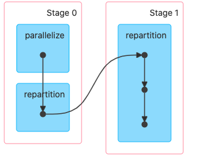

#### `value.repartition(4)`

> 数据打散，全部重新分区计算，会发生 shuffle



```scala
value.repartition(4)

def repartition(numPartitions: Int)(implicit ord: Ordering[T] = null): RDD[T] = withScope {
  coalesce(numPartitions, shuffle = true)
}

def coalesce(numPartitions: Int, shuffle: Boolean = false,
             partitionCoalescer: Option[PartitionCoalescer] = Option.empty)
(implicit ord: Ordering[T] = null)
: RDD[T] = withScope {
  require(numPartitions > 0, s"Number of partitions ($numPartitions) must be positive.")
  if (shuffle) {
    /** 
    Distributes elements evenly across output partitions, starting from a random partition. 		
    第一步：先将一个一个分区中的数据 map 为 (Int, Iterator[T])
    也就是最上面的 stage0 中的 repartition，这里面是一个 mapPartitionRDD 
    
    */
    val distributePartition = (index: Int, items: Iterator[T]) => {
      // 这里的 index 就是老的 rdd 数量 index
      // 给了 seed 以及 bound 参数，这里生成的 position 是不变的。
      var position = new Random(hashing.byteswap32(index)).nextInt(numPartitions)
      items.map { t =>
        // Note that the hash code of the key will just be the key itself. The HashPartitioner
        // will mod it with the number of total partitions.
        position = position + 1
        (position, t)
      }
    } : Iterator[(Int, T)]

    // include a shuffle step so that our upstream tasks are still distributed
    // 第四步：将shuffle 后的 ShuffledRDD 在包装为 CoalescedRDD，这个时候返回的函数 (Int, Iterator[Int])
    new CoalescedRDD(
      // 第三步：这里也传入了 HashPartitioner 所以这里完成了 shuffle 返回 ShuffledRDD
      new ShuffledRDD[Int, T, T](
        // 第二步：这里将上面定义的 mapPartitionRDD 操作传入操作，
        mapPartitionsWithIndexInternal(distributePartition, isOrderSensitive = true),
        new HashPartitioner(numPartitions)),
      numPartitions,
      partitionCoalescer).values
      // 最后执行 values,完成 (Int, Iterator[Int]) -> Iterator[Int]
      // 这里返回一个 MapPartitionsRDD
  } else {
    // 如果不 shuffle
    new CoalescedRDD(this, numPartitions, partitionCoalescer)
  }
}

// 根据上面的注释，完成一个 repartition 所经历的 RDD 有
// mapPartitionRDD -> ShuffledRDD -> CoalescedRDD -> mapPartitionRDD
// 所以上面的 DAG 图中有4个点点，分别就是这4个RDD
```

#### `coalesce`

```scala
val value: RDD[Int] = sc.parallelize(List(1, 2, 3, 4,5,6,7,8), 2)

println("aaaaaa " + value.getNumPartitions) // 分区数是 2
val value1: RDD[Int] = value.coalesce(4, false)
println("aaaaaa " + value1.getNumPartitions) // 这里分区数还是不变，是2
```

> `coalesce` 默认情况下是不发生 `shuffle` 的，所以如果是想将分区数变大，那么就是不能使用该算子的，因为分区数变大那么必然发生 `shuffle`，而该算子默认是不发生 `shuffle` 的。
>
> 当然也是可以既想讲分区数减少，且讲数据打散，那么设置 `shuffle=true`
>
> 或者 `repartition(num)`