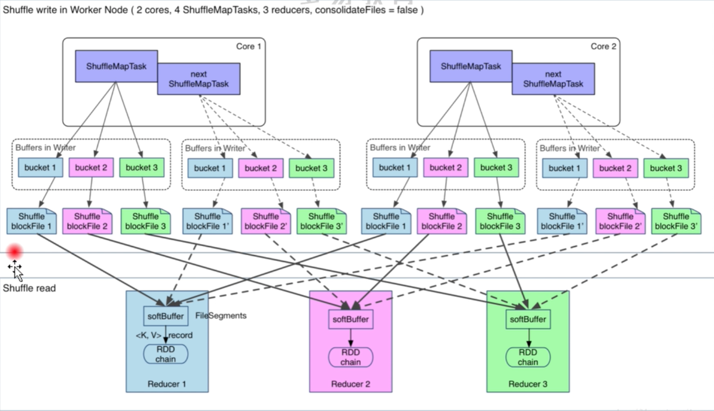
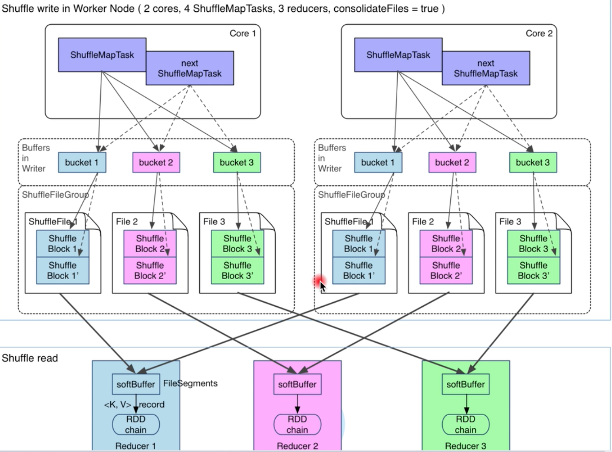
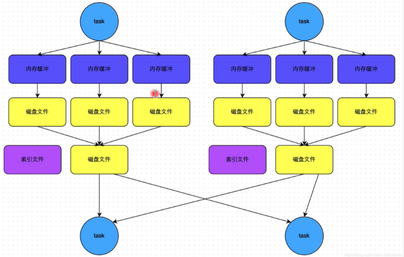
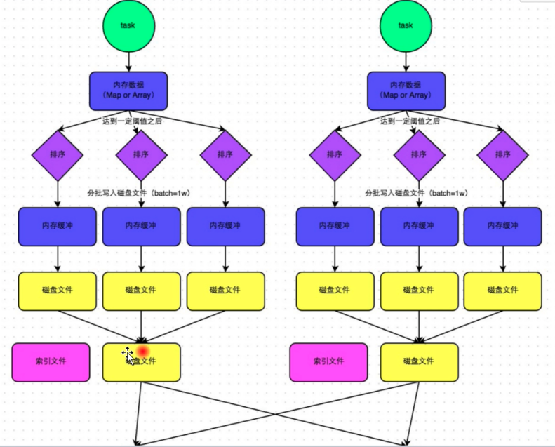

#### `shuffle` 优化之前

应用分区器，根据对应的分区规则，

1. 计算出数据的`partition` 编号，
2. 然后将数据写入`bucket` 内存中(`partition 中`)，
3. 当数据达到一定大小或者数据全部处理完后，将数据写出到持久化，之所以要持久化，一方面是减少内存存储空间压力，另一放是为了容错`降低数据恢复`代价。

下游根据`partition` 编号，从持久化中，这种情况下，总共会产生`shuffleMapTask 数量` * `下游shuffleRead 数量`， **这样就会产生很多很多的小文件**，这样的结果就是在读取数据的时候性能会很低。

#### `shuffle` 优化后

将每个`core` 中的鞋的`bucket` 进行结合，那么产生的小文件个数就是

`上游 core 个数 * 下游shuffleRead partition 数量`

如果`core` 比较大，这里的产生的分区小文件还是会比较的大。

中间类型有`数据文件` 和 `index文件`

#### 继续优化 `SortShuffleManager` 

它里面会有3种逻辑

* `ByPassMergeSortShuffleWriter`

使用它的条件是：

1. 没有 `map` 端的聚合操作
2. 分区数量小于参数：`spark.shuffle.sort.bypassMgergeThread`默认是200.

如`groupByKey算子`。它适用于没有聚合，数据量不大的场景，给每个分区分配了一个临时文件，对每个 `record` 的key使用分区器(模式是 hash，如果用户自定义就使用自定义的分区器)找到哦啊对应分区的输出文件并写入文件对应的文件。

因为写入磁盘文件是通过`Java` 的 `BufferdOutputStream` 实现的,`BufferdOutputStream` 是`Java` 的缓冲输出流，首先会将数据缓冲到内存中，当内存缓冲满了之后再一次写入到磁盘中，这样就可以减少磁盘 `IO` 次数，提升性能，所以图中会有内存缓冲的概念。

* `UnsafeShuffleWriter`

使用该策略需要满足

1. `Serializer` 支持`relocation`,`Serializer` 支持`relocation`是说，`Serializer` 可以对已经序列化的对象惊喜排序，这种排序起到的效果就是和先前对数据排序在做序列化一直，支持 `relocation`的`Serializer`有`KeyoSerializer`, `spark` 默认使用`JavaSerializer`, 可以通过 `spark.serializer` 设置。

2. 没有指定`aggregation` 或者 `key` 排序

3. `partition` 数量不能大于当前指定的阈值(2^24)

`UnsafeShuffleWriter`将`record` 序列化后插入`sorter`，然后对已经序列化的`record` 进行排序，并在排序完成后写入磁盘文件作为`spill file`，在将多个文件合并为一个输出文件，在合并时候回基于文件的数量选择合适的合并策略。

* `SortShuffleWriter`

如果上面的2个策略都不能使用那么使用该策略

1. `SortShuffleWriter` 先将数量写入到内存中，并会尝试扩展内存大小，若内存不足，则把数据持久化到磁盘中
2. `SortShuffleWriter`将数据写入到磁盘时候，会按照分区进行和并，并对key 进行排序，然后写入到分区的临时文件中
3. `SortShuffleWriter` 最后把前面写的临时文件进行合并，合并为一个文件，也就是说和在 map 操作结束时候将各个分区文件合并为一个文件，这样做可以有效的减少文件个数以及为了维护这些文件而产生的资料消耗

