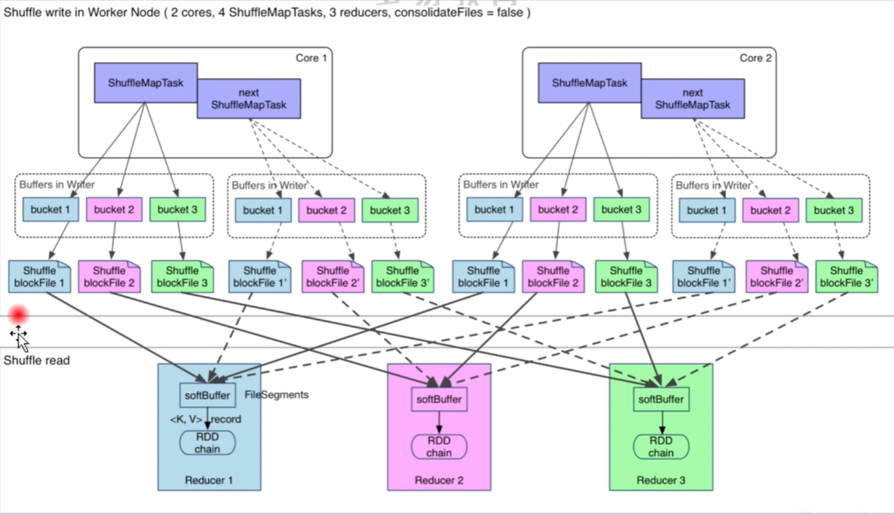
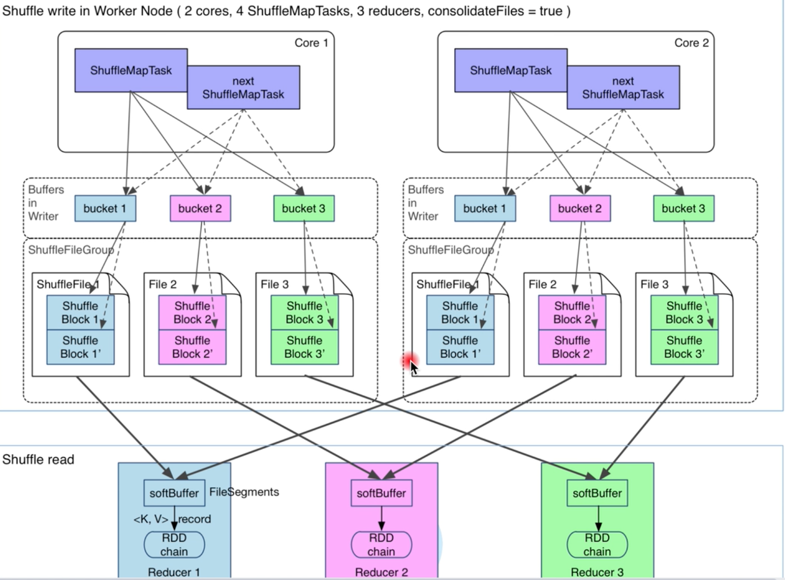
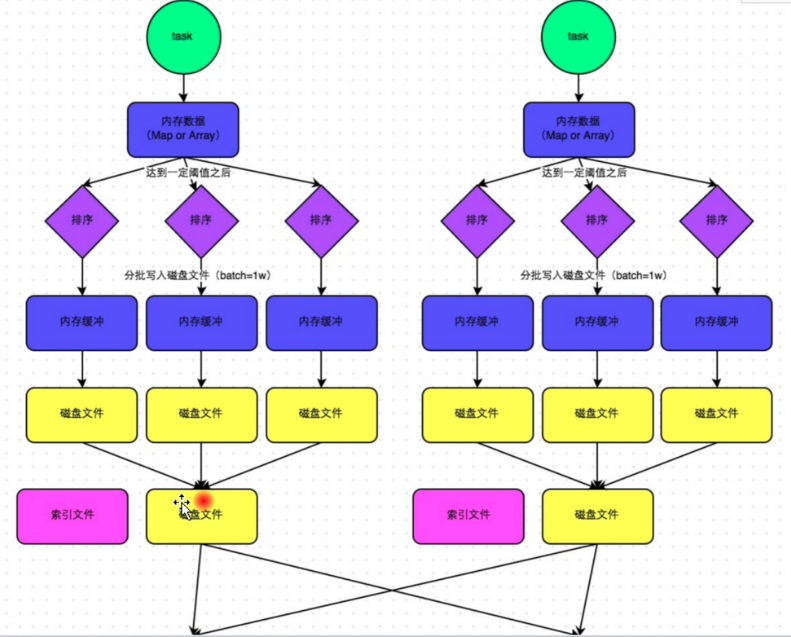

#### `shuffle` 优化之前

大多数的`Spark` 作业的性能主要是消耗在了 `shuffle` 环节，因为该环节涉及到了大量的磁盘`IO`、序列化、网络数据传输等操作，所以在有必要对 `shuffle` 进行调优，但是它的调优并不是写大数据程序需要专注的，其主要还是专注资源、代码、以及数据倾斜。

`spark1.2` 版本以前的 `shuffleManager` 是使用的 `HashShuffleManager`,  会产生很多的小文件，随后的版本中使用到了`SortShuffleManager`

#### `HashShuffleManager`

应用分区器，根据对应的分区规则

1. 计算出数据的`partition` 编号
2. 然后将数据写入`bucket` 内存中(`partition 中`)
3. 当数据达到一定大小或者数据全部处理完后，将数据写出到持久化，之所以要持久化，一方面是减少内存存储空间压力，另一放是为了容错`降低数据恢复`代价(`shuffle` 的恢复非常的昂贵，因为需要从上游重新计算，然后`write` 数据)。

针对下游 `task` 个数，将对应的多个的缓存模块，然后缓存满之后，将数据写入。

下游根据`partition` 编号，从持久化中，这种情况下，总共会产生`shuffleMapTask 数量` * `下游shuffleRead 数量`， **这样就会产生很多很多的小文件**，会有很多的 `IO`操作，这样的结果就是在读取数据的时候性能会很低。还有就是小文件的读写效率低，会发生很多的`open`, `close`等操作，对系统资源浪费比较多。

这种方式也是有一些好处的，那就是下游的`read shuffle` 直接对属于自己的那个文件直接读取就可以了。

综合来说存在的问题就是：

* 小文件太多，系统频繁打开关闭文件操作，效率低。
* 一个小文件有一个缓冲区 `bucket`，占用内存空间大。

#### HashShuffleManager 优化后

*对小文件数量进行优化*

将每个`core` 中的鞋的`bucket` 进行结合，那么产生的小文件个数就是

产生的小文件数量还是更加下游的`task`数量的，只不过这优化前不一样的是这里只有一个`Executor` 产生一组缓存，而不想优化前，一个`Task` 产生一组，在优化后，一个`Executor` 中的所有的`Task` 共享缓存文件。

`上游 core 个数 * 下游 shuffleRead partition 数量`

以`core` 为单位写到同一个`task` 中，因为`core` 中跑的多个 `Task` 是属于同一个线程的。

如果`core` 比较大，这里的产生的分区小文件还是会比较的大。

上面使用的 `HashShuffleManager` 在数据磁盘，还有一个`index` 文件，用于表示这个数据是属于哪个下游的`task`

#### 继续优化 `SortShuffleManager` 

它里面会有几种逻辑

* `ByPassMergeSortShuffleWriter`

使用它的条件是：

1. 没有 `map` 端的聚合操作
2. `shuffle read` 分区数量小于参数：`spark.shuffle.sort.bypassMgergeThread`默认是200.

如`groupByKey算子`。它适用于没有聚合，数据量不大的场景，给每个分区分配了一个临时文件，对每个 `record` 的 `key`使用分区器(模式是 `hash`，如果用户自定义就使用自定义的分区器)找到对应分区的输出文件并写入文件对应的文件。

因为写入磁盘文件是通过`Java` 的 `BufferdOutputStream` 实现的,`BufferdOutputStream` 是`Java` 的缓冲输出流，首先会将数据缓冲到内存中，当内存缓冲满了之后再一次写入到磁盘中，这样就可以减少磁盘 `IO` 次数，提升性能，所以图中会有内存缓冲的概念。

索引文件表示这磁盘文件中的哪些数据是在下游的那个 `task` 中。

这里如何理解 `bypass` 呢？ 它的英文含义是`绕开`，也就是绕开排序这个过程，因为使用到`bypassShuffleManager` 的是其分区是小于200的，所以数据量会比较的少，所以仅仅根据 索引文件能够快速定位到数据。

* `UnsafeShuffleWriter`

如果不满足第一个条件，那么继续判断

1. `Serializer` 支持`relocation`,`Serializer` 支持`relocation`是说，`Serializer` 可以对**已经序列化的对象进行排序**，这种排序起到的效果就是和先前对数据排序在做序列化一致，支持 `relocation`的`Serializer`有`KeyoSerializer`, `spark` 默认使用`JavaSerializer`, 可以通过 `spark.serializer` 设置。

2. 没有指定`aggregation` 或者 `key` 排序

3. `partition` 数量不能大于当前指定的阈值(2^24)

`UnsafeShuffleWriter`将`record` 序列化后插入`sorter`，然后对已经序列化的`record` 进行排序，并在排序完成后写入磁盘文件作为`spill file`，在将多个文件合并为一个输出文件，在合并时候回基于文件的数量选择合适的合并策略。

上面的2个条件都没有满足，最终进去到：

* `SortShuffleWriter`

如果上面的2个策略都不能使用那么使用该策略，`aggregate/reduce` 等就会进入到这里

1. `SortShuffleWriter` 先将数量写入到内存中，并会尝试扩展内存大小，若内存不足，则把数据持久化到磁盘中
2. `SortShuffleWriter`将数据写入到磁盘时候，会按照分区进行和并，并对`key` 进行排序，然后写入到分区的临时文件中
3. `SortShuffleWriter` 最后把前面写的临时文件进行合并，合并为一个文件，也就是说和在 `map` 操作结束时候将各个分区文件合并为一个文件，这样做可以有效的减少文件个数以及为了维护这些文件而产生的资料消耗

这里为什么需要 `sort` 呢？ 是因为方便快速的根据索引找到数据，从`hashShuffleManager` 一个下游的数据会存放在一个文件中，下游的`shuffle read` 直接读取这个文件就可以了，所以并不需要`sort`

而在`sortShuffleManager` 中因为将数据均放在了一个文件中，下游`shuffle read` 在读数据的时候需要更加索引文件去对指定的数据，而当数据比较大的时候，通过排序可以更加快速的定位到数据。

