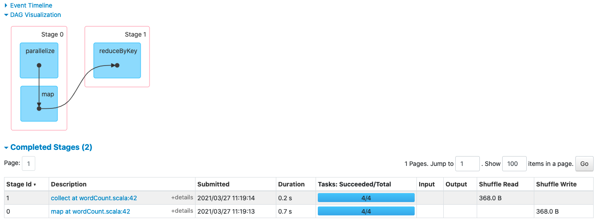

#### `task/job/task` 关系

* 一个 `action` 一个 `job`
* 一个`shuffle ` 对应一个 `stage`
* 在`stage`中，一个分区对应一个 `task`

---

#### `wordcount`

```scala
val value: RDD[Int] = sc.parallelize(List(1, 2, 3, 4,5,6,7,8), 4)
val tuples: Array[(Int, Int)] = value.map(x => (x, 1)).reduceByKey(_ + _).collect()
```



> `value` 有4个分区，所以计算中有3个`task`，有一个 `action` 操作 `collection` 所有有一个`job`


