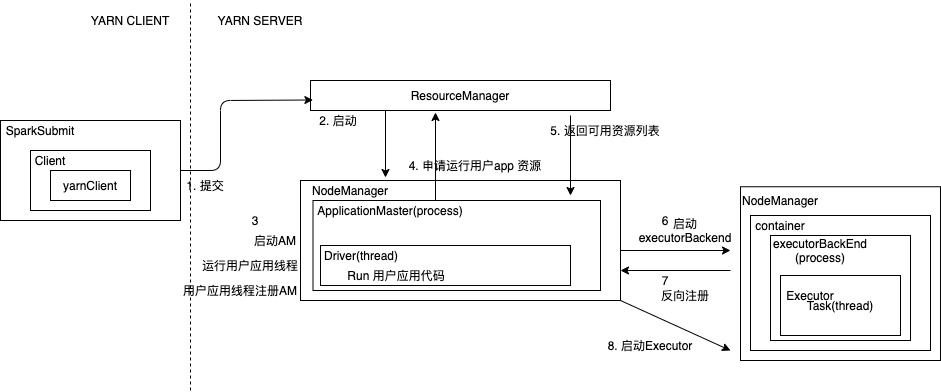

##### spark 提交程序命令

```scala
./bin/spark-submit --master spark://spark-master:7077 \
--conf spark.hadoop.fs.s3a.endpoint=http://172.22.0.4:9000 \
--jars /spark/examples/delta-core_2.11-0.5.0.jar \
--class com.delta.Run examples/original-deltaLake2-1.0-SNAPSHOT.jar s3a://spark-test/  delta21 schemaCheck21
```

这个命令在干啥呢？Spark 是基于JVM 的，那么在启动的时候都会去启动Java 虚拟机，那么就会去执行一个 `main` 方法，进入 执行这个命令的脚本目录 `./bin/spark-submit`

核心代码

```scala
exec "${SPARK_HOME}"/bin/spark-class org.apache.spark.deploy.SparkSubmit "$@"
```

然后去执行 `/bin/spark-class` 并传入参数 `org.apache.spark.deploy.SparkSubmit`

然后在 `spark-class` 中关键代码

```shell
RUNNER="${JAVA_HOME}/bin/java"
```

并且猜测，在这个脚本中使用 `java` 去执行脚本传入的参数 `org.apache.spark.deploy.SparkSubmit`

所以去找这样的类，看是否有主方法。源码中存在伴生对象

```scala
org.apache.spark.deploy.SparkSubmit
```

如果我们进入 `spark-shell`那么执行 `jps` 就会出现 `SparkSubmit` 的一个进程

---

所以程序一开始的执行，那么就是去执行伴生对象的的`main` 方法

```scala
org.apache.spark.deploy.SparkSubmit#main
```

现在开始看这个 `main` 方法做了什么

```scala
  override def main(args: Array[String]): Unit = {
    val submit = new SparkSubmit() {
      self => # rename this to self
      override protected def parseArguments(args: Array[String]): SparkSubmitArguments = {
        new SparkSubmitArguments(args) {
          ...
        }
      }
	  ...
      override def doSubmit(args: Array[String]): Unit = {
        try {
          super.doSubmit(args)
        } catch {
          case e: SparkUserAppException =>
            exitFn(e.exitCode)
        }
      }
    }
    submit.doSubmit(args)
  }
```


首先 `new` 了一个 `SparkSubmitArguments` 它是我们提交任务的时候那些参数的封装

在它的构造函数中有一个函数还是有必要研究一下的

```scala
org.apache.spark.launcher.SparkSubmitOptionParser#parse

# 函数签名
protected final void parse(List<String> args)
```

然后在后面的解析中并完成赋值

```scala
override protected def handle(opt: String, value: String):
```

这里的 `opt` 就是我们参数中的 `--class` 参数名，`value` 就是对应的值

然后在这个函数中使用模式匹配的方法完成赋值，部分代码

```scala
override protected def handle(opt: String, value: String): Boolean = {
    opt match {
      
      # protected final String NAME = "--name";
      case NAME =>
        name = value
			
      # protected final String MASTER = "--master";
      case MASTER =>
        master = value

      # protected final String CLASS = "--class";
      case CLASS =>
        mainClass = value
    .....
    }
}
```

 `SparkSubmitArguments` 它是我们提交任务的时候那些参数的封装。

然后去执行 `submit.doSubmit(args)`， 在这个方法中根据 `action` 字段的值，分别取执行不同的行为

```scala
def doSubmit(args: Array[String]): Unit = {
 		...
    val appArgs = parseArguments(args)
 		...
    appArgs.action match {
      case SparkSubmitAction.SUBMIT => submit(appArgs, uninitLog)
      case SparkSubmitAction.KILL => kill(appArgs)
      case SparkSubmitAction.REQUEST_STATUS => requestStatus(appArgs)
      case SparkSubmitAction.PRINT_VERSION => printVersion()
    }
  }
```

默认的行为是 `submit`， 其方法签名为

```scala
private def submit(args: SparkSubmitArguments, uninitLog: Boolean): Unit
```

在这个函数里面，执行方法 `doRunMain` ，这个方法也是方法 `submit` 中的一个内部方法

```scala
    def doRunMain(): Unit = {
      ...
        runMain(args, uninitLog)
      ...
    }
```

```scala
private def runMain(args: SparkSubmitArguments, uninitLog: Boolean)
```

这个方法中首先执行一个方法，这个函数完成的主要事情：

```scala
private def runMain(args: SparkSubmitArguments, uninitLog: Boolean): Unit = {
   // 加载环境
    val (childArgs, childClasspath, sparkConf, childMainClass) = 			
  				prepareSubmitEnvironment(args)
		...
  	// 类加载器
  	val loader =
      if (sparkConf.get(DRIVER_USER_CLASS_PATH_FIRST)) {
        new ChildFirstURLClassLoader(new Array[URL](0),
          Thread.currentThread.getContextClassLoader)
      } else {
        new MutableURLClassLoader(new Array[URL](0),
          Thread.currentThread.getContextClassLoader)
      }
    Thread.currentThread.setContextClassLoader(loader)

    // 加载 jar
    for (jar <- childClasspath) {
      addJarToClasspath(jar, loader)
    }

  	// 获得 Class 信息
  	mainClass = Utils.classForName(childMainClass)
		...		
    new JavaMainApplication(mainClass)
 }
```

注意各个 `JavaMainApplication` 类，它是一个 `SparkApplication`

```scala
private[deploy] class JavaMainApplication(klass: Class[_]) extends SparkApplication {

  override def start(args: Array[String], conf: SparkConf): Unit = {
    val mainMethod = klass.getMethod("main", new Array[String](0).getClass)
    ...
    val sysProps = conf.getAll.toMap
    sysProps.foreach { case (k, v) =>
      sys.props(k) = v
    }
    mainMethod.invoke(null, args)
  }
}
```

在`start` 获得了`Class`  的 `main` 函数，然后去调这个函数。

这里启动的是 `childMainClass`， 那么 `childMainClass` 是啥呢？

这个变量是函数 `prepareSubmitEnvironment` 返回的。再来看看这个函数做了什么事情

```scala
 private[deploy] def prepareSubmitEnvironment(
      args: SparkSubmitArguments,
      conf: Option[HadoopConfiguration] = None
 ): (Seq[String], Seq[String], SparkConf, String)
```

然后从后往前看这个代码，看最后它返回的是个 `childMainClass` 是啥

```scala
if (isKubernetesCluster) {
 		# private[deploy] val KUBERNETES_CLUSTER_SUBMIT_CLASS =
    #		"org.apache.spark.deploy.k8s.submit.KubernetesClientApplication"    
  	childMainClass = KUBERNETES_CLUSTER_SUBMIT_CLASS
} 

if (deployMode == CLIENT) {
  		# mainClass 就是 提交的时候 --class 指定的参数，执行Driver 的东西
      childMainClass = args.mainClass
}

if (isYarnCluster) {
    # private[deploy] val YARN_CLUSTER_SUBMIT_CLASS =
	  #  "org.apache.spark.deploy.yarn.YarnClusterApplication"  
  	childMainClass = YARN_CLUSTER_SUBMIT_CLASS
}
```

`yarn cluster`下返回的就是 `org.apache.spark.deploy.yarn.YarnClusterApplication`

注意这里的这个类

```scala
private[spark] class YarnClusterApplication extends SparkApplication {

  override def start(args: Array[String], conf: SparkConf): Unit = {
    ...
    # 包装了参数
    # new Client
    # client.run
    new Client(new ClientArguments(args), conf).run()
    ...
  }
}
```

它覆盖了上面 `JavaMainApplication` 中的方法，执行这里的方法，

```scala
private[spark] class Client(
    val args: ClientArguments,
    val sparkConf: SparkConf)
  extends Logging {
	...
  # 创建 yarn 客户端，和rm 建立联系
  private val yarnClient = YarnClient.createYarnClient
  ...
  # 构造器中后续的代码基本就是一些配置东西
}
```

创建`yarnClient` 的方法中

```scala
public static YarnClient createYarnClient() {
		# 这里面有了 rm变量，也就是 这里 client 是和 rm 去做连接的
  	YarnClient client = new YarnClientImpl();
    return client;
 }
```

上面的代码在 `new Client` 的时候，拥有了`rm` 的一些属性

后续看看 `client.run`

```scala
def run(): Unit = {
    this.appId = submitApplication()
  	val report = getApplicationReport(appId)
    val state = report.getYarnApplicationState
  	...
    # 后续就是一些任务的报告和状态的内容
}
```

继续看看  `submitApplication` 做了什么事情

```scala
def submitApplication(): ApplicationId = {
 			...
  # yarn 初始化
  launcherBackend.connect()
  yarnClient.init(hadoopConf)
	# yarn client 和 server 开始连接
  yarnClient.start()
  ...
  # 给 yarn 提交任务
  # 容器的环境，这里申请资源的
  val containerContext = createContainerLaunchContext(newAppResponse)
	# 应用的环境
  val appContext = createApplicationSubmissionContext(newApp, containerContext)
  yarnClient.submitApplication(appContext)
 	# 任务都提交给 yarn 了，后续的事情就是 yarn 的了
}
```

```scala
private def createContainerLaunchContext(newAppResponse: GetNewApplicationResponse){
	...
  # Java 启动参数
  javaOpts += "-Xmx" + amMemory + "m"
  ...
  javaOpts += "-XX:+UseConcMarkSweepGC"
  ...
  val amClass =
  if (isClusterMode) {
    Utils.classForName("org.apache.spark.deploy.yarn.ApplicationMaster").getName
  } else {
    Utils.classForName("org.apache.spark.deploy.yarn.ExecutorLauncher").getName
  }
  ...
  val commands = prefixEnv ++
      Seq(Environment.JAVA_HOME.$$() + "/bin/java", "-server") ++
      javaOpts ++ amArgs ++
      Seq(
        "1>", ApplicationConstants.LOG_DIR_EXPANSION_VAR + "/stdout",
        "2>", ApplicationConstants.LOG_DIR_EXPANSION_VAR + "/stderr")
  ...
  # 最终生成的 command,这个 command 是在 yarn 的日志中输出的
  # 发送command 到 yarn 
  // send the acl settings into YARN to control who has access via YARN interfaces
  val securityManager = new SecurityManager(sparkConf)
  amContainer.setApplicationACLs(
      YarnSparkHadoopUtil.getApplicationAclsForYarn(securityManager).asJava)
  setupSecurityToken(amContainer)
  # 启动一个 am 返回
  amContainer
}
```

这里可以看出在 `AM` 上，不同的集群或者非集群模式启动的`AM` 是不同的

在 yarnCluster 下，amClass 是去获得了一个 `org.apache.spark.deploy.yarn.ApplicationMaster`

查看其方法的半生对象中的 `main`  方法

```scala
  def main(args: Array[String]): Unit = {
    ...
    // 参数封装，如获取用户输入的参数 --class 等等
    val amArgs = new ApplicationMasterArguments(args)
    master = new ApplicationMaster(amArgs)
    System.exit(master.run())
  }
```

run 里面运行了代码

```scala
private def runImpl(): Unit = {
	...
  if (isClusterMode) {
      runDriver() // RunDriver 运行
  } else {
    runExecutorLauncher() // RunExecutor
  }
  ...
}
```

然后在 runDriver 方法中

```scala
private def runDriver(): Unit = {
    ...
    userClassThread = startUserApplication()
 		...
    // 上面的代码开启了一个线程，启动用户的应用
    // 然后程序继续执行，将应用注册到AM
    rpcEnv = sc.env.rpcEnv

    val userConf = sc.getConf
    val host = userConf.get("spark.driver.host")
    val port = userConf.get("spark.driver.port").toInt
    registerAM(host, port, userConf, sc.ui.map(_.webUrl))
}
```

startUserApplication 方法中

```scala
private def startUserApplication(): Thread = {
val mainMethod = userClassLoader.loadClass(args.userClass)
      .getMethod("main", classOf[Array[String]])

    val userThread = new Thread {
      override def run() {
        try {
           ...
            // 执行main 方法
            mainMethod.invoke(null, userArgs.toArray)
            finish(FinalApplicationStatus.SUCCEEDED, ApplicationMaster.EXIT_SUCCESS)
            logDebug("Done running user class")
          ...
      }
    }
    userThread.setContextClassLoader(userClassLoader)
    userThread.setName("Driver")
		// 启动 run 方法，run 里面调了 main 方法，这里也就是用户的传入的--class
    // 也就是用户的应用程序
    userThread.start() 
    userThread
}
```

注册AM， AM 向RM 请求资源，拿到可用资源列表，资源和任务匹配

```scala
org.apache.spark.deploy.yarn.YarnAllocator#handleAllocatedContainers

   // Match incoming requests by host
    ...
	 // 本地化match， 先选择数据和计算在同一个 host 中

    // Match remaining by rack. 
    // 匹配数据和计算在同一个机架上
    ...
      }
}
```

然后在后续的代码中，启动 containers，启动过程涉及到 prapareCommand方法 的的构造，其中会启动类

```scala
org.apache.spark.executor.CoarseGrainedExecutorBackend
```

其中的 `main` 方法

```scala
def main(args: Array[String]){
  ...
  run(driverUrl, executorId, hostname, cores, appId, workerUrl, userClassPath)
}
```

在run 方法中启动 container，通过rpc 通信，并向Driver 注册自己(向Driver 中的 spark context 通信)

注册完毕之后，new Executor, 真正执行操作

```scala
executor = new Executor(executorId, hostname, env, userClassPath, isLocal = false)
```

然后在 executor 接收 Driver 的 task

```scala
  def launchTask(context: ExecutorBackend, taskDescription: TaskDescription): Unit = {
    val tr = new TaskRunner(context, taskDescription)
    runningTasks.put(taskDescription.taskId, tr) // 每一个 task 扔进 threadPool
    threadPool.execute(tr) // 然后执行
  }
```

上面的整个过程




得到 main 方法之后，返回了一个线程，这个线程的名字叫 `Driver`, `Driver` 就是一个线程

> * ClusterMode
>
>   */bin/java org.apache.spark.deploy.yarn.ApplicationMaster + 一系列java 启动参数*
>
> * 非 ClusterMode
>
>   */bin/java org.apache.spark.deploy.yarn.ExecutorLauncher + 一系列java 启动参数*


---

