* Driver program

  > 每个spark 应用程序都包含一个驱动程序，驱动恒旭负责将并行操作发布到集群上，驱动程序包含spark 引用程序中的主函数，定义了分布式数据集以用用在集群中
  >
  > 驱动程序通过sparkContext 对象来访问spark，SoarkContext 对象相当于一个到Spark 集群的连接

* RDD：

  > 将我们的计算单元缩小到更适合并行计算
  >
  > ```scala
  > /*
  > transform 包含2个操作,从逻辑上来将 transform 并不是最小单元，当一个线程来的时候
  > 需要先执行 substring -> toUpperCase 二者是一个串行的过程
  > 
  > 拆分 transform(s) ->  toUpperCase(getHead(s))
  > 在多线程中就可以并行计算了，如前50条数据执行完 getHead 之后林外一个线程去执行 toUpperCase
  > 而后50条数据就可以继续执行了，也就是在前50条数据执行 toUpperCase 的时候，后50条数据就可以在第一个线程中开始执行了
  > 所以将计算单元越小，那么久更加适合发布到不同集群节点上并行计算
  >    */
  >   def transform(s:String):String = s.substring(0,1).toUpperCase
  > 
  >   def getHead(s:String):String = s.substring(0,1)
  > 
  >   def toUpperCase(s:String):String = s.toUpperCase
  > ```

* Cluster manager（集群资源管理器）

  > 计算和资源分离，一个container 中存放一个executor，二者是一一对应的
  >
  > 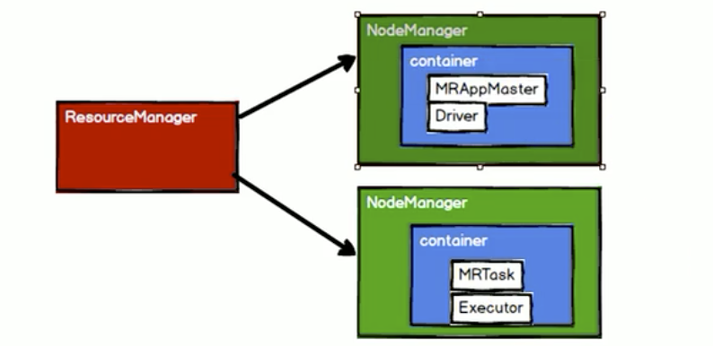

* executor

  > 它是一个进程(进程名称 ExecutorBackend，运行在Worker 上)，spark 发送引用程序代码(jar 包)带每个执行器，sparkContext 对象发送任务到执行器开始执行程序
  >
  > 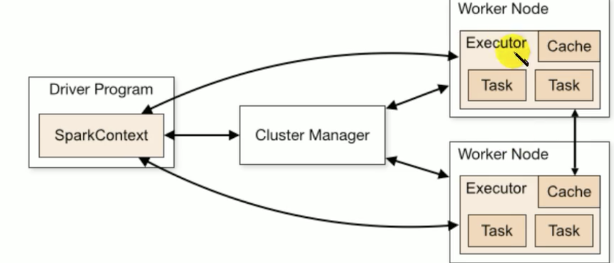

* Yarn 模式

  > Spark 客户端之间连接Yarn，不需要额外构建Spark 集群
  >
  > 有Yarn-client 和 Yarn-cluster 2种模式，主要区别在于：
  >
  > * yarn-client： Driver 程序运行在客户端，适合于交互，调试，立马看到app 的输出
  > * yarn-cluster： Driver 程序运行在由RM（ResourceManager） 启动的AM(ApplicationMater)上，适合生产环境
  >
  > 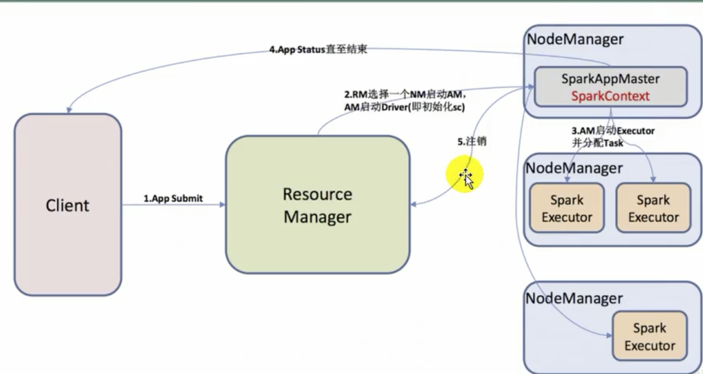
  >
  > 1. 客户端提供任务，到yarn
  > 2. yarn 分配资源启动一个NodeManager，启动ApplicationManager，AM 启动Driver
  > 3. 根据资源启动executor(executor 和 container 对应，container 就是对资源的抽象)
  > 4. executor启动后，当前资源以及准备好，然后将任务发给该资源
  > 5. 发送的过程中，任务的执行情况会反向发送回Driver
  > 6. 任务执行结束后，释放资源

* RDD（Resilient Dristributed Dataset）

  > Spark 中最基本的计算抽象，适合并行计算的最小计算单元，弹性的，不可变的，可分区的，里面的元素可并行计算的。
  >
  > **5个属性**
  >
  > * 多个分区，分区看做是数据及的基本组成单位
  > * 每个分区执行的计算是完全相同的
  > * 和其他RDD 之间的依赖关系(RDD 的血缘(依赖)系统，也是spark 容错的基础)
  > * 对存储KV对的RDD(pair RDD)，还有一个可选的分区器Partitionner

* Shuffle、stage、Job

  > Shuffle 将任务一分为2，将Job 划分为 stage
  >
  > Shuffle 前的第一个stage1， 没有执行结束，则stage2是不能执行的。shuffle 会发生数据的落盘。
  >
  > 每个Job 由多个stages 组成，这些stages 就是实现最终的RDD 所需的数据转换的步骤，一个宽依赖(Shuffle)划分一个stage。
  >
  > 每个stage 由多个tasks 来组成，这些tasks 就表示每个并行计算，并且会在多个执行器上执行。

* DAG：有向无环图

  > Spark 的顶层调度层使用RDD 的依赖为每个Job 创建一个由stages 组成的DAG，在Spark API 张红，被称为是DAG 调度器(DAG Scheduler)。
  >
  > DAG 为每个Job 构建一个 stages 组成的图表，从而确定运行每个task 的位置，然后传递这些信息给TaskScheduler，TaskScheduler 负责在集群中允许任务

* 持久化

  > 

---

* spark 提交命令的

* DAG/TaskScheduler

  > Spark 的任务调度是从DAG 切割开始，主要是由DAGScheduler 开始，当遇到一个Action 操作后就会触发一个Job 的计算，并交给DAGScheduler来提交，如下图示涉及到Job 提交的相关方法调用流程：
  >
  > 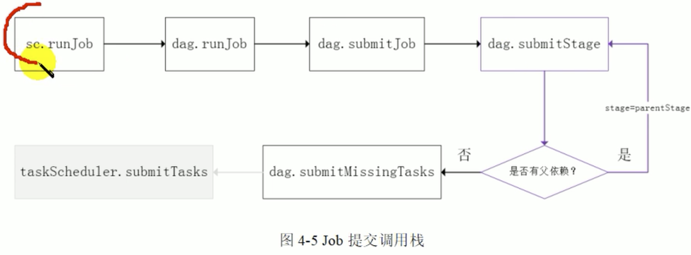
  >
  > sc 将Job 交给DAGScheduler 提交，它会更加RDD 的血缘关系构成的DAG 进行切分，将一个Job 划分为若干Stage，具体划分策略是由最终的RDD不断通过依赖回溯判断父依赖是否为宽依赖，以shuffle 为界，划分stage，窄依赖的RDD 直接被划分到同一个Stage 中，可以进行pipeline 式的计算，划分stage 为2类
  >
  > * ResultStage
  > * ShuffleMapStage
  >
  > 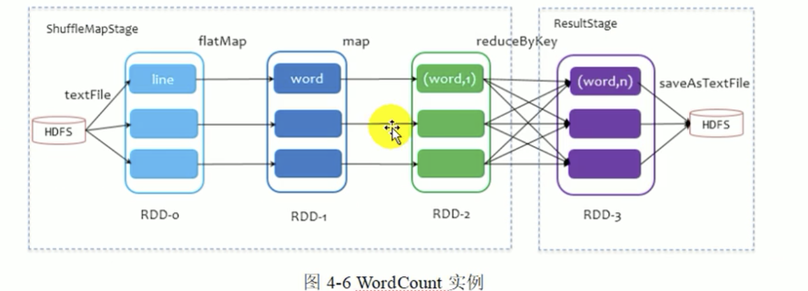
  >
  > 一个stage 是否被提交，需要判断它的父stage 是否执行，只有在父stage执行完毕才能提交当前stage，如果一个stage 没有父stage，那么该stage 开始提交，提交时候会将Task 信息序列化，并被打包成TaskSet交给TaskScheduler，一个P爱人提提欧尼对于一个Task，
  >
  > DAGScheduler 做的事情比较简单，仅仅是在Stage 层面划分DAG，提交stage 并监控状态信息，TaskScheduler 则相对较为复杂。
  >
  > 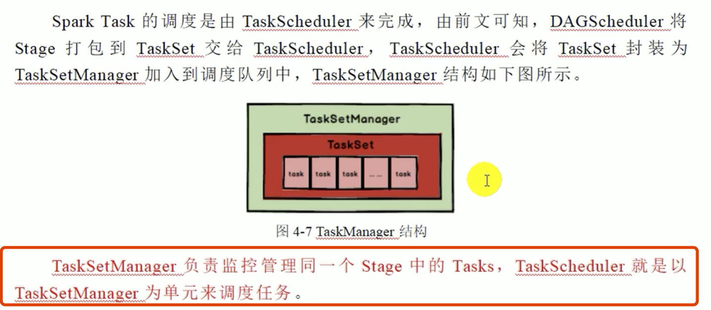
  >
  > 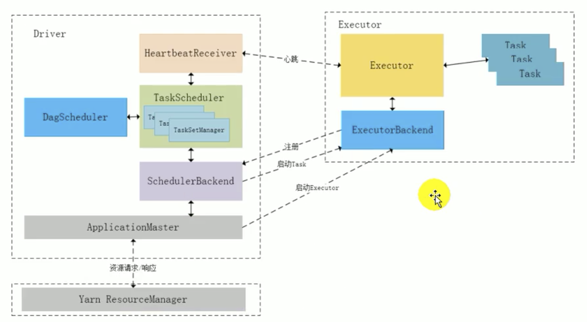
  >
  > 将任务全部提交到TaskSetPool 中，然后从这里再取出来，并提交。
  >
  > 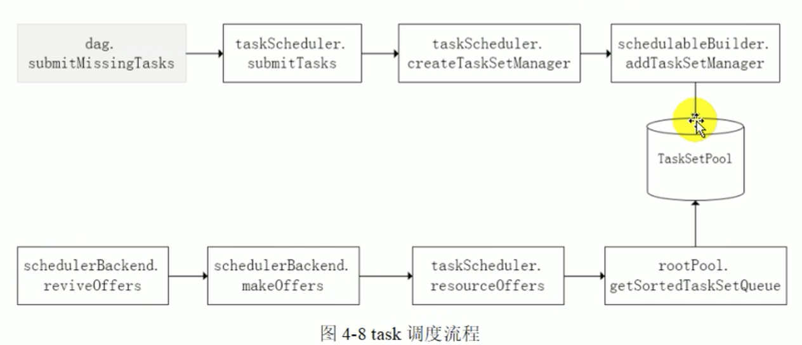
  >
  > * 调度策略
  >
  >   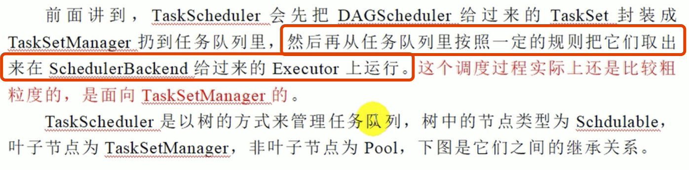
  >
  >   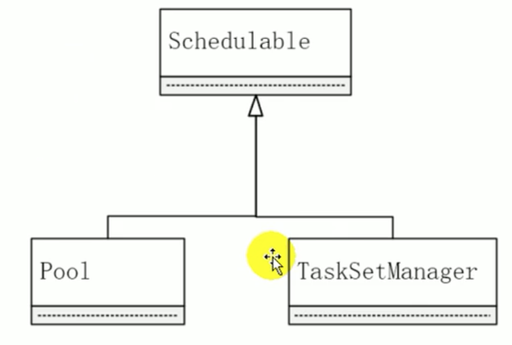
  >
  >   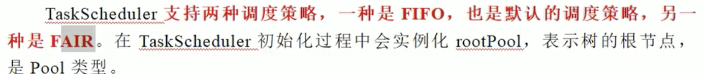
  >
  >   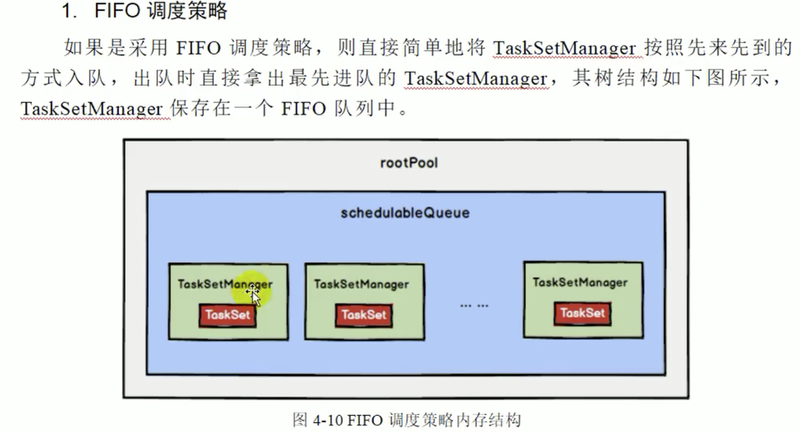
  >
  >   ---
  >
  >   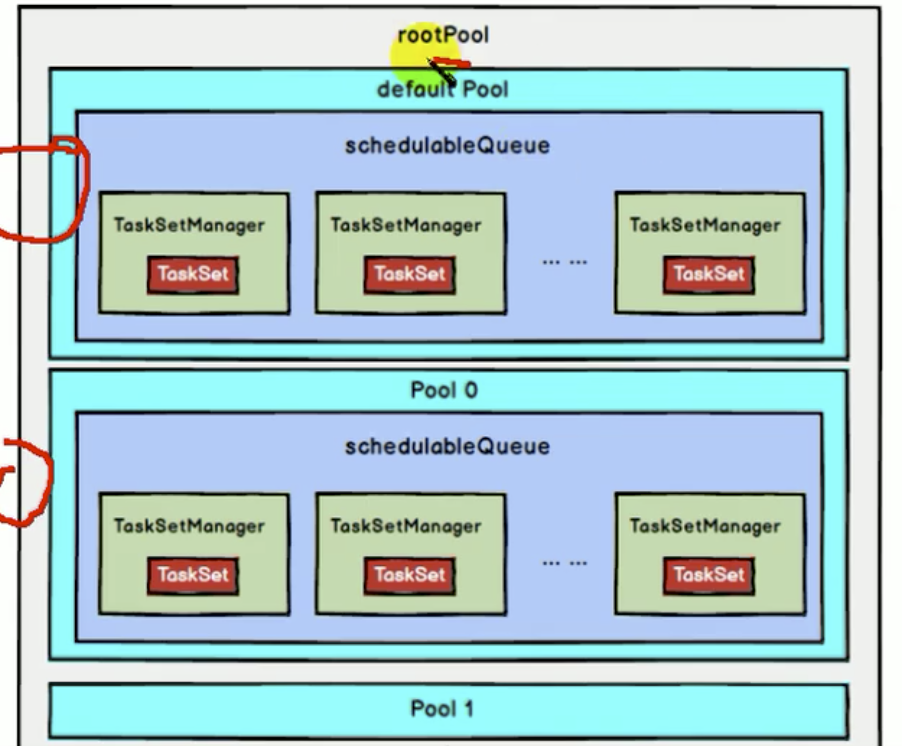
  >
  >   

* 提交

  > 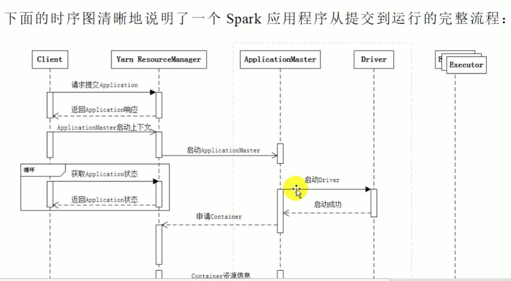
  >
  > 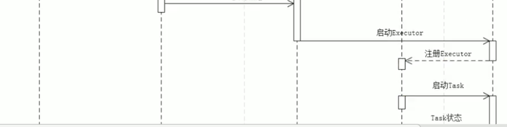
  >
  > 

---

### Hadoop / Spark 历史版本

#### Hadoop 1.x 版本问题

* NameNode 单节点，容易单点故障，制约集群发展 
* MapReduce 面向数据集的，一次性的计算需求，不适合迭代式计算
* 资源和计算框架强耦合，只能做MR。

#### Hadoop 2.x 

* NameNode 高可用
* Yarn 资源管理器
* 资源和计算框架解耦，支持其他的计算框架

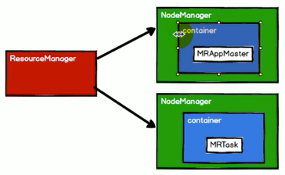

#### spark

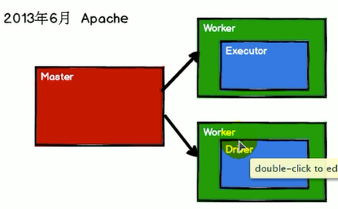

* 出现：解决Hadoop 的MR 计算框架问题

* 适合数据重复使用，迭代式计算

* **Spark 的性能优于MR**，Spark 是基于MR 的，只不过优化了其中的计算过程，可以提升数据统计，分析性能，基于scala语言开发，更适合函数式编程，适合迭代式计算

  hadoop 的计算框架

  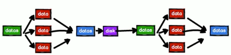

  一个MR只能完成一次数据集的操作，要将第一个MR结果交给第二次MR计算，中间必须经过写磁盘操作，由此而带来了慢的问题，读写磁盘(IO)耗性能。

  而Spark 就是基于此进行改善，就将Dist，替换为内存。

  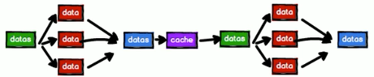

  由此就没有了IO操作，将计算变得更快。

* **Spark 由于hadoop 不止如此**，MR的 计算模型，太过于简单，不适合并行计算，而spark 提供了很多很多的计算模型。

* Spark 简易流程
  * Client  提交任务到Driver(初始化sc，任务划分，任务调度)
  * 和资源管理器申请资源，
  * 得到可用的资源列表
  * 然后将任务 发布到Executor
  * Executor 启动之后，反向注册到Driver。
  * 然后Driver 将任务发送到Driver，Executor 开始执行任务

#### 核心概念

* SparkContext

* RDD

* cluster Manager (资源，存储和计算解耦)

* executor

  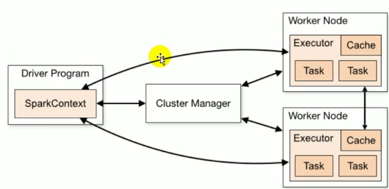

#### 部署模式

* Standalong

  master + slave 模式集群，spark 本身的进行资源管理

* Yarn 模式

  yarn-client: Driver 程序运行在客户端，适用于交互，调试，希望立马可以看到app 的输出

  yarn-cluster： Driver 程序运行在由RM(ResourceManager) 启动的AM(ApplicationMater) 上，适用于生成环境

* 提交步骤

  * 提交Job 给Yarn
  * 申请资源
  * 启动Executor
  * Executor反向注册Driver
  * Driver 发task给 Executor


#### spark 集群启动/提交任务

```scala
Centos7 防火墙的操作
systemctl status firewalld 相对于的 status -> stop -> start 来查看，关闭，开启防火墙

Centos7安装
https://www.bilibili.com/video/av76793551/
https://www.youtube.com/watch?v=ACypx1rwm6g&t=4s

查看master 的管理页面 http://192.168.99.100:8080/ 

开启spark 到 spark 文件的 sbin 文件下，执行 start-all.sh 开启，stop-all.sh 关闭

开启hdfs 文件系统 在 hadoop 的sbin 目标下执行 ./start-dfs.sh 命令

查看hdfs 文件 hddfs 的命令都在 /opt/spark/hadoop/hadoop-2.6.5/bin 目录中./hdfs dfs -ls /
	
在web 页面可以看见 http://192.168.99.100:50070

启动spark 的shell
	在 /opt/spark/spark/spark-2.2.0-bin-hadoop2.7/bin 路径下
	./spark-shell 如果直接执行这个启动spark，那么这是本地模式启动spark
  启动的时候指定master 启动集群模式  ./spark-shell --master spark://node-1:7077
  并在 master 中会启动 SparkSubmit  进程，这个进程主要是提交任务到每个worker 的Executor 中去执行
  然后通过 master 的管理页面 http://192.168.31.100:8080/  可以查看到 Spark shell 正在运行的 spark application
  启动之后，再所有的 节点 node 中都会出现一个  CoarseGrainedExecutorBackend 进程 这就是真正的跑集群任务

9. http://192.168.99.100:8088/cluster ResourceManager UI 界面
    1. 启动 yarn  ${HADOOP_HOME}./satrt-yarn.sh
9. 计算第一个任务
   sc.textFile("hdfs://node-1:9000/wordcount.txt").flatMap(_.split(" ")).map((_,	
			1)).reduceByKey(_+_).sortBy(_._2).collect 注意关闭 所有集群上的防火墙，否则计算的时候，集群之间无法通信


提交任务到集群
	打 jar 包并上传到集群机器  scp learning-1.0-SNAPSHOT.jar root@192.168.31.100:/opt/spark
	在任何一台node 中都可以提交任务
	执行
	./spark-submit --master spark://node-1:7077 --executor-memory 512m --total-executor-cores 2 --class com.bigData.spark.App /opt/spark/spark-code-jars/learning-1.0-SNAPSHOT.jar hdfs://node-1:9000/wordcount.txt hdfs://node-1:9000/wordcountResult121.txt

./spark-submit --class org.apache.spark.examples.SparkPi --master yarn --deploy-mode cluster --driver-memory 1G --executor-memory 1G --executor-cores 1 lib/spark-exampl

最后面几个参数分别是：jar 路径 执行的那个class 锁需要的2个参数

----

./bin/spark-submit --master spark://spark-master:7077  --class com.bigData.spark.core.wordCount /opt/bigData/spark/myJars/learning-1.0-SNAPSHOT.jar

./bin/spark-submit --master yarn  --deploy-mode cluster --class com.bigData.spark.core.wordCount /opt/bigData/spark/myJars/learning-1.0-SNAPSHOT.jar
// 使用 yarn 会比较的慢，因为需要将spark的一些spark 配置，类库等上传给 yarn
```


