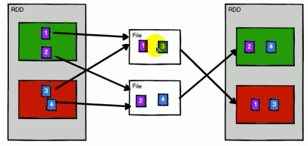
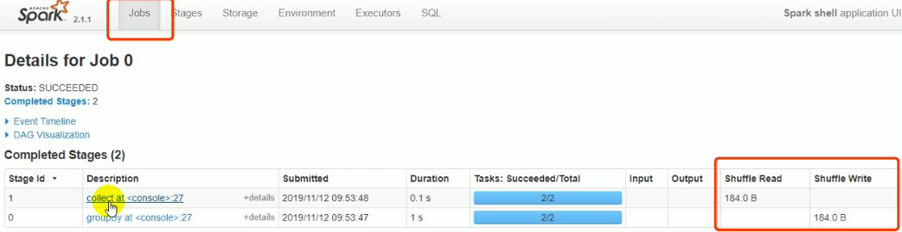

#### 什么是RDD

RDD(Resilient Distribute Dataset)： 弹性分布式数据集， 是spark 中的数据(计算)抽象，适合并行计算的最小计算单元，在代码中是一个抽象类，它代表一个**弹性的，不可变，可分区**，里面的元素可以并行计算的集合。

* 5 个主要属性
  * a list of partitions
  * a function for computing each split 计算以分区为单位的，每个RDD 都会实现computr 函数
  * a list dependencies on other RDDs: RDD 直接相互依赖
  * 可选的分区器
  * 可设置优先计算的分区(将计算逻辑代码优先分发到优先的分区去计算，而不是去移动数据，这样就会产生IO)

---

#### 理解RDD

* 分布式的
* 弹性的: 一系列的容错机制，表示的是恢复的能力，当一个RDD丢失之后，它是可以恢复的

* RDD 不存储数据，它只是告诉计算该如何做。RDD 更适合说成是计算的抽象

---

#### shuffle 读写磁盘(为什么shuffle 要读写磁盘)

在进行 group 等相关操作的时候中间会发生 shuffle 过程，如上图，在进行奇偶分的时候，最后是将奇数和偶数，分到不同的分区过程中，中间的2和4来自于不同的分区，而shuffle 过程中有些数据先准备好了，有些数据还没有准备好，那么先准备好了的数据就先写到磁盘中进行等待，当所有的数据都就绪之后，然后在从磁盘中将数据读进来，然后才能进行后续算子的执行。

**所以之所以要进行shuffle 读写数据，就是因为shuffle 中间有数据移动快速的不同，需要等待数据都准备好，就是这个等待动作，所以要写磁盘**

在sparkUI中的stage 中就会由 shuffle write 和 shuffle read 的显示：由上图显示是2个分区，那么就会由2个分区的写，2个分区的读，所以在下面的UI显示中，group 步骤有shuffle write的2个task，而没有shuffle read 的task，而在collect 步骤中有2个shuffle read 的读task，没有写task

spark计算框架是这样的 **数据不动计算逻辑代码动**，但是在shufflle中会有数据的移动，所以发生shuffle过程的算子的计算代价是非常昂贵的。

