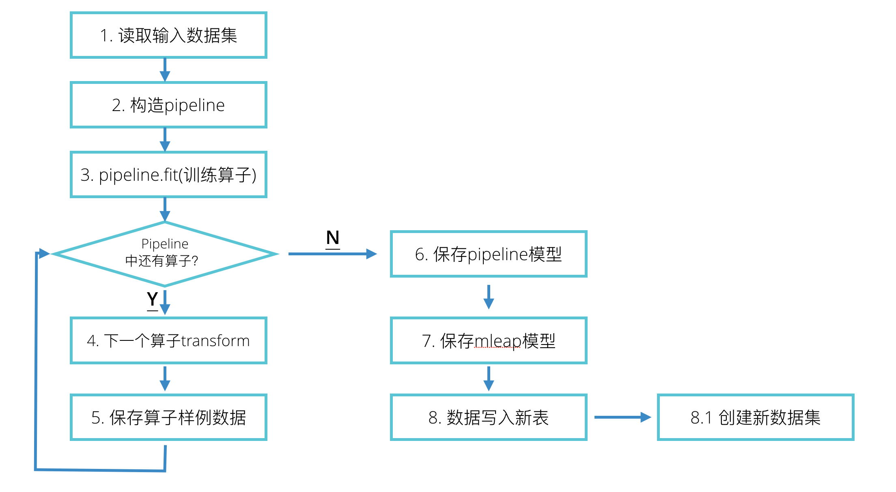
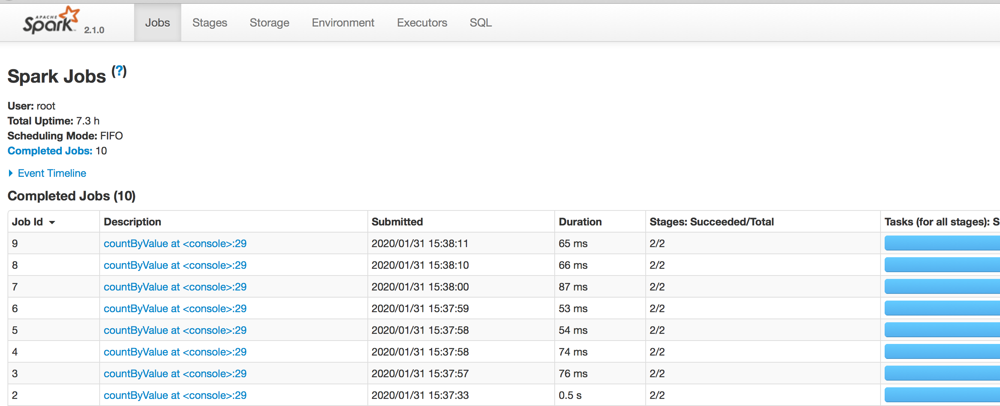

**Spark调优**

* 构建快速反馈环

  > TDD教会我们快速反馈的重要性。一旦我们有了一个快速反馈的机制，我们就能快速修正问题，快速前进。但是在超大数据的场景下，问题的复杂性往往使得我们难以获取快速反馈。比如，一个spark的应用，可能需要运行数十分钟到数小时，而我们遇到的问题可能在数十分钟或数小时之后才会出现。
  >
  > 在这样的场景下，我们如何尽可能的构建快速反馈环就显得更为重要了。试想，如果我们修改一行代码，需要花两个小时才能部署到环境中，然后应用运行再需要两个小时才能重现问题，那么我们一次修改就需要花费4个小时的时间。一来一回，可能一周或者一个月过去了，我们也没有能解决所有问题。
  >
  > 这样的场景对于我们的技术经验及技术功底的要求无疑都非常高。然而在我看来，最关键的还是在于构建快速反馈环。
  >
  > 为了构建这个反馈环我们做了哪些事情呢？
  >
  > 打造环境和工具。在做大规模数据的测试之前，我们能预料到潜在的（几乎是必然的）会产生不少的代码修改。那么搭建一套专用的测试环境就显得非常重要。有了这套环境，在必要时，我们可以采用非常规手段尽快部署我们的修改。同时我们需要自动化一切可以自动化的事情，将各种部署的步骤都编写成可以一键执行的脚本，这就为高效工作奠定了基础。为了实现尽可能的自动化，我们编写了多个自动化的工具脚本。工欲善其事，必先利其器。这些准备工作为后续的性能优化奠定了基础。
  >
  > 打通Spark监控页面及日志。同时由于我们所使用的是一套类生产环境，出于数据保密的要求，我们无法通过网络直接访问到这些数据，而和这些数据部署在一起的大数据集群自然也不例外了。为了访问这些数据，我们需要首先通过某一专用vpn连接到一个内网，然后通过windows的远程桌面连接到某一台内网跳板机，最后我们从跳板机来发起访问。在这样的网络模式中，不仅由于网速慢而导致操作卡顿严重，而且复制粘贴操作也被严格的限制了。客户的安全限制无疑成为了一个阻碍我们快速诊断问题的障碍。在这样的情况下，我们果断的快速实现了一个代理机制，将yarn上的Spark监控页面及相关日志通过代理暴露到我们可访问的网络中来。这样一来，我们就可以快速查询到我们的spark应用的状态了。我们后续遇到的所有问题几乎都是靠Spark监控页面及日志辅助解决的。
  >
  > 启动Spark历史应用日志服务。Spark不仅可以在运行时提供一个内容丰富的监控页面，其实它也可以将运行时的监控数据保存下来供后续分析和查看（详情见[这里](https://spark.apache.org/docs/latest/monitoring.html)）。我们只需要在运行应用时配置`spark.eventLog.enabled`为`true`，`spark.eventLog.dir`配置为某一个`hdfs`路径即可。有了这些日志之后，我们运行`./sbin/start-history-server.sh`启动日志服务工具，就可以在浏览器web页面上面看到相应的历史日志了。当我们的应用失败的时候，Yarn的Spark监控页面（driver节点上面启动的一个web服务）也会相应退出。这给我们分析这些失败的应用带来了困难。有了Spark历史应用日志服务，我们也就不会再有这样的问题。

* 了解基本的Spark 优化方案

  > 首先，Spark应用也是一个普通的Java应用，所以所有的java程序优化手段都是适用的，例如如何合理利用缓存，如何优化数据结构和内存等。
  >
  > 其次，我们需要了解基本的分布式程序运行原理，简单来说就是`Map-Reduce`（后续简称MR）算法的基本原理，Spark应用最终都会以一系列MR任务的方式执行。
  >
  > 然后，我们需要了解一般情况下分布式程序工作的瓶颈所在。一般而言，运行某个分布式应用时，我们会拥有非常多的cpu并行执行代码，但是这些cpu分布在不同的物理机上，所以在这些cpu间共享数据和调度任务会成为一个问题。
  >
  > 这里的问题会大致表现为
  >
  > 1. 磁盘IO – 多机并行数据读写时是否充分利用了多个磁盘进行数据访问，是否读取了尽可能近的数据存储，是否避免了没有必要的写盘操作等；
  > 2. 网络IO – 在reduce操作时任务间交换的数据有多少，如何在不同的物理机上的进程共享一些大的对象等；
  > 3. 调度规模 – 是否因为任务调度慢而导致应用慢，比如任务数量过多。
  >
  > 以上述几点为基础可以扩展出非常广泛的内容，各种资料也非常多，在这里就不重复赘述了。在这次的Spark应用优化中，我参考过的比较成体系的优化资料有：
  >
  > 1. 官方的[Spark调优指南](https://spark.apache.org/docs/latest/tuning.html)
  > 2. 来自美团的Spark优化指南 – [初级篇](https://tech.meituan.com/2016/04/29/spark-tuning-basic.html)及[高级篇](https://tech.meituan.com/2016/05/12/spark-tuning-pro.html)
  > 3. [Java应用GC调优指南](https://docs.oracle.com/javase/8/docs/technotes/guides/vm/gctuning/index.html)
  >
  > 从这些资料中，我们可以将Spark应用的优化方式整理为如下几点：
  >
  > 
  >
  > **算法性能优化**
  >
  > - 使用map-side的计算（在map过程进行预计算），如使用`reduceByKey`/`aggregateByKey`替代`groupByKey`
  > - 使用带Partitions的API进行计算（一次函数调用处理一个Partition），如`mapPartitions`替代`map`
  > - 使用[手动添加前缀](https://tech.meituan.com/2016/05/12/spark-tuning-pro.html)的方式优化由于数据倾斜带来的性能问题
  >
  > **并行度优化**
  >
  > 	* 调用`repartition` API设置分区数量
  >
  > 	* 设置默认的`shuffle`操作之后的分区数量
  > 	* 数据量变化之后，调用`coalesce`重设分区数量
  >
  > **缓存优化**
  >
  > * 调用`cache` `persist`及`unpersist`以便控制哪一个`RDD`需要缓存
  > * 缓存`RDD`时考虑使用序列化缓存，进一步考虑压缩
  >
  > **内存优化**
  >
  > * 使用更节约内存的数据结构：如避免使用java的包装类型（boxed），避免使用内置的`Map` `List`等数据结构（会创建额外的`Entry`对象）等
  > * 使用广播变量：对于某个只读的大对象，在一个`Executor`内部共享，而不是每个`task`都复制一份
  > * 调整spark管理的内存大小：配置`spark.memory`相关参数
  > * 调整JVM的新生代和老生代内存比例
  > * gc优化：使用`G1`垃圾收集器
  >
  > **其他有用的优化方式**
  >
  > * 资源：配置`executor`的数量，每个`executor`的核数及内存，`driver`的核数和内存
  > * 调度：配置是否重启一个较慢的任务，设置`spark.speculation`相关参数
  > * IO：使用节约空间的序列化方式，如配置`kryo`序列化，调整本地化程度等待时间`spark.locality.wait`参数

* 解决大数据场景下的问题

  > 为了大家能理解后续的问题，对于我们的目标Spark应用，我整理了一个简单的数据处理流程图如下。
  >
  > 

  > 整个系统基于[Spark MLLib](https://spark.apache.org/docs/latest/ml-guide.html)构建。得益于`Spark MLLib`中的`Pipeline`抽象，我们可以将通用的数据处理过程建模为一个一个算子。比如原始数据中有一些字符串类型的分类特征(如按照出生时间可以分为80后、90后、00后等)，我们一般会先将其数值化。这通过一个字符串索引算子([StringIndexer](https://spark.apache.org/docs/latest/ml-features.html#stringindexer))就可以实现。再比如，我们如果要将某一个特征进行正则化，我们可以通过正则算子([Normalizer](https://spark.apache.org/docs/latest/ml-features.html#normalizer))来实现。将这些算子从前到后依次串联就可以实现一系列的可复用的处理过程。
  >
  > 某些算子需要预先做一些统计工作，比如为了实现正则化，我们需要知道当前特征的最大值最小值。计算这样的统计类信息的过程称为算子的`fit`过程，而真正执行计算的过程称为`transform`。
  >
  > 以上简述了`Spark MLLib`中最基本的抽象，想了解更多的同学们可以移步[这里](https://spark.apache.org/docs/latest/ml-features.html)。
  >
  > 为了将数据处理为机器学习模型需要的数据格式，我们构建了一个类似下面的`Pipeline`。将一系列的数据（特征）转换为一个稀疏向量（上千万维）。
  >
  > ```scala
  > StringIndexer(特征列a b c -> a_idx b_idx c_idx)
  >  -> OneHot(特征列a_idx b_idx c_idx -> a_idx_oh b_idx_oh c_idx_oh)
  >  -> MultiHot(特征列ma -> ma_mh) 
  >  -> MultiHot(特征列mb -> mb_mh) 
  >  -> MultiHot... 
  >  -> VectorAssembler(特征列a_idx_oh b_idx_oh c_idx_oh ma_mh mb_mh ... -> final_result)
  > ```
  >
  > 这里用到的几个算子的功能简述如下：
  >
  > - `StringIndexer`算子：提取字符串数据表示的所有分类，然后对某一个数据进行数值化编码，如，当我们一共有分类`a` `b` `c`，则某一个分类`b`将编码为数值`1`（从0开始编码）
  > - `OneHot`算子：将一个数值数据进行OneHot编码，转换为一个稀疏向量，如，当我们一共有4个元素时，数值3将编码为`[0, 0, 0, 1, 0]`
  > - `MultiHot`算子：将一个多值字符串数据编码为一个稀疏向量，如，对于某一特征`喜好`，所有的`喜好`类型有`a` `b` `c` `d`，则数据`b c`将编码为`[0, 1, 1, 0]`
  > - `VectorAssembler`算子：将多个向量合并为一个大的向量，如数据`[0, 0, 1]` `[1, 0]`将合并为向量`[0, 0, 1, 1, 0]`

* 在应对亿级数据时，这样的Spark应用遇到了哪些问题，而我们又是如何一步一步解决的呢？

  > 由于我们已经在一个小的数据集上面实现并验证过了所有的功能，一开始我们直接将这个`Pipeline`应用于亿级数据。启动应用之后，我们发现计算特别慢，最后在某一个`MultiHot`算子出现OOM的问题，导致整个应用失败。
  >
  > * 资源优化
  >
  >   > 我们的Spark应用，处理的数据规模在一亿左右，特征列的数量在120左右，大部分特征以字符串的形式存储，分区数8000，整个数据量占用空间约200G。这并不是一个特别大的数据集，按道理以Spark的设计可以轻松应对才是，但是如果不经优化，在这样的数据集情况下，很多性能问题都会显现出来。
  >   >
  >   > 首先我们想到的是优化资源，这是最简单的方式，修改应用启动配置即可。于是我们分配了100个executor，每个executor分配64GB内存加8个计算核心，总分配内存6TB左右。但是结果却不尽如人意，程序执行依然很慢。全部依赖资源是不现实的，我们开始着手优化应用实现。
  >
  > * 缓存优化
  >
  >   > 经过上述优化之后，我们发现虽然我们分配了足够多的资源，但是应用还是会在后面几个`MultiHot`算子报错OOM退出。这是为什么呢？检查Spark监控页面下的`Storage`页面，我们发现有多个缓存的RDD，其中好几个RDD占用了1TB的内存。这不OOM才怪呢。
  >   >
  >   > 
  >
  >   > 检查代码发现，在流程图步骤`5`保存样例数据时，我们添加了一个非预期的`dataset.cache()`，这导致每一个算子执行完毕之后都会缓存起来。去掉这个cache之后，测试，OOM问题消失。虽然这个问题没有了，但是应用运行到`VectorAssembler.fit`的时候会卡住，等待数小时依然无响应。
  >   >
  >   > 虽然没有了`MultiHot`算子的OOM问题，但是我们发现算子执行速度特别慢。这也是一个亟待优化的问题。否则为了重现上面的应用无响应问题，我们需要等待超过1小时的时间。这对于我们而言，太慢了。于是我们开始分析为什么算子执行速度特别慢。
  >
  > * **StringIndexer 优化**
  >
  >   > 查看Spark监控页面，我们发现在`StringIndexer`算子出现了特别多的名为`countByValue`的`Job`，每个`Job`执行都比较慢。
  >   >
  >   > 
  >   >
  >   > （此处的截图仅为了演示创建，非实际的图，实际的action执行时间在数分钟）
  >   >
  >   > 我们知道每个`Job`会对应一个`action`操作。这就表示我们的`StringIndexer`算子针对每一特征列触发了一个`action`操作。由于我们在这个算子上面将会处理上百个特征列，所以就出现了特别多的这样的操作。这些操作具体是做什么呢？回顾上述的`StringIndexer`的处理过程可知，我们需要先统计每一个特征列的所有分类（`fit`过程），然后构造一个字典来实现数据转换（`transform`过程）。这里的`CountByValue`操作看来是用于统计每一个特征列的所有分类了。一查代码果然如此。
  >   >
  >   > 但是为何会这么慢呢？难道每次操作都会重新去hive表读取数据？检查代码发现，果然是没有对输入的数据集进行缓存，在Spark监控页面下的`Storage`页面中也未发现任何缓存的数据。在流程图步骤`1`读取输入数据集后，添加缓存代码`dataset.cache()`，再进行测试。这次`CountByValue`速度立即提升了数十倍，达到数秒到数十秒的级别。这时再观察Spark监控页面下的`Storage`页面，将发现其缓存了一个`HiveTableScan`的`RDD`。
  >   >
  >   > 经过上述优化，整个`StringIndexer`算子的`fit`过程还是会花费5分钟左右。是否还可以从算法层面优化这个算子呢？实际上我们可以通过添加前缀的方式设计如下算法来解决这个问题：
  >   >
  >   > ```scala
  >   > dataset.select("a", "b", "c").rdd
  >   >     .flatMap(row => row.toSeq.zipWithIndex.map { case (v, i) => s"${i}:${v}" }) // 拼接列索引前缀
  >   >     .countByValue
  >   >     .keys
  >   >     .groupBy(key => key.substring(0, key.indexOf(":"))) // 按照列索引分组
  >   >     .toSeq
  >   >     .map { 
  >   >         case (colIdx, categories) => 
  >   >             (Map(0-> "a", 1-> "b", 2-> "c").get(colIdx.toInt).get, 
  >   >                 categories.map(cate => cate.substring(cate.indexOf(":") + 1)).toSeq)
  >   >     }
  >   > // for testing
  >   > // 1. prepare data from beeline
  >   > // create table tt (a int, b varchar, c varchar, d double);
  >   > // insert into tt values(1, '1', '2', 3), (2, '2', '3', 4), (3, '3', '4', 5), (4, '4', '5', 6), (5, '5', 6', 7');
  >   > // 2. run the code above, got:
  >   > // ArrayBuffer((c,ArrayBuffer(4, 5, 6, 2, 3)), (b,ArrayBuffer(4, 5, 1, 2, 3)), (a,ArrayBuffer(4, 5, 1, 2, 3)))
  >   > ```
  >   >
  >   > 通过添加前缀的方式，我们将多列合并为了一列，那么也就将针对每一特征列的计算，转换为了针对一个列的计算。完成计算之后，在driver端我们再根据之前的拼接规则按列进行拆分即可。
  >
  >   **multiHot 优化**
  >
  >   主要算法代码如下：
  >
  >   > ```scala
  >   > val dict = dataframe.select("ma", "mb").rdd
  >   >     .flatMap(row => row.toSeq.zipWithIndex.flatMap { case (v, i) => v.toString.split(" ").map(vj => s"${i}:${vj}") }) // 每一个值都拼接一个列索引前缀
  >   >     .countByValue
  >   >     .keys
  >   >     .zipWithIndex
  >   >     .toMap
  >   > // for testing
  >   > // 1. prepare data from beeline
  >   > // create table tt1 (ma string, mb string);
  >   > // insert into tt1 values("a b c", "1 2 3"), ("b c d", "2 3 4"), ("c d e", "3 4 5");
  >   > // 2. run the code above, got: 
  >   > // scala.collection.immutable.Map[String,Int] = Map(0:b -> 0, 0:e -> 1, 1:4 -> 2, 1:3 -> 3, 0:a -> 4, 1:2 -> 5, 1:1 -> 6, 0:c -> 7, 0:d -> 8, 1:5 -> 9)
  >   > ```
  >   >
  >   > 经过这里的处理之后，我们就得到一个所有列的所有可能值的一个大的字典。在进行数据转换时，我们首先需要同样的拼接一个列索引前缀，然后再按照字典查询并填充向量值。主要代码如下：
  >   >
  >   > ```scala
  >   > val dictSize = dict.size
  >   > dataframe.select("ma")
  >   >     .rdd
  >   >     .map(x => Vectors.sparse(dictSize, x.getString(0).split(" ").map(xi => (dict(s"0:${xi}"), 1.0)).toSeq)) // 拼接一个列索引前缀后再查询上述字典
  >   > // for testing
  >   > // run the code above, got:
  >   > // Array[org.apache.spark.ml.linalg.Vector] = Array((10,[0,4,7],[1.0,1.0,1.0]), (10,[0,7,8],[1.0,1.0,1.0]), (10,[1,7,8],[1.0,1.0,1.0]))
  >   > ```
  >   >
  >   > 实现了这个优化之后，不仅使得整个`fit`计算过程变快了数倍，而且由于我们的算子可以支持同时处理多个特征列，这带来了很大的易用性提升。
  >   >
  >   > 对于这里的实现，有经验的同学们可能已经发现另一个优化点，那就是这个`dict`变量。这个变量可能非常大，在我们的场景中，它内部可能有上千万个元素。由于map函数中使用到了这个变量，如果不做任何处理，我们将会序列化一个非常大的task到其他executor中执行，这将是非常低效的操作。这里我们可以将这个dict转化为一个广播变量，然后在map函数中引用这个广播变量。
  >   >
  >   > ```
  >   > val dictBC = dataframe.sparkSession.sparkContext.broadcase(dict)
  >   > dataframe.select("ma")
  >   >     .rdd
  >   >     .map(x => Vectors.sparse(dictBC.value.size, x.getString(0).split(" ").map(xi => (dictBC.value(s"0:${xi}"), 1.0)).toSeq)) // 拼接一个列索引前缀后再查询上述字典
  >   > // for testing
  >   > // run the code above, got:
  >   > // Array[org.apache.spark.ml.linalg.Vector] = Array((10,[0,4,7],[1.0,1.0,1.0]), (10,[0,7,8],[1.0,1.0,1.0]), (10,[1,7,8],[1.0,1.0,1.0]))
  >   > ```

* 写Hive 慢，输出的数据表在Hive 下面查询非常慢

  > 经过上述的优化，前面几个步骤都已经比较快了。由于业务需要，我们打算先在小数据集上面做验证。于是我们抽样了50w左右的一个数据集进行计算。程序很快的进入了流程图第`8`步写入数据到新表，这一步运行速度没有想象中的快。但更关键的是，`8.1`步创建数据集竟然会失败。一看日志，发现hive表查询超时。
  >
  > 这种情况显示，我们可以成功的创建hive表，但是hive表的查询非常慢。我们快速在`beeline`中进行了查询验证，发现也很慢。这是为什么呢？经过我们的`Pipeline`处理之后的数据究竟有啥不一样呢？
  >
  > 经过一段时间的分析，我们注意到当对生成的数据表进行`describe formatted {TABLE_NAME}`时，查询竟然要超过1分钟才能返回。不仅如此，查询结果时，hive控制台输出了一个特别长的元数据信息。类似下图：
  >
  > 

  > 上图是一张示意图，真实情况，会有大量的`spark.sql.sources.schema.part.0`数据出现，末尾的数字会到递增9999，出现`spark.sql.sources.schema.part.9999`数据。
  >
  > **事实上，对某一张hive表进行`describe`操作时，我们仅仅是查询hive的元数据而已。查询元数据慢，预示着生成的hive表可能元数据太多。**
  >
  > 这些元数据从哪里来的呢？我们又回到程序的源代码，经过仔细的代码走查，我们发现Spark的`Pipeline`算子会有很多元数据创建操作。这在我们之前优化`OneHot`算子时，也有发现过（以往的经验）。示例代码在[这个文件](https://github.com/apache/spark/blob/v2.1.0/mllib/src/main/scala/org/apache/spark/ml/feature/OneHotEncoder.scala)94行。
  >
  > 既然可能是这些元数据惹的祸，并且这些元数据对于我们的应用用处不大，那么我们是不是可以在创建数据集的时候，预先将这些元数据都去掉？尝试修改原来写表的代码如下：
  >
  > ```scala
  > val dataframeWithoutMetadata = dataframe.sparkSession.createDataFrame(
  >     dataframe.rdd, 
  >     StructType(dataframe.schema.fields.map(f => StructField(f.name, f.dataType, f.nullable, Metadata.empty)))
  > )
  > dataframeWithoutMetadata.write.saveAsTable("sometable")
  > ```
  >
  > 在应用这样的修改之后，重新测试，我们发现查询元数据变得飞快了。运行`describe formatted {TALBLE_NAME}`时，也看不到如此大量的`spark.sql.sources.schema.part.9999`数据了。我们可以注意到这里的metadata值为`{}`，而之前的metadata是存在数据的。

* 系统卡主，长时间无响应

  > 经过前面的优化，现在到达执行`VectorAssembler.fit`卡住的问题就比较快了。启动应用后差不多20分钟就可以重现这个问题。
  >
  > 经过一番日志分析之后，我们发现日志中有一个ERROR的消息，显示`java.lang.OutOfMemoryError: Requested array size exceeds VM limit`。出现了OOM，但是Spark程序仍然在运行。这是为什么呢？实际上，这个错误是由JVM的native代码抛出来的。JVM在分配数组之前会执行一个检查，防止我们分配的数组太大。当JVM发现我们要分配一个超过`2^31 - 2 = 2147483645`（64位系统）的数组时，就会抛出这个错误。但是这个错误却不会让JVM进程退出，只会让当前线程退出。
  >
  > 我们可以编写一个测试来验证：
  >
  > ```java
  > import org.junit.Test;
  > 
  > public class OOMTest {
  >     @Test
  >     public void test_oom() throws InterruptedException {
  >         new Thread(() -> {
  >             final byte[] bytes = new byte[Integer.MAX_VALUE];
  >         }).start();
  >         Thread.sleep(1000);
  >         System.out.println("executed here!");
  >     }
  > }
  > ```
  >
  > 运行上述测试，我们会发现，控制台出现了一个`java.lang.OutOfMemoryError: Requested array size exceeds VM limit`报错，但是随即打印了`executed here!`字符串。
  >
  > 到这里我们大概猜到了问题的原因。应用在运行到`VectorAssembler.fit`时，分配了一个超大的数组。这导致了某个关键线程退出，从而导致应用无响应。这个关键的线程就是`dag-scheduler-event-loop`线程。看这个线程的名字我们就知道了，这个线程是负责进行任务调度的。没有了任务调度，所有的executor都处于等待中，Spark应用当然无响应了。
  >
  > 为验证这个问题，我们检查了Spark监控页面的Executor页面，发现当系统无响应时，下面这个线程不在了。
  >
  > 那么这个数组从何而来呢？回顾一下代码，`VectorAssembler`究竟是做了什么呢？阅读其源代码会发现一个有问题的地方。在[这个文件](https://github.com/apache/spark/blob/v2.1.0/mllib/src/main/scala/org/apache/spark/ml/feature/VectorAssembler.scala)的88行和89行，程序分配了一个超大的数组：
  >
  > ```java
  > val numAttrs = group.numAttributes.getOrElse(first.getAs[Vector](index).size)
  > Array.tabulate(numAttrs)(i => NumericAttribute.defaultAttr.withName(c + "_" + i))
  > ```
  >
  > 我们知道，由于这里的向量维度是在千万级别，上面这行代码将分配千万级别的数组，并创建上千万个字符串。
  >
  > 这是什么操作？这些字符串创建之后有什么用呢？我们还是只能在Spark源代码里面找答案。阅读相关的源代码之后可以发现，Spark在`DataFrame`类中设计了一个用于存储元数据的`metadata`。而`Spark MLLib`中的多个算子都会借用这个`metadata`来存储相关算子的状态，在算子开始计算的时候，会判断是否已经存在相关的`metadata`，如果已经存在，那么就可以避免某些计算。更多关于metadata的分析可以参考[这里](https://github.com/awesome-spark/spark-gotchas/blob/master/06_data_preparation.md)。
  >
  > 这里的`metadata`看起来对于我们的应用没什么用处。既然如此，我们可以先忽略这里的元数据。于是修改代码，再进行测试，发现`VectorAssembler.fit`可以正常运行了。
  >
  > 事实上由于我们的维度仅仅在千万级别，上面分配数组的操作是可以正常完成的，真正的OOM报错出现在另一个地方。经过仔细的分析，我们最终找到了报错的地方。代码在[这里](https://github.com/apache/spark/blob/v2.1.0/core/src/main/scala/org/apache/spark/scheduler/DAGScheduler.scala)的989-991行。最终报错的地方处于[这里](https://github.com/apache/spark/blob/v2.1.0/core/src/main/scala/org/apache/spark/serializer/JavaSerializer.scala)的98-102行。
  >
  > ```scala
  > // DAGScheduler.scala
  >       case stage: ShuffleMapStage =>
  >           JavaUtils.bufferToArray(
  >             closureSerializer.serialize((stage.rdd, stage.shuffleDep): AnyRef))
  > 
  > // JavaSerializer.scala
  >     val bos = new ByteBufferOutputStream()
  >     val out = serializeStream(bos)
  >     out.writeObject(t)
  >     out.close()
  >     bos.toByteBuffer
  > ```
  >
  > 分析这里的代码，我们大致可以得知，Spark在序列化一个任务的时候，会将RDD及其对应的程序闭包序列化，而RDD关联的元数据也会一并序列化。由于我们这里的metadata可能包含上千万的字符串对象，在将这样大的metadata序列化为字节数组的时候，自然有可能出现OOM了。实际上这里只需要对象序列化大小超过2GB，就可能会出现这个问题。

* 保存Mleap 模型是OOM

  > 在解决了`VectorAssembler.fit`算子的问题之后，程序可以正常运行到第`8`步了，但是这里又出现了OOM。程序在运行一段时间之后，退出。查看异常日志发现，保存Mleap模型的时候，我们需要将Mleap模型序列化，而序列化会报错`java.lang.OutOfMemoryError: Requested array size exceeds VM limit`。
  >
  > 有了前面的经验，处理这个问题还算比较快。我们快速的找到了Mleap相关代码，发现[这里](https://github.com/combust/mleap/blob/v0.14.0/bundle-ml/src/main/scala/ml/combust/bundle/serializer/NodeSerializer.scala)的第48行会报错。
  >
  > ```scala
  > object JsonFormatNodeSerializer extends FormatNodeSerializer {
  >   override def write(path: Path, node: Node): Unit = {
  >     Files.write(path, node.asBundle.toJson.prettyPrint.getBytes("UTF-8"))
  >   }
  >   ...
  > ```
  >
  > 原来是Mleap在保存模型为Json格式时会将其先转换为一个字节数组，然后写入文件。我们这里由于存在几个上千万的大字典对象，这里的Json将会超过2GB大小。
  >
  > 如何解决呢？阅读Mleap的文档可知，我们可以用`ProtoBuf`格式去序列化这个模型，`ProtoBuf`比`Json`不仅存储压缩率更高，而且可以直接以流的形式写入文件。但是如果我们直接用Mleap的代码还是可能会出现类似的问题，因为Mleap的`ProtoBuf`序列化实现也会先在内存里面分配一个字节数组。代码见[这里](https://github.com/combust/mleap/blob/v0.14.0/bundle-ml/src/main/scala/ml/combust/bundle/serializer/NodeSerializer.scala)的60行。

